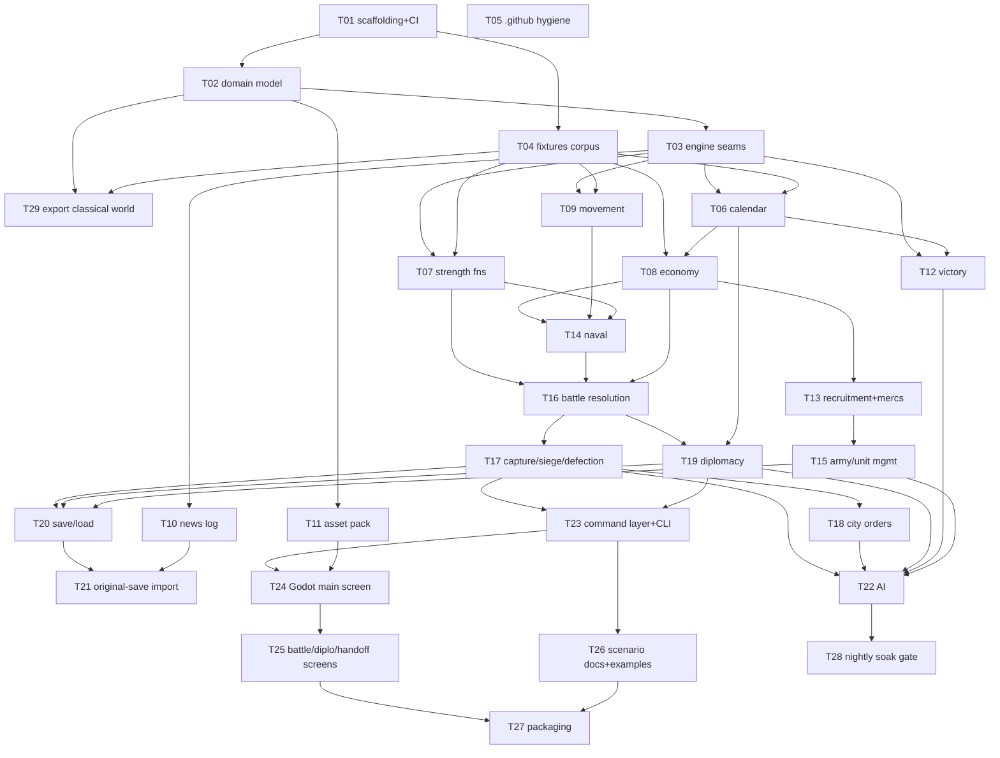

# Build orchestration plan: running the 20-milestone build with multiple agents

This document turns the 20-milestone backlog at the end of [game-design.md](game-design.md) into a **multi-agent, branch-parallel execution plan**. It replaces the single-agent sequential `/loop` operating mode proposed there (`game-design.md` §"The build harness", final paragraph) with a pipeline of implementer agents, reviewer agents, and one orchestrator, coordinated through git branches and GitHub issues/PRs.

It changes **no design decision**. Every rule, constant, and *done when* here traces back to `game-design.md` and [design-audit.md](design-audit.md); where a *done when* is sharpened below it is made **more** mechanically checkable, never weaker. Where a task would need a design decision that those two documents do not already make, the task escalates to the user rather than inventing one — see [§11](#11-open-questions-for-the-user).

**Division of responsibility between this document and GitHub:**

> **This document is the intent. GitHub is the state.**
>
> Task scope, Definition of Done, model, effort, dependencies and branch names live here and change only by a deliberate commit to `main`. Progress — what is queued, in flight, in review, merged, blocked or escalated — lives entirely in GitHub issue/PR labels. Nothing in this repository is edited to track progress, because a progress file on `main` would conflict with every task branch in flight.
>
> **Live state**: [issue #29, the pinned build tracker](https://github.com/diegoami/imperial_conquest_2/issues/29). Task issues #1–#28 are numbered to match their task ids; T29 (added after the tracker claimed #29) is the one exception — it's [issue #32](https://github.com/diegoami/imperial_conquest_2/issues/32).

Related reading, in order: [HANDOVER.md](HANDOVER.md) (current state) → [game-design.md](game-design.md) (what is being built) → [design-audit.md](design-audit.md) (what the evidence actually supports) → this document (how it gets built).

---

## 0. Where things stand, and what you can test

This section exists so the answer to "where am I at?" is never "ask the orchestrator" — everything is visible on GitHub without needing a running agent at all.

### 0.1 Where to look

| Where | What it shows |
| --- | --- |
| **[Issue #29](https://github.com/diegoami/imperial_conquest_2/issues/29)**, the pinned tracker | The single dashboard. Every orchestrator tick posts an updated status table here (task / state / PR / agent / blocked-by) plus a plain-language summary of what merged, what started, what's blocked, what needs you. Start here. |
| **Milestones tab** | One per phase — `Phase 0 Foundation`, `Phase 1 Pure rules`, `Phase 2 Systems`, `Phase 3 Delivery` — each a built-in GitHub progress bar over its issues. |
| **Issues #1–28**, `status:*` label | Each task's exact stage: `ready` → `in-progress` → `in-review` → `rework` (changes requested) or `approved` (awaiting merge) → `merged`; or `escalated` if it's waiting on you. `gh issue list --label status:in-review` (etc.) filters directly; the GitHub UI's label filter does the same. |
| **Pull requests tab** | One per dispatched task, with the reviewer's actual GitHub review (`Approved` / `Changes requested`) and live CI status inline. |
| **Actions tab** | Once T01 merges, every push gets a real build+test run here. |
| **`release:v0.1.0`…`v1.0.0` labels** | Which of the five planned releases a task belongs to, per [`release-plan.md`](release-plan.md) — the "how far to a usable version" view, orthogonal to the phase/milestone view. |

### 0.2 What you can actually run, and when

Most of the pipeline produces no visible game for quite a while — it's headless engine code with tests, by design (`game-design.md` principle 4, determinism first). Expect a long stretch of "PRs merging, tests passing, nothing to click on" before either of the two milestones below:

| After | What exists | Can you run it? |
| --- | --- | --- |
| T01–T05 | Solution scaffolding, CI, templates | `dotnet build` / `dotnet test` only |
| T02–T12 (waves 1–3) | Domain model + isolated rule subsystems (calendar, economy, combat math, movement, …) | Only via their own unit tests — nothing assembled yet |
| T13–T22 (waves 4–5) | Recruitment, naval, battle resolution, diplomacy, AI — real gameplay logic, wired together | Still headless-only |
| **T23** | `IC2.Cli`, a scriptable headless play harness | **First thing you can actually run**: load a scenario, issue orders, end turns, from a terminal — text output, no graphics |
| **T24** | Godot main screen, New Game flow, the ruleset chooser, the map taking real commands | **First thing that looks like a game** — clicking around and playing a turn becomes possible |
| T25–T28 | Remaining screens, packaging, the nightly regression gate | A complete, playable build |

If you want the earliest hands-on checkpoint, watch for T23 rather than expecting anything playable before it.

### 0.3 Pausing the build for any reason

See [§7.5](#75-user-initiated-pause) for the mechanism. Short version: ask in any session (this one included) to pause, or run `gh issue edit 29 --add-label orchestrator:pause` yourself — no need to find or message the orchestrator's own agent. It stops dispatching new work at its next checkpoint (at most one `/loop` interval away, usually sooner) and leaves everything already in flight untouched.

---

## 1. What the pipeline has to work around

Four properties of this project shape the whole design.

1. **The milestone list has real sequential dependencies.** Strength functions (M5) feed M8/M9/M12; economy (M3) gates recruitment (M4), naval (M7) and army management (M14); battle resolution (M8) gates siege (M9), diplomacy's reparation trigger (M11) and the AI (M12). Assuming the 20 milestones parallelise is wrong. The real graph is in [§4](#4-the-dependency-graph).
2. **One Windows machine.** Godot 4.7.2 (.NET edition) and the .NET 10 SDK are installed locally; GitHub Actions can build and test everything *except* the Godot project. Anything that launches or exports Godot is **single-instance**; anything that reads the user's original `.sav`/`.dat` files is **local-only** (those files are, and stay, outside the repository).
3. **Merge conflicts are the real cost of parallelism**, not agent time. The plan spends effort up front (T01–T03) buying conflict-free seams so that later tasks touch disjoint files.
4. **Fidelity is the thing that can silently go wrong.** `design-audit.md` §2 is a catalogue of plausible-looking claims that did not survive checking, and §4.5 concluded with a hard rule worth promoting to a review gate: *a `[designed]` tag is only valid if the document says what was searched and came up empty*. An autonomous pipeline that merges wrong constants quickly is worse than a slow one.

---

## 2. What makes the parallelism possible

Parallelism here is not "run agents and hope". It comes from four deliberate structural choices, all of which land in the foundation phase.

**2.1 Pre-committed seams (T03).** Before any gameplay task starts, one task establishes and merges: the seeded RNG service, the turn coordinator's ordered phase pipeline, the command dispatch and typed rejection type, the domain-event/news sink, and the ruleset accessor. Every later system is written *against these interfaces* and registers itself, so no two tasks edit a shared wiring file.

**2.2 Declared file ownership.** Every task below has an **Owns** list of paths. An implementer may only create/modify files inside its Owns list plus its own tests; anything else is a review failure and an escalation. The orchestrator never dispatches two tasks with overlapping Owns lists concurrently. This is the single biggest conflict-avoidance lever.

**2.3 No shared registry files.** Three files would otherwise be edited by nearly every task and conflict constantly:

- `IC2.sln` — **T01 pre-declares every project the whole backlog will ever need**, so no later task edits the solution.
- A system-registration list — replaced in T03 by assembly-scanned registration (each system declares itself via an attribute), so adding a system touches only that system's own file.
- Doc indexes (`README.md`, `HANDOVER.md`) — updated by the orchestrator directly on `main` after a merge, never by a task branch.

**2.4 The fixtures corpus (T04) lands before the fan-out.** Every exact number from `docs/reports/` is transcribed once into a typed JSON corpus with per-entry provenance. Later tasks assert against `Fixtures.Get("rome.taxBase")` rather than each re-reading 46 reports and each getting a chance to misread them. This was `design-audit.md` §4.4's own recommendation; the multi-agent setting makes it mandatory rather than merely efficient, because *n* agents independently re-deriving the same constant is *n* chances to diverge.

**2.5 Each system owns its own news messages.** Rather than one late milestone wiring every news-log message (a guaranteed conflict across a dozen files), T10 delivers the ring buffer, the message catalog, **and the single writer that carries a news-worthy event from T03's event sink into `GameState.NewsLog`**, while **each gameplay task's DoD includes emitting its own confirmed message literal**. This is a deliberate sharpening of design milestone M17. The split matters: *emission* is per-task and therefore conflict-free, but *the path into state* must be exactly one piece of code, or the ordering of the news log becomes a function of which system happened to write first.

---

## 3. Roles, models, and the effort scale

### 3.1 The three roles

| Role | Count | What it does |
| --- | --- | --- |
| **Implementer** | **One at a time** (revised — see note below) | One task, one branch, one PR, working directly in the main checkout. Writes code + tests, runs the DoD commands, pushes, opens the PR with evidence. |
| **Reviewer** | **One at a time**, never concurrent with an implementer | Independently re-runs the DoD commands on the PR head, audits provenance and scope, posts findings as a PR comment and applies a `status:approved`/`status:rework` label. Never the same agent instance that implemented. |

> **Revised after the first live run (T01/T05).** The plan originally specified up to 3 concurrent implementers, each in its own `isolation: "worktree"`. In practice the orchestrator struggled managing multiple worktrees (one was left `locked`), and the user asked for a simpler, more conservative model: **no worktrees, and never more than one code-modifying agent running on this machine at a time.** Every "concurrent" figure below is superseded by this — kept in place as the original reasoning, with the current rule stated alongside it, rather than silently rewritten.
| **Orchestrator** | exactly 1 | Dispatches, tracks, merges, handles conflicts and escalations. Does not write task code. |

### 3.2 The effort scale

Four levels, mapped to the reasoning budget the agent is run at. The scale is deliberately coarse — a finer scale would not change any dispatch decision:

| Level | Use when | Typical shape |
| --- | --- | --- |
| **Low** | Fully specified, mechanical, single-file, no judgment. A wrong answer is obvious immediately. | Config, templates, a workflow file. |
| **Medium** | Multi-file but the design is fully given; judgment limited to code structure. | Implementing a described state machine with given constants. |
| **High** | Requires reconciling evidence across several reports, or exact numeric/integer-semantics fidelity where a subtle error passes casual reading. | Economy, naval, siege, diplomacy. |
| **Ultrahigh** | An error propagates across the entire remaining backlog, or the solution space is genuinely open. | Only T03 (engine seams) and T22 (AI). |

### 3.3 Model selection

Per task, not uniform. The rationale, in one line each:

- **Opus** — 4 implementation tasks (T02, T03, T16, T22) where an error is not local: the domain model and the engine seams are consumed by all 25 other tasks; battle resolution is consumed by five downstream systems and is the most integer-semantics-sensitive code in the project; the AI has the most design latitude and the hardest failure mode (a soak that never terminates).
- **Sonnet** — 18 tasks. The default for "the design document already says what to build, and the hard part is building it correctly".
- **Haiku** — 5 tasks (T10, T11, T18, T26, T28) that are small, fully specified, and CI-gated, so a failure is cheap and caught before review.
- **Fable** — 1 task (T05), pure templates and configuration with no judgment at all. Fable is deliberately not used for anything that must compile against the domain model.

### 3.4 Why the reviewer's model differs from the implementer's

Three reasons, and they point in the same direction:

1. **Independence.** A reviewer running the same model as the implementer tends to re-make the implementer's misreading of the same report — the failure mode `design-audit.md` §2.1 documents happening twice in a row to the *same* claim, in opposite directions. A different model reading the same evidence is the cheapest available source of independent perspective.
2. **Cost asymmetry.** Reviewing a diff costs a fraction of producing it. Upgrading the reviewer one model tier is cheap leverage; upgrading the implementer is not.
3. **Task fit.** The reviewer's job is close reading and verification ("does this constant match the report it cites? does this integer division truncate the way Delphi's did?"), not code generation. That plays to Opus's strengths more than implementation does.

Concrete assignment rule:

| Implementer | Reviewer | Plus |
| --- | --- | --- |
| Opus (T02, T03, T16, T22) | Opus / High | **and** `/code-review --effort ultra` (cloud multi-agent) as a second, independent pass |
| Sonnet on fidelity-critical tasks (T04, T07, T08, T13, T14, T17, T19, T20, T21) | **Opus / Medium** | — |
| Sonnet on structural tasks (T01, T06, T09, T12, T15, T23, T24, T25, T27) | Sonnet / High | — |
| Haiku / Fable (T05, T10, T11, T18, T26, T28) | Sonnet / Medium | — |

### 3.5 Where the `/code-review` skill fits

The purpose-built reviewer agent is the **default gate**, not `/code-review`, because three of this project's five review checks are project-specific and a general correctness reviewer will not perform them: provenance-to-report tracing, the `[designed]`-tag rule from `design-audit.md` §4.5, and the Owns-list scope check. The reviewer must also *re-run the DoD commands locally*, which includes Godot-headless runs and local-only fixtures that a cloud reviewer cannot reach.

`/code-review` is used **inside** the reviewer's run, at `--effort high`, as a supplementary correctness sweep, and `--effort ultra` is used as a genuinely independent second opinion in exactly two situations: on the four Opus-implemented architecture PRs, and on any PR that has reached rework round 2 (where implementer and reviewer are visibly disagreeing and a third voice is worth the cost).

---

## 4. The dependency graph

Two kinds of dependency, distinguished because conflating them destroys most of the available parallelism:

- **Merge-after** (hard): task B's branch may not be merged to `main` until task A is merged. This is the real dependency.
- **Start-after** (soft): task B's implementer cannot usefully begin until A is merged, because B has nothing to write against.

Most dependencies are merge-after only. A task whose `start-after` set is satisfied can be dispatched even while its `merge-after` set is still in flight; the implementer works against `main` plus stubs and rebases before merge.



### 4.1 Waves and the critical path

| Wave | Tasks dispatchable together | Notes |
| --- | --- | --- |
| 0 | **T01, T05** | Disjoint file sets (`/`+`tests/` vs `.github/`). |
| 1 | **T02, T04** | T04 needs only the test project from T01. |
| 2 | **T03, T29** | T03 is the single serialization point for engine code; T29 only needs T02's schema and T04's corpus, and owns disjoint paths (`data/worlds/classical-mediterranean.json`, `data/rulesets/classical-faithful.json`, `scripts/**`, `tests/IC2.Engine.Tests/Export/**`), so it runs alongside T03 rather than blocking on it. |
| 3 | **T06, T07, T08, T09, T10, T11, T12** | Seven-way fan-out; the widest point. Concurrency-capped to 3 at a time. |
| 4 | **T13, T14, T15, T16** | T16 is the long pole. |
| 5 | **T17, T18, T19, T20, T21, T22** | Internally ordered: T17 first, then T18/T19/T20 in parallel, then T21 and T22. T22 is the long pole. |
| 6 | **T23, T24, T25, T26, T27, T28** | T24/T25/T27 are single-instance (Godot); they serialize against each other regardless of the cap. |

**Critical path**: `T01 → T02 → T03 → T07 → T14 → T16 → T17 → T23 → T24 → T25 → T27` — 11 of 28 tasks. The AI chain (`… → T17 → T18 → T22 → T28`, 10 tasks) runs alongside it and is not on the critical path, which is a good argument for *not* deferring T22: it has the most slack of any late task and the most uncertain duration. Everything else is slack that fills the concurrency budget around it. Note the practical consequence: **T03 blocks the entire project**, so it gets the most capable model at the highest effort and the heaviest review, and nothing else should be in flight while it is (its diff defines the interfaces everyone else will conflict with).

### 4.2 Parallel-safe vs strictly sequential, stated plainly

- **Strictly sequential, no alternative**: T01 → T02 → T03. Also T16 → T17 (a siege *is* a battle), T17 → T18 (a siege wipes a pending fortify order, which is T18's DoD), T08 → T13 (mercenary hire debits the army purse that T08 defines), T24 → T25 → T27 (Godot, single-instance).
- **Parallel-safe, genuinely**: the whole of wave 3 (seven independent pure-rules systems over disjoint directories); T13/T14/T15 against each other; T18/T19/T20/T21 against each other; T26 against the Godot lane; T29 against T03 (disjoint paths, and T29 needs only T02's schema and T04's corpus, not T03's engine seams).
- **Looks parallel but is not**: T12 (victory) reads city counts and could be written any time, but it is gated behind T06 because its 250 BC condition needs the calendar's year; T20 (save/load) could be written early but its DoD ("a mid-game state round-trips after N turns") is only meaningful once the state is largely complete.

---

## 5. The task catalogue

29 tasks covering all 20 design milestones plus six pieces of scaffolding the milestone list assumes but never produces (build/CI harness, engine seams, GitHub hygiene, asset pack, nightly regression gate, and the one-time export of the shipped `classical-mediterranean` world/ruleset).

Conventions used by every entry:

- **Branch**: `task/T<nn>-<slug>`. One branch per task, never reused.
- **Owns**: the only paths the implementer may create or modify, besides its own tests. Anything else → escalate.
- **Done when**: each line is a single assertion an agent can check by running a command. A DoD line is **immutable to the implementer** — see [§6.4](#64-the-dod-is-not-negotiable-by-an-agent).
- Numbers cited without a report name are already cited in `game-design.md`/`design-audit.md` at the referenced milestone.

---

### Phase 0 — Foundation

#### T01 Build scaffolding and CI

- **Design milestone**: none (prerequisite the backlog assumes). **Labels**: `phase:0 lane:infra`
- **Branch**: `task/T01-build-scaffolding` · **Model/effort**: Sonnet / Medium · **Reviewer**: Sonnet / High
- **Start after**: — · **Merge after**: —
- **Owns**: `IC2.sln`, `Directory.Build.props`, `.editorconfig`, `tests/**`, `.github/workflows/**`, `scripts/**`, `src/IC2.Engine/IC2.Engine.csproj`, `src/IC2.Cli/**` (the bare `.csproj`/stub `Program.cs` only — `src/IC2.Engine/Model/**` and `src/IC2.Engine/Serialization/**` are T02's, not touched here)
- **Scope**: Create the solution and **pre-declare every project the backlog will ever need** so no later task edits `IC2.sln`: existing `IC2.Data`, `IC2.Inspect`; new `src/IC2.Engine`, `src/IC2.Cli`; new `tests/IC2.Engine.Tests`, `tests/IC2.Data.Tests`. `godot/IC2.MapViewer.csproj` is **excluded** from the solution (it needs the Godot SDK and cannot build in CI) and that exclusion is documented in the file. `Directory.Build.props` centralises `net10.0`, `Nullable=enable`, `ImplicitUsings=enable`, and `TreatWarningsAsErrors=true` **for the new projects only** (existing `IC2.Data`/`IC2.Inspect` opt out, to avoid a scaffolding task turning into a refactor). Add the CI workflow: restore, build the solution, `dotnet test`, on push and PR. Add `scripts/check-godot-churn.ps1` implementing the HANDOVER caveat — after a Godot headless run, revert `godot/project.godot` and `godot/MapViewer.cs` if their diff is whitespace/header-only.
- **Done when**:
  1. `dotnet build IC2.sln` succeeds from a clean clone with zero warnings in the new projects.
  2. `dotnet test IC2.sln` runs and passes (a placeholder test in each new test project is acceptable).
  3. The CI workflow runs on the PR and is green; its job does **not** reference the Godot project.
  4. `scripts/check-godot-churn.ps1` exits 0 on a clean tree and exits non-zero (with the two filenames named) when `godot/project.godot`'s header alone has changed.
- **Hazards**: do not "fix" existing `IC2.Data`/`IC2.Inspect` code; out of scope. **This PR is gated by the same CI workflow it adds — that is not a chicken-and-egg problem worth special-casing.** A same-repo (non-fork) branch's `pull_request`-triggered workflow runs using the workflow file *from that PR's head*, so T01's own PR does get checked by the workflow it introduces, same as every later task; an earlier belief that "T01 can't gate on its own CI" and needs a manual exception was simply wrong and should not be repeated.

#### T02 Core domain model and JSON round-trip

- **Design milestone**: M1 (types half). **Labels**: `phase:0 lane:engine`
- **Branch**: `task/T02-domain-model` · **Model/effort**: **Opus / High** · **Reviewer**: Opus / High **+ `/code-review --effort ultra`**
- **Start after**: T01 · **Merge after**: T01
- **Owns**: `src/IC2.Engine/Model/**`, `src/IC2.Engine/Serialization/**`, `data/worlds/toy-3city.json`, `data/rulesets/toy-ruleset.json`, `data/scenarios/toy-3city.json`, `tests/IC2.Engine.Tests/Model/**` (file-level, not `data/worlds/**`/`data/rulesets/**` wildcards — see T29, which owns the real shipped world/ruleset data under the same directories without overlapping these specific files)
- **Scope**: The four file kinds from `game-design.md` §"The core data model" — `World`, `Ruleset`, `Scenario`, `SaveGame` — as C# records with `System.Text.Json` contracts, plus the `GameState` tree they produce. Must carry, from day one, every field later tasks need so they do not have to widen the model: per-army and per-fleet **money purse and supply stock**, army morale (`+14` semantics), the unit slot's regular/mercenary marker, city fortification with its `>100` in-progress encoding, fleet condition, the symmetric N×N diplomatic relation matrix with negative cooldowns, and the news ring buffer's storage. Support a `"_provenance"` key per field as `game-design.md` §"Ruleset format" specifies. Ship the toy 3-city / 2-nation `World`+`Ruleset`+`Scenario` under `data/`. Terrain tile types are an **open list** (12 codes shipped, not hardcoded to 12).
- **Done when**:
  1. Round-trip equality tests pass for each of `World`, `Ruleset`, `Scenario`, `SaveGame` (serialize → deserialize → serialize produces identical JSON).
  2. The toy scenario loads from `data/scenarios/toy-3city.json` and resolves its world and ruleset by id.
  3. A malformed file, an unknown required field, and a version mismatch each produce a distinct typed error, one negative test each — never a silent default.
  4. `GameState` is a fully serializable tree: a test constructs a non-trivial state, serializes it, deserializes it, and asserts deep equality.
  5. No gameplay constant is hardcoded in C#: a test asserts that every ruleset-governed number the model exposes is sourced from the loaded `Ruleset` object.
- **Hazards**: this is the widest-blast-radius diff in the plan. Nothing else may be in flight that touches `src/IC2.Engine`.

#### T29 Export the shipped classical-mediterranean world and ruleset

- **Design milestone**: none explicitly — closes a real gap `game-design.md` §"The core data model" describes in prose ("the original's actual data becomes one shipped `World`... produced by a one-time export tool") but never turns into a scheduled deliverable. Surfaced by the user asking, after wave 0, whether the reimplementation ends up depending on original assets at all. **Labels**: `phase:0 lane:data local-only`
- **Branch**: `task/T29-export-classical-world` · **Model/effort**: Sonnet / High · **Reviewer**: **Opus / Medium**
- **Start after**: T02, T04 · **Merge after**: T02, T04
- **Owns**: `data/worlds/classical-mediterranean.json`, `data/rulesets/classical-faithful.json`, `scripts/export-classical-world.*`, `tests/IC2.Engine.Tests/Export/**` (file-level within `data/worlds/**`/`data/rulesets/**` — does not touch T02's toy fixtures)
- **Scope**: A one-time, re-runnable export script, built on the existing `IC2.Data` parsers, that reads the original DAT (and the classical-faithful ruleset's constants, sourced from the T04 fixtures corpus) and writes `data/worlds/classical-mediterranean.json` and `data/rulesets/classical-faithful.json` conforming to T02's `World`/`Ruleset` schema. **This is the only step in the whole plan that reads the user's original game files to produce something that ships** — every later build, test, and play session uses the committed JSON output, never the original DAT again. Run once by whoever has `assets.local.ini` configured (today, that's this machine); the *output* is what everyone else, including CI, depends on.
- **Done when**:
  1. Running the script against the configured original DAT produces `data/worlds/classical-mediterranean.json` with exactly 334 cities, 16 nations, and the confirmed 320×140 map — cross-checked against `IC2.Data`'s own parse of the same file (same city count, same nation names, same map dimensions), not re-derived independently.
  2. `data/rulesets/classical-faithful.json` contains every constant in the T04 fixtures corpus tagged `confirmed`, with each value traced to its fixture id in `_provenance` — no value invented here that isn't already in the corpus.
  3. The committed JSON round-trips through T02's `World`/`Ruleset` loaders with no schema errors.
  4. Re-running the script against the same DAT produces byte-identical JSON (deterministic — same test pattern as T11's asset generator).
  5. **Every test in this task skips with an explicit "original files not configured" result when `assets.local.ini` is absent**, exactly like T21 — CI stays green on a machine without the original files, because CI only ever needs the *committed output*, not the ability to regenerate it.
- **Hazards**: do not hand-edit the committed JSON to fix a mismatch found after export — fix the export script and re-run, so the committed data always has a reproducible source. If the original DAT ever needs re-reading (a corrected field, a newly-decompiled table), this is the one task whose branch gets reopened, not a one-off patch to the JSON.

#### T03 Engine seams: RNG, turn pipeline, commands, events

- **Design milestone**: none explicitly (implied by `game-design.md` §"Testing and determinism"). **Labels**: `phase:0 lane:engine`
- **Branch**: `task/T03-engine-seams` · **Model/effort**: **Opus / Ultrahigh** · **Reviewer**: Opus / High **+ `/code-review --effort ultra`**
- **Start after**: T02 · **Merge after**: T02
- **Owns**: `src/IC2.Engine/Core/**`, `tests/IC2.Engine.Tests/Core/**`
- **Scope**: The interfaces every later task is written against, and nothing else:
  - `IRng` — one seeded service, threaded through the turn coordinator; the **only** source of randomness in gameplay code (`game-design.md` principle 4).
  - The turn coordinator: an ordered phase pipeline with a stable, declared phase order and an `OnQuarterBoundary` hook contract (fired by T06's calendar, subscribed by T08's economy and T19's thaw) — so economy tests can fire the hook directly without the calendar merged.
  - Command dispatch: `ICommand` → `CommandResult` with a **typed rejection** (illegal command never throws, never silently no-ops).
  - The domain-event sink that T10's news log and the UI both consume.
  - **Attribute-based system registration** (assembly scan), so adding a system touches only that system's own file. This is the anti-conflict mechanism [§2.3](#2-what-makes-the-parallelism-possible) depends on.
  - The determinism guard: a test that scans `src/IC2.Engine` sources and fails on `System.Random`, `DateTime.Now`/`UtcNow`, `Guid.NewGuid`, `Environment.TickCount`, or unordered-dictionary enumeration in gameplay paths.
- **Done when**:
  1. Two full runs of a scripted N-phase sequence with the same seed produce byte-identical `GameState` hashes; with different seeds, different hashes.
  2. A no-op test system registers by attribute alone and executes in the declared phase order; a second one added in a second file does not require editing any shared file (asserted by the test's own structure).
  3. An illegal command returns a typed rejection with a reason code; a test asserts no exception is thrown and no state changed.
  4. The determinism guard test fails when a deliberately-added `new Random()` is present in a scratch file under `src/IC2.Engine` (test proves the guard works, then removes it).
  5. The `OnQuarterBoundary` hook can be fired directly in a test without a calendar implementation present.
- **Hazards**: **the critical-path blocker.** No other task may be in flight. If the phase order or command shape is wrong here, every wave-3 task inherits it.

#### T04 Fixtures corpus

- **Design milestone**: M1 (fixtures half); implements `design-audit.md` §4.4's recommendation. **Labels**: `phase:0 lane:data`
- **Branch**: `task/T04-fixtures-corpus` · **Model/effort**: Sonnet / High · **Reviewer**: **Opus / Medium**
- **Start after**: T01 · **Merge after**: T01 (parallel with T02/T03 — disjoint paths)
- **Owns**: `tests/fixtures/**`, `tests/IC2.Engine.Tests/Fixtures/**`
- **Scope**: Transcribe **every exact number in `docs/reports/`** into one typed JSON corpus with a small loader. Each entry carries `id`, `value`, `source` (the report filename), and `tag` (`confirmed` / `derived` / `designed`, matching the report's own tagging). Nothing is derived or computed here — pure transcription, so that a later disagreement is always between code and a fixture, never between two agents' readings. Minimum contents: the twelve `design-audit.md` §4.4 fixtures; the 12-entry terrain move-cost table; the full unit-type stat table; the 5×5 type-effectiveness matrix; the `+0x26` power weights (LI 20 · HI 100 · Ar 40 · LC 60 · HC 120); the diplomatic cooldowns (−8 / −24 / −18); the loyalty floors (40 / 65 / →90); the news-log message literals; the calendar constants; the caps (100,000 troops, 20 units, 198 armies, 40 news slots, 50 mercenary slots, 1,000 purse, 990 unity, 30,000 melee, 40%).
- **Done when**:
  1. A test loads the corpus and fails if any entry has an empty `value`, `source`, or `tag`.
  2. **A test asserts every `source` names a file present in a committed manifest of the research repo's real report filenames** (`tests/fixtures/known-reports.json` or similar, owned by this task, generated once from `gh api repos/diegoami/imperial-conquest-2-research/contents/docs/reports` and checked in — filenames only, not content, so nothing copyrighted or from the original game is involved). This replaces an earlier line that checked against a local `docs/reports/` directory, which stopped existing here after the repo split ([`HANDOVER.md`](HANDOVER.md)) — the manifest is a fully offline, CI-green stand-in that still catches an invented or typo'd citation without requiring the research repo to be cloned. If the manifest ever drifts from the research repo's real contents (a new report added there), that is a one-line update to the manifest, not a reason to weaken this check.
  3. A test asserts the corpus contains every id in a committed required-ids list (the minimum contents above), so a later task cannot silently find its fixture missing.
  4. A test asserts no two entries share an id.
- **Hazards**: the highest-leverage task in the plan for silent error. Reviewed by Opus specifically to re-derive a sample of entries from their cited reports (fetched from the research repo for the review, same as any other citation check — nothing here requires vendoring the reports into this repo). Any number that cannot be found in a report is **not** invented — it is omitted and reported in the PR body.

#### T05 GitHub hygiene: templates, labels, CODEOWNERS

- **Design milestone**: none. **Labels**: `phase:0 lane:infra`
- **Branch**: `task/T05-github-hygiene` · **Model/effort**: **Fable / Low** · **Reviewer**: Sonnet / Medium
- **Start after**: — · **Merge after**: — (fully disjoint; can merge first)
- **Owns**: `.github/pull_request_template.md`, `.github/ISSUE_TEMPLATE/**`, `.github/CODEOWNERS`
- **Scope**: The PR template carrying the review contract from [§6.2](#62-what-the-reviewer-checks): a DoD-evidence fenced block, a provenance checklist, a determinism checkbox, an Owns-list scope declaration, and `Closes #<issue>`. An issue template for a build task mirroring the catalogue entry shape. `CODEOWNERS` assigning `docs/` and `.github/` to the user so doc changes always notify a human.
- **Done when** (headless-checkable, what the implementer and reviewer actually run):
  1. All three files exist and parse without error (`gh api repos/<owner>/<repo>/contents/<path>` returns 200 for each).
  2. `.github/pull_request_template.md`'s text contains the DoD-evidence heading, the provenance checklist, the determinism checkbox, the Owns-list scope declaration, and the literal string `Closes #` — a plain text/regex assertion against the file, not a behavioral PR-creation check.
  3. The issue template's YAML front matter parses and its body fields mirror the catalogue entry shape (task/model/effort/DoD).
  - **Not part of the headless gate — post-merge, human-verified only**: that `gh pr create` run interactively (no TTY in an agent's shell, so an agent cannot itself drive this) actually renders the template as the new PR's starting body, and that the issue template appears in `gh issue create --web`'s picker (opens a browser; unobservable to an agent). Noted here as a real check worth doing once, by hand, the next time a human opens an issue or PR — not a gate any agent can pass or fail.

---

### Phase 1 — Pure-rules fan-out

#### T06 Calendar and turn sequencing

- **Design milestone**: **M2**. **Labels**: `phase:1 lane:engine`
- **Branch**: `task/T06-calendar` · **Model/effort**: Sonnet / Medium · **Reviewer**: Sonnet / High
- **Start after**: T03 · **Merge after**: T03, T04
- **Owns**: `src/IC2.Engine/Calendar/**`, `tests/IC2.Engine.Tests/Calendar/**`
- **Scope**: Week `+2 mod 12`; season advance at the 11→1 wrap; year *decrement* at Winter→Spring (270 BC counts down); the quarterly hook fired on the season boundary; active-seat rotation following the save's 16-entry turn-order table, with hotseat pause points surfaced as events (not UI). City-unit `StateCode` +2/week capped at 24. Parameterised by `weeksPerSeason`/`seasonsPerYear` from the ruleset.
- **Done when**:
  1. Advancing 48 turns from the shipped start produces a week/season/year sequence byte-equal to a committed expected-sequence fixture (hand-computed in the PR body from [`decompiled-turn-and-calendar-sequencing.md`](https://github.com/diegoami/imperial-conquest-2-research/blob/main/docs/reports/decompiled-turn-and-calendar-sequencing.md)).
  2. The quarterly hook fires **exactly 4 times per in-game year** over that 48-turn run — asserted by count, not by inspection.
  3. The year decrements only at the Winter→Spring wrap (a test walks every wrap and asserts on the other three that the year is unchanged).
  4. Seat rotation visits every seat once per calendar tick in turn-order-table order; a hotseat seat raises a handoff event and an AI seat does not.
  5. `StateCode` reaches 24 and stays there (cap, not a reset).

#### T07 Strength functions

- **Design milestone**: **M5**. **Labels**: `phase:1 lane:engine`
- **Branch**: `task/T07-strength-functions` · **Model/effort**: Sonnet / High · **Reviewer**: **Opus / Medium**
- **Start after**: T03 · **Merge after**: T03, T04
- **Owns**: `src/IC2.Engine/Strength/**`, `tests/IC2.Engine.Tests/Strength/**`
- **Scope**: The three pure functions that M8, M9 and M12 all consume, extracted early exactly as `game-design.md` M5 says: `armyPower`, `fleetPower`, and siege defender strength. **Integer semantics are part of the specification** — the original is Delphi and truncates; every division must be pinned by a test, not left to C# operator defaults.
- **Done when**:
  1. `armyPower(a) = (Σ powerWeight[type] × troops / 100) / 80 × armyMorale` reproduces hand-computed values for the published 13-unit Roman roster, using the `+0x26` weights from the T04 corpus.
  2. `fleetPower(f) = ships × condition / 10 (+ carriedArmyPower / 50)` reproduces hand-computed values, including the carried-army term and its absence.
  3. The `× (1 + random(4)/10)` bonus is applied through `IRng` and is exactly reproducible under a fixed seed (same seed → same value, asserted twice in one test).
  4. Siege defender strength triples archers, and applies the fortification/loyalty term.
  5. A truncation test: at least three cases where integer division differs from floating-point division assert the integer result.
- **Hazards**: `design-audit.md` §2.9 — **two different morales**. Only army record `+14` (strategic) feeds these functions; the per-unit tactical morale array must not appear here. A reviewer finding tactical morale in this diff rejects it.

#### T08 Economy, supply, and purses

- **Design milestone**: **M3**. **Labels**: `phase:1 lane:engine`
- **Branch**: `task/T08-economy` · **Model/effort**: Sonnet / High · **Reviewer**: **Opus / Medium**
- **Start after**: T03 · **Merge after**: T03, T04, T06
- **Owns**: `src/IC2.Engine/Economy/**`, `tests/IC2.Engine.Tests/Economy/**`
- **Scope**: Tax, quarterly upkeep with real non-payment consequences, tribute growth, loyalty drift and the rebellion check's *confirmed structure* with `_provenance`-tagged placeholder thresholds, the weather-event frequency curve with data-driven effects, **supply as a purchased economy**, and per-army/per-fleet money purses gated by the `economy.purses` ruleset flag (`design-audit.md` Q4): `classical-faithful` keeps the confirmed per-army/per-fleet purses (cap 1,000); `improved` routes the same purchases straight to/from the national treasury instead.
- **Done when** (sharpened from M3, which already names most of these):
  1. `income = 2440 × 15 / 100` and `× 20 / 100` reproduce both published Rome figures exactly.
  2. Ship upkeep `= 3 × ships` per quarter.
  3. The 13-unit Roman roster's regular upkeep computes to exactly **442**.
  4. That army's 482 tons against 48,173 troops reads exactly **100%**; the supply triple 204/998, 344/998, 184/282 reads **20% / 34% / 65%**.
  5. A 100-ton supply purchase costs **20** talents, debited from the buying army's purse and credited to the **selling city's owner's** treasury — behind ruleset flag `supplyPurchaseCostsMoney` (default `true`, per the code), with the flag's existence and `design-audit.md` Q9 named in its `_provenance`.
  6. The purse cap of 1,000 is enforced on every path that credits a purse.
  7. An army whose upkeep cannot be paid loses troops (a real consequence, not a debt counter).
  8. Weather events fire ~8× more often in Winter than Summer over a fixed-seed 400-quarter run (asserted as a ratio band, the only band assertion in the plan, because the underlying figure is itself approximate in [`decompiled-weather-events.md`](https://github.com/diegoami/imperial-conquest-2-research/blob/main/docs/reports/decompiled-weather-events.md)).
  9. Under `economy.purses = centralized` (`improved`), the same supply/mercenary purchase debits and credits the national treasury directly, with no per-army/per-fleet purse involved — asserted with a fixture that would fail item 5's purse-crediting assertion if run under the wrong flag, so the two paths can't silently collapse into one.
- **Hazards**: Q9 is unresolved evidence, not an engineering unknown — implement the code's behaviour behind the flag and do **not** escalate; the flag is the resolution.

#### T09 Movement and terrain

- **Design milestone**: **M6**. **Labels**: `phase:1 lane:engine`
- **Branch**: `task/T09-movement` · **Model/effort**: Sonnet / Medium · **Reviewer**: Sonnet / High
- **Start after**: T03 · **Merge after**: T03, T04
- **Owns**: `src/IC2.Engine/Movement/**`, `tests/IC2.Engine.Tests/Movement/**`
- **Scope**: The one-click Bresenham walk; the 12-entry terrain cost table from the corpus; blocking markers; the abort rule and its move-zeroing, gated by the `seatAsymmetry` ruleset flag (`design-audit.md` Q6, `build-orchestration-plan.md` §11 Q-D): **AI-only** under `classical-faithful`, **every seat** under `improved`. Used by both armies (T09) and fleets (T14) — the walker is terrain-table-driven and does not special-case sea.
- **Done when**:
  1. The 12-entry table drives costs: Sea 1, Sea 3, Plain 1, Desert 1, Forest 2, Mountains 4, and all six River codes 4.
  2. A Bresenham walk over a committed test grid produces a cell sequence byte-equal to a committed expected-path fixture.
  3. A city, army or fleet marker in the path blocks the walk entirely (the walk stops **before** the marker; no move cost is charged for it).
  4. An unaffordable step aborts the move; under `classical-faithful` the army's remaining moves are **unchanged for a human seat** and **zeroed for a computer-controlled seat**; under `improved` moves are zeroed for **every** seat — asserted as separate tests per ruleset.
  5. A terrain type present in a world but absent from the ruleset's cost table defaults to 1 (the "arbitrary custom maps" guarantee), with a warning event.

#### T10 News log ring buffer and message catalog

- **Design milestone**: **M17**. **Labels**: `phase:1 lane:engine`
- **Branch**: `task/T10-news-log` · **Model/effort**: **Haiku / Medium** · **Reviewer**: Sonnet / Medium
- **Start after**: T03 · **Merge after**: T03, T04
- **Owns**: `src/IC2.Engine/News/**`, `tests/IC2.Engine.Tests/News/**`
- **Scope**: The 40-slot ring buffer, the catalog of confirmed message templates with operand substitution, **and the writer that carries a news-worthy domain event into `GameState.NewsLog`**. **Emission stays with each gameplay system** ([§2.5](#2-what-makes-the-parallelism-possible)); this task delivers the buffer, the catalog, the sink-to-state writer, and the coverage test that later tasks must keep green.
  - **The writer** is a system registered through T03's attribute-based registration, subscribing to T03's domain-event sink: for each news-worthy event it resolves the catalog template, substitutes the operands, and appends the rendered message to `GameState.NewsLog` (the storage T02 already ships). This closes a real gap found during T03's review — T02 built the ring buffer's storage, T10 builds the buffer and catalog, and §2.5 gives every gameplay task its own *emission*, but until now **no task owned the step that puts an emitted event into game state**, so T20 would have round-tripped a news log nothing ever filled. It lands here because T10 already owns both ends it connects, and it needs no new Owns path.
- **Done when**:
  1. 41 appends leave exactly the 40 newest, in order, oldest evicted.
  2. Every message literal in the T04 corpus's news section is present in the catalog and renders with its operands substituted (one test per literal, table-driven).
  3. A coverage test asserts every domain event kind returned by T03's `DomainEventCatalog.Discover` that is marked news-worthy has a catalog entry — so a later task adding an event without a message fails CI. (This line previously said "every member of the domain event **enum**". T03 deliberately shipped attribute-declared event subtypes plus `DomainEventCatalog.Discover(assemblies)` instead of an enum, because a single enum appended to by six tasks is precisely the shared-registry-file conflict [§2.3](#2-what-makes-the-parallelism-possible) exists to remove. The substance of the check is unchanged — iterate the discovered set rather than `Enum.GetValues`.)
  4. A news-worthy event published to the sink during a turn appears as a rendered message in `GameState.NewsLog` at the end of that turn, asserted on the state itself rather than on the sink; a non-news-worthy event does not. **The 40-slot eviction is asserted end-to-end through the writer**, not only against the buffer in isolation.
  5. The rendered log survives a `GameState` round-trip through T02's serialization — so T20's save/load inherits a news log that is actually populated.

#### T11 Asset pack loader and generated placeholder pack

- **Design milestone**: none explicitly (`game-design.md` §"Asset packs"). **Labels**: `phase:1 lane:data`
- **Branch**: `task/T11-asset-pack` · **Model/effort**: **Haiku / Medium** · **Reviewer**: Sonnet / Medium
- **Start after**: T02 · **Merge after**: T02
- **Owns**: `src/IC2.Engine/Assets/**`, `assets/packs/placeholder/**`, `scripts/generate-placeholder-assets.*`, `tests/IC2.Engine.Tests/Assets/**`
- **Scope**: The manifest loader mapping stable keys to files, plus a **deterministic generator script** producing the placeholder pack (flat-colour unit icons, terrain tiles, silent-but-valid audio stubs). Includes the **size-tiered army/fleet icon set** (`game-design.md` §"Army and fleet markers scale with size", `[confirmed]` — the original's own `TUnitMap_SelectUnit` marker arithmetic, not a guess): exactly `army.tier1.icon`/`army.tier2.icon`/`army.tier3.icon` and `fleet.tier1.icon`/`fleet.tier2.icon`/`fleet.tier3.icon`, one per confirmed band. Also the **city tier set** (`game-design.md` §"City markers", `[designed]` — placeholder pending confirmation): `city.tier1.icon` … `city.tierN.icon` plus `city.capital.icon`. Every tier icon a distinct (not just recoloured) placeholder shape so tiers are visually distinguishable at a glance even in flat placeholder art. No copyrighted original asset ever enters the repo — the existing `.gitignore` policy is unchanged and unchallenged.
- **Done when**:
  1. Every key in the engine's `AssetKeys` constant list resolves to a file that exists in the placeholder pack.
  2. A missing key raises a typed error naming the key, not a null.
  3. Re-running the generator produces byte-identical files (`git status` clean after a re-run) — asserted by the test running the generator into a temp dir and comparing hashes.
  4. `AssetKeys` includes the full city/army/fleet tier set from `game-design.md`, and a test asserts each tier's icon file is pixel-different from its neighbouring tiers (not the same placeholder shape re-exported under a different key).

#### T12 Victory conditions

- **Design milestone**: **M13**. **Labels**: `phase:1 lane:engine`
- **Branch**: `task/T12-victory` · **Model/effort**: Sonnet / Medium · **Reviewer**: Sonnet / High
- **Start after**: T03 · **Merge after**: T03, T06
- **Owns**: `src/IC2.Engine/Victory/**`, `tests/IC2.Engine.Tests/Victory/**`
- **Scope**: The four shipped conditions — the original's all-cities condition and its 250 BC year limit, domination-over-hostiles, score-at-turn-limit, and scenario-custom. Evaluated against a `GameState` constructed directly in tests; does **not** need capture logic merged.
- **Done when**: one test per condition, each with a positive and a negative case; the all-cities test uses the shipped world's own city count (not a hardcoded 334); the year-limit test fires at 250 BC and not at 251 BC; a scenario-custom goal defined purely in scenario JSON fires.
- **Note**: which condition is the shipped default is `design-audit.md` **Q5**, now answered: `victory.default` is `all-cities` under `classical-faithful`, and `domination-over-hostiles` (or `score-at-limit`, ruleset's choice) under `improved`. The task implements all four conditions and reads the default from the ruleset per seat's chosen preset; it does not hardcode either.

---

### Phase 2 — Dependent systems

#### T13 Recruitment and mercenaries

- **Design milestone**: **M4**. **Labels**: `phase:2 lane:engine`
- **Branch**: `task/T13-recruitment` · **Model/effort**: Sonnet / High · **Reviewer**: **Opus / Medium**
- **Start after**: T08 · **Merge after**: T08
- **Owns**: `src/IC2.Engine/Recruitment/**`, `tests/IC2.Engine.Tests/Recruitment/**`
- **Scope**: Standing recruitment from the treasury; the 50-slot mercenary pool; hire **from the hiring army's own purse**; the two distinct upkeep formulas; the unit slot `+0` regular/mercenary marker and the merge block it implies.
- **Done when**:
  1. `cost = (troops / 200) × price[type]` reproduces every solved value in the corpus.
  2. The Felsina hire (6,438 troops, "very good") costs `(troops × quarterlyPrice[type]) / 1000 × quality` exactly, is debited from the **army purse** (treasury unchanged), and leaves the pool slot at the `0xFFFF` sentinel.
  3. Mercenary quarterly upkeep = `(troops / 200) × price[type] × quality / 5`; a regular of identical troops/type costs exactly 5×/quality as much (one test asserting both).
  4. The 100,000-troop army cap blocks an over-cap recruitment with a typed rejection.
  5. A mercenary unit's slot `+0` is non-zero and a regular's is zero; merging the two is rejected.
  6. Emits its confirmed news message(s) via T10's catalog.

#### T14 Naval

- **Design milestone**: **M7**. **Labels**: `phase:2 lane:engine`
- **Branch**: `task/T14-naval` · **Model/effort**: Sonnet / High · **Reviewer**: **Opus / Medium**
- **Start after**: T09 · **Merge after**: T07, T08, T09
- **Owns**: `src/IC2.Engine/Naval/**`, `tests/IC2.Engine.Tests/Naval/**`
- **Scope**: Construction (10–100 clamp, `ships × 10`, 24-tick countdown at a named coastal city, coastal nations only); launch state (condition 100%, 50 tons, no money); condition as a strength multiplier and paid repair; transport; sea movement via T09's walker; join/split/transfer/scuttle. Naval **combat** is T16. Over-capacity embarkation is `seatAsymmetry`-gated per `design-audit.md` Q6 — if the original's own AI-only trimming behaviour is implemented at all, it sits behind this same flag rather than as a hardcoded AI special case; confirm against [`mobilization-movement-and-city-capture-modes.md`](https://github.com/diegoami/imperial-conquest-2-research/blob/main/docs/reports/mobilization-movement-and-city-capture-modes.md) before adding it, and escalate rather than guess if the evidence doesn't actually support a trim (as opposed to outright refusal) for either seat type.
- **Done when**:
  1. A 10-ship order costs **100** talents, has capacity **5,000** troops, and quarterly upkeep **30**.
  2. It launches after exactly 24 ticks at 100% condition with 50 tons and 0 money; before launch its record reads as under construction.
  3. An army of more than `ships × 500` troops is refused embarkation with a typed rejection under both rulesets; exactly `ships × 500` is accepted.
  4. Repair of N points costs `ships × N / 5` and zeroes the fleet's moves; it is refused away from an owned city.
  5. A fleet carrying an army refuses repair, scuttle, split and join — four separate assertions.
  6. Join caps at 100 combined ships; split requires ≥ 20.
  7. Scuttle near an owned city returns money to the treasury and supplies to that city.
  8. Fleet map-marker encoding: 90 ships owner 1 → **333**; 70 ships owner 3 → **335**.
  9. Supply capacity is `ships × 8` tons, purchased through T08's economy at 1 talent per 5 tons.

#### T15 Army and unit management

- **Design milestone**: **M14**. **Labels**: `phase:2 lane:engine`
- **Branch**: `task/T15-army-management` · **Model/effort**: Sonnet / Medium · **Reviewer**: Sonnet / High
- **Start after**: T13 · **Merge after**: T08, T13
- **Owns**: `src/IC2.Engine/Armies/**`, `tests/IC2.Engine.Tests/Armies/**`
- **Scope**: Join/split armies, join/split/rename/disband units, the auto-naming scheme, and every cap.
- **Done when**:
  1. Army join enforces ≤ 20 units **and** ≤ 100,000 troops combined, rejects either army being aboard a fleet, zeroes the survivor's moves, and pools money and supplies (conservation asserted exactly).
  2. Army split requires ≥ 2 units, enforces the 198-army cap, and gives the new army morale 59, no money, no supplies, and — `seatAsymmetry`-gated (`design-audit.md` Q6) — **0 moves for a human seat / 1 move for an AI seat under `classical-faithful`**, the same starting moves for every seat under `improved`.
  3. Disband is refused away from an owned city; money → treasury, supplies → that city, conserved exactly.
  4. Unit join requires same type, regulars only (mercenary marker blocks it), and merged troops ≤ the type's battalion size; merged quality is the **arithmetic mean**.
  5. Auto-naming produces the `Nth Foot/Guards/Bowmen/Lancers/Dragoons Battalion` ordinals counted across the whole nation, matching a published roster from the corpus.

#### T16 Battle resolution — all three variants

- **Design milestone**: **M8**. **Labels**: `phase:2 lane:engine`
- **Branch**: `task/T16-battle-resolution` · **Model/effort**: **Opus / High** · **Reviewer**: Opus / High **+ `/code-review --effort ultra`**
- **Start after**: T07 · **Merge after**: T07, T08, T14
- **Owns**: `src/IC2.Engine/Battle/**`, `tests/IC2.Engine.Tests/Battle/**`
- **Scope**: The original's own instant resolver, ported — field, siege, and naval — producing one `BattleResult`. Emits a `PeaceTreatyTriggered` domain event rather than calling diplomacy, so this task and T19 do not depend on each other's internals. Also implements the `combat.onDefeat` ruleset flag (`game-design.md` Combat section, `design-audit.md` Q1 follow-up): `classical-faithful` keeps the confirmed annihilation outcome; `improved` scatters the loser's field/naval army instead. `BattleResult` must stay presentation-agnostic — nothing in its shape should need to change if a future optional battle screen is added later.
- **Done when**, all under a **fixed seed** with exact assertions:
  1. The higher-power side wins; an exact tie goes to the defender (one test each).
  2. Under `classical-faithful`, the loser's army is destroyed outright.
  3. Winner casualties equal `loserPower × 40 / winnerPower` (integer semantics pinned) — unaffected by `combat.onDefeat`.
  4. The winner absorbs the loser's money, and supplies capped at `troops / 100` — unaffected by `combat.onDefeat`.
  5. Every surviving unit ends at ≥ "average"; exactly the 1-in-4 further promotions fire for the seeded roll; quality is capped at "elite".
  6. Unity moves loser −25 / winner +25, clamped at 990; at sea it moves `± floor(loserShips / 2)` — unaffected by `combat.onDefeat`.
  7. Under `classical-faithful`, the naval variant annihilates the loser's fleet **and any army aboard it**, and reduces the winner's ships and condition in proportion to the closeness of the fight.
  8. `PeaceTreatyTriggered` is emitted on a 2-in-5 roll gated on loser unity > 500 **and** city count > 7, and is observable in a test with no diplomacy system registered.
  9. Emits the confirmed news messages, including *"X sinks fleet of Y."*
  10. Under `improved`, a lost field or naval battle applies the mirrored `loserPower × 40 / winnerPower`-shaped casualty ratio to the loser's own troops instead of destroying it, relocates the survivor 2–4 tiles from the battle site onto the nearest valid unoccupied tile of the right kind, and zeroes its moves for the remainder of that turn.
  11. Under `improved`, when no valid tile exists even at distance 1 (fully boxed in), the outcome falls back to the `classical-faithful` destroyed result — assert this fallback with a scripted boxed-in fixture, not just the happy path.
  12. `combat.onDefeat` has **no effect on siege resolution** under either ruleset — a siege's defender outcome is unchanged by this flag (assert directly, since T17 depends on this staying true).
- **Explicitly not a DoD**: the Rome/Gaul per-type numbers (99,882 → 63,282). Per `design-audit.md` Q1's answer, they came from the *tactical* path and this resolver cannot produce them. An implementer that tries to make them pass has misread the task.
- **Hazards**: the type-effectiveness matrix, the 40% melee cap and the tactical morale array are **research held in reserve** for a possible future detailed resolver — they must not appear in this diff. A reviewer finding them rejects it. The `improved` scatter outcome is `[designed, no original analogue]` — its survivor-fraction and scatter-tile-range constants are ruleset data with a documented placeholder default, not a value to hunt for in the decompilation.

#### T17 City capture, siege, and the defection cascade

- **Design milestone**: **M9**. **Labels**: `phase:2 lane:engine`
- **Branch**: `task/T17-capture-siege` · **Model/effort**: Sonnet / High · **Reviewer**: **Opus / Medium**
- **Start after**: T16 · **Merge after**: T16
- **Owns**: `src/IC2.Engine/Cities/Capture/**`, `tests/IC2.Engine.Tests/Cities/Capture/**`
- **Scope**: Siege resolution routed through T16's resolver; capture transfers; the cascading defection mechanic; nation elimination.
- **Done when**:
  1. A scripted scenario reproduces the Galatia-elimination pattern **city by city**: exactly 2 *"falls to"* with population and fortification loss, and exactly 7 *"defects from"* with **neither** changed.
  2. Loyalty floors hold: 40 after a forced capture, 65 after a defection, toward 90 when the allegiant nation recaptures.
  3. Capture transfers unity (+9 / −15), wealth, city count, and the `nationTaxBase` field.
  4. Losing the last city eliminates the nation (capital sentinel set, unity reset).
  5. Per-siege attrition runs on **every** attempt, win or lose.
  6. Emits the confirmed *"falls to"* / *"defects from"* messages.
- **Known-open item to record, not resolve**: [`decompiled-city-capture-resolution.md`](https://github.com/diegoami/imperial-conquest-2-research/blob/main/docs/reports/decompiled-city-capture-resolution.md)'s −20%-if-owner≠allegiance and `FUN_0044B27C`'s ×9/10-if-attacker==allegiance are unreconciled (`HANDOVER.md` "What's still open"). Implement **both as separately-named ruleset flags**, default to the reports' stated behaviour, and document the ambiguity in the ruleset's `_provenance`. Do **not** escalate — the resolution needs new decompilation work, not a user decision.

#### T18 City orders (fortification)

- **Design milestone**: **M10**. **Labels**: `phase:2 lane:engine`
- **Branch**: `task/T18-city-orders` · **Model/effort**: **Haiku / Medium** · **Reviewer**: Sonnet / Medium
- **Start after**: T17 · **Merge after**: T08, T17
- **Owns**: `src/IC2.Engine/Cities/Orders/**`, `tests/IC2.Engine.Tests/Cities/Orders/**`
- **Scope**: Fortification as a paid, queued order, behind a generic `cityOrders` table with fortify as the only shipped entry (which keeps `design-audit.md` **Q7**'s door open without deciding it).
- **Done when**: a fortify order of N points costs `population(thousands) × N` talents; it reads back as in-progress via the `> 100` encoding and the panel text; a siege attempt clears it (`fort %= 100`); it is refused at 100% and while under siege.

#### T19 Diplomacy

- **Design milestone**: **M11**. **Labels**: `phase:2 lane:engine`
- **Branch**: `task/T19-diplomacy` · **Model/effort**: Sonnet / High · **Reviewer**: **Opus / Medium**
- **Start after**: T16 · **Merge after**: T06, T16
- **Owns**: `src/IC2.Engine/Diplomacy/**`, `tests/IC2.Engine.Tests/Diplomacy/**`
- **Scope**: The original's confirmed model — the symmetric relation matrix, negative cooldowns, the trade cap, contagion, auto-declaration, post-battle terms, and reparations. Subscribes to T16's `PeaceTreatyTriggered`. **No AI decision-making** (that is T22) — this task's job for `diplomacy.model` (`design-audit.md` Q3) is only to make sure the confirmed state machine exposes whatever read surface T22's opinion-score layer will need under `improved`; it does not compute the score itself.
- **Done when**:
  1. The state machine round-trips all four states (peace / trade / alliance / war) and the matrix stays symmetric under every transition.
  2. Breaking trade sets −8, breaking an alliance −24, ending a war −18.
  3. The 3-trade-partner cap is enforced; trade is refused during a cooldown and while allied or at war.
  4. Allying drags the ally into the partner's wars; declaring war drags in the target's allies.
  5. Attacking sets the relation to war **before** the battle resolves.
  6. The quarterly thaw converges to 0 (`+1`, plus `min(0, v+3)` at probability 1/3) under a fixed seed.
  7. `reparations = W/4 + random(W/4) + cities × 10` is **exact** under a fixed seed, and falls in the observed range for the one recorded Ptolemaic payment.
  8. The honourable-peace branch fires when the victor is weaker on population × unity or on total army strength.
  9. The `design-audit.md` **Q8** first-8-columns thaw bug is behind ruleset flag `faithfulThawColumnBug`, default faithful in `classical-faithful`, with a test for **each** setting.
- **Note**: `design-audit.md` **Q3** (how faithful, versus an opinion score) affects only the AI's *willingness* layer, which is T22. This task implements the confirmed model regardless of Q3's answer.

#### T20 New-format save/load and versioning

- **Design milestone**: **M16**. **Labels**: `phase:2 lane:engine`
- **Branch**: `task/T20-save-load` · **Model/effort**: Sonnet / High · **Reviewer**: **Opus / Medium**
- **Start after**: T17 · **Merge after**: T15, T17, T19
- **Owns**: `src/IC2.Engine/Persistence/**`, `tests/IC2.Engine.Tests/Persistence/**`, `tests/fixtures/saves/**`
- **Scope**: Versioned save files with an explicit migration path; the round-trip guarantee across the now-complete state.
- **Done when**:
  1. A mid-game state after N turns (N ≥ 20, all systems registered) round-trips to an **equal state hash**.
  2. A committed older-version save file loads through a migration and produces the expected state.
  3. An unknown *future* version is rejected with a typed error, not best-effort parsed.
  4. A save records which `World` and `Ruleset` it started from, and reloading with a different ruleset id is rejected with a clear message (`game-design.md` §"Original-save compatibility" policy, applied to native saves too).

#### T21 Original-save import bridge

- **Design milestone**: **M15**. **Labels**: `phase:2 lane:data local-only`
- **Branch**: `task/T21-save-import` · **Model/effort**: Sonnet / High · **Reviewer**: **Opus / Medium**
- **Start after**: T20 · **Merge after**: T10, T20
- **Owns**: `src/IC2.Engine/Import/**`, `tests/IC2.Engine.Tests/Import/**`
- **Scope**: Map `IC2.Data`'s parsed original state onto the new domain model, per `game-design.md`'s import policy (always the `classical-mediterranean` world and `classical-faithful` ruleset; anything else rejected).
- **Done when**:
  1. Three or four representative saves (per `AGENTS.md`'s sampling rule, sample choice justified in the PR body) import, save to the new format, and reload to an equal state.
  2. An import report lists zero unmapped fields for every table `IC2.Data` already parses.
  3. Importing onto a different ruleset or world id is rejected with the specified message.
  4. **Every test in this task skips with an explicit "original files not configured" result when `assets.local.ini` is absent**, so CI stays green on a machine without the user's files.
- **Constraint**: `local-only`. Cannot be dispatched to a machine without `C:\Users\diego\Documents\imp_conq_original`. See [§10](#10-adding-a-second-machine-later).

#### T22 AI

- **Design milestone**: **M12**. **Labels**: `phase:2 lane:engine`
- **Branch**: `task/T22-ai` · **Model/effort**: **Opus / Ultrahigh** · **Reviewer**: Opus / High **+ `/code-review --effort ultra`**
- **Start after**: T19 · **Merge after**: T12, T15, T17, T18, T19
- **Owns**: `src/IC2.Engine/Ai/**`, `tests/IC2.Engine.Tests/Ai/**`
- **Scope**: The heuristic four-phase AI from `game-design.md` §AI — economy, military, diplomacy, victory-awareness — scored per candidate action, no lookahead, tuned by per-nation personality parameters in scenario data.
- **Done when**:
  1. **50 fixed seeds**, each running an all-AI toy scenario to a victory condition **or a stated turn cap**, with zero exceptions, zero rejected commands, and zero stalls (a turn that issues no command and changes no state twice in a row counts as a stall and fails).
  2. The whole 50-seed soak completes inside a stated wall-clock budget (proposed: 5 minutes) so it can run in CI, with the budget asserted by the test.
  3. Personality parameters demonstrably change behaviour: an `aggression: 0.9` nation attacks in a scripted state where an `aggression: 0.1` nation does not.
  4. Per-seed logs are written as a test artifact so a failing seed is reproducible from its number alone.
- **Hazards**: the highest risk of a non-terminating soak, because the original's victory condition is total conquest. The turn cap is mandatory, not optional.

---

### Phase 3 — Interface, delivery, and the standing gate

#### T23 Command layer and headless CLI harness

- **Design milestone**: **M18** (headless half). **Labels**: `phase:3 lane:engine`
- **Branch**: `task/T23-command-layer` · **Model/effort**: Sonnet / Medium · **Reviewer**: Sonnet / High
- **Start after**: T17 · **Merge after**: T17, T19
- **Owns**: `src/IC2.Cli/**`, `src/IC2.Engine/Presentation/**`, `tests/IC2.Engine.Tests/Presentation/**`
- **Scope**: The headless boundary the Godot UI will bind to — view models for the contextual panel's selections (city / army / fleet / nation), and `IC2.Cli` as a scriptable play harness. Splitting this out of M18 is what makes the Godot lane small enough to serialize cheaply.
- **Done when**: a committed script drives `IC2.Cli` to load a scenario, issue **one order of each command type**, and end a turn, exiting 0; its output matches a committed golden transcript exactly (determinism proves itself here).

#### T24 Godot main game screen

- **Design milestone**: **M18** (UI half). **Labels**: `phase:3 lane:ui single-instance`
- **Branch**: `task/T24-godot-main-screen` · **Model/effort**: Sonnet / High · **Reviewer**: Sonnet / High **+ human visual review**
- **Start after**: T23 · **Merge after**: T11, T23
- **Owns**: `godot/**`, `tests/IC2.Engine.Tests/Ui/**`
- **Scope**: The **main menu and New Game flow** (previously unowned by any task — added here because it gates every screen after it) — New Game / Load / Settings / Quit, with the **ruleset chooser as the flow's first, most prominent screen**: a two-card `Classical Faithful` vs `Improved` picker with a plain-language summary of what each changes, shown before scenario/seat selection, `Classical Faithful` pre-highlighted as the default (`game-design.md` §UI item 1). Also: top bar, the persistent contextual side panel, the bottom filter toolbar, the non-modal news log, and extending the existing `MapViewer` from read-only to issuing commands — including replacing `MapViewer`'s current size-blind `DrawArmy`/`DrawFleet` with the **confirmed three-tier markers** from T11's asset pack (`game-design.md` §"Army and fleet markers scale with size" — `troopsThousands < 25/50` and `shipCount < 25/50`, the original's own thresholds, not invented ones) and `DrawCity` with the placeholder city tier set (`game-design.md` §"City markers", `[designed]`), capital called out separately. Follows the published mockup's **layout intent**, not its markup (`game-design.md` §UI names the artifact URL).
- **Done when**:
  1. `Godot_..._console.exe --headless --path godot --quit-after 2` exits 0.
  2. A scripted headless Godot run loads a scenario, issues one order of each type through the command layer, and ends a turn, exiting 0.
  3. `scripts/check-godot-churn.ps1` reports a clean tree after that run (the HANDOVER `project.godot`/line-ending caveat is handled, not left to a human to remember).
  4. A scripted headless run reaches the New Game flow and asserts the ruleset chooser renders both `Classical Faithful` and `Improved` as equally-weighted, labelled options **before** any scenario/seat control is reachable, and that `Classical Faithful` is the pre-selected default; picking either value is what the scenario bootstrap actually reads (not a cosmetic control disconnected from the loaded `Ruleset`).
  5. A test asserts the map marker for a low-population city and a high-population city resolve to different asset keys (and likewise for a small vs. large army/fleet), driven by the loaded `GameState`'s actual numbers, not a fixed marker per owner.
- **Constraints**: `single-instance` — the only Godot-touching task that may be in flight. Needs human visual sign-off; see [§11](#11-open-questions-for-the-user) question 2.

#### T25 Battle result, diplomacy, and hotseat handoff screens

- **Design milestone**: **M18** (remaining screens). **Labels**: `phase:3 lane:ui single-instance`
- **Branch**: `task/T25-godot-screens` · **Model/effort**: Sonnet / Medium · **Reviewer**: Sonnet / High **+ human visual review**
- **Start after**: T24 · **Merge after**: T24
- **Owns**: `godot/Screens/**`, `tests/IC2.Engine.Tests/Ui/Screens/**`
- **Scope**: The two deliberate modals (battle result, hotseat handoff) plus the diplomacy grid. The battle-result screen presents the **instant resolver's** contents — both power values, the winner, the loser's fate (destroyed under `classical-faithful`, scattered under `improved` — present whichever `BattleResult` actually reports, not a hardcoded "destroyed" string), the winner's casualties and promotions, absorbed money and supplies, the unity swing, and whether the automatic peace fired — not the original tactical dialog's per-type attrition table. Build this screen so a future optional alternate battle presentation (`game-design.md` §UI, reserved not built) could later be swapped in without changing what `T16` emits — no work item now, just don't paint this screen into a corner.
- **Done when**: a headless run opens each of the three screens from a scripted state and exits 0; a test asserts the battle-result view model exposes every field of `BattleResult` (so a later resolver change cannot silently drop one), including the loser's-fate field under both a destroyed and a scattered fixture; the blind-handoff toggle is read from the scenario.

#### T26 Scenario authoring docs and example scenarios

- **Design milestone**: **M19**. **Labels**: `phase:3 lane:data`
- **Branch**: `task/T26-scenario-docs` · **Model/effort**: **Haiku / Medium** · **Reviewer**: Sonnet / Medium
- **Start after**: T23 · **Merge after**: T23
- **Owns**: `docs/scenario-authoring.md`, `data/scenarios/examples/**`, `tests/IC2.Engine.Tests/Scenarios/**`
- **Scope**: A reference for every field of `World`, `Ruleset` and `Scenario` including the `_provenance` convention, plus two example custom scenarios that are genuinely different (one alternate ruleset over the shipped world, one small custom world).
- **Done when**: both examples load and run 10 turns headlessly via `IC2.Cli`, exit 0; a test asserts the doc names every public field of the three file kinds (reflection-driven, so the doc cannot silently go stale).

#### T27 Packaging

- **Design milestone**: **M20**. **Labels**: `phase:3 lane:ui single-instance`
- **Branch**: `task/T27-packaging` · **Model/effort**: Sonnet / Medium · **Reviewer**: Sonnet / High
- **Start after**: T25 · **Merge after**: T25, T26
- **Owns**: `godot/export_presets.cfg`, `scripts/package.*`, `docs/packaging.md`
- **Done when**: the packaging script produces an export that launches and loads a scenario when run from a directory with no Godot and no .NET SDK on `PATH` (verified by running it in a shell with a scrubbed `PATH`/`DOTNET_ROOT` and capturing exit 0 plus a screenshot).
- **Constraint**: `single-instance`; needs Godot export templates installed.

#### T28 Nightly regression and soak gate

- **Design milestone**: none. **Labels**: `phase:3 lane:infra`
- **Branch**: `task/T28-nightly-gate` · **Model/effort**: **Haiku / Low** · **Reviewer**: Sonnet / Medium
- **Start after**: T22 · **Merge after**: T22
- **Owns**: `.github/workflows/nightly.yml`
- **Scope**: A scheduled workflow running the full golden-fixture suite plus the 50-seed AI soak, on a schedule and on manual dispatch, opening an issue on failure.
- **Done when**: the workflow runs green on manual dispatch; a deliberately-failing scratch run opens an issue (verified once, then reverted).

---

## 6. The review and merge pipeline

### 6.1 The path a task takes

```text
issue status:ready
  → orchestrator spawns implementer (Agent, model per catalogue, working in the main checkout —
      no other code-modifying agent runs until this one finishes)
  → implementer: code + tests, runs DoD commands, pushes task/T<nn>-*, opens PR
      PR body: Closes #N, the Owns list it touched, and a fenced DoD-evidence block
      (the exact commands run and their output tails, one per DoD line)
  → label status:in-review
  → orchestrator spawns reviewer (different model per §3.4, checks out the PR head directly
      in the main checkout — the implementer has finished and pushed by this point)
  → reviewer re-runs every DoD command itself and posts its findings as a PR comment
      (see §6.2's five gates), then applies the label itself:
      all five gates pass  → label status:approved
      any gate fails       → label status:rework
  → status:approved + CI green + mergeable
      → orchestrator squash-merges, closes the issue, deletes the branch, label status:merged
      → orchestrator updates docs indexes on main if needed, recomputes the ready set
```

**Why a comment + label instead of a native GitHub review**: every agent in this pipeline authenticates as the same GitHub account, and GitHub refuses to let an account approve or request changes on its own pull request (`gh pr review` fails outright for any agent here, discovered live on T05's first review). The label is applied by the reviewer, exactly where a native review's `reviewDecision` would have landed — the orchestrator's drain step reads the label, not `reviewDecision`. This keeps the same two-party structure (a different agent instance checks and signs off, the orchestrator alone merges) at the cost of a real, acknowledged weakening: a label is not cryptographically or independently attributable to a review the way GitHub's own review feature is. See §6.3.

### 6.2 What the reviewer checks

Five gates, in order; any failure is `request-changes`:

1. **DoD, independently reproduced.** The reviewer runs the commands itself, checked out at the PR head in the main checkout. The PR body's evidence is a convenience, never the proof. A DoD line with no runnable check is itself a finding.
2. **Provenance.** Every constant traces to a `tests/fixtures` entry or a cited report. Any `[designed]` value must say *what was searched and came up empty* — `design-audit.md` §4.5's rule, promoted here to a hard merge gate, because it would have caught all four of that audit's bad `[designed]` tags.
3. **Determinism.** No `System.Random`, wall-clock, `Guid.NewGuid`, or order-dependent iteration in gameplay paths; every random draw goes through `IRng`; a seeded test proves reproducibility.
4. **Scope.** Every changed file is inside the task's declared **Owns** list. A change outside it is a finding even if it is a good change.
5. **Correctness sweep.** `/code-review --effort high` inside the reviewer's run, for ordinary bugs the four project-specific gates would not catch.

### 6.3 Is a third agent needed to merge?

**No third reviewer. But the reviewer does not merge — the orchestrator does.** The reasoning:

- The reviewer's judgment is **local** to one PR. The merge decision is **global**: merge order across in-flight branches, whether a dependent task is waiting, whether `main` has moved since review. Only the orchestrator holds that state.
- Separating *judge* from *executor* leaves a two-party audit trail on every merge (a labelled, commented review by one agent, a merge by another), which matters when the human is reconstructing what happened days later — weaker than a native GitHub review would be (see §6.1's note), but still two distinct agent actions, not one.
- It costs nothing: the orchestrator is already running.

The one place a third voice is bought is the four architecture PRs (T02, T03, T16, T22) and any PR at rework round 2, which additionally get `/code-review --effort ultra`. That is an *additional opinion*, not an additional gate — the human, not the ultrareview, is the tiebreaker if it disagrees with the reviewer.

### 6.4 The DoD is not negotiable by an agent

An implementer that cannot satisfy a DoD line **escalates**. It never edits the DoD, never weakens an assertion to a range, never marks a test `Skip`, and never deletes a failing assertion. A DoD line changes only by a commit to this document on `main` made after a human decision. The reviewer treats any diff to this document from a task branch as an automatic `request-changes`.

This rule exists because the failure mode it prevents — an autonomous pipeline quietly relaxing its own acceptance criteria until everything passes — is silent, cumulative, and exactly the kind of thing `design-audit.md` was written to catch after the fact.

### 6.5 Rework

Reviewer requests changes → the orchestrator sends the findings to the **same implementer agent** via `SendMessage` (its context is intact, so the fix is cheap) → the agent pushes to the same branch and re-requests review. If that agent is gone, a fresh implementer is spawned with the PR, the review, and the task entry as input.

**Rework round 2 is the last one.** A third failing round escalates to the human with: the task entry, the diff, both reviews, and the reviewer's stated disagreement. Ping-pong between two agents that have each anchored on a different reading of the same report is the most expensive failure mode available, and two rounds is enough evidence that it is happening.

### 6.6 When to escalate to the human instead of auto-merging

The orchestrator stops and asks in any of these cases:

1. Rework round 3 would be needed ([§6.5](#65-rework)).
2. The task needs an answer to one of `design-audit.md` §3's open questions **that its ruleset-flag workaround does not cover** (the catalogue says per task where a flag is the intended resolution).
3. A DoD would have to be weakened to pass ([§6.4](#64-the-dod-is-not-negotiable-by-an-agent)).
4. Two reports disagree and the code must pick one (distinct from case 2: this is evidence conflict, not taste).
5. A merge conflict needs a **semantic** decision — two branches changed the same behaviour, not just the same lines.
6. A change would touch original game files, `assets.local.ini`, `.gitignore`'s exclusion policy, or anything under `docs/reports/`.
7. A new external dependency (NuGet package, CDN asset, tool) would be added.
8. CI cannot be made green for a reason outside the task (toolchain, runner, Godot).
9. **Circuit breaker**: three consecutive tasks fail review, or two consecutive escalations occur — stop dispatching entirely and report. A systemic problem multiplied across three concurrent agents is worse than idle time.
10. Anything destructive: force-push, `reset --hard`, amending a pushed commit, rewriting `main`, deleting an issue.

Everything else — including every `[designed]` placeholder `game-design.md` documents as a deliberate, revisitable choice — merges autonomously, exactly as that document's operating-mode paragraph intends.

---

## 7. The orchestrator

### 7.1 Who actually runs it

**A long-lived interactive Claude Code session in the repository root, running `/loop 15m /build-tick`.**

- `/loop` is the existing self-scheduling mechanism; a 15-minute interval is a *safety net*, not the primary trigger, because a subagent completing already wakes the session. The interval catches the two cases notifications do not: nothing is in flight (everything is blocked and a merge elsewhere unblocked it), and a missed or dropped notification.
- `/build-tick` is a project skill (full text in [Appendix C](#appendix-c-the-build-tick-skill)) that performs one reconciliation pass. It is installed at kickoff; this document does not install it, because installing it is the act of starting the build.

**Why this rather than the alternatives:**

| Option | Verdict |
| --- | --- |
| Long-lived session + `/loop` + `Agent` subagents, serialized in the main checkout (**revised** — originally `isolation: "worktree"`, one per task) | **Chosen, revised after the first live run.** Worktrees were dropped after the orchestrator struggled managing them on T01/T05 (one was left `locked`); running exactly one code-modifying agent at a time in the main checkout is simpler and cannot hit that failure mode, at the cost of wall-clock parallelism, which this project's pace can afford. Subagent output still stays out of the orchestrator's context; the user keeps the running narrative `AGENTS.md` asks for; still recovers across sessions because all state is in GitHub. |
| A scheduled/cron cloud agent | Rejected as the primary driver: the Godot and original-save tasks are local-only, so a cloud session cannot run a large fraction of the DoDs. Useful later for the nightly gate (T28), which is a GitHub Actions workflow anyway. |
| A PowerShell driver invoking `claude -p` headlessly, one process per task | Rejected as the *default*, kept as the documented escape hatch. It gives true OS-level parallelism and survives session death, but loses the interactive progress narrative and is harder to debug. It is also the **exact mechanism a second machine would use** ([§10](#10-adding-a-second-machine-later)), so the design keeps it viable rather than designing it out. |
| Teammates / other live sessions coordinated by `SendMessage` | Used *within* the chosen option — `SendMessage` is how rework reaches a still-live implementer — not as the top-level driver. |

### 7.2 Where the state lives

Entirely in GitHub, as issue and PR labels. Nothing in the repository tracks progress.

| Label | Meaning |
| --- | --- |
| `status:ready` | Dependencies merged, not yet dispatched |
| `status:blocked` | A `merge-after` dependency is unmerged |
| `status:in-progress` | An implementer is running or a PR is open without a review |
| `status:in-review` | A reviewer is running |
| `status:rework` | Changes requested; round count in the issue's comments |
| `status:approved` | Reviewed and approved, awaiting merge |
| `status:merged` | Closed and merged |
| `status:escalated` | Waiting on the human |

Dependencies are recorded in each issue body as a GitHub task list of issue references, so GitHub itself renders and tracks "blocked by". A single pinned **tracking issue** carries one status-table comment per tick, giving the human one URL that shows the whole pipeline's history.

This is what makes the pipeline **resumable across sessions**: a brand-new Claude Code session that runs `/build-tick` once reconstructs the entire world from `gh issue list` and `gh pr list`, with no local state at all.

### 7.3 One tick

```text
1. Check for a pause request:
     if issue #29 carries label `orchestrator:pause` → post a status comment noting the pause
     and that nothing new will be dispatched, then stop the loop entirely (do not schedule the
     next tick). Skip steps 2-7. See §7.5.
2. Reconcile crashes:
     for each issue status:in-progress or status:in-review with no live agent (ListAgents)
     and no open PR  → reset to status:ready, delete the stale branch if one exists.
3. Drain finished PRs:
     gh pr list --label task --json number,labels,statusCheckRollup,mergeable
     Before trusting a green statusCheckRollup: if any of this PR's merge-after deps merged to
     main AFTER this PR's branch was cut (i.e. this branch predates that merge), its existing
     "green" ran against a stale base and proves nothing about the merged code — GitHub does not
     retroactively re-run checks on a branch when its base moves. Run `gh pr update-branch
     <number>` first, then wait for the resulting fresh check run before treating it as green.
     A task genuinely merged in dependency order with no intervening merge-after landing needs no
     update — this only applies to the out-of-order case.
     status:approved + green + MERGEABLE  → squash-merge, close issue, delete branch, status:merged,
       **then update README.md's "Current status" section and HANDOVER.md's split/build-status
       callout and "Next useful work" #1, commit directly to main (not a task branch — §2.3), in
       the SAME tick as the merge.** This is not optional and not deferrable to a later tick — it
       was skipped for the whole of wave 0 and had to be fixed by hand afterward. A merge without
       the matching doc update is an incomplete tick.
     status:rework                        → dispatch rework (§6.5)
     CONFLICTING                          → conflict protocol (§7.4)
     no status:approved/status:rework yet, no live reviewer → spawn reviewer
     (the reviewer applies status:approved/status:rework itself — see §6.1's note on why this
     is a label, not `gh pr review`, and `reviewDecision` is never read)
4. Recompute the ready set:
     every status:blocked issue whose merge-after deps are all status:merged → status:ready
5. Dispatch **one task at a time only** — never a second code-modifying agent while one is
     already running (implementer or reviewer), regardless of Owns-list overlap. Respect the
     single-instance rule (§9) as a subset of this. Wait for the running agent to finish before
     dispatching the next, even if its own tick reports back before this one does.
     Agent(subagent_type: general-purpose, model: <per catalogue>,
           prompt: Appendix A filled in from this document's task entry)
6. Post the tick's status table to the tracking issue.
7. Escalate anything in §6.6; if the circuit breaker tripped, stop dispatching and report.
```

### 7.4 Merge conflicts

**Prevention first** — the Owns lists, the pre-declared solution, attribute-based registration, per-system news messages, and orchestrator-only edits to doc indexes ([§2](#2-what-makes-the-parallelism-possible)) mean most task pairs cannot conflict at all.

When one happens anyway:

1. **Mechanical conflict** (same file, different concerns): the orchestrator sends the implementer back to rebase its branch on current `main` and re-run its DoD. If the rebase changes nothing semantic, the existing approval stands and the orchestrator merges; the reviewer is not re-run.
2. **Semantic conflict** (both branches changed the same behaviour): escalate ([§6.6](#66-when-to-escalate-to-the-human-instead-of-auto-merging) case 5). Do not let an agent decide which of two designs survives.
3. **Repeated conflicts on one file** are a signal the Owns lists are wrong. Fix the plan (a commit to this document) rather than re-resolving the same conflict each time.

Merge order is always **dependency order**, and a task is never merged while one of its `merge-after` dependencies is unmerged, even if its PR is green — that green is meaningless against the wrong base.

### 7.5 User-initiated pause

Distinct from [§6.6](#66-when-to-escalate-to-the-human-instead-of-auto-merging): that section is the orchestrator stopping itself because it detected a problem. This is the human stopping it for any reason, or no reason — no justification required, and it should not require finding or messaging the orchestrator's own running agent to work.

**Mechanism**: the label `orchestrator:pause` on the pinned tracking issue (#29). `/build-tick`'s first action, every tick, before anything else, is to check for it ([§7.3](#73-one-tick) step 1). If present:

1. Dispatch **zero** new tasks this tick (steps 2–7 are skipped entirely).
2. Post a status comment to #29: what's still open for manual review/merge, and that nothing new will be dispatched until the label is removed.
3. Call `stop: true` on the loop rather than scheduling the next tick — the orchestrator goes fully quiet instead of idling every 15 minutes doing nothing.

**Nothing already running is killed.** Any implementer/reviewer subagents dispatched in an earlier tick finish naturally; their PRs simply sit unmerged instead of being auto-merged. This is safe by construction: [§6.6](#66-when-to-escalate-to-the-human-instead-of-auto-merging) item 10 already guarantees nothing destructive happens mid-tick without escalating, so there is no unsafe mid-flight state a pause could catch mid-way.

**To pause**: ask in any Claude Code session, including one that isn't the orchestrator itself — it just needs to run `gh issue edit 29 --add-label orchestrator:pause`. No agent ID or session handle required. Optionally, if the orchestrator's own agent ID is known, `SendMessage` it directly to wake it immediately rather than waiting for its next scheduled tick (the label is still the authoritative signal; the message is only a faster trigger for the same check).

**To resume**: `gh issue edit 29 --remove-label orchestrator:pause`, then restart `/loop 15m /build-tick`.

**To stop faster than "next tick"**: ordinary session interruption (however the running session is stopped — a keyboard interrupt, or ending the session) always works too. Cruder — it doesn't post a status comment — but not unsafe, for the same §6.6-item-10 reason above.

---

## 8. Git and GitHub conventions

| Thing | Convention |
| --- | --- |
| Branch | `task/T<nn>-<slug>`, e.g. `task/T09-movement`. One per task, never reused, deleted on merge. |
| Commit subject | `T09: <imperative subject>` |
| Commit trailer | `Refs #<issue>`, plus the attribution lines each agent's own harness provides |
| PR title | `T09 Movement and terrain` |
| PR body | The `.github/pull_request_template.md` from T05: `Closes #<issue>`, the Owns list touched, the fenced DoD-evidence block, the provenance checklist, the determinism checkbox |
| Review | A PR comment with the five-gate findings, plus a `status:approved`/`status:rework` label applied by the reviewer itself (not a native GitHub review — every agent shares one GitHub account, which GitHub refuses to let review its own PR; see §6.1) — the orchestrator reads the label, never `reviewDecision` |
| Merge | Squash, by the orchestrator, after CI green + approval + dependency order |
| Issue title | `T09 Movement and terrain` |
| Issue body | Scope, Owns, DoD as a checklist, model/effort, branch, `Blocked by #x` task list, a link to this document's anchor, and a link to the `game-design.md` milestone |
| GitHub milestone | One per phase: `Phase 0 Foundation`, `Phase 1 Pure rules`, `Phase 2 Systems`, `Phase 3 Delivery` |
| Labels | `task`; `phase:0..3`; `lane:engine|data|ui|infra`; `status:*`; `model:*`; `effort:*`; `local-only`; `single-instance`; `needs-human`; `orchestrator:pause` (issue #29 only — see [§7.5](#75-user-initiated-pause)) |

**Two-way cross-referencing**, so a human can follow progress from either side:

- Each GitHub issue links to its section anchor in this document (`docs/build-orchestration-plan.md#t09-movement-and-terrain`) and to the design milestone it implements.
- The [task index](#12-task-index) in this document carries the issue number for each task, so the doc links back to GitHub.
- The pinned tracking issue links to this document, and this document links to the tracking issue.

**Should the issues be opened now?** Yes, and they have been — they are the orchestrator's state store, so the pipeline literally cannot start without them, and unlike opening real feature PRs they are cheap, reversible (close or delete) and touch no code. Created as part of delivering this plan: 29 labels, the four phase milestones, the 28 task issues (**#1–#28, numbered to match their task ids**), and the pinned [tracking issue #29](https://github.com/diegoami/imperial_conquest_2/issues/29). `#1` (T01) and `#5` (T05) are labelled `status:ready`; the other 26 are `status:blocked` until their dependencies merge. **T29** (this plan's later addition) is [issue #32](https://github.com/diegoami/imperial_conquest_2/issues/32), `status:blocked` until T02 and T04 both merge.

---

## 9. Concurrency, single-instance, and local-only

- **Revised cap: exactly one code-modifying agent at a time, full stop** — no concurrent implementers, no implementer running alongside a reviewer. This superseded the original "3 concurrent implementers + up to 2 reviewers" figure after worktree-based isolation proved fragile in practice ([§7.1](#71-who-actually-runs-it)'s note); without per-task worktrees, two agents touching the same checkout at once is unsafe regardless of Owns-list discipline, not just slower. The remaining bullets in this section (single-instance Godot tasks, local-only tasks) are now a subset of this stricter rule rather than an additional constraint on top of a concurrency cap.
- **Never two `single-instance` tasks at once**: T24, T25, T27. They launch or export Godot 4.7.2; two concurrent headless Godot runs against sibling worktrees fight over the `.godot` import cache and the `project.godot` header rewrite that `HANDOVER.md` documents. The whole Godot lane is therefore a single serial chain regardless of the cap.
- **`local-only` tasks**: T21 and T29 (both need the user's `imp_conq_original` DAT/saves via `assets.local.ini`) and, in practice, T24/T25/T27 (need a Godot install). Their tests must **skip explicitly**, never fail, when the local prerequisite is absent — otherwise CI on GitHub's runners can never be green and the whole gate loses its meaning.
- **Nothing else is machine-bound.** T01–T20, T22, T23, T26 and T28 build and test on a plain .NET 10 runner.
- **While T03 is in flight, nothing else is dispatched.** It defines the interfaces everything else compiles against.

---

## 10. Adding a second machine later

**Already generalises, with no change:** every piece of pipeline state (issues, labels, PRs, reviews, milestones), the branch-per-task model, the fixtures corpus and toy world (both in-repo, no original files needed), the CI gate, and the review contract. GitHub Actions is, in effect, already a second machine that runs a subset of the DoDs.

**Currently coupled to this machine:** the orchestrator's single serialized checkout (no longer a worktree pool — see §7.1); the Godot 4.7.2 install and its export templates (T24, T25, T27); the user's original saves at `C:\Users\diego\Documents\imp_conq_original` and the `assets.local.ini` that points at them (T21); and the in-process `Agent` dispatch, which cannot reach another host.

**What would have to change to add a second machine** — three things, none of them a redesign:

1. **Replace in-process dispatch with claim-based pull.** Each machine runs a small worker loop (the `claude -p` escape hatch from [§7.1](#71-who-actually-runs-it)) that claims a `status:ready` issue by self-assigning it — `gh issue edit --add-assignee` is the atomic claim primitive, and GitHub resolves the race. The orchestrator stops dispatching and becomes a pure reconciler.
2. **Add capability labels.** `requires:godot` and `requires:original-saves` on the tasks that need them; a worker only claims issues whose requirements it advertises. This is a superset of today's `single-instance` / `local-only` labels, which is why they are labels rather than prose.
3. **Make CI the authority on test results.** Today a reviewer re-running DoD commands locally is the strongest evidence available. With two machines, "it passed on mine" stops being meaningful for anything CI can run, and the reviewer's local run becomes a supplement for the local-only subset.

Deliberately **not** built now: a job queue, a work-stealing scheduler, a shared artifact cache, or any service. One machine plus GitHub is enough, and every one of the three changes above is additive.

---

## 11. Open questions for the user — **all four ANSWERED: proposed defaults accepted**

> **User's decision: "all as recommended."** All four proposed defaults below stand as written, with Q-B resolved to option (a). Kept in full below as the record of what was actually agreed, rather than trimmed to just the answer.

Four, all genuinely decisions rather than engineering.

**Q-A. How much merge autonomy do you want? — ANSWERED: the proposed default.** The orchestrator squash-merges any PR with a reviewer approval and green CI **without** human sign-off, *except* the four architecture PRs (T02, T03, T16, T22), which wait for a thumbs-up because everything downstream inherits them.

**Q-B. How should the Godot UI be reviewed visually? — ANSWERED: option (a), screenshot review per screen.** As T24 and T25 land, each posts a screenshot of every new screen to its PR for review, rather than batching visual review to the end of the lane or leaving it to a later manual pass. This catches a layout problem while the context for fixing it is still warm, and it is the option that best matches "large autonomous chunks, reviewed as they land" rather than a big pile of UI to review at once. The published mockup (`game-design.md` §UI) is the layout intent either way, but "looks right" is taste and stays the user's call on each screenshot.

**Q-C. Is the proposed cost profile right? — ANSWERED: yes, as proposed; the concurrency figure was since revised.** Opus on four tasks and on the reviewer seat for nine fidelity-critical PRs, plus `/code-review --effort ultra` on four PRs, all still stand. This project has already reached `main` with a wrong constant twice on a cheaper profile; the added Opus/reviewer cost buys down exactly that failure mode. **The "three concurrent implementers" half of this answer is superseded** by [§7.1](#71-who-actually-runs-it)'s and [§9](#9-concurrency-single-instance-and-local-only)'s revision to exactly one code-modifying agent at a time, after the first live run — kept here as the original record rather than silently edited.

**Q-D. Should the seven open audit questions (Q3–Q9) be answered before their tasks dispatch, or implemented behind ruleset flags and retuned later? — ANSWERED: behind ruleset flags, and further formalized.** Every affected task ships the confirmed behaviour behind a named ruleset flag. This has since been formalized past "flags with defaults" into **two shipped, named, user-facing presets** — `classical-faithful` and `improved` — surfaced as a prominent New Game choice rather than left as scenario-JSON-only settings (`game-design.md` "Two shipped presets", `design-audit.md` Q3/Q4/Q5/Q6/Q8). Mapping: Q9 → T08's `supplyPurchaseCostsMoney` (still genuinely open, needs a play session, not a ruleset fork); Q8 → T19's `bugPolicy.diplomaticThaw`; Q7 → T18's generic `cityOrders` table (schema choice, not a preset fork); Q5 → T12's `victory.default`; Q3 → T19's `diplomacy.model`; Q4 → T08's `economy.purses`; Q6 → the new `seatAsymmetry` flag, owned wherever movement/embarkation/army-split logic lands (T09, T14, T15). A new item joined this same mechanism after the presets were formalized: `combat.onDefeat` (T16) — `classical-faithful` keeps the confirmed annihilation outcome, `improved` scatters the loser's field/naval army a few tiles away with its moves zeroed, so the victor cannot immediately re-catch it. See `design-audit.md` Q1's follow-up note.

---

## 12. Task index

Issue numbers are filled in from GitHub; this table is the doc→GitHub half of the cross-reference, and each issue links back to this document's anchor.

| Task | Title | Design M | Model | Effort | Reviewer | Merge after | Issue |
| --- | --- | --- | --- | --- | --- | --- | --- |
| T01 | Build scaffolding and CI | — | Sonnet | Medium | Sonnet/High | — | #1 |
| T02 | Core domain model | M1 | **Opus** | High | Opus/High + ultra | T01 | #2 |
| T03 | Engine seams | — | **Opus** | **Ultrahigh** | Opus/High + ultra | T02 | #3 |
| T04 | Fixtures corpus | M1 | Sonnet | High | **Opus**/Medium | T01 | #4 |
| T05 | GitHub hygiene | — | **Fable** | Low | Sonnet/Medium | — | #5 |
| T06 | Calendar and turns | M2 | Sonnet | Medium | Sonnet/High | T03, T04 | #6 |
| T07 | Strength functions | M5 | Sonnet | High | **Opus**/Medium | T03, T04 | #7 |
| T08 | Economy and purses | M3 | Sonnet | High | **Opus**/Medium | T03, T04, T06 | #8 |
| T09 | Movement and terrain | M6 | Sonnet | Medium | Sonnet/High | T03, T04 | #9 |
| T10 | News log | M17 | **Haiku** | Medium | Sonnet/Medium | T03, T04 | #10 |
| T11 | Asset pack | — | **Haiku** | Medium | Sonnet/Medium | T02 | #11 |
| T12 | Victory conditions | M13 | Sonnet | Medium | Sonnet/High | T03, T06 | #12 |
| T13 | Recruitment and mercenaries | M4 | Sonnet | High | **Opus**/Medium | T08 | #13 |
| T14 | Naval | M7 | Sonnet | High | **Opus**/Medium | T07, T08, T09 | #14 |
| T15 | Army/unit management | M14 | Sonnet | Medium | Sonnet/High | T08, T13 | #15 |
| T16 | Battle resolution | M8 | **Opus** | High | Opus/High + ultra | T07, T08, T14 | #16 |
| T17 | Capture, siege, defection | M9 | Sonnet | High | **Opus**/Medium | T16 | #17 |
| T18 | City orders | M10 | **Haiku** | Medium | Sonnet/Medium | T08, T17 | #18 |
| T19 | Diplomacy | M11 | Sonnet | High | **Opus**/Medium | T06, T16 | #19 |
| T20 | Save/load and versioning | M16 | Sonnet | High | **Opus**/Medium | T15, T17, T19 | #20 |
| T21 | Original-save import | M15 | Sonnet | High | **Opus**/Medium | T10, T20 | #21 |
| T22 | AI | M12 | **Opus** | **Ultrahigh** | Opus/High + ultra | T12, T15, T17, T18, T19 | #22 |
| T23 | Command layer and CLI | M18 | Sonnet | Medium | Sonnet/High | T17, T19 | #23 |
| T24 | Godot main screen | M18 | Sonnet | High | Sonnet/High + human | T11, T23 | #24 |
| T25 | Godot screens | M18 | Sonnet | Medium | Sonnet/High + human | T24 | #25 |
| T26 | Scenario docs and examples | M19 | **Haiku** | Medium | Sonnet/Medium | T23 | #26 |
| T27 | Packaging | M20 | Sonnet | Medium | Sonnet/High | T25, T26 | #27 |
| T28 | Nightly gate | — | **Haiku** | Low | Sonnet/Medium | T22 | #28 |
| T29 | Export classical-mediterranean world | — | Sonnet | High | **Opus**/Medium | T02, T04 | [#32](https://github.com/diegoami/imperial_conquest_2/issues/32) |

**Totals** — 29 tasks: 4 Opus, 19 Sonnet, 5 Haiku, 1 Fable. Effort: 2 Ultrahigh, 13 High, 12 Medium, 2 Low. Structure: 3 strictly sequential foundation tasks, a 7-wide parallel wave, a 4-wide wave, a 6-wide wave, and a 4-task serial Godot/delivery tail, plus T29 running alongside the T03 serialization point. Critical path: 11 of 29; the other 18 are slack that fills the concurrency budget around it.

---

## Appendix A: implementer prompt template

```text
You are implementing task T<nn> of the Imperial Conquest 2 build, working directly in the main
checkout. No other code-modifying agent runs at the same time as you — you have exclusive use of
the working tree until you finish, push, and open your PR.

Read first, in order:
  docs/build-orchestration-plan.md  — find your task entry, §<anchor>. It is the contract.
  docs/game-design.md               — design milestone M<n> and the Design principles at the top.
  docs/design-audit.md              — what the evidence actually supports; §2 is a list of
                                      plausible-looking claims that did not survive checking.
  AGENTS.md                         — collaboration norms.

Your task entry gives Scope, Owns, and Done when. All three are binding:
  - Create or modify files ONLY inside your Owns list, plus your own tests.
  - Satisfy every "Done when" line with a runnable check.
  - You may NOT edit any "Done when" line, weaken an assertion, skip a test, or edit
    docs/build-orchestration-plan.md. If a line cannot be satisfied, STOP and report why.

Rules that apply to all engine code:
  - Every gameplay constant comes from the Ruleset or tests/fixtures, never a C# literal.
  - Every random draw goes through IRng. No System.Random, DateTime.Now, Guid.NewGuid.
  - Every number must trace to a docs/reports/ citation or the fixtures corpus. If you cannot
    find evidence for a number, do NOT invent one: report it. A [designed] value is only
    acceptable if you state what you searched and came up empty.
  - Original game files (EXE/DAT/SAV/WAV/screenshots/recordings) never enter the repository.

When done:
  1. `dotnet build IC2.sln` and `dotnet test IC2.sln` must pass.
  2. Run each "Done when" check and capture its command and output.
  3. Commit to branch task/T<nn>-<slug> with subject "T<nn>: <subject>" and trailer "Refs #<issue>".
  4. Push and open a PR with `gh pr create`, using the repository PR template. The body must
     contain "Closes #<issue>", the files you touched, and a fenced DoD-evidence block with one
     command+output per "Done when" line.
  5. Report back: what you built, the DoD results, anything you could not verify, and any
     evidence conflict you found. Do not merge. Do not review your own PR.
```

## Appendix B: reviewer prompt template

```text
You are reviewing PR #<pr> for task T<nn> of the Imperial Conquest 2 build. You did not write it.
Check out the PR head directly in the main checkout (`gh pr checkout <pr>`) — the implementer has
already finished and pushed, so no other code-modifying agent is running concurrently with you.

Read: docs/build-orchestration-plan.md (the task entry, and §6.2 "What the reviewer checks"),
      docs/game-design.md (milestone M<n>), docs/design-audit.md.

Run five gates, in order. Any failure is request-changes:
 1. DoD, reproduced by you. Run every "Done when" check YOURSELF. Do not trust the PR body.
    A "Done when" line with no runnable check is itself a finding.
 2. Provenance. Every constant traces to tests/fixtures or a cited docs/reports/ file. Re-derive
    a sample from the report itself. Any [designed] value must say what was searched and came up
    empty (design-audit.md §4.5). A citation that does not contain the claim is a finding —
    design-audit.md §2.7 is a real instance of exactly that.
 3. Determinism. No System.Random / wall clock / Guid.NewGuid / order-dependent iteration in
    gameplay paths; randomness through IRng; seeded reproducibility proven by a test.
 4. Scope. Every changed file is inside the task's declared Owns list. Outside it is a finding
    even if the change is good. Any diff to docs/build-orchestration-plan.md is an automatic
    request-changes.
 5. Correctness. Run /code-review --effort high over the diff for ordinary bugs.

Post your findings as a PR comment (`gh pr comment <pr> --body-file ...`) — specific, actionable,
file and line — covering all five gates explicitly, then apply the label yourself:
all five gates pass → `gh issue edit <issue> --add-label status:approved --remove-label status:in-review`
any gate fails      → `gh issue edit <issue> --add-label status:rework --remove-label status:in-review`
(NOT `gh pr review --approve`/`--request-changes` — every agent here shares one GitHub account,
which GitHub refuses to let review its own PR; the label is the approval signal instead, and the
orchestrator reads it, never `reviewDecision`.) Do not merge — the orchestrator merges. Do not fix
the code yourself. If you and the implementer are on round 2 of disagreement, say so explicitly in
your comment so the orchestrator escalates rather than starting a round 3.
```

## Appendix C: the `/build-tick` skill

Install at kickoff as `.claude/skills/build-tick/SKILL.md`. One invocation = one reconciliation pass; `/loop 15m /build-tick` runs the pipeline.

```markdown
---
name: build-tick
description: Run one orchestration tick of the Imperial Conquest 2 multi-agent build — reconcile
  GitHub state, merge approved PRs, dispatch implementers and reviewers, escalate blockers.
---

Read `docs/build-orchestration-plan.md` first; it is the contract. You are the orchestrator.
You do not write task code yourself.

1. CHECK PAUSE. `gh issue view 29 --json labels`. If it carries `orchestrator:pause`: post a
   status comment to #29 (what's open for manual review/merge, nothing new will be dispatched),
   then stop the loop entirely (do not schedule the next tick). Skip steps 2-7. This check runs
   before anything else, every tick, no exceptions. See plan §7.5.

2. RECONCILE. `gh issue list --label task --json number,title,labels` and
   `gh pr list --label task --json number,headRefName,statusCheckRollup,mergeable,labels`.
   Compare with `ListAgents`. Any issue status:in-progress / status:in-review with no live agent
   and no open PR → reset to status:ready, delete the stale branch if one exists.

3. DRAIN. For each open task PR, read its issue's status:* label (the reviewer applies this
   itself — see Appendix B; `reviewDecision` is never read, since `gh pr review` cannot work when
   every agent shares one GitHub account):
   - status:approved + checks green + MERGEABLE and all merge-after deps status:merged
       → `gh pr merge --squash --delete-branch`, close the issue, label status:merged, THEN
       update README.md's "Current status" section and HANDOVER.md's build-status callout and
       "Next useful work" #1 to reflect the new state, and commit both directly to main in this
       same tick. Do not defer this to a later tick or treat it as optional — the merge and the
       doc update are one action, not two.
   - status:rework → SendMessage the findings to the live implementer, or spawn a fresh one with
     the PR + review comment. Round 3 → escalate (plan §6.5).
   - CONFLICTING → conflict protocol (plan §7.4). Semantic conflict → escalate.
   - Neither label yet, no live reviewer → spawn the reviewer (Appendix B, model per the catalogue).

4. UNBLOCK. Any status:blocked issue whose merge-after deps are all status:merged → status:ready.

5. DISPATCH **at most one task**, and only if no other code-modifying agent (implementer or
   reviewer) is currently running (check `ListAgents`) — never two at once, regardless of Owns-list
   overlap. This supersedes the plan §9 concurrency caps, which described a since-abandoned
   worktree-per-task model. Nothing local-only on a machine without the prerequisite. Spawn with:
     Agent(subagent_type: "general-purpose", model: <catalogue>,
           prompt: Appendix A filled in from the task entry)
   Label the issue status:in-progress. Wait for it to finish before this tick dispatches anything
   else — do not poll for its completion; the next tick (or the completion notification) picks up
   from there.

6. REPORT. Post a status table (task, state, PR, agent, blocked-by) as a comment on the tracking
   issue, and summarise to the user: what merged, what started, what is blocked, what needs them.

7. ESCALATE anything in plan §6.6. If the circuit breaker tripped (3 consecutive review failures
   or 2 consecutive escalations), stop dispatching entirely and report.

Never: merge without an approving review; weaken a Definition of Done; edit
docs/build-orchestration-plan.md as part of a tick; force-push; review a PR yourself.
```
