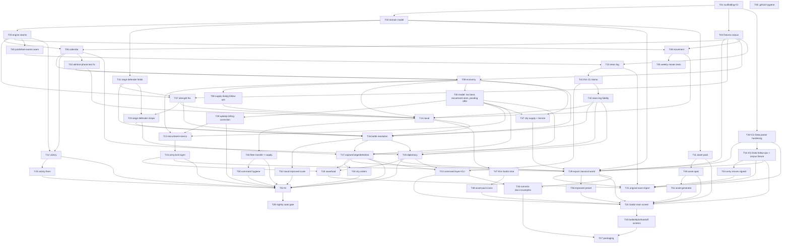

# Task catalogue

Every build task's scope, **Owns** list, Definition of Done, model/effort, reviewer and dependencies, plus the dependency graph and the task index. **How** tasks are dispatched, reviewed and merged is in [build-process.md](build-process.md); operating the project day to day is in [operating-guide.md](operating-guide.md).

**Status is not in this document.** Each task's stage (ready, in progress, merged, blocked, escalated) lives only in its GitHub issue's `status:*` label ([build-process.md §5](build-process.md#5-status-lives-on-github)). The index below links every issue.

57 tasks: the 20 design milestones, eight pieces of scaffolding the milestone list assumes (build/CI harness, engine seams, GitHub hygiene, asset pack, nightly regression gate, the one-time export of the shipped `classical-mediterranean` world/ruleset, the authored `improved` preset, and hardening the `IC2.Data` parsers), twelve corrections to already-merged code (T31–T35, T38–T40, T42–T45), one rule no task owned (T37, the weekly city supply step), and two early slices — T41 of T23's CLI, and T47 of T24's Godot UI.

---

## 1. The dependency graph

- **Merge-after** (hard): task B's branch may not be merged until task A is merged.
- **Start-after** (soft): task B's implementer cannot usefully begin until A is merged, because B has nothing to write against.

A task whose start-after set is satisfied can be dispatched while its merge-after set is still in flight; the implementer works against `main` plus stubs and rebases before merge.



### 1.1 Waves and the critical path

Waves are dependency layers, not concurrent batches: execution is serial, one code-modifying agent at a time ([build-process.md §7](build-process.md#7-concurrency-single-instance-and-local-only)).

| Wave | Tasks | Notes |
| --- | --- | --- |
| 0 | T01, T05 | Disjoint file sets. |
| 1 | T02, T04, T30 | T04 and T30 need only T01. T30's merge gates T29, T21 and T34. |
| 2 | T03 | The serialization point for engine code. |
| 3 | T06, T07, T08, T09, T10, T11, T12, T31, T32, T33, T34, T40, T41, T42, T43 | The widest wave. T43 follows T12. T40 merges before T10; T41 (the thin CLI demo) and then T42 (news-log fidelity) follow T10. T32 merges before T08; T33 before T16 and T17; T34 any time before T21, T24 and T29. T08 and T33 both write `Ruleset.cs`, `toy-ruleset.json` and `tests/fixtures/**` — different records and entries, never in flight together. |
| 4 | T38, T13, T14, T15, T16, T35, T37, T39, T44, T45 | T44 follows T34 and must merge before T21. T45 follows T08 and T09 and gates nothing — it is test-only. T38 follows T08 and precedes T14. T39 follows T35 and precedes T13 and T22. T35 follows T08 and gates T13, T17, T19 and T37. T37 must merge before T29. T16 is the long pole. |
| 5 | T17, T18, T19, T20, T29, T21, T22 | T17 first, then T18/T19/T20; T29 once T15, T17, T19 and T37 have merged; then T21 and T22. T22 is the long pole. |
| 6 | T23, T36, T24, T25, T26, T27, T28 | T36 follows T29 and precedes T24. T24/T25/T27 are single-instance (Godot) and form one serial chain. |

**Critical path**: `T01 → T02 → T03 → T06 → T32 → T08 → T38 → T14 → T16 → T17 → T29 → T36 → T24 → T25 → T27` — 15 of 43 tasks — with `T08 → T35 → T17` and `T31 → T33 → T16` as parallel edges into it; T29 also waits for T15 and T19, and `T17 → T23 → T24` runs one task shorter. The AI chain (`… → T17 → T18 → T22 → T28`) runs alongside it with the most slack and the most uncertain duration, which argues for not deferring T22.

### 1.2 Sequential and independent tasks

- **Strictly sequential**: T01 → T02 → T03; T12 → T43 → T22 (the AI soak needs a victory check that can actually fire); T03 → T40 → T10 → T41 (the news writer reads the published-events view T40 adds; the demo prints its news); T41 → T23 (T23 extends the demo harness); T10 → T41 → T42 → T14, T16, T17, T19 (the news format and its placeholder check settle before the first production news events); T16 → T17 (a siege is a battle); T17 → T18 (a siege wipes a pending fortify order); T08 → T13 (mercenary hire debits the army purse T08 defines); T08 → T38 → T14 (T14 is the first caller of the supply dialog T38 finishes); T35 → T39 → T13, T22 (billing is corrected before recruitment and the AI build on it); T24 → T25 → T27 (Godot, single-instance); T30 → T29 (T29 reads the DAT through T30's parser); T31 → T07 and T31 → T16 (both consume the siege defender weights T31 corrects); T32 → T08 and T32 → T14 (T06's attrition-phase test must stop counting systems before either registers one); T33 → T16 and T33 → T17 (both consume the defender-strength shape T33 corrects); T35 → T13, T17, T19, T37 (the model fields they read and write; T37 also reuses T35's threat predicate); T37 → T29 (it adds `EconomyRules` fields, and the ruleset schema settles before the export); T34 → T29 and T34 → T21 (both read the nation tax base through T34's parse); T34 → T44 → T21 (the army `moves` field is made signed in the parser before the import bridge maps it); T15, T17, T19 → T29 → T21, T24, T26 (the ruleset schema settles before the shipped ruleset is exported, and the shipped world, ruleset and scenario exist before anything consumes them — [build-process.md §2.6](build-process.md#2-how-the-build-avoids-conflicts)); T29 → T36 → T24 (the `improved` preset is authored from the exported constants, and the New Game chooser needs both presets).
- **Independent**: wave 3's pure-rules systems over disjoint directories; T32, T33 and T34 against each other and against T09–T12; T13/T14/T15; T18/T19/T20; T26 against the Godot lane.
- **Looks independent but is not**: T12 (victory) is gated behind T06 because its 250 BC condition needs the calendar's year; T20 (save/load) could be written early, but its DoD ("a mid-game state round-trips after N turns") is only meaningful once the state is largely complete.

---

## 2. The tasks

Conventions used by every entry:

- **Branch**: `task/T<nn>-<slug>`. One branch per task, never reused.
- **Owns**: the only paths the implementer may create or modify, besides its own tests. Anything else → escalate; a defect in another task's files → the bug list ([build-process.md §4.6](build-process.md#46-bugs-and-follow-ups)). A parenthesis narrows a shared file to the part the task may change — for example `Ruleset.cs` (the `NavalRules` record only); ruleset schema changes follow [build-process.md §2.6](build-process.md#2-how-the-build-avoids-conflicts).
- **Done when**: each line is a single assertion an agent can check by running a command. A DoD line is **immutable to the implementer** — see [build-process.md §4.3](build-process.md#43-the-dod-is-not-negotiable-by-an-agent).
- Numbers cited without a report name are already cited in `game-design.md`/`design-audit.md` at the referenced milestone.

### Phase 0 — Foundation

#### T01 Build scaffolding and CI

- **Design milestone**: none (prerequisite the backlog assumes). **Labels**: `phase:0 lane:infra`
- **Branch**: `task/T01-build-scaffolding` · **Model/effort**: Sonnet / Medium · **Reviewer**: Sonnet / High
- **Start after**: — · **Merge after**: —
- **Owns**: `IC2.sln`, `Directory.Build.props`, `.editorconfig`, `tests/**`, `.github/workflows/**`, `scripts/**`, `src/IC2.Engine/IC2.Engine.csproj`, `src/IC2.Cli/**` (the bare `.csproj`/stub `Program.cs` only — `src/IC2.Engine/Model/**` and `src/IC2.Engine/Serialization/**` are T02's, not touched here)
- **Scope**: Create the solution and **pre-declare every project the backlog will ever need** so no later task edits `IC2.sln`: existing `IC2.Data`, `IC2.Inspect`; new `src/IC2.Engine`, `src/IC2.Cli`; new `tests/IC2.Engine.Tests`, `tests/IC2.Data.Tests`. `godot/IC2.MapViewer.csproj` is **excluded** from the solution (it needs the Godot SDK and cannot build in CI) and that exclusion is documented in the file. `Directory.Build.props` centralises `net10.0`, `Nullable=enable`, `ImplicitUsings=enable`, and `TreatWarningsAsErrors=true` **for the new projects only** (existing `IC2.Data`/`IC2.Inspect` opt out, to avoid a scaffolding task turning into a refactor). Add the CI workflow: restore, build the solution, `dotnet test`, on push and PR. Add `scripts/check-godot-churn.ps1` implementing the Godot headless-churn caveat ([`operating-guide.md` §6](https://github.com/diegoami/imperial_conquest_2/wiki/Practical-caveats)) — after a Godot headless run, revert `godot/project.godot` and `godot/MapViewer.cs` if their diff is whitespace/header-only.
- **Done when**:
  1. `dotnet build IC2.sln` succeeds from a clean clone with zero warnings in the new projects.
  2. `dotnet test IC2.sln` runs and passes (a placeholder test in each new test project is acceptable).
  3. The CI workflow runs on the PR and is green; its job does **not** reference the Godot project.
  4. `scripts/check-godot-churn.ps1` exits 0 on a clean tree and exits non-zero (with the two filenames named) when `godot/project.godot`'s header alone has changed.
- **Hazards**: do not "fix" existing `IC2.Data`/`IC2.Inspect` code; out of scope. This PR is gated by the CI workflow it adds: a same-repo branch's `pull_request` workflow runs from the PR head, so no special-casing is needed.

#### T02 Core domain model and JSON round-trip

- **Design milestone**: M1 (types half). **Labels**: `phase:0 lane:engine`
- **Branch**: `task/T02-domain-model` · **Model/effort**: **Opus / High** · **Reviewer**: Opus / High **+ `/code-review --effort ultra`**
- **Start after**: T01 · **Merge after**: T01
- **Owns**: `src/IC2.Engine/Model/**`, `src/IC2.Engine/Serialization/**`, `data/worlds/toy-3city.json`, `data/rulesets/toy-ruleset.json`, `data/scenarios/toy-3city.json`, `tests/IC2.Engine.Tests/Model/**` (file-level, not `data/worlds/**`/`data/rulesets/**` wildcards — see T29, which owns the real shipped world/ruleset data under the same directories without overlapping these specific files)
- **Scope**: The four file kinds from `game-design.md` §"The core data model" — `World`, `Ruleset`, `Scenario`, `SaveGame` — as C# records with `System.Text.Json` contracts, plus the `GameState` tree they produce. Must carry, from day one, every field later tasks need so they do not have to widen the model: per-army and per-fleet **money purse and supply stock**, army morale (`+14` semantics), the unit slot's regular/mercenary marker, city fortification with its `>100` in-progress encoding, fleet condition, the symmetric N×N diplomatic relation matrix with negative cooldowns, and the news ring buffer's storage. Support a `"_provenance"` key per field as `game-design.md` §"Ruleset format" specifies. Ship the toy 3-city / 2-nation `World`+`Ruleset`+`Scenario` under `data/`. Terrain tile types are an **open list** (12 codes shipped, not hardcoded to 12).
- **Done when**:
  1. Round-trip equality tests pass for each of `World`, `Ruleset`, `Scenario`, `SaveGame` (serialize → deserialize → serialize produces identical JSON).
  2. The toy scenario loads from `data/scenarios/toy-3city.json` and resolves its world and ruleset by id.
  3. A malformed file, an unknown required field, and a version mismatch each produce a distinct typed error, one negative test each — never a silent default.
  4. `GameState` is a fully serializable tree: a test constructs a non-trivial state, serializes it, deserializes it, and asserts deep equality.
  5. No gameplay constant is hardcoded in C#: a test asserts that every ruleset-governed number the model exposes is sourced from the loaded `Ruleset` object.
- **Hazards**: this is the widest-blast-radius diff in the plan. Nothing else may be in flight that touches `src/IC2.Engine`.

#### T31 Correct `Ruleset.Siege`'s defender-strength field identities

- **Design milestone**: none — a correction to merged T02, found by T07's review. **Labels**: `phase:0 lane:engine`
- **Branch**: `task/T31-siege-defender-fields` · **Model/effort**: Sonnet / Medium · **Reviewer**: **Opus / Medium**
- **Start after**: T02 · **Merge after**: T02 — and merged before T07 and T16
- **Owns**: `src/IC2.Engine/Model/Ruleset.cs` (the `SiegeRules` record only), `data/rulesets/toy-ruleset.json`, `tests/IC2.Engine.Tests/Model/**`, `tests/fixtures/**` (the one mis-transcribed corpus entry only — a top-up under [build-process.md §2.4](build-process.md#2-how-the-build-avoids-conflicts)'s contract), `docs/investigations/siege-defender-strength.md` (new)
- **Scope**: T02 shipped `SiegeRules` with the loyalty and fortification defender weights attached to the wrong city fields and the population weight named "unidentified" — a report line that guessed at `FUN_0044A98C` propagated through the T04 corpus into T02's field names. The decompiled function, cross-checked against the city-details panel's own UI labels (`TInformation_ShowCityDetails` @ `0x0043BE5C`), gives `loyalty × 150 + finishedFortificationPercent × 250 + populationThousands × 200`. This task corrects **only** `SiegeRules`, the toy ruleset's `siege` block, the one corpus entry, and their provenance text; it writes no engine logic and leaves `FortificationCode` (already correct) untouched. Full evidence: [`investigations/siege-defender-strength.md`](investigations/siege-defender-strength.md).
- **Done when**:
  1. In `SiegeRules` and in `data/rulesets/toy-ruleset.json`, `DefenderLoyaltyWeight`/`defenderLoyaltyWeight` is **150** and `DefenderFortificationWeight`/`defenderFortificationWeight` is **250**. A test asserts both off the **loaded** `Ruleset`, never off a C# literal.
  2. `DefenderUnidentifiedFieldWeight` is renamed **`DefenderPopulationWeight`** (JSON `defenderPopulationWeight`), value unchanged at **200**, and its doc comment and `_provenance` name the city's **population in thousands**, citing `0x0043BE5C`'s `"Population -"` read. No field whose name claims an unidentified field survives in `SiegeRules`; a round-trip test covers the renamed JSON key.
  3. A doc comment on `SiegeRules` states the whole formula as `loyalty × 150 + finishedFortificationPercent × 250 + populationThousands × 200`, and states that the fortification term is the word decoded through **`FortificationCode.FinishedPercent`** — the guarded `code > MaxPercent ? code % radix : code`, matching the function's `if (fort < 0x65) fort else fort % 100` — **not** a raw stored word and **not** an unguarded `% 100`. A test pins `FinishedPercent(100, fortifyRule) == 100` and `FinishedPercent(200, fortifyRule) == 0`, so the difference between the guarded and unguarded decode cannot be lost later. `FortificationCode.cs` itself is unchanged.
  4. The T04 corpus entry **`capture.siegeDefenderStrengthFormula`** is corrected in place — same id, so T04's required-ids and no-duplicate-ids checks stay green — to `loyalty*150 + fortification*250 + population*200` (with the decode noted). Keeps `tag: "confirmed"`; its `note` records that the value supersedes `decompiled-city-capture-resolution.md`'s own wording, naming `FUN_0044A98C` and `0x0043BE5C` as the superseding evidence. All four of T04's DoD checks are re-run and green. (`capture.fortBonusThreshold` is bug [#46](https://github.com/diegoami/imperial_conquest_2/issues/46), not this task's.)
  5. The same file's provenance error is corrected: `combat.naval._provenance.carriedArmyPowerDivisor` currently reads *"a carried army adds armyPower / 50"*; `FUN_0044AA54` calls `FUN_0044A930` (**siege** strength), not `FUN_0044A8CC` (`armyPower`), so it adds *siege* strength / 50. Value unchanged at 50; text corrected. This is the only change outside the `siege` block.
  6. `docs/investigations/siege-defender-strength.md` records the decompilation, the panel-based field identification, the label-to-`DAT_*` table, and a one-line before/after for every field this task renamed or re-weighted.
  7. `dotnet build IC2.sln` and `dotnet test IC2.sln` are green, and `git diff --name-only main...HEAD` lists only Owns paths — in particular **nothing** under `src/IC2.Engine/Strength/**`.
  8. The PR body lists, for the post-merge documentation step, the claims this evidence settles: `design-audit.md` §2.13's `FUN_0044A98C` item (including that the −20%-if-owner≠allegiance and ×9/10-if-attacker==allegiance readings are **two separate adjustments in two different functions**, not one mis-read) and T17's *"Known-open item to record, not resolve"*, which this settles.
- **Out of scope, filed as bugs** ([build-process.md §4.6](build-process.md#46-bugs-and-follow-ups)): [#46](https://github.com/diegoami/imperial_conquest_2/issues/46) — `HighFortificationThreshold`/`…BonusNumerator`/`…BonusDenominator` are misnamed (the branch tests **loyalty** `> 59`, gated on the capital predicate `FUN_0044B8D0`); [#47](https://github.com/diegoami/imperial_conquest_2/issues/47) — `DefenderOwnerNotAllegiancePenaltyPercent` (20) does not match the function's `(strength << 2) / 5`, which truncates differently from a 20% subtraction. Both were fixed by **T33** (`4d4ba20`), which renamed the fields; the names in this line are the pre-fix ones.
- **Hazards**: do not touch T07's branch or `src/IC2.Engine/Strength/**`. Do not re-derive the weights from `decompiled-city-capture-resolution.md` — it was the source of the error. Do not touch `AttackerIsAllegianceDefenderReductionPercent` (`FUN_0044B27C`, T17's). The values 150 / 250 / 200 are unchanged; only which field each multiplies was wrong. T31 and T08 both write `tests/fixtures/**` and are never dispatched together.

#### T30 Harden `IC2.Data`: army tombstones, and the DAT's own file layout

- **Design milestone**: none — the only task that owns `src/IC2.Data/**`, which T21 and T29 build on. Evidence: [`investigations/thracia-supply-morale.md`](investigations/thracia-supply-morale.md) (defect A) and [`investigations/dat-file-layout.md`](investigations/dat-file-layout.md) (defect B). **Labels**: `phase:0 lane:data local-only`
- **Branch**: `task/T30-data-parser-hardening` · **Model/effort**: **Sonnet / High** · **Reviewer**: **Opus / Medium**
- **Start after**: T01 · **Merge after**: T01 — and merged before T29 and T21 start
- **Owns**: `src/IC2.Data/**`, `src/IC2.Inspect/**`, `tests/IC2.Data.Tests/**` (the test project T01 already pre-declares in `IC2.sln`, so this task edits no solution file)
- **Scope**: **two distinct defect classes**, measured across the whole local corpus (51 `.sav` files plus the DAT).

  **A — the `0xFFFF` army tombstone. 3 of 51 saves. [confirmed]** `SaveArmyTable.Parse` rejects any army record whose owner word exceeds 15 and throws `InvalidDataException`, which aborts the parse of the **entire save** — so one bad record makes a whole file unreadable to every tool built on it. Real saves contain such records legitimately: `0xFFFF` is the established **no-owner sentinel** (the same one [`galatia-elimination-and-city-resupply-confirmed.md`](https://github.com/diegoami/imperial-conquest-2-research/blob/main/docs/reports/galatia-elimination-and-city-resupply-confirmed.md) already had to special-case for the *capital* field), marking an army slot merged or eliminated during the turn and not yet compacted. Exactly one such record appears in each of `1_thracia_271_spring_3.sav` (army 10), `1_thracia_271_autumn_1.sav` (army 9) and `1_cartago_271_spring_5.sav` (army 0) — in every case with **valid coordinates**, so the owner word alone is the discriminator. Treat such a record as a **tombstone**: skip it, keep parsing, and surface it as data rather than as a fatal error. Audit the other tables for the same pattern — the fleet, city and nation parsers all apply similar range checks — rather than patching only the one site that happens to be known.

  **B — the DAT is not SAV-shaped, and every table parser after `WorldPrefix` assumed it is. [confirmed]** The DAT has no record-count words (its loader `FUN_004481a0` hardcodes 15 armies and 2 fleets), and its 16-record nation table sits at `0x1B100` with a 1,055-byte record — not the SAV's 1,172, and not a constant offset shift. `Leader` and `HumanPlayer` are absent from the DAT because New Game assigns them. The complete read order, record offsets and field map are in [`investigations/dat-file-layout.md`](investigations/dat-file-layout.md). Deliver a DAT-vs-SAV layout discriminator and a DAT-shaped parse path; do **not** teach the SAV locator to "try harder".
- **Done when**:
  1. `1_thracia_271_spring_3.sav`, `1_thracia_271_autumn_1.sav` and `1_cartago_271_spring_5.sav` all parse; `--list-armies … Thracia` prints the Thracian army for the first two instead of aborting.
  2. Tombstoned records are **excluded from `Armies`** (not returned as degenerate entries with owner 65535) and exposed separately — e.g. a `SkippedRecords` count — so a caller can tell "clean parse" from "parse with tombstones" without re-reading bytes.
  3. A record that is malformed for any *other* reason still throws, with a message naming the record index and the failing field. Tombstone tolerance must not become blanket tolerance for corruption.
  4. A regression fixture runs **every** file in the configured assets directory — all 51 `.sav` files across `saves/`, `saves-processed/` and `saves-processed/processed/`, plus the DAT — through **every** parser and asserts a committed expected-outcome table: 51 of 51 saves and the DAT parse clean through all seven parsers, zero unexpected exceptions, with per-file army/fleet/city/nation counts.
  5. The DAT parses: 16 nation records whose names equal `NationCatalog`'s 16 names in order, plus treasury, unity, mobilized, capital-city index, city count and tax rate read at the **DAT record's own offsets**. A test asserts the DAT's per-nation city counts sum to 334, and that the DAT yields 15 armies and 2 fleets.
  6. `Leader` and `HumanPlayer` are **absent from a DAT parse by construction** — modelled as not-present (e.g. `null` plus an explicit "came from the DAT" marker), never defaulted to a plausible-looking value — with one negative test asserting a caller cannot read a leader name off the DAT and get a non-empty string.
  7. A file that is neither DAT-shaped nor SAV-shaped is rejected with a typed error naming which discriminator failed; the format sniffing must not silently fall through to the wrong layout.
  8. **Every test in this task skips with an explicit "original files not configured" result when `assets.local.ini` is absent**, exactly like T21 and T29.
- **Hazards**: **merge this before T29 starts, and before T21 starts.** T29's DoD line 1 cross-checks its export against `IC2.Data`'s own parse of the DAT — that is defect B, and it is unreachable until this merges. T21's DoD line 1 imports "three or four representative saves" and its line 2 requires an import report with zero unmapped fields, both unreachable if the parser can still abort on a real save; an implementer who meets either by sampling only clean saves will have satisfied the letter of the DoD while leaving the defect in place. Do **not** widen the owner check to accept all values ≤ 65535; `0xFFFF` is a specific sentinel and every other out-of-range owner is still a genuine parse failure. Do **not** recover the DAT's record offsets by searching a SAV for matching values — they are decompiled from `FUN_004481a0` and cited in `investigations/dat-file-layout.md`; a byte-search that happens to land on the same numbers is a `[derived]` result dressed as a `[confirmed]` one, which is exactly what `design-audit.md` §4.5 exists to catch.

#### T03 Engine seams: RNG, turn pipeline, commands, events

- **Design milestone**: none explicitly (implied by `game-design.md` §"Testing and determinism"). **Labels**: `phase:0 lane:engine`
- **Branch**: `task/T03-engine-seams` · **Model/effort**: **Opus / Ultrahigh** · **Reviewer**: Opus / High **+ `/code-review --effort ultra`**
- **Start after**: T02 · **Merge after**: T02
- **Owns**: `src/IC2.Engine/Core/**`, `tests/IC2.Engine.Tests/Core/**`
- **Scope**: The interfaces every later task is written against, and nothing else:
  - `IRng` — one seeded service, threaded through the turn coordinator; the **only** source of randomness in gameplay code (`game-design.md` principle 4).
  - The turn coordinator: an ordered phase pipeline with a stable, declared phase order and an `OnQuarterBoundary` hook contract (fired by T06's calendar, subscribed by T08's economy and T19's thaw) — so economy tests can fire the hook directly without the calendar merged.
  - Command dispatch: `ICommand` → `CommandResult` with a **typed rejection** (illegal command never throws, never silently no-ops).
  - The domain-event sink that T10's news log and the UI both consume.
  - **Attribute-based system registration** (assembly scan), so adding a system touches only that system's own file. This is the anti-conflict mechanism [build-process.md §2.3](build-process.md#2-how-the-build-avoids-conflicts) depends on.
  - The determinism guard: a test that scans `src/IC2.Engine` sources and fails on `System.Random`, `DateTime.Now`/`UtcNow`, `Guid.NewGuid`, `Environment.TickCount`, or unordered-dictionary enumeration in gameplay paths.
- **Done when**:
  1. Two full runs of a scripted N-phase sequence with the same seed produce byte-identical `GameState` hashes; with different seeds, different hashes.
  2. A no-op test system registers by attribute alone and executes in the declared phase order; a second one added in a second file does not require editing any shared file (asserted by the test's own structure).
  3. An illegal command returns a typed rejection with a reason code; a test asserts no exception is thrown and no state changed.
  4. The determinism guard test fails when a deliberately-added `new Random()` is present in a scratch file under `src/IC2.Engine` (test proves the guard works, then removes it).
  5. The `OnQuarterBoundary` hook can be fired directly in a test without a calendar implementation present.
- **Hazards**: **the critical-path blocker.** No other task may be in flight. If the phase order or command shape is wrong here, every wave-3 task inherits it.

#### T04 Fixtures corpus

- **Design milestone**: M1 (fixtures half); implements `design-audit.md` §4.4's recommendation. **Labels**: `phase:0 lane:data`
- **Branch**: `task/T04-fixtures-corpus` · **Model/effort**: Sonnet / High · **Reviewer**: **Opus / Medium**
- **Start after**: T01 · **Merge after**: T01 (independent of T02/T03 — disjoint paths)
- **Owns**: `tests/fixtures/**`, `tests/IC2.Engine.Tests/Fixtures/**`
- **Scope**: Transcribe **every exact number in the research repo's `docs/reports/`** into one typed JSON corpus with a small loader. Each entry carries `id`, `value`, `source` (the report filename), and `tag` (`confirmed` / `derived` / `designed`, matching the report's own tagging). Nothing is derived or computed here — pure transcription, so that a later disagreement is always between code and a fixture, never between two agents' readings. Minimum contents: the twelve `design-audit.md` §4.4 fixtures; the 12-entry terrain move-cost table; the full unit-type stat table; the 5×5 type-effectiveness matrix; the `+0x26` power weights (LI 20 · HI 100 · Ar 40 · LC 60 · HC 120); the diplomatic cooldowns (−8 / −24 / −18); the loyalty floors (40 / 65 / →90); the news-log message literals; the calendar constants; the caps (100,000 troops, 20 units, 198 armies, 40 news slots, 50 mercenary slots, 1,000 purse, 990 unity, 30,000 melee, 40%).
- **Done when**:
  1. A test loads the corpus and fails if any entry has an empty `value`, `source`, or `tag`.
  2. **A test asserts every `source` names a file present in a committed manifest of the research repo's real report filenames** (`tests/fixtures/known-reports.json` or similar, owned by this task, generated once from `gh api repos/diegoami/imperial-conquest-2-research/contents/docs/reports` and checked in — filenames only, not content, so nothing copyrighted or from the original game is involved). The manifest keeps the check offline and CI-green without cloning the research repo. If the manifest ever drifts from the research repo's real contents (a new report added there), that is a one-line update to the manifest, not a reason to weaken this check.
  3. A test asserts the corpus contains every id in a committed required-ids list (the minimum contents above), so a later task cannot silently find its fixture missing.
  4. A test asserts no two entries share an id.
- **Hazards**: the highest-leverage task in the plan for silent error. Reviewed by Opus specifically to re-derive a sample of entries from their cited reports (fetched from the research repo for the review, same as any other citation check — nothing here requires vendoring the reports into this repo). Any number that cannot be found in a report is **not** invented — it is omitted and reported in the PR body.

#### T05 GitHub hygiene: templates, labels, CODEOWNERS

- **Design milestone**: none. **Labels**: `phase:0 lane:infra`
- **Branch**: `task/T05-github-hygiene` · **Model/effort**: **Fable / Low** · **Reviewer**: Sonnet / Medium
- **Start after**: — · **Merge after**: — (fully disjoint; can merge first)
- **Owns**: `.github/pull_request_template.md`, `.github/ISSUE_TEMPLATE/**`, `.github/CODEOWNERS`
- **Scope**: The PR template carrying the review contract from [build-process.md §4.2](build-process.md#42-what-the-reviewer-checks): a DoD-evidence fenced block, a provenance checklist, a determinism checkbox, an Owns-list scope declaration, and `Closes #<issue>`. An issue template for a build task mirroring the catalogue entry shape. `CODEOWNERS` assigning `docs/` and `.github/` to the user so doc changes always notify a human.
- **Done when** (headless-checkable, what the implementer and reviewer actually run):
  1. All three files exist and parse without error (`gh api repos/<owner>/<repo>/contents/<path>` returns 200 for each).
  2. `.github/pull_request_template.md`'s text contains the DoD-evidence heading, the provenance checklist, the determinism checkbox, the Owns-list scope declaration, and the literal string `Closes #` — a plain text/regex assertion against the file, not a behavioral PR-creation check.
  3. The issue template's YAML front matter parses and its body fields mirror the catalogue entry shape (task/model/effort/DoD).
  - **Not part of the headless gate — post-merge, human-verified only**: that `gh pr create` run interactively (no TTY in an agent's shell, so an agent cannot itself drive this) actually renders the template as the new PR's starting body, and that the issue template appears in `gh issue create --web`'s picker (opens a browser; unobservable to an agent). Noted here as a real check worth doing once, by hand, the next time a human opens an issue or PR — not a gate any agent can pass or fail.

---

### Phase 1 — Pure-rules fan-out

#### T06 Calendar and turn sequencing

- **Design milestone**: **M2**. **Labels**: `phase:1 lane:engine`
- **Branch**: `task/T06-calendar` · **Model/effort**: Sonnet / Medium · **Reviewer**: Sonnet / High
- **Start after**: T03 · **Merge after**: T03, T04
- **Owns**: `src/IC2.Engine/Calendar/**`, `tests/IC2.Engine.Tests/Calendar/**`
- **Scope**: Week `+2 mod 12`; season advance at the 11→1 wrap; year *decrement* at Winter→Spring (270 BC counts down); the quarterly hook fired on the season boundary; active-seat rotation following the save's 16-entry turn-order table, with hotseat pause points surfaced as events (not UI). City-unit `StateCode` +2/week capped at 24. Parameterised by `weeksPerSeason`/`seasonsPerYear` from the ruleset. Also **the declared position of the per-turn attrition phase in the turn order** — the slot T08's supply/morale rule and T14's fleet attrition register into. This task owns *when*, not *what*: it declares and asserts the ordering, and the rules themselves live in T08 and T14.
- **Done when**:
  1. Advancing 48 turns from the shipped start produces a week/season/year sequence byte-equal to a committed expected-sequence fixture (hand-computed in the PR body from [`decompiled-turn-and-calendar-sequencing.md`](https://github.com/diegoami/imperial-conquest-2-research/blob/main/docs/reports/decompiled-turn-and-calendar-sequencing.md)).
  2. The quarterly hook fires **exactly 4 times per in-game year** over that 48-turn run — asserted by count, not by inspection.
  3. The year decrements only at the Winter→Spring wrap (a test walks every wrap and asserts on the other three that the year is unchanged).
  4. Seat rotation visits every seat once per calendar tick in turn-order-table order; a hotseat seat raises a handoff event and an AI seat does not.
  5. `StateCode` reaches 24 and stays there (cap, not a reset).
  6. **The turn order places army and fleet attrition before the calendar advance, once per turn, for every army and every fleet regardless of seat.** The original's tick `FUN_004514ec` runs its army loop, then its fleet loop, then the weather system, and only then updates the calendar (`design-audit.md` §2.9a; [`investigations/thracia-supply-morale.md`](investigations/thracia-supply-morale.md), which pins one save = one turn = two weeks three independent ways). Asserted with two no-op probe systems registered into the attrition phase: over a 12-turn run each fires exactly 12 times, both before the calendar advance in every turn, and the season the attrition phase observes is the season **before** that turn's advance — so a Winter→Spring turn consumes at the Winter rate, not the Spring one. That last point is the one an implementer gets wrong by accident, and T08's per-season consumption figures are wrong by 7× if it is.
  7. The attrition phase is a **declared, named phase in T03's ordered pipeline**, not an implicit side effect of another phase — a test asserts a system can register into it without T08 or T14 present, so those two tasks can be written and tested against the ordering before either merges.

#### T07 Strength functions

- **Design milestone**: **M5**. **Labels**: `phase:1 lane:engine`
- **Branch**: `task/T07-strength-functions` · **Model/effort**: Sonnet / High · **Reviewer**: **Opus / Medium**
- **Start after**: T03 · **Merge after**: T03, T04, **T31**
- **Owns**: `src/IC2.Engine/Strength/**`, `tests/IC2.Engine.Tests/Strength/**`
- **Scope**: The three pure functions that M8, M9 and M12 all consume, extracted early exactly as `game-design.md` M5 says: `armyPower`, `fleetPower`, and siege defender strength. **Integer semantics are part of the specification** — the original is Delphi and truncates; every division must be pinned by a test, not left to C# operator defaults.
- **Done when**:
  1. `armyPower(a) = (Σ powerWeight[type] × troops / 100) / 80 × armyMorale` reproduces hand-computed values for the published 13-unit Roman roster, using the `+0x26` weights from the T04 corpus.
  2. `fleetPower(f) = ships × condition / 10 (+ carriedArmyPower / 50)` reproduces hand-computed values, including the carried-army term and its absence.
  3. The `× (1 + random(4)/10)` bonus is applied through `IRng` and is exactly reproducible under a fixed seed (same seed → same value, asserted twice in one test).
  4. Siege defender strength triples archers, and applies the city term. The two clauses are two different decompiled functions and stay split: the attacker side is `FUN_0044A930` (archers ×3, no intermediate `/ 100`, `(total / 80) × morale`), and the defender side is `FUN_0044A98C`, which is `loyalty × 150 + finishedFortificationPercent × 250 + populationThousands × 200`, with **every weight read from T31's corrected `Ruleset.Siege`** and the fortification term decoded through `FortificationCode.FinishedPercent`, never the raw stored word. The third term is population; no parameter, field or doc comment in this diff may describe it as unidentified, and none may tell a caller to pass 0 for it.
  5. A truncation test: at least three cases where integer division differs from floating-point division assert the integer result.
  6. `armyPower` is exercised across the **full confirmed 51…70 morale range** and at both bounds, and the strength it returns is monotonic in morale over that range. `51 … 70` are the real bounds of the field, not a convention: `design-audit.md` §2.9a and [`investigations/thracia-supply-morale.md`](investigations/thracia-supply-morale.md) confirm the hard floor and ceiling in the turn tick, and the army panel prints the value as five 4-wide tiers via `moraleNames[(v − 51) >> 2]`. **This task does not implement the rule that moves morale** (that is T08) and does not clamp on its input; it is a pure function, and a morale outside 51…70 reaching it means an upstream bug rather than something to defend against here.
- **Hazards**: `design-audit.md` §2.9 — **two different morales**. Only army record `+14` (strategic) feeds these functions; the per-unit tactical morale array must not appear here. A reviewer finding tactical morale in this diff rejects it. Equally, a reviewer finding the supply→morale *rule* implemented in this diff rejects it: T07 consumes the field, T08 writes it. It compiles against T31's corrected `Ruleset.Siege` field names (`DefenderPopulationWeight`; loyalty 150, fortification 250); changing `Ruleset.Siege` from inside this task's Owns list is a scope failure.

#### T08 Economy, supply, and purses

- **Design milestone**: **M3**. **Labels**: `phase:1 lane:engine`
- **Branch**: `task/T08-economy` · **Model/effort**: Sonnet / High · **Reviewer**: **Opus / Medium**
- **Start after**: T03 · **Merge after**: T03, T04, T06, **T32**
- **Owns**: `src/IC2.Engine/Economy/**`, `tests/IC2.Engine.Tests/Economy/**`, `src/IC2.Engine/Model/Ruleset.cs` (the `EconomyRules` record and new records nested in it only — additive), `data/rulesets/toy-ruleset.json` (the `economy` block only), `tests/fixtures/**` (DoD 13's top-up only, under [build-process.md §2.4](build-process.md#2-how-the-build-avoids-conflicts)'s contract)
- **Scope**: Tax, quarterly upkeep with real non-payment consequences, loyalty drift and the rebellion check's *confirmed structure* with `_provenance`-tagged placeholder thresholds, the weather-event frequency curve with data-driven effects, **supply as a purchased economy**, **per-turn supply consumption and the supply→army-morale rule it drives**, and per-army/per-fleet money purses gated by the `economy.purses` ruleset flag (`design-audit.md` Q4): `classical-faithful` keeps the confirmed per-army/per-fleet purses (cap 1,000); `improved` routes the same purchases straight to/from the national treasury instead.
  - **Supply consumption and army morale** (`design-audit.md` §2.9a, [`investigations/thracia-supply-morale.md`](investigations/thracia-supply-morale.md), both `[confirmed]`). T07 *consumes* `armyMorale` and T06 owns *when* the tick runs; this task owns the rule that writes the field, because the morale write is a function of the supply percentage it computes. **Every constant below is transcribed from that investigation, not re-derived**; an implementer that goes back to the decompilation to rediscover them has misread the task ([build-process.md §2.4](build-process.md#2-how-the-build-avoids-conflicts)).
    - Per-turn consumption `= ((90 − seasonVal) × troops) / 20000`, with `seasonVal` from the DAT season table at `0x1F7D8`: **Spring 50 · Summer 80 · Autumn 80 · Winter 20**. An army **aboard a fleet** instead consumes a flat `troops / 200`, with no seasonal term.
    - Supply percentage `= supplies × 10000 / troops`, computed **after** that turn's consumption.
    - `pct < 10` → morale `−2`, hard-floored at **51**, and the army loses **one move**. `10 ≤ pct ≤ 15` → **no change** (a deliberate dead band). `pct > 15` → morale `+1`, capped at **70**.
    - Base moves `= 10 − min(5, troops / 20000)`, before the `pct < 10` penalty.
- **Done when** (sharpened from M3, which already names most of these):
  1. `income = 2440 × 15 / 100` and `× 20 / 100` reproduce both published Rome figures exactly.
  2. Ship upkeep `= 3 × ships` per quarter.
  3. The 13-unit Roman roster's regular upkeep computes to exactly **442**.
  4. That army's 482 tons against 48,173 troops reads exactly **100%**; the supply triple 204/998, 344/998, 184/282 reads **20% / 34% / 65%**.
  5. **Supply purchase (`design-audit.md` Q9)**: resupplying at a city the buying army's nation **owns** is free — no talent debit, matching the confirmed Mediolanum frames (army money and national treasury both unchanged across a 100-ton transfer). A 100-ton purchase at a city the nation does **not** own costs **20** talents, debited from the buying army's purse — the `amount / 5` constant from the code, for the paid case only. Where a foreign purchase's talents end up (the selling city's owner, or nowhere) is not yet confirmed; implement the debit as specified and treat the credit side as `_provenance`-flagged `[open]` pending more evidence, not as a confirmed destination. Read `design-audit.md` Q9 in full before writing this test.
  6. The purse cap of 1,000 is enforced on every path that credits a purse.
  7. An army whose upkeep cannot be paid loses troops (a real consequence, not a debt counter).
  8. Weather events fire ~8× more often in Winter than Summer over a fixed-seed 400-quarter run (asserted as a ratio band, the only band assertion in the catalogue, because the underlying figure is itself approximate in [`decompiled-weather-events.md`](https://github.com/diegoami/imperial-conquest-2-research/blob/main/docs/reports/decompiled-weather-events.md)).
  9. Under `economy.purses = centralized` (`improved`), the same supply/mercenary purchase debits and credits the national treasury directly, with no per-army/per-fleet purse involved — asserted with a fixture that would fail item 5's purse-crediting assertion if run under the wrong flag, so the two paths can't silently collapse into one.
  10. **Seasonal consumption**: a 22,000-troop army consumes exactly **44 / 11 / 11 / 77** tons per turn in Spring / Summer / Autumn / Winter, from the season values 50/80/80/20 read out of the ruleset (not hardcoded in C#); an army aboard a fleet consumes exactly `troops / 200` in every season, asserted separately.
  11. **The supply→morale rule reproduces the Thracian series exactly.** A test replays the thirteen recorded turns of `1_thracia_271_*` as a fixture — a 22,000-troop army starting at 142 tons and morale 65, never resupplied, through six Spring turns and into Summer — and asserts the morale sequence **65, 66, 67, 65, 63, 61, 59, 57, 55, 53, 51, 51, 51** turn for turn, and the moves sequence 9 while supplied and 8 from the first `pct < 10` turn on. The floor must hold on the last two turns (`max(51, 49)`), not merely trend downwards. The dead band gets its own case: an army held at 12 % for three turns does not move at all.
  12. Morale is **hard-clamped to 51…70 on every path that writes it**, asserted by a property-style test over the rule (a `+1` at 70 stays 70; a `−2` at 51 stays 51; a `−2` at 52 gives 51, not 50). T07 depends on this range and does not re-check it.
  13. The fixtures corpus is topped up from the 47th report, [`supply-driven-morale-and-fleet-attrition.md`](https://github.com/diegoami/imperial-conquest-2-research/blob/main/docs/reports/supply-driven-morale-and-fleet-attrition.md), the season table (50/80/80/20 at DAT `0x1F7D8`), the `20000` consumption divisor, the flat `troops / 200` at-sea rate, the 10 % / 15 % thresholds, the 51 / 70 clamps, the new-army morale 59, and the fleet constants T14 needs (below) — each a `confirmed` entry citing that report. **This is a top-up, not a reopen of T04**: T04 is merged, its Owns list covers `tests/fixtures/**`, and this task adds entries under that same contract, keeping T04's four DoD checks green (no empty field, `source` present in the manifest — the manifest gets the 47th filename added — every required id present, no duplicate ids).
- **Hazards**: Q9's one open detail (where a foreign purchase's talents go) is not a blocker — tag the credit side `[open]` and move on. `design-audit.md` §2.9 — **two different morales**. This task writes only army record `+14` (strategic); the per-unit tactical morale array must not appear in this diff. Do **not** share an implementation with T14's fleet-condition attrition: the two rules look analogous and are not the same rule (different trigger, different decay shape, different floor, different regeneration, different applicability) — see T14 and the comparison table in `investigations/thracia-supply-morale.md`. T08 and T33 both change `Ruleset.cs`, `toy-ruleset.json` and `tests/fixtures/**` — different records, blocks and entries, never in flight together; whichever merges second rebases and re-runs T02's round-trip tests and T04's four corpus checks. Wiring tax income into the quarterly tick needs a nation tax-base field the model does not carry; that is T35's, not this task's. **This task writes neither unity nor mobilization.** The older billing report's "unity decays by 3 every quarter" is really mobilization's `−3`, and unity has its own quarterly update ([`city-population-growth.md`](https://github.com/diegoami/imperial-conquest-2-research/blob/main/docs/reports/city-population-growth.md)). Both are T35's. T02's `EconomyRules.UnityDecayPerQuarter` field is left for T35 to rename (bug [#68](https://github.com/diegoami/imperial_conquest_2/issues/68)), so this task neither applies it nor removes it.

#### T09 Movement and terrain

- **Design milestone**: **M6**. **Labels**: `phase:1 lane:engine`
- **Branch**: `task/T09-movement` · **Model/effort**: Sonnet / Medium · **Reviewer**: Sonnet / High
- **Start after**: T03 · **Merge after**: T03, T04
- **Owns**: `src/IC2.Engine/Movement/**`, `tests/IC2.Engine.Tests/Movement/**`
- **Scope**: The one-click Bresenham walk; the 12-entry terrain cost table from the corpus; blocking markers; the abort rule and its move-zeroing, gated by the `seatAsymmetry` ruleset flag (`design-audit.md` Q6, [build-process.md §9](build-process.md#9-standing-governance-decisions) Q-D): **AI-only** under `classical-faithful`, **every seat** under `improved`. Used by both armies (T09) and fleets (T14) — the walker is terrain-table-driven and does not special-case sea.
- **Done when**:
  1. The 12-entry table drives costs: Sea 1, Sea 3, Plain 1, Desert 1, Forest 2, Mountains 4, and all six River codes 4.
  2. A Bresenham walk over a committed test grid produces a cell sequence byte-equal to a committed expected-path fixture.
  3. A city, army or fleet marker in the path blocks the walk entirely (the walk stops **before** the marker; no move cost is charged for it).
  4. An unaffordable step aborts the move; under `classical-faithful` the army's remaining moves are **unchanged for a human seat** and **zeroed for a computer-controlled seat**; under `improved` moves are zeroed for **every** seat — asserted as separate tests per ruleset.
  5. A terrain type present in a world but absent from the ruleset's cost table defaults to 1 (the "arbitrary custom maps" guarantee), with a warning event.

#### T10 News log ring buffer and message catalog

- **Design milestone**: **M17**. **Labels**: `phase:1 lane:engine`
- **Branch**: `task/T10-news-log` · **Model/effort**: Sonnet / Medium · **Reviewer**: **Opus / Medium**
- **Start after**: T03 · **Merge after**: T03, T04, **T40**
- **Owns**: `src/IC2.Engine/News/**`, `tests/IC2.Engine.Tests/News/**`
- **Scope**: The 40-slot ring buffer, the catalog of confirmed message templates with operand substitution, **and the writer that carries a news-worthy domain event into `GameState.NewsLog`**. **Emission stays with each gameplay system** ([build-process.md §2.5](build-process.md#2-how-the-build-avoids-conflicts)); this task delivers the buffer, the catalog, the sink-to-state writer, and the coverage test that later tasks must keep green.
  - **The writer** is a system registered through T03's attribute-based registration, subscribing to T03's domain-event sink: for each news-worthy event it resolves the catalog template, substitutes the operands, and appends the rendered message to `GameState.NewsLog` (the storage T02 already ships). Without it, T20 would round-trip a news log nothing ever fills.
- **Done when**:
  1. 41 appends leave exactly the 40 newest, in order, oldest evicted.
  2. Every message literal in the T04 corpus's news section is present in the catalog and renders with its operands substituted (one test per literal, table-driven).
  3. A coverage test asserts every domain event kind returned by T03's `DomainEventCatalog.Discover` that is marked news-worthy has a catalog entry — so a later task adding an event without a message fails CI. (T03 ships attribute-declared event subtypes, not an enum — iterate the discovered set.)
  4. A news-worthy event published to the sink during a turn appears as a rendered message in `GameState.NewsLog` at the end of that turn, asserted on the state itself rather than on the sink; a non-news-worthy event does not. **The 40-slot eviction is asserted end-to-end through the writer**, not only against the buffer in isolation.
  5. The rendered log survives a `GameState` round-trip through T02's serialization — so T20's save/load inherits a news log that is actually populated.
- **Hazards**: The first attempt (PR #77, branch `task/T10-news-log`) escalated after three review rounds. It reached into T03's private `CompositeEventSink` by reflection (R7), and its only alternative was a mutable static (R4). **Resume from that branch** and take the open findings as the brief: R6 and R7, plus the non-blocking N1, N2, N6, N7, N8 and N10–N12 from https://github.com/diegoami/imperial_conquest_2/pull/77#issuecomment-5663984617 and https://github.com/diegoami/imperial_conquest_2/pull/77#issuecomment-5664079375. The writer is a **stateless system registered in `SeatEnd` and `RoundEnd`**. It reads T40's published-events view, renders the news-worthy events of its own scope (seat-scoped or round-scoped, by their phase tag), and appends them to `GameState.NewsLog`. No reflection, no static, no sink that buffers. The DoD-4 tests wire a realistic sink (the writer plus an extra UI-style sink), not a bare writer. Test event kinds live in a namespace-unique fixture group, so later tasks' fixtures can't collide with them (N10).

#### T11 Asset pack loader and generated placeholder pack

- **Design milestone**: none explicitly (`game-design.md` §"Asset packs"). **Labels**: `phase:1 lane:data`
- **Branch**: `task/T11-asset-pack` · **Model/effort**: Sonnet / Medium · **Reviewer**: Sonnet / Medium
- **Start after**: T02 · **Merge after**: T02
- **Owns**: `src/IC2.Engine/Assets/**`, `assets/packs/placeholder/**`, `scripts/generate-placeholder-assets.*`, `tests/IC2.Engine.Tests/Assets/**`
- **Scope**: The manifest loader mapping stable keys to files, plus a **deterministic generator script** producing the placeholder pack (flat-colour unit icons, terrain tiles, silent-but-valid audio stubs). Includes the **size-tiered army/fleet icon set** (`game-design.md` §"Army and fleet markers scale with size", `[confirmed]` — the original's own `TUnitMap_SelectUnit` marker arithmetic, not a guess): exactly `army.tier1.icon`/`army.tier2.icon`/`army.tier3.icon` and `fleet.tier1.icon`/`fleet.tier2.icon`/`fleet.tier3.icon`, one per confirmed band. Also the **city tier set** (`game-design.md` §"City markers", `[designed]` — placeholder pending confirmation): `city.tier1.icon` … `city.tierN.icon` plus `city.capital.icon`. Every tier icon a distinct (not just recoloured) placeholder shape so tiers are visually distinguishable at a glance even in flat placeholder art. No copyrighted original asset ever enters the repo — the existing `.gitignore` policy is unchanged and unchallenged.
- **Done when**:
  1. Every key in the engine's `AssetKeys` constant list resolves to a file that exists in the placeholder pack.
  2. A missing key raises a typed error naming the key, not a null.
  3. Re-running the generator produces byte-identical files (`git status` clean after a re-run) — asserted by the test running the generator into a temp dir and comparing hashes.
  4. `AssetKeys` includes the full city/army/fleet tier set from `game-design.md`, and a test asserts each tier's icon file is pixel-different from its neighbouring tiers (not the same placeholder shape re-exported under a different key).

#### T12 Victory conditions

- **Design milestone**: **M13**. **Labels**: `phase:1 lane:engine`
- **Branch**: `task/T12-victory` · **Model/effort**: Sonnet / Medium · **Reviewer**: Sonnet / High
- **Start after**: T03 · **Merge after**: T03, T06
- **Owns**: `src/IC2.Engine/Victory/**`, `tests/IC2.Engine.Tests/Victory/**`
- **Scope**: The four shipped conditions — the original's all-cities condition and its 250 BC year limit, domination-over-hostiles, score-at-turn-limit, and scenario-custom. Evaluated against a `GameState` constructed directly in tests; does **not** need capture logic merged.
- **Done when**: one test per condition, each with a positive and a negative case; the all-cities test uses the shipped world's own city count (not a hardcoded 334); the year-limit test fires at 250 BC and not at 251 BC; a scenario-custom goal defined purely in scenario JSON fires.
- **Note**: which condition is the shipped default is `design-audit.md` **Q5**, now answered: `victory.default` is `all-cities` under `classical-faithful`, and `domination-over-hostiles` (or `score-at-limit`, ruleset's choice) under `improved`. The task implements all four conditions and reads the default from the ruleset per seat's chosen preset; it does not hardcode either.
- **Hazards**: the original's start-of-turn check (`FUN_00452034`) also deposes a human nation that is in debt and hands its seat to the AI ([`upkeep-payment-and-desertion.md`](https://github.com/diegoami/imperial-conquest-2-research/blob/main/docs/reports/upkeep-payment-and-desertion.md)). That is **T39's**, not this task's. Leave the start-of-turn evaluation open to a second check, and don't implement debt here.

#### T43 Victory: make domination reachable, and run the check each round

- **Design milestone**: **M13**, finishing it. A correction to merged T12 (bug [#108](https://github.com/diegoami/imperial_conquest_2/issues/108)) plus the wiring no task owned (gap [#105](https://github.com/diegoami/imperial_conquest_2/issues/105)). **Labels**: `phase:1 lane:engine`
- **Branch**: `task/T43-victory-fixes` · **Model/effort**: Sonnet / Medium · **Reviewer**: **Opus / Medium**
- **Start after**: T12 · **Merge after**: T12 — and merged before T22
- **Owns**: `src/IC2.Engine/Victory/**`, `tests/IC2.Engine.Tests/Victory/**`, `tests/IC2.Engine.Tests/News/NewsLogWriterTests.cs` (DoD 5's ordering assertion only)
- **Scope**: T12 shipped `VictoryEvaluator` as a pure function, with two gaps this task closes.
  - **The domination branch is dead code** (#108). `GameStateFactory` marks a 0-city nation `Eliminated`, and `EvaluateDomination` skips eliminated nations in its hostile scan, so `hasLiveHostile` is only ever set by a hostile that still owns a city — which immediately clears `everyHostileDominated`. The two can never hold together, so the condition silently degrades to literal total conquest. Concretely: North, at war only with South, takes South's last city and stays `Undecided` forever unless it owns the whole map. That is the shipped `improved` preset's default win condition (`game-design.md` §"Two shipped presets"), so as merged it is unreachable.
  - **Nothing evaluates victory during a run** (#105). `TurnPhase.cs` names "T12 victory" as a `RoundEnd` consumer, but no system registers. T22's soak ends "at a victory condition or a stated turn cap", so this must exist before T22.
- **Done when**:
  1. **Domination is reachable**: a scripted state where North is at war only with South, South owns no cities and North does not own every city on the map, returns `Won` for North. The test fails against the current merged code.
  2. **Elimination doesn't erase the win**: the same scripted state, with South marked `Eliminated`, still returns `Won`. Decide from the evidence whether "every nation I am at war with holds nothing" should count a nation that was eliminated earlier in the game, and say in `_provenance` what was searched; `game-design.md` describes the condition in one sentence and settles no more than that.
  3. **No vacuous win**: a nation that owns no cities itself never wins, mirroring the total-conquest branch's own `totalCities > 0` guard.
  4. **A registered system evaluates victory at `RoundEnd`**, declared by attribute from inside `Victory/**` the way T08's systems declare themselves from `Economy/**` — `Core/Pipeline/**` is not touched. It reads the ruleset's default condition and publishes a domain event when a game is won or expires. Reading a **scenario's** condition instead is `[open]` here: `SystemContext` and `TurnCoordinator` carry the ruleset and the world but never a live `Scenario`, and widening that seam is a `Core/Pipeline/**` change outside this task's Owns list. Record it in the code and the PR. The event is news-worthy only if a corpus literal covers it; if none does, it is not news, and the PR says so.
  5. **It runs last in `RoundEnd`**, after T42's news writer, so a win is evaluated against the state the round actually ended in. A test pins the order. T42 left a deliberate tripwire — `NewsWriterRound_IsLast_InRoundEnd_AcrossTheWholeEngineAssembly` — which this trips by design, so that assertion becomes an **explicit allow-list**: the victory system is named in it, with the reason (no corpus literal covers a victory news line, since T42 reclassified `victoryAllCities` and `conqueredByNation` as `THumanFalls` form labels, so nothing is lost by running after the writer), and any other system appearing after the writer still fails it. A second assertion pins the victory system after the news writer from the other side.
  6. **Idempotence**: evaluating twice in the same round produces one event, not two.
  7. `dotnet build IC2.sln` and `dotnet test IC2.sln` are green, and `git diff --name-only main...HEAD` lists only Owns paths.
- **Hazards**:
  - **Prove each fix by mutation**: re-apply the defect, watch exactly your new test fail, and put that in the PR. T12's own tests passed while this branch was dead, which is how it shipped.
  - T12's round-1 review added the eliminated-skip as "redundant but harmless". It is the thing that makes the win unreachable. Read that exchange before changing it back.
  - Don't widen scope into the debt-based deposition of a human leader: that is T39's.

#### T32 Make T06's calendar tests independent of later systems

- **Design milestone**: none — a correction to merged T06, bug [#50](https://github.com/diegoami/imperial_conquest_2/issues/50), plus the test-only items of T06's review follow-ups [#43](https://github.com/diegoami/imperial_conquest_2/issues/43) (its seat-rotation items are T17's). **Labels**: `phase:1 lane:engine`
- **Branch**: `task/T32-calendar-test-independence` · **Model/effort**: Sonnet / Low · **Reviewer**: Sonnet / High
- **Start after**: T06 · **Merge after**: T06 — and merged before T08 and T14
- **Owns**: `tests/IC2.Engine.Tests/Calendar/**`
- **Scope**: `AttritionPhaseOrderingTests.AttritionPhasesAcceptRegistrationWithNeitherT08NorT14Present` asserts `Assert.Single` over every system registered in `ArmyTick` and `FleetTick`, and `CalendarTestbed.RegistryFor` scans the whole engine assembly — so the test fails the moment T08 registers its supply/morale system, and will again when T14 registers fleet attrition. Make every Calendar test independent of which other systems exist, and fold in #43's test-infrastructure items, which sit in the same directory. Test code only: no production file changes.
- **Done when**:
  1. The attrition-phase registration test asserts that T06's two probe systems are registered in `ArmyTick` and `FleetTick` **by system id**, never by the phase's system count, and stays green with an additional test-local system registered into each phase — a fixture in this task's tests that stands in for T08 and T14.
  2. No test under `tests/IC2.Engine.Tests/Calendar/**` asserts the number of systems in a phase, and `CalendarTestbed` registers T06's own systems plus the test group's fixtures rather than every system in the engine assembly — so the DoD-6 attrition run gives the same result with the stand-in fixtures present, and no later task's system can change a Calendar test's outcome.
  3. #43's test-infrastructure items ([review](https://github.com/diegoami/imperial_conquest_2/pull/41#issuecomment-5656277822), gate 5): `CalendarTestbed` builds each group's `SystemRegistry` once rather than per call; `CalendarTestPaths.cs`'s repository-root walk and `CalendarTestbed`'s copy of `CoreTestbed`'s pattern call the existing helpers wherever they are reachable without editing another task's files; the duplicated probe systems in `AttritionProbeFixtures.cs` collapse into one fixture.
  4. `dotnet build IC2.sln` and `dotnet test IC2.sln` are green, and `git diff --name-only main...HEAD` lists only `tests/IC2.Engine.Tests/Calendar/**`.
- **Hazards**: T06's DoD 7 still holds — the attrition phases are declared, named phases a system registers into by attribute alone; this task changes how the tests prove it, not the phase order. It is on the critical path: nothing beyond these items belongs in it.

#### T33 Complete `Ruleset.Siege` and `SiegeStrength.Defender` against `FUN_0044A98C`

- **Design milestone**: none — a correction to merged T31 and T07: bugs [#46](https://github.com/diegoami/imperial_conquest_2/issues/46), [#47](https://github.com/diegoami/imperial_conquest_2/issues/47) and [#52](https://github.com/diegoami/imperial_conquest_2/issues/52), plus T07's review follow-ups [#49](https://github.com/diegoami/imperial_conquest_2/issues/49). **Labels**: `phase:1 lane:engine`
- **Branch**: `task/T33-siege-defender-shape` · **Model/effort**: Sonnet / Medium · **Reviewer**: **Opus / Medium**
- **Start after**: T31, T07 · **Merge after**: T31, T07 — and merged before T16 and T17
- **Owns**: `src/IC2.Engine/Model/Ruleset.cs` (the `SiegeRules` record only), `data/rulesets/toy-ruleset.json` (the `siege` block, and the root `_provenance` entry for unit-type field `+0x20`), `tests/IC2.Engine.Tests/Model/**` (siege tests only), `tests/fixtures/**` (the `capture.fortBonusThreshold`, `capture.fortBonusMultiplier` and `capture.nonAllegiantDefenderPenalty` entries only), `src/IC2.Engine/Strength/**`, `tests/IC2.Engine.Tests/Strength/**`
- **Scope**: [`investigations/siege-defender-strength.md`](investigations/siege-defender-strength.md) decompiled `FUN_0044A98C` in full: the weighted sum, then `× 5 / 3` when the city is its controlling nation's capital (`FUN_0044B8D0`) **and** its loyalty exceeds 59, then `(strength << 2) / 5` when the city's owner is not its allegiance, then the garrison addend. `SiegeRules` names the first branch after fortification and models the second as a 20 % subtraction, and T07's `SiegeStrength.Defender` stops after the weighted sum. This task corrects the fields, applies both branches in `Defender`, and fixes the stale provenance and T07's follow-ups in the same files. The garrison addend needs recruitment-slot state and is T17's (DoD 7 there).
- **Done when**:
  1. **#46**: `HighFortificationThreshold` / `HighFortificationBonusNumerator` / `HighFortificationBonusDenominator` become `HighLoyaltyThreshold` / `HighLoyaltyBonusNumerator` / `HighLoyaltyBonusDenominator` (JSON keys likewise), values 59 / 5 / 3 unchanged; the doc comment and `_provenance` state the branch tests loyalty `> 59` **and** the capital predicate `FUN_0044B8D0`. Tests assert the values off the loaded `Ruleset` and round-trip the renamed keys.
  2. **#47**: `DefenderOwnerNotAllegiancePenaltyPercent` (20) becomes `DefenderNonAllegiantNumerator` (4) and `DefenderNonAllegiantDenominator` (5), applied as `(strength × 4) / 5`. A test pins `strength = 9 → 7` (a 20 % subtraction gives 8).
  3. `SiegeStrength.Defender` applies both branches in the function's order — weighted sum, then the capital-and-loyalty branch, then the owner ≠ allegiance branch — truncating at each step, taking "is the controller's capital" and "owner ≠ allegiance" as inputs (it stays pure). One test per branch, one with both, and one input where applying them in the other order gives a different result.
  4. The three corpus entries are corrected in place (same ids, so T04's four checks stay green): the threshold names loyalty and the capital gate, and the penalty is `(s × 4) / 5`, not "−20 %".
  5. **#52** and the siege block's provenance: the root `_provenance` entry for `+0x20` cites [`battle-replayed-rout-mechanic-and-combat-constants.md`](https://github.com/diegoami/imperial-conquest-2-research/blob/main/docs/reports/battle-replayed-rout-mechanic-and-combat-constants.md) — per-type shooting vulnerability, LI 18 · HI 2 · Ar 18 · LC 15 · HC 4 — and no `siege` or root provenance string refers to a document that does not exist or calls a now-identified condition unrecovered or unreconciled. No value changes.
  6. **#49**: the seeded-reproducibility test uses a seed whose draw is non-zero and asserts that it is; `SiegeStrength.Attacker` rejects an unknown unit-type id the way `ArmyPower` does; the `ArmyPower.cs` comment claiming the Roman roster pins the truncation order is corrected (both orders give 29,854 — only the dedicated truncation test pins it); no doc comment still quotes T07's pre-correction "fortification/loyalty" wording.
  7. `dotnet build IC2.sln` and `dotnet test IC2.sln` are green, and `git diff --name-only main...HEAD` lists only Owns paths — nothing in `EconomyRules` or the `economy` block, which are T08's.
- **Hazards**: T08 and T33 both change `Ruleset.cs`, `toy-ruleset.json` and `tests/fixtures/**` — different records, blocks and entries, never in flight together; whichever merges second rebases and re-runs T02's round-trip tests and T04's four corpus checks. `AttackerIsAllegianceDefenderReductionPercent` (`FUN_0044B27C`) is T17's and stays as it is. Do not re-derive anything from `decompiled-city-capture-resolution.md`; the investigation is the source.

#### T34 `IC2.Data` follow-ups, a path-independent corpus fixture, and the pending-offer block

- **Design milestone**: none — T30's review follow-ups [#40](https://github.com/diegoami/imperial_conquest_2/issues/40) (items 1–7; item 2's `MapViewer.cs` half is T24 DoD 6), the local corpus-sweep drift, and one confirmed SAV block no parser reads. **Labels**: `phase:1 lane:data local-only`
- **Branch**: `task/T34-data-follow-ups` · **Model/effort**: Sonnet / Medium · **Reviewer**: **Opus / Medium**
- **Start after**: T30 · **Merge after**: T30 — and merged before T21, T24 and T29
- **Owns**: `src/IC2.Data/**`, `src/IC2.Inspect/**`, `tests/IC2.Data.Tests/**`
- **Scope**: T30's expected-outcome table keys each file by its path relative to the assets directory and asserts exact set equality with the files on disk. Moving a save from `saves/` to `saves-processed/` — which `/process-evidence` does once a report cites it — or adding a new save therefore fails the sweep locally until the table is regenerated by hand (CI skips it). Make the fixture follow the file, not the folder, give it a regeneration command, read the nation tax-base and wealth words, and fold in #40's seven items and the pending-offer block ([`pending-offer-block-army-split-and-naupactus.md`](https://github.com/diegoami/imperial-conquest-2-research/blob/main/docs/reports/pending-offer-block-army-split-and-naupactus.md)), which T21's zero-unmapped-fields rule then carries into the model.
- **Done when**:
  1. **Corpus fixture keyed by file name.** Each entry is found by name across `saves/`, `saves-processed/` and `saves-processed/processed/`; moving a save between those folders changes no test outcome (asserted with a synthetic directory tree), and a name found in two folders fails naming both paths.
  2. A save on disk that the fixture does not list makes the coverage test **skip** with a message naming the files and the regeneration command, instead of failing; a fixture entry whose file is absent skips that one case with a reason (#40 item 4). Every present, listed file still runs through all seven parsers, and the headline counts are asserted on the fixture itself, not on the directory.
  3. `IC2.Inspect --corpus-outcomes <out.json>` regenerates the fixture from the configured directory; a re-run over an unchanged corpus is byte-identical, and the committed fixture is regenerated with it (the file count stated in the PR body, not hard-coded in a test).
  4. **#40 items 1 and 2**: an army table in which every record is a `0xFFFF` tombstone is rejected with a typed error naming the count (the cap is `[designed]`; the confirmed corpus has at most one per save); the unreachable SAV-branch guards in `SaveArmyTable.cs` and `SaveFleetTable.cs` are removed, and a malformed SAV is asserted to raise `UnrecognizedSaveFormatException` from each parser — the contract T24 DoD 6 catches.
  5. **#40 items 3, 5, 6 and 7**: `DatLayout.cs`'s derivation prose is corrected; `DatFormatTests`' leader/human-player assertion pins T30 DoD 6's contract exactly; `LocalAssets` treats only its three named exception types as "not configured" (a malformed `assets.local.ini` fails loudly, asserted); `SaveJsonExporter` writes `mercenaryOffers: null` for a DAT, like the other DAT-absent fields.
  6. **The pending-offer block**: a parser reads the 4 bytes at `fileLength − 23` (the report said `− 22`; T34 showed on all five named saves that `− 23` is the offset its own table and reproduction command describe, and that `− 22` clips `currentNation`. The research report is corrected as `63bb025`.) as `proposingNationIndex` (`0xFFFF` = none) and `proposedRelationState`, asserted on `1_rome_270_winter_9.sav` (none), `1_rome_270_winter_9_b.sav` (7, 1) and `1_rome_270_winter_11.sav` (11, 1), and raises `DatDataNotPresentException` on the DAT.
  7. **Tax base and wealth**: the nation table exposes the tax base — a signed 16-bit word at SAV nation `+0x44c` and DAT nation `+0x41b` — and wealth at SAV `+0x430` and its DAT counterpart in `investigations/dat-file-layout.md`'s read order ([`nation-tax-base-and-city-economy-fields.md`](https://github.com/diegoami/imperial-conquest-2-research/blob/main/docs/reports/nation-tax-base-and-city-economy-fields.md)). Asserted on Rome: 2,444 in `1_rome_270_summer_7.sav`, and 2,528 in the DAT.
  8. Every test skips with an explicit "original files not configured" result when `assets.local.ini` is absent; `dotnet build IC2.sln` and `dotnet test IC2.sln` are green; only Owns paths change.
- **Hazards**: tombstone tolerance stays specific to `0xFFFF` (T30's hazard). Regeneration records what the parsers produce — it is not a way to make a failing file pass: a file whose outcome changes between regenerations is reported, not silently re-baselined.

---

#### T44 `IC2.Data`: army `moves` is a signed field, and a sweep for the same gap

- **Design milestone**: none. A correction to merged T30/T34: `ArmyRecord.Moves` decodes a **signed** 16-bit field as `ushort`, so a real save's `−1` reports as `moves 65535` (bug [#125](https://github.com/diegoami/imperial_conquest_2/issues/125)). **Labels**: `phase:1 lane:data local-only`
- **Branch**: `task/T44-army-moves-sentinel` · **Model/effort**: Sonnet / Medium · **Reviewer**: **Opus / Medium**
- **Start after**: T34 · **Merge after**: T30, T34 — and merged before T21
- **Owns**: `src/IC2.Data/**`, `src/IC2.Inspect/**`, `tests/IC2.Data.Tests/**`
- **Scope**: The corpus evidence, from a sweep of all 54 save files (50 distinct save states; **627** army records across the 54 files — 623 live plus 4 tombstoned — and 572 across the distinct states, which is the denominator the 0–10 range below uses): legitimate `moves` values run **0–10**, and exactly one army reads `0xFFFF` — Ptolemaic army 9 at `(192, 96)`, Summer 270 week 7, present in `11.sav`, `11_ptol.sav`, `11_supply.sav` and `1_rome_270_summer_7.sav`, which are all the same save state. Its `CoveredCell` is `2`, **not** `AboardFleetSentinel`, so it is a live on-map army, and every other field of the record parses sensibly. **[`army-moves-field-signed-and-the-ffff-underflow.md`](https://github.com/diegoami/imperial-conquest-2-research/blob/main/docs/reports/army-moves-field-signed-and-the-ffff-underflow.md) settles what the value is, at instruction level: army `+6` is a *signed* word.** Every guard on it is `JLE`/`JGE` and every widening read is `MOVSX` — there is no `JBE`, `JAE` or `MOVZX` on the field anywhere — so `0xFFFF` is `−1`, and it is **not a sentinel**: no code compares against it, and all fourteen write sites write `0`, `1`, a floored decrement, or the weekly value. It is an **underflow in the original**, from the one unfloored write (`0x0044DBF7 SUB word ptr [EBX + 0x6],0x2`, the aboard-a-fleet branch, whose sibling `DEC` twelve instructions later *is* guarded). Its effect in the original: every guard fails, so the army is frozen and cannot even be selected for the rest of the turn — self-healing at the next weekly tick. The original's own army panel would print `Moves --1`, though only its owner sees the number, and the owner here is an AI. So this task makes the parser read the field as it is written, rather than naming a sentinel that does not exist, and audits the rest of both record types for the same signedness gap.
- **Done when**:
  1. `ArmyRecord.Moves` is a **signed** 16-bit field, so the affected army reads `−1`, not `65535`. Its doc comment states what [`army-moves-field-signed-and-the-ffff-underflow.md`](https://github.com/diegoami/imperial-conquest-2-research/blob/main/docs/reports/army-moves-field-signed-and-the-ffff-underflow.md) establishes — that a negative value is an underflow in the original which freezes the army until the next weekly tick, not a sentinel — and cites the report by filename. `0xFFFF` gets **no** constant of its own: inventing one would assert a sentinel the decompilation specifically refutes.
  2. Nothing downstream reads `65535`. A negative value is legible as negative wherever the field surfaces, and the two genuine `0xFFFF` sentinels on these records (`AboardFleetSentinel`, `TombstoneOwnerSentinel`) keep their existing, separate handling — this task must not blur the three together.
  3. `IC2.Inspect` prints the signed value in `--list-armies`, `--inspect-army` and `--to-json`. A negative one is additionally flagged as the original's frozen-army state, in the style of the existing `aboardFleet` flag, so a reader is not left to wonder.
  4. A test pins Ptolemaic army 9 in the `11` save family to `−1`, and a second pins an ordinary army in the same save to its positive value, so a change that flattens both is caught.
  5. **The sweep**: every other `ushort` field in `ArmyRecord`, `ArmyUnit` and `FleetRecord` is checked against the corpus for values outside its plausible range **and for the same signedness question** — a field the game guards with `JLE`/`MOVSX` is signed, whatever its current C# type says — and the PR body lists what was checked and what was found, including "nothing" where nothing was found. This is the instruction T30 was given for the tombstone, for the same reason: patching only the known site leaves the next one to be found by a user.
  6. Every test skips with an explicit "original files not configured" result when `assets.local.ini` is absent; `dotnet build IC2.sln` and `dotnet test IC2.sln` are green; only Owns paths change.
- **Hazards**:
  - **Do not "fix" the original's bug in the parser.** `IC2.Data` reports what the file says: an army at `−1` parses as `−1`. Clamping it to `0` here would hide a real artefact of the original from every consumer, and the import policy belongs to T21.
  - **Do not treat a negative `moves` as a parse failure.** It is a legitimate state of a real save — the corpus has one — exactly as the `0xFFFF` owner tombstone is (T30's hazard).
  - Do not touch `src/IC2.Engine/**`. How the imported model represents this is T21's, under its own hazard line.
  - The corpus numbers above are evidence to check against, not to re-derive: a sweep that reports different counts has found something, and says so.
- **Constraint**: `local-only`. Cannot be dispatched to a machine without `C:\Users\diego\Documents\imp_conq_original`. See [build-process.md §8](build-process.md#8-adding-a-second-machine-later).

---

#### T45 Pin the weekly moves maximum with the tests it never got

- **Design milestone**: none. **The rule is already implemented** — this task supplies the checks it was merged without. **Labels**: `phase:1 lane:engine`
- **Branch**: `task/T45-weekly-moves-maximum` · **Model/effort**: Sonnet / Medium · **Reviewer**: **Opus** / Medium
- **Start after**: T08, T09 · **Merge after**: T08, T09
- **Owns**: `tests/IC2.Engine.Tests/Economy/**` (new tests only — no production file, no ruleset, no fixture)
- **Scope**: **Read this before planning anything.** This task was originally written to *add* the weekly moves budget, on the belief that nothing granted moves. That belief was wrong, and the error was the main session's: T08 already recomputes it for every army, every round.
  - `src/IC2.Engine/Economy/SupplyMoraleRule.cs` — `BaseMoves` returns `BaseMovesMax - Math.Min(MovesReductionCap, troops / MovesTroopDivisor)`, and `data/rulesets/toy-ruleset.json`'s `economy.supplyMorale` supplies **10, 5, 20000**: exactly `10 − min(5, troops / 20000)`.
  - The same file's `ApplyToMorale` subtracts `movesPenaltyOnDecay` (**1**) when `supplyPercent < decayThresholdPercent` (**10**), where `SupplyCapacity.PercentFull` is `supplyTons * SupplyPercentNumerator / troops` — the tick's `supplies × 10000 / troops`, **not** `FUN_0044AAB4`'s variant.
  - `ArmySupplyAndMoraleSystem.cs:51` writes `Moves = outcome.Moves` for every army, in `TurnPhase.ArmyTick`.

  So the formula is live and correct. What it has never had is **boundary coverage**: no test anywhere in the repository exercises the five size steps, the starving threshold, or the mid-week non-refresh clause. That is this task, and it is test-only.

  The formula, for reference, `[confirmed]` at instruction level in [`army-moves-field-signed-and-the-ffff-underflow.md`](https://github.com/diegoami/imperial-conquest-2-research/blob/main/docs/reports/army-moves-field-signed-and-the-ffff-underflow.md) §4 (`0x00451633`–`0x004516D7`) — an **independent** recovery that agrees with what T08 shipped from [`investigations/thracia-supply-morale.md`](investigations/thracia-supply-morale.md). Two derivations from different evidence agreeing is the strongest confirmation this project has for the rule; say so in the PR body rather than re-deriving either.
- **Done when**:
  1. **The five size steps, at their boundaries**: 19,999 and 20,000 troops; 39,999 and 40,000; and at 100,000+, where `min(5, …)` pins the floor at 5. Each asserted through the ruleset's values, never a C# literal.
  2. **The starving case, either side of its threshold**, and asserted to use the **`supplies × 10000 / troops`** expression — an army whose percentage lands just below 10 loses the extra move, one just above does not.
  3. **The maximum is not refreshed when an army's size changes mid-week.** A test grows an army between ticks and asserts its moves are unchanged until the next tick. This is a confirmed corpus claim that nothing currently verifies: Rome's army at `(100, 42)` in `12_mac.sav` kept `moves 8` — right for its pre-transfer 48,173 troops — after growing to 63,173 mid-week.
  4. **Each of the three is proved by mutation**: change the constant or the clause it pins, watch a named test fail, restore it, and report the failing test's name in the PR body. A test that passes with the behaviour broken is the defect this task exists to prevent.
  5. `dotnet build IC2.sln` and `dotnet test IC2.sln` are green, and `git diff --name-only main...HEAD` lists only Owns paths.
- **Hazards**:
  - **Do not add a system, a rule, or a ruleset field.** A second system registered in `TurnPhase.ArmyTick` also writing `ArmyState.Moves` would race the existing one on the same field — the order-dependency class [build-process.md §4.2](build-process.md#42-what-the-reviewer-checks) gate 5 exists to catch. If a test seems to need production code to change, **stop and report it**.
  - **Do not change T08's rule or its constants to make a test convenient.** If the implementation and the report disagree anywhere, that is a finding to report, not a thing to fix here.
  - **The original's own inconsistency stays `[open]`.** The tick writes the value using `supplies × 10000 / troops`, while `FUN_0044AAB4` — the end-turn "has not acted" helper — tests `supplies × troops / 10000`. They agree only near 10,000 troops. Pin **the tick's**, which is what is implemented, and leave the end-turn prompt alone. The report's controlled-save recipe B settles which the original applies; if it has been run by the time this task starts, cite its result.

---

#### T40 Expose the run's published events to systems (a T03 seam)

- **Design milestone**: none. A correction to merged T03: a registered system can't read the events published earlier in the same run without breaking T03's stateless-system contract (bug [#83](https://github.com/diegoami/imperial_conquest_2/issues/83)). T10's news writer needs exactly that. **Labels**: `phase:1 lane:engine`
- **Branch**: `task/T40-published-events-seam` · **Model/effort**: Sonnet / Medium · **Reviewer**: **Opus / Medium**
- **Start after**: T03 · **Merge after**: T03 — and merged before T10
- **Owns**: `src/IC2.Engine/Core/Pipeline/SystemContext.cs`, `src/IC2.Engine/Core/Pipeline/TurnCoordinator.cs`, `src/IC2.Engine/Core/Events/**` (additive only), `tests/IC2.Engine.Tests/Core/**` (new tests only)
- **Scope**: `TurnCoordinator.Run` already records every event of a run in a private `RecordingEventSink`. Expose that record, read-only, on `SystemContext`, so a system can see what earlier systems in the same run published without keeping state of its own. Each entry carries the phase it was published in, and the id of the system that published it. The change is additive: `SystemContext`'s constructor is internal, so no existing system changes.
- **Done when**:
  1. `SystemContext` exposes the events published **earlier in the current run**, in publication order, each tagged with its phase and publishing system id. The list is read-only; a system cannot modify it.
  2. It includes events published through command dispatch and quarter-boundary handlers during the run, since they go through the same sink. One test for each source.
  3. A system in `SeatEnd` sees the events of `SeatStart`, `Orders` and the systems before it in `SeatEnd`. A system in `RoundEnd` sees the round-scoped phases' events. When `RunTurn` follows on into the round tick, it also sees the seat-scoped events of the same run, told apart by their phase tag. A fresh run starts empty, so nothing carries over between turns.
  4. The caller's own sink still receives every event exactly as before, and `TurnResult.Events` is unchanged. Existing golden runs keep the same `GameStateHash`, and every existing test stays green.
  5. `dotnet build IC2.sln` and `dotnet test IC2.sln` are green, and `git diff --name-only main...HEAD` lists only Owns paths.
- **Hazards**:
  - Registered systems stay **stateless**: this seam exists so that T10 needs neither reflection over `CompositeEventSink` nor a static.
  - Don't add a news-specific hook. This is a general read-only view that any system may use.
  - Keep `SystemContext` wide but additive, per its own remarks.

#### T41 Thin CLI demo on the toy world (a walking skeleton)

- **Design milestone**: **M18** (headless half), an early slice of T23. **Labels**: `phase:1 lane:engine`
- **Branch**: `task/T41-cli-demo` · **Model/effort**: Sonnet / Medium · **Reviewer**: Sonnet / High
- **Start after**: T10 · **Merge after**: T06, T08, T09, T10 — and merged before T23
- **Owns**: `src/IC2.Cli/**`, `src/IC2.Engine/Presentation/**` (the text session and the snapshots it prints), `src/IC2.Engine/Movement/Commands/**` and `src/IC2.Engine/Economy/Commands/**` (new: the move-army and buy-supply commands and their handlers), `tests/IC2.Engine.Tests/Presentation/**`, `tests/IC2.Engine.Tests/Movement/Commands/**`, `tests/IC2.Engine.Tests/Economy/Commands/**`, `tests/fixtures/cli/**` (the demo script and its golden transcript), `data/scenarios/demo-*.json` (only if the demo needs its own scenario)
- **Scope**: A playable text slice of what is already built, on the toy 3-city world, so the user can see the engine run before the full rules land. `IC2.Cli` loads the toy world, ruleset and scenario, then runs the real `TurnCoordinator` with every registered system. It reads commands from the console, or from a script with `--script <file>`:
  - `status`: the calendar and the active seat; each nation's treasury, unity and tax rate; each army's position, troops, units, supplies and supply %, morale and moves; each city's owner, population, supplies and loyalty.
  - `map`: the 8×6 terrain as ASCII, with city, army and fleet markers.
  - `move <army> <x> <y>`: a new `MoveArmy` command. Its handler walks with T09's `MovementWalker` / `TerrainCostLookup` (never `Ruleset.MoveCostFor`), spends the moves, applies the abort rules and prints the path.
  - `buy <army> <city> <tons>`: a new `BuySupply` command wrapping T08's `SupplyPurchase` dialog path. It is free at your own cities and paid abroad.
  - `end`: ends the human seat's turn through `TurnCoordinator.RunTurn`. Seats without a human pass with no orders, because there is no AI yet, and the round tick runs when it is due. It prints the news written that turn (T10) and what changed.
  - `news`, `help`, `quit`.

  Everything goes through commands and the turn pipeline; the CLI holds no game rules of its own. What isn't built yet (battles, capture, recruitment, diplomacy, the AI) is simply absent, and `help` says so.
- **Done when**:
  1. `dotnet run --project src/IC2.Cli -- --script tests/fixtures/cli/demo.txt` exits 0, and its output equals the committed `tests/fixtures/cli/demo.golden.txt` byte for byte. A test runs the same session in-process, through the Presentation session, and asserts the same. The script plays across a season boundary, so the quarterly billing and the supply/morale ticks show up. It includes a move and a `news` print.
      **The free/paid purchase demonstration moved out of this fixture on 2026-09-19.** It used to be a clause of this line, and the demo no longer shows it: T22's AI takes `south`'s seat at `aggression: 0.8`, attacks `north-army-1` where the script walks it, and **wins on the engine's own arithmetic** (3,630 against 4,425, ratio 1,219 against a gate asking 1,160). The army dies six turns before the script would buy with it.
      **Sparing it was rejected on purpose.** Tuning the AI down would be tuning the engine to fit a fixture; reordering the script makes both purchases legal but degenerate (*"bought 1 tons… free"* and *"bought 0 tons… costing 0 talents"* — the letter of the rule and none of its substance), because the old transcript only showed a real 50-ton purchase after six turns of consumption had emptied the army first.
      **So the rule is pinned by its own test instead**: `SupplyPurchaseDemoTests` (`tests/IC2.Engine.Tests/Presentation/**`), asserting a **free** purchase at an owned city and a **paid** one at a foreign city, through the Presentation session, with the exact talents asserted. **The third time in one day** the golden transcript broke a rule belonging to another task — T50's `arx` move, T18's fortification tick, and this — which is the argument for the split: the golden proves *the demo runs and its output is stable and explained*, and a specific rule is pinned by a test only that rule can break.
  2. The same seed gives an identical transcript twice. A different `--seed` changes only what the RNG drives, such as weather.
  3. `MoveArmy` is rejected with a typed rejection for an unknown army, another nation's army, or no moves left. A legal move spends exactly the walker's cost and ends where the walker stops.
  4. `BuySupply` is free at an own city and costs `amount / 5` abroad, using T08's functions. It re-implements no rule.
  5. The CLI and Presentation code carry no gameplay constants or rules. Every number printed comes from `GameState` or the ruleset.
  6. The PR's "Docs affected" lists a short README section, "Try the demo", with the command to run.
  7. `dotnet build IC2.sln` and `dotnet test IC2.sln` are green, and `git diff --name-only main...HEAD` lists only Owns paths.
- **Hazards**:
  - **It's a slice, not T23.** It has no Godot-facing view models and no command for every order type. T23 later extends this harness to the full command set and the view models; it doesn't start over.
  - **Order news.** Commands dispatched between turns don't reach `SystemContext.PublishedEvents` (T40). Route each `CommandResult`'s events through T10's public `NewsLogWriter.Append`, so that news from orders reaches the log (T40 follow-up [#87](https://github.com/diegoami/imperial_conquest_2/issues/87) P1).
  - **The scenario's `ai` seat has no AI.** The demo ends that seat's turn with no orders and says so in the transcript.
  - **T38 will change `SupplyPurchase`'s API** (clamping, `AdmittedTons`). T38 updates this task's `BuySupply` handler.
  - Don't edit the toy data files. If the demo needs a different setup, add `data/scenarios/demo-toy.json`.

#### T42 News-log fidelity: slot format, round headers, and the corpus's news literals

- **Design milestone**: **M17**. A correction to merged T10 and T04, from T10's follow-up [#91](https://github.com/diegoami/imperial_conquest_2/issues/91), bug [#88](https://github.com/diegoami/imperial_conquest_2/issues/88), and [`news-log-format-and-messages.md`](https://github.com/diegoami/imperial-conquest-2-research/blob/main/docs/reports/news-log-format-and-messages.md) (research `d9473ff`). **Labels**: `phase:1 lane:engine`
- **Branch**: `task/T42-news-fidelity` · **Model/effort**: Sonnet / Medium · **Reviewer**: **Opus / Medium**
- **Start after**: T10 · **Merge after**: T10, T41 — and merged before T14, T16, T17 and T19
- **Owns**: `src/IC2.Engine/News/**`, `tests/IC2.Engine.Tests/News/**`, `src/IC2.Engine/Model/Ruleset.cs` (the news rules record only), `data/rulesets/toy-ruleset.json` (the `news` block only), `tests/fixtures/**` (the `newsMessage.*` entries, `required-ids.json`'s news ids, and the report's filename in `known-reports.json`), `tests/fixtures/cli/demo.golden.txt` (regenerated only if the demo's output changes)
- **Scope**: Make the news log match the original byte for byte, where the report settles it, and fix the corpus's news literals. **Every rule below is transcribed from the report, not re-derived.**
  - **The slot:** 40 slots of 61 bytes each, a NUL-terminated single-byte string, so **at most 60 bytes of text**, all printable ASCII `[confirmed: 2,101 slots in 54 saves]`. Slot 0 is the oldest, and a full log shifts down one slot `[confirmed: 252 of 252 save pairs]`.
  - **Numbers:** the reparations amount is grouped with a comma every three digits and no locale (`2,269`). No other operand is grouped; week and year are plain.
  - **Round headers:** the last entries of every round tick are a single-space line `" "` and the header `"Week  <w>      <Season>      <year>BC"`, with the report's exact spacing. Storm, fleet-completion and deposition lines are written before them.
  - **"A conquers B."** is written between two 59-dash lines.
  - **Corpus:**
    - `fleetLostAtSeaObservedExample` and `fleetFinished` gain their final period (#88).
    - `victoryAllCities` and `conqueredByNation` are game-over form labels, and `pendingDiplomaticOfferParaphrase` is a dialog. None of them is news: reclassify them out of the news section, and keep the ids if T04's required-id list needs them.
    - The report's missing templates are added: alliance, war declaration, capital move, deposition, storm damage, the dash line, the blank line and the week header.
- **Done when**:
  1. **Slot text is capped at 60 bytes in a single-byte encoding**, with the 61st byte reserved for the NUL. A test covers a 59-, a 60- and a 61-byte message, and a non-ASCII operand, which is rejected or replaced (say which, with `_provenance`) rather than silently counted as UTF-8 (#91 N15).
  2. **The reparations operand renders `2,269`** and `12,345,678`, with a comma every three digits and no culture. A week or year operand renders ungrouped (#91 N27).
  3. **The round tick ends with `" "` and the week header**, written by the `RoundEnd` writer after that round's news. A test runs a full round through `TurnCoordinator` and asserts the last two `NewsLog` entries exactly, spacing included, with the calendar values after that tick's advance.
  4. **"A conquers B."** renders as three entries: dash line, message, dash line. A test covers it.
  5. **The corpus's news section matches the report**, with the corrections and additions above. The catalog holds each literal verbatim, and a render test covers every literal, extending T10's table-driven test. T04's four checks stay green.
  6. **The coverage test checks placeholders** (#91 N17/N28): every news-worthy event type in the engine assembly has a property for every placeholder in its template, and a test proves the check fails when one is missing. This must be in place before T14, T16 or T17 declare the first production news events.
  7. **T10's other follow-up items:**
     - N16: the catalog test checks set equality.
     - N18: "runs last" is pinned against the whole engine assembly, or the tie-break is documented and tested.
     - N20: the out-of-run entry point is tested with a real `CommandResult`.
     - N23: no test fixture reuses a production event kind.
     - N25: the stale comments are fixed.
     - N26: an ambiguous placeholder throws.
  8. If the demo's output changes, T41's golden transcript is regenerated in the same PR, and the diff shows only news lines.
  9. `dotnet build IC2.sln` and `dotnet test IC2.sln` are green, and `git diff --name-only main...HEAD` lists only Owns paths.
- **Hazards**:
  - **Uppercasing:** a war declaration involving a human is uppercased in full `[derived]`. T19 emits war declarations; T42 provides the rendering rule, and T19 calls it with the human flag.
  - **The new-game seed** (the DAT's 27 scripted lines, and `newsIndex` 26) is world data. It is T29's to export, not T42's.
  - **Byte-exact leftovers** after each NUL matter only for writing original-format saves, which no task does. Don't model them.
  - T41 prints news. If its golden transcript changes, regenerate it here, and don't touch T41's code.

### Phase 2 — Dependent systems

#### T35 Model: nation tax base, recruitment slots, and the pending diplomatic offer

- **Design milestone**: none — a correction to merged T02, whose model does not carry four pieces of state later tasks read and write, and to merged T04's corpus, which carries Rome's tax base as 2,440; also the quarterly tax-base rebuild and treasury credit, which T08 cannot wire without the first, and the rest of that quarterly step no task owned: city population growth, the mobilization decay and the unity update. **Labels**: `phase:2 lane:engine`
- **Branch**: `task/T35-model-additions` · **Model/effort**: Sonnet / High · **Reviewer**: **Opus / High**
- **Start after**: T08 · **Merge after**: T08 — and merged before T13, T17 and T19
- **Owns**: `src/IC2.Engine/Model/**` and `src/IC2.Engine/Serialization/**` (the four additions below, and `NationState.Wealth`'s doc comment, only), `src/IC2.Engine/Model/Ruleset.cs` (additive `EconomyRules` fields for this task's constants, and DoD 10's rename of `UnityDecayPerQuarter`), `data/rulesets/toy-ruleset.json` (the `economy` block only), `data/worlds/toy-3city.json` and `data/scenarios/toy-3city.json` (their values for the new fields only), `tests/IC2.Engine.Tests/Model/**` (new tests only), `src/IC2.Engine/Economy/**` and `tests/IC2.Engine.Tests/Economy/**` (the quarterly rebuild, the treasury credit, the city-transfer adjustment, quarterly population growth, the quarterly mobilization and unity update, the quarterly loyalty draws, and the hostile-army-adjacent predicate only), `tests/fixtures/**` (DoD 8's entries only), `tests/IC2.Engine.Tests/Fixtures/FixturesCorpusTests.cs` and `tests/IC2.Engine.Tests/Fixtures/DownstreamNamespaceUsageTests.cs` (their `tax.nationTaxBaseRome` and `economy.unityDecayPerQuarter` assertions only), `tests/IC2.Engine.Tests/Core/DownstreamSeamUsageTests.cs` (DoD 10's rename only)
- **Scope**: `NationState` has no tax base, so T08's `TaxIncome.Compute` is never credited and T17's DoD 3 names a field that does not exist; `GameState` has no recruitment slots, which T13's standing recruitment, T06's `CityUnitStateCode` and T17's garrison addend all need; it has no pending diplomatic offer, which T19 DoD 10 and T34's parse need; and `NationState` has no mobilization, which population growth, the unity update, T37's city supply step and T13's recruitment cap all read. [`nation-tax-base-and-city-economy-fields.md`](https://github.com/diegoami/imperial-conquest-2-research/blob/main/docs/reports/nation-tax-base-and-city-economy-fields.md) settles the tax base `[confirmed]` against 54 saves: it is persisted state — the signed 16-bit nation word at SAV `+0x44c` and DAT `+0x41b` — that `FUN_00451b40` zeroes and rebuilds every quarter and that city transfers adjust in between. [`city-population-growth.md`](https://github.com/diegoami/imperial-conquest-2-research/blob/main/docs/reports/city-population-growth.md) gives the same function's population growth, mobilization decay, unity update and step order, all `[confirmed]` against saves except where DoD 9–10 say otherwise. **Every constant below is transcribed from those two reports, not re-derived.**
- **Done when**:
  1. `NationState` carries the tax base as **persisted state**, never recomputed on demand. It also carries its **mobilization** percentage as persisted state: nation `+0x442`, `IC2.Data`'s `MobilizedPercent`, 0–100 (the cap is `recruitment.mobilizationCapPercent`). `Wealth` stays a separate field, and its doc comment says what it is — nation `+0x430`, `Σ population × 3000` — and that the reparation formula reads the tax base, not wealth.
  2. Each nation carries its recruitment slots with exactly the fields `IC2.Data`'s `SaveRecruitmentTable` exposes — target city, unit type, troops, state code — and no invented ones.
  3. `GameState` carries at most one pending diplomatic offer — proposing nation and proposed relation code — or none, as the pending-offer report describes.
  4. All four survive T02's round-trip and deep-equality tests, which are extended to cover them; T02's DoD 3 (a missing required field is a typed error) still holds.
  5. **The quarterly rebuild** (`FUN_00451b40`): at each quarter boundary every nation's tax base is zeroed and rebuilt as `Σ over the cities it owns of (tribute × population / maxPopulation) × 4`, and its wealth as `Σ population × 3000`, integer-truncating each city's contribution — a test on a scripted `GameState`.
  6. **The quarterly treasury credit** (`FUN_00451b40`): `taxBase × taxRate / 100 + taxBase / 4 − cityCount × 7 − wealth / 20000`. The second term is `taxBase / 4`, not `mobilization / 4`, and the `× 7` is per city — both corrections of `decompiled-quarterly-billing-and-economy.md` in the report. The last term, `FUN_004499ec(nation)`, is **trade income**: `+ Σ over nations with relation 1 (trade) or 2 (alliance) of their taxBase / 12`, using the partners' tax bases as just rebuilt ([`upkeep-payment-and-desertion.md`](https://github.com/diegoami/imperial-conquest-2-research/blob/main/docs/reports/upkeep-payment-and-desertion.md), `[confirmed]`; with it, the human nation's whole-quarter treasury change matches in 6 of 6 quarter pairs). One test per term. The credit reads the tax base and wealth **just rebuilt** by DoD 5 in the same quarter, not the stored values from before it (`city-population-growth.md`, the step order `[derived]` from the code).
  7. **City transfers** get one helper, for T17 and any later ownership change to call: the new owner's tax base `+= contribution × 4` and the old owner's `−= contribution × 4`, and wealth `± population × 3000`, with `contribution = tribute × population / maxPopulation` read at transfer time. It reproduces the report's Naupactus capture: tribute 15, population 25, maximum 30 → contribution 12; Illyria's tax base 396 → 444, Greece's 2,296 → 2,248; wealth 768,000 → 843,000 and 2,490,000 → 2,415,000.
  8. **Corpus corrections**: `tax.nationTaxBaseRome` becomes **2,444** (the report reads it straight from Rome's saves; 2,440 and 2,444 both give 366 at 15 % and 488 at 20 %, so T08's DoD 1 is unaffected), and the two T04 tests that pin 2,440 pin 2,444. The entries that name the wrong field are corrected in place, same ids: `economy.wealthFormulaOnCapture` and `capture.wealthPerFortPoint` (population × 3000, not fortification), `capture.taxBaseMultiplier` (the city's contribution × 4, not a per-army value), `reparation.formula` and `diplomacy.maxTradePartners` (`+0x44C` is the tax base, not wealth). `economy.unityDecayPerQuarter` (3, "unity decays by 3 every quarter") is wrong: the `−3` is mobilization's. It is replaced by `economy.mobilizationDecayPerQuarter`, citing `city-population-growth.md`; if T04's required-id list or tests name the old id, they change in the same diff (bug [#68](https://github.com/diegoami/imperial_conquest_2/issues/68)). `supply.capacityFormula.army` keeps its value (`troops / 100`) but is re-attributed to the non-dialog capacity paths: automatic resupply, army-to-army and battle absorption. The "482/481 = 100 %" reading is restated as the dialog cap `troops / 100 + 1` ([`supply-capacity-rounding.md`](https://github.com/diegoami/imperial-conquest-2-research/blob/main/docs/reports/supply-capacity-rounding.md); bug [#75](https://github.com/diegoami/imperial_conquest_2/issues/75)). Both reports' constants are added, and both filenames join `tests/fixtures/known-reports.json`; T04's four checks stay green.
  9. **Quarterly population growth** (`FUN_00451b40`, [`city-population-growth.md`](https://github.com/diegoami/imperial-conquest-2-research/blob/main/docs/reports/city-population-growth.md) `[confirmed]`: 494 of 494 growing cities and 1,497 of 1,497 at their maximum, over 6 save pairs). What grows is a city's **population** (`+0x1c`) toward its maximum (`+0x1e`). Tribute does not grow, and the season is not read. It is deterministic, with no random draw. For each city below its maximum that is not threatened:
     ```text
     d   = (maxPop − pop) / 4                        // truncated
     d   = d − d × taxRate / 120                      // owner's tax rate
     pop = min(maxPop, pop + d − d × mobilized / 300 + 1)   // owner's mobilization
     ```
     A city is **threatened**, and does not grow that quarter, when an army of a nation **at war** with its owner stands in the 3 × 3 block of cells centred on it (`FUN_004497cc`). That is one helper, which T37 reuses. Tests on a scripted `GameState`, each value from the report:
     - **Below the maximum grows**, by at least 1: pop 60 of 70 at tax 5 and mobilization 15 → **63** (Sala).
     - **At the maximum does not change.**
     - **Higher tax grows it less**, in steps: pop 44 of 72 at mobilization 0 → **+8** at tax 17 and **+7** at tax 18.
     - **Higher mobilization grows it less**, in steps: pop 44 of 72 at tax 0 → **+8** at mobilization 42 and **+7** at 43.
     - **Both reductions together**: pop 56 of 72 at tax 40 and mobilization 100 → **59** (Laranda).
     - **A threatened city does not grow**; the same city with the enemy army one cell further away does.
     - **Growth never exceeds the maximum**: a property test over gaps 1–40, tax 0–100 and mobilization 0–100.

     The divisors 120 and 300 are read from the code's operands and confirmed together by one city (Laranda); the saves cannot isolate them. Tag them `[confirmed]` with `_provenance` saying exactly that.
  10. **The quarterly mobilization and unity update** (`FUN_00451b40`'s nation loop, `city-population-growth.md` `[confirmed]`: 71/80 and 60/80 nation-quarters, the misses explained by events in the round). For every nation with unity > 0: `mobilized = max(0, mobilized − 3)`, then `unity = min(990, max(300, unity + 25 − taxRate / 2 − mobilized / 5))` using the **decayed** mobilization. There is no "unity decays by 3" rule (bug [#68](https://github.com/diegoami/imperial_conquest_2/issues/68)): T02's `EconomyRules.UnityDecayPerQuarter` is renamed to the mobilization decay, its `toy-ruleset.json` entry and `_provenance` follow, and T03's demo handler in `tests/IC2.Engine.Tests/Core/DownstreamSeamUsageTests.cs` and its assertion are rewritten to the renamed field. Tests:
      - unity 500, tax 20, mobilization 30 → mobilization **27**, unity **510**;
      - unity 980, tax 0, mobilization 0 → unity **990** (the cap);
      - unity 310, tax 100, mobilization 100 → mobilization **97**, unity **300** (the floor);
      - mobilization 2 → **0**;
      - a nation with unity 0 is untouched.

      **One test asserts the step order within the quarter**, on a single scripted nation and city:
      - growth reads the mobilization **before** its decay;
      - DoD 5's rebuild reads the **grown** population;
      - DoD 6's credit reads the **rebuilt** tax base and wealth;
      - the unity update reads the **decayed** mobilization.
  11. **The quarterly loyalty draws** (`FUN_00451b40`'s city loop, `city-population-growth.md`, `[derived]` from the code, not save-checked; [#72](https://github.com/diegoami/imperial_conquest_2/issues/72) and T08 follow-up [#76](https://github.com/diegoami/imperial_conquest_2/issues/76) N1). T08 merged the thresholds as data that nothing reads: `LowTaxLoyaltyThresholdPercent` 11, `LowTaxLoyaltyCityThreshold` 80 and `RebellionLoyaltyThreshold` 30. It also merged `RebellionRiskDetected`, which nothing publishes. This task reads them. For each city, after its growth and tax-base contribution:
      ```text
      if taxRate < 11 and loyalty < 80:  loyalty += Random(4)                  // 0..3
      if Random(3) == 0:                  loyalty −= Random(taxRate) / 8
      if loyalty < 30 and the city is no nation's capital:  publish RebellionRiskDetected
      ```
      The new constants (4, 3 and 8) go in the ruleset with `_provenance` saying `[derived]`, code only. The rebellion itself, meaning which nation the city goes to (`FUN_0044c204` → `FUN_0044bed8`), is only partly traced (an unidentified bitmask). It stays with T17's known-open defection item: this task raises the event and changes no owner. Tests use a stub RNG:
      - a low-tax city rises by exactly the draw;
      - a city at 80 never rises;
      - the loss is `Random(taxRate) / 8`;
      - the event fires for a non-capital city at 29, not for one at 30, and never for a capital;
      - the draws happen in city index order, one sequence per city, so a fixed seed reproduces exactly.
  12. `dotnet build IC2.sln` and `dotnet test IC2.sln` are green, and `git diff --name-only main...HEAD` lists only Owns paths.
- **Hazards**:
  - The tax base is **not** `Population`, `Wealth` or `Treasury`; the toy files carry designed test values with `_provenance` saying so.
  - A stored tax base legitimately differs from the rebuild until the next quarter. The DAT's starting values do (Rome 2,528 stored, 2,464 rebuilt), and so does a mid-quarter save, so loading a world or save never recomputes it.
  - The capture path's other terms (treasury credit, unity, city count) are T17's.
  - **Population grows only here, once a quarter.** `decompiled-turn-and-calendar-sequencing.md`'s "weekly, seasonal, loyalty-modulated population growth" is the weekly city **supply** step, corrected by `city-population-growth.md`. That step is T37's, not this task's, and it never touches population.
  - **Order against T08's quarterly system.** In the original, upkeep runs first, then the city loop: growth, then the rebuild, then the loyalty and rebellion draws; the treasury credit comes after, in the nation loop (`city-population-growth.md`'s step order). T08 owns the upkeep; this task owns everything after it. T08's review (#76 N8) assumed income is credited before billing. The upkeep report settles it the other way: billing comes first and never checks the balance, so nothing that decides payment reads this quarter's income (T39). Say in the PR how the quarter-boundary handlers are ordered, and why.
  - T08 does not touch unity: it stopped applying the unity decay in its own review (PR #53). If T08 merged still applying it, that is a new bug, not this task's to patch silently.
  - `GameState.cs` is the most-shared file in the engine: nothing else that touches `src/IC2.Engine/Model/**` is in flight.

#### T37 City supply production and famine unrest

- **Design milestone**: none. This is a rule no task owned: the weekly city loop of `FUN_004514ec`, which the older calendar report misread as population growth. **Labels**: `phase:2 lane:engine`
- **Branch**: `task/T37-city-supply` · **Model/effort**: Sonnet / **High** · **Reviewer**: **Opus / Medium**
- **Start after**: T35 · **Merge after**: T08, T35 — and merged before T29
- **Owns**: `src/IC2.Engine/Economy/**` and `tests/IC2.Engine.Tests/Economy/**` (the city supply step, plus DoD 11's two folded test corrections), `src/IC2.Engine/Model/Ruleset.cs` (additive `EconomyRules` fields only), `data/rulesets/toy-ruleset.json` (the `economy` block only), `tests/fixtures/**` (DoD 7's and DoD 10's entries only), `src/IC2.Engine/Core/Pipeline/TurnPhase.cs` (the `CityTick` summary and the city line of the enum's remarks only; bug [#69](https://github.com/diegoami/imperial_conquest_2/issues/69))
- **Scope**: Once per round, every city's supply stock (`CityState.SupplyTons`, city `+0x18`) changes with its population and the season that is ending. A city whose stock is empty in Winter may lose a point of loyalty. The rule comes from [`city-population-growth.md`](https://github.com/diegoami/imperial-conquest-2-research/blob/main/docs/reports/city-population-growth.md) §"The weekly step is city supply production", `[confirmed]`: 33 save pairs, 10,693 of 10,980 city-turns exact, and nearly all the rest fit armies drawing on or depositing into city stocks during the round. **Every constant below is transcribed from that report, not re-derived.**
  ```text
  v   = seasonValue[season]            // 50 / 80 / 80 / 20: T08's season table in the ruleset
  s   = pop × (v − 40) / 10            // Spring +pop, Summer/Autumn +4·pop, Winter −2·pop
  inc = s − s × mobilized / 200        // owner's mobilization (T35's field); shrinks gains and losses alike
  if threatened (T35's helper): inc = min(inc, 0)
  supplies = max(0, min(supplies + inc, pop × 10))
  if supplies == 0 and season == Winter and Random(3) == 0: loyalty −= 1
  ```
  It registers into `CityTick`, which runs before `ArmyTick` and before `CalendarAdvance`. So it reads the season that is ending and, at a quarter boundary, the population from before T35's growth.
- **Done when**:
  1. At mobilization 0, a pop-50 city's stock changes by exactly **+50 / +200 / +200 / −100** per turn in Spring / Summer / Autumn / Winter. The season values are read from the ruleset, not C# literals.
  2. At mobilization 100 every figure halves (**+25 / +100 / +100 / −50**). At mobilization 30 the Winter change is **−85**.
  3. The stock is capped at `pop × 10`: a pop-181 city at 1,700 in Summer ends at **1,810**, the ceiling Rome holds in the saves. The stock is floored at **0**.
  4. A threatened city gains nothing (Summer: unchanged) but still loses in Winter. **Asserted end to end**: an actual hostile army is placed adjacent and the step is run through its registered system, never by passing a `threatened` literal to the rule. T35 wrote this same check with literals and it proved nothing (bug [#132](https://github.com/diegoami/imperial_conquest_2/issues/132)) — this task reuses that predicate, so it inherits the hole unless the test goes through the system.
  5. **Famine unrest.** With a stub RNG whose `Random(3)` returns 0, a Winter city whose stock ends the turn at 0 loses exactly **1** loyalty. When it returns 1 or 2, the city keeps its loyalty. A city with stock left, or any city outside Winter, never loses loyalty this way and draws no random number. There is one draw per qualifying city, in city index order.
  6. Across a scripted Winter → Spring wrap, the step uses Winter's value and the population from before T35's quarterly growth.
  7. The report's supply-step constants join the corpus (its filename is already in `known-reports.json` from T35). T04's four checks stay green.
  8. `TurnPhase.CityTick`'s summary and the city line of the enum's remarks describe this step (supply production and famine unrest), not population growth (bug #69). Any claim in them that no report supports is removed rather than restated.
  9. **T35's missing corpus top-up** (bug [#131](https://github.com/diegoami/imperial_conquest_2/issues/131)). T35 DoD 8 required [`city-population-growth.md`](https://github.com/diegoami/imperial-conquest-2-research/blob/main/docs/reports/city-population-growth.md)'s and [`nation-tax-base-and-city-economy-fields.md`](https://github.com/diegoami/imperial-conquest-2-research/blob/main/docs/reports/nation-tax-base-and-city-economy-fields.md)'s constants to join the corpus; its merge added **zero** new entries (8 insertions, 8 deletions, all corrections). Add them: the credit terms (4, 7, 20000, 12), the growth divisors (4, 120, 300, +1), the threat radius, the unity terms (25, /2, /5, floor 300), the contribution ×4 and wealth ×3000, and the loyalty rolls (4, 3, 8). This task's own DoD 7 assumes that pattern is already in place, which is why it folds here. **Also add `upkeep-payment-and-desertion.md` to `known-reports.json`**: `toy-ruleset.json` already cites it and T04's check does not cover ruleset provenance, so it bites the moment a corpus entry cites it.
  10. **T35's two unproving tests** (bug [#132](https://github.com/diegoami/imperial_conquest_2/issues/132)), both in files this task already owns:
      - the threat predicate is wired to growth by a test that runs through `QuarterlyCityEconomySystem` with a real adjacent army — **proved by mutation**: forcing `threatened` to `false` at `QuarterlyCityEconomySystem.cs:62` must now fail a test, where today it leaves all 1,643 green;
      - `ScriptedRng` records the arguments it is handed and asserts them, so `LoyaltyRiseRollBound` (4) and `LoyaltyFallProbabilityDenominator` (3) are pinned — **proved by mutation**: substituting `8` and `5` must now fail, where today both leave the suite green. This task's own DoD 5 leans on the `Random(3)` draw, so an RNG stub that discards its arguments would hide this task's constants too.
  11. **The mis-attributed Winter corpus entry** (bug [#133](https://github.com/diegoami/imperial_conquest_2/issues/133)). `tests/fixtures/corpus.json`'s `calendar.winterPopulationDeclineChance` says the Winter effect is "1 in 3 chance it loses a population unit". It is **1 point of loyalty, not population**, and only when the stock is empty — this task's own DoD 5 rule. The 1-in-3 value survives; the id, note and attributed effect are corrected.
  12. `dotnet build IC2.sln` and `dotnet test IC2.sln` are green, and `git diff --name-only main...HEAD` lists only Owns paths.
- **Hazards**:
  - This step never writes population. Mobilization scales it, not loyalty (the older report's two misreadings).
  - Armies drawing on city stocks between ticks (the AI auto-resupply path at dump lines `53090–53156`) is untraced and not this task's. T08's supply purchase is the only path the engine has.
  - The same original loop also advances fortify orders (`fortification > 100`). That is T18's, not this task's.
  - **The three folded corrections (DoD 9–11) are corrections, not a licence to revisit T35.** Touch only what those items name. Anything else wrong in T35's merged code is a new bug report, not a fix in this diff ([build-process.md §4.6](build-process.md#46-bugs-and-follow-ups)).
  - **A mutation that still passes is the finding**, not a detail to mention in passing: DoD 10 is met only by running both mutations and watching a test fail. Report the failing test's name in the PR body for each.
  - T08, T35 and this task all write `src/IC2.Engine/Economy/**`, `Ruleset.cs` and `toy-ruleset.json`, in different records and blocks. They are never in flight together.

#### T38 Supply dialog follow-ups, treasury ↔ purse transfers, and automatic resupply

- **Design milestone**: none. A correction to merged T08, from its follow-up [#76](https://github.com/diegoami/imperial_conquest_2/issues/76) and [`supply-capacity-rounding.md`](https://github.com/diegoami/imperial-conquest-2-research/blob/main/docs/reports/supply-capacity-rounding.md) (research `c7dd688`), before T14 becomes the first caller of `SupplyPurchase`. **Labels**: `phase:2 lane:engine`
- **Branch**: `task/T38-supply-followups` · **Model/effort**: Sonnet / High · **Reviewer**: **Opus / Medium**
- **Start after**: T08 · **Merge after**: T08 — and merged before T14
- **Owns**: `src/IC2.Engine/Economy/**` and `tests/IC2.Engine.Tests/Economy/**` (`SupplyPurchase`, `SupplyCapacity`, the treasury ↔ purse transfer and automatic resupply only, plus T41's `BuySupply` handler in `Economy/Commands/**`, which moves to the new API), `src/IC2.Engine/Model/Ruleset.cs` (the `EconomyRules` record only: additive fields, plus DoD 2's change to `SupplyDialogArmyCapacityBonus`), `data/rulesets/toy-ruleset.json` (the `economy` block only), `tests/fixtures/**` (DoD 7's entries only), `tests/fixtures/cli/demo.golden.txt` (regenerated only, never hand-edited: DoD 5's seller credit changes one treasury line in the CLI demo)
- **Scope**: Finish the supply dialog as the original has it, and add the two supply and money paths no task owned. **Every rule below is transcribed from `supply-capacity-rounding.md`, not re-derived.** The dialog's two panels (`TAFSupply_FindProviders` offers every city within one tile whose owner is not at war with the buyer, and the buyer's own fleets within one tile):
  ```text
  own city / own fleet (free):   step = min(request, provider stock, cap − supplies)
  foreign city (paid):           amount = min(request, city stock, cap − supplies, money × 5)
                                 target.money −= amount / 5;  treasury[city owner] += amount / 5
  cap: army = troops / 100 + 1 (the dialog only); fleet = ships × 8
  ```
  Automatic resupply (`FUN_0044F6D8` army, `FUN_0044F7E4` fleet) caps armies at `troops / 100`, with no `+ 1`:
  ```text
  tons = min(troops / 100 − supplies, city stock)        // fleet: ships × 8 − supplies
  own city:     free; then purse > 1,000 → the excess to the treasury;
                purse < 500 and treasury > 0 → the purse gains 500 from the treasury
  foreign city: tons = min(tons, money / 5); cost tons / 5, to the city's owner
  ```
  The room term is **not floored at 0** in the original. An army above its cap gives the surplus back to the provider, and on the paid path the negative amount is refunded at `amount / 5`.
- **Done when**:
  1. **One clamping model** (#76 N9): a dialog purchase clamps the requested tons by stock, room and, on the paid path, `money × 5`, and moves the result. It never throws because a request exceeds a cap. Example: the Roman army with 79 t of room, requesting 100 t at a city holding 90 t, gets **79**. A request that clamps to 0 moves nothing and succeeds. Invalid calls, such as the wrong nation or a provider out of range, still throw.
  2. **`SupplyDialogArmyCapacityBonus` becomes a required parameter** (#76 N10), placed before `Provenance`, so a ruleset without it fails `SchemaValidator`. T02's round-trip and no-hardcoded-constants tests stay green.
  3. **No floor at 0** (#76 N12): an army holding 500 t at 40,000 troops (cap 401) that opens the dialog at its own city ends at **401**, and the city gains 99. On the paid path it is refunded `99 / 5 = 19`. The deviation T08 documented is removed.
  4. **The result reports what moved** (#76 N13): `ArmyResult` / `FleetResult` carry `AdmittedTons` alongside `TalentsPaid`.
  5. **The seller is paid** (T08 DoD 5's `[open]` credit side): a foreign purchase credits `amount / 5` to the selling city's owner's treasury. It is tagged `[derived]`, code only, because no save has a foreign purchase yet.
  6. **Treasury ↔ purse transfer** (`TAFSupply_ChangeMoney`, #76 N2): moves talents between the national treasury and an army or fleet in the dialog, in either direction. The report also names a **co-located own fleet** as an alternative source but traces it no further, so implement the nation ↔ purse direction only and record the fleet source as `[open]`, saying what was searched. It never takes more than the source holds, and never takes a purse above **1,000**; conservation is asserted exactly. Where the report is silent (for example, whether the treasury may go negative), escalate rather than decide.
  7. **Automatic resupply**, as pure functions for an army and for a fleet, with the rules above. Tests:
     - a 48,173-troop army at its own city with 403 t goes to **481**, not 482;
     - the purse top-up case (purse 300, treasury positive → 800);
     - the purse excess case (purse 1,200 → 1,000, treasury +200);
     - the foreign `money / 5` cap;
     - an over-cap army trimmed back to `troops / 100`, with the surplus returned to the city;
     - a fleet capped at `ships × 8`.
     
     Wiring the triggers is not this task's: a human army's move that ends against a non-hostile city is T23's, and the AI's per-turn pass is T22's.
  8. The report's constants join the corpus as `confirmed` or `derived` entries matching its tags, and its filename joins `known-reports.json` if T08 has not already added it. T04's four checks stay green.
  9. `dotnet build IC2.sln` and `dotnet test IC2.sln` are green, and `git diff --name-only main...HEAD` lists only Owns paths.
- **Hazards**:
  - Two caps, not one: the dialog's `troops / 100 + 1`, and `troops / 100` everywhere else. They must not collapse into one helper with a flag nobody sets.
  - Automatic resupply's foreign cap is `money / 5`; the dialog's is `money × 5`. Both are in the report, and neither is a typo.
  - T35, T37 and this task all write `src/IC2.Engine/Economy/**`, `Ruleset.cs` and `toy-ruleset.json`, in different records and blocks. They are never in flight together.
  - The upkeep and purse questions still open in #76 N3 (where upkeep is paid from, and what non-payment does) are a separate research pass. They are not this task's.

#### T39 Quarterly upkeep: who pays, mercenary desertion, and deposition for debt

- **Design milestone**: none. A correction to merged T08. Its quarterly billing charges mercenaries to the treasury, skips garrisons, and "mutinies" every army on non-payment, a rule the original doesn't have (bug [#80](https://github.com/diegoami/imperial_conquest_2/issues/80)). **Labels**: `phase:2 lane:engine`
- **Branch**: `task/T39-upkeep-billing` · **Model/effort**: Sonnet / High · **Reviewer**: **Opus / Medium**
- **Start after**: T35 · **Merge after**: T08, T35 — and merged before T13 and T22
- **Owns**: `src/IC2.Engine/Economy/**` and `tests/IC2.Engine.Tests/Economy/**` (quarterly billing, upkeep enforcement, the debt test and deposition, plus the folded test corrections below), `src/IC2.Engine/Model/Ruleset.cs` (the `EconomyRules` record only: additive fields, plus removing `UnpaidUpkeepTroopLossDivisor`), `data/rulesets/toy-ruleset.json` (the `economy` block only), `tests/fixtures/**` (DoD 8's entries only), T10's message catalog (the deposition line only)
- **Scope**: Replace T08's quarterly billing and its non-payment rule with the original's, from [`upkeep-payment-and-desertion.md`](https://github.com/diegoami/imperial-conquest-2-research/blob/main/docs/reports/upkeep-payment-and-desertion.md) (research `f50a4f6`). **Every rule below is transcribed from that report, not re-derived.** Billing is the first step of the quarter, before T35's rebuild and credit:
  ```text
  1a ships:      for each launched fleet (none under construction): treasury[owner] −= 3 × ships
  1b armies:     for each army, slots 0 → 19:
                   regular:    treasury[owner] −= (troops / 200) × price[type]        // no balance check
                   mercenary:  if purse ≤ 0: supplies −= troops / 100; remove the unit
                               else: purse −= ((troops / 200) × price[type] × quality) / 5
                 then purse = max(0, purse); supplies = max(0, supplies)
  1c city units: for each nation, each of its recruitment slots with troops > 0:
                   treasury −= (troops / 200) × price[type]
  ```
  **Removing a unit** (`FUN_0044ac3c`) copies the army's last occupied slot into the hole and empties the last slot. The loop does not go back over the moved unit. An army left empty is deleted.

  **Debt** is `treasury < −(wealth / 500)`, or `treasury < −20,000`, or `unity < 400`. It leads to **deposition** (`FUN_0044c8f0`):
  - For an AI nation: after the quarter's income and unity update, if `Random(9) == 0` and it is in debt. The news line is "X depose their leader Y.".
  - For a human nation: at the start of each of its turns, deterministically. The human's leader falls and the seat passes to the AI.
  - The effects: `unity = max(unity, min(550, unity + 150))`; `treasury = treasury < 0 ? 0 : treasury + 1000`; relations −5 … −1 reset to 0.
- **Done when**:
  1. **Who pays**: the treasury pays regulars, recruitment slots and launched ships, with no balance check, so it may go negative. The army's own purse pays its mercenaries, and the treasury is never charged for them. Worked values from the report: 15,000 light infantry → **75**; 6,000 heavy infantry → **60**; the Gallic 6,438 light infantry at quality 8 → **51** from the purse; 90 ships → **270**. A fleet under construction pays nothing.
  2. **Mercenary desertion**:
     - a mercenary reached with the purse at or below 0 leaves as a whole unit, and the army's supplies drop by its `troops / 100`;
     - the mercenary that drives the purse negative is still paid, and the purse is floored at 0 after the army;
     - the last unit fills the hole and is not revisited: a scripted army reproduces the Carthaginian case (`1_cartago_271_spring_11 → summer_1`), where the Numidian unit moves into the Moor's slot 3 and survives;
     - an unpaid all-mercenary army of `n` units loses `⌈n / 2⌉` of them;
     - an army emptied this way is deleted.
  3. **Regulars never leave for lack of pay**: a nation 900 in debt keeps every regular unit. There is no morale write and no news message on desertion.
  4. **T08's rule is removed**: `UpkeepEnforcement`'s troop loss, `ArmyMutinied`, `UnpaidUpkeepTroopLossDivisor`, and the tests asserting them. So is the doc comment that assumes income is credited before billing. T02's round-trip tests stay green without the removed field.
  5. **Garrison upkeep** (T08 follow-up [#76](https://github.com/diegoami/imperial_conquest_2/issues/76) N3, moved here from T13): every recruitment slot with troops, "not ready" ones included, is charged at the regular rate.
  6. **Debt and deposition**:
     - the debt test's three arms, one test each;
     - AI deposition fires only when in debt and `Random(9) == 0`, using a stub RNG;
     - the effects: Gaul, with unity 470 and treasury −2,658, ends at unity **550** and treasury **0**; a nation with a positive treasury gains **+1,000**; a −3 relation becomes 0;
     - a human nation in debt at the start of its turn is deposed and its seat passes to the AI, with `_provenance` `[derived]` (code only).
  7. **The deposition news line** comes from T10's catalog. The report says the new leader is "a different random name from the nation's 12-name table". The pool is located in the DAT at `0x2089A` (16 nations × 12 names, [investigations/dat-file-layout.md](investigations/dat-file-layout.md)), but the world data carries only one `LeaderName`. So the rename is a known-open data gap: keep `LeaderName`, tag it `[open]`, and don't invent names. Exporting the pool would be a T29 change.
  8. **Corpus**: `economy.unpaidUpkeepConsequence` is corrected in place, same id: mercenary desertion by purse, not a troop loss. The report's constants are added (the debt line's `500` and `20,000`, `400`, `9`, `550`, `150` and `1,000`), and its filename joins `known-reports.json`. T04's four checks stay green.
  9. `dotnet build IC2.sln` and `dotnet test IC2.sln` are green, and `git diff --name-only main...HEAD` lists only Owns paths.
  10. **Folded follow-ups ([#143](https://github.com/diegoami/imperial_conquest_2/issues/143), [#139](https://github.com/diegoami/imperial_conquest_2/issues/139))** — four defects in tests whose whole purpose is pinning behaviour, all in `tests/IC2.Engine.Tests/Economy/**`:
      - `WeeklyMovesMaximumTests.cs:182` passes **through a signed integer overflow**: `SupplyTons: 10_000_000` makes `PercentFull` compute `9,999,904 × 10,000`, past `int.MaxValue`, which wraps to `1,214,792,192` and happens to land in the regen branch. About **+93,300 more tons** would make the wrap land negative and fail the test by one move with a baffling message. Use ~`100_000` and correct the comment, which claims the value is simply "far above any plausible capacity".
      - Same file `:204`: the mid-week assertion pins **C# record-copy semantics**, not engine behaviour — deleting the line changes nothing. Make it assert through the system, or drop it and say the tick assertions carry the clause.
      - The starving tests pin the penalty's **value** but never that `ApplyTurn` subtracts it: removing the subtraction leaves all nine green. One assertion through `ApplyTurn` (50,000 troops / 10 tons → `Moves == BaseMoves(50_000) - 1`) closes it.
      - `T37FixtureCorpusTopUpTests`' `[Theory]`→`[Fact]` consolidation lost per-case naming and fails fast, so one run reports only the first wrong constant. A `[Theory]` with a `MemberData` source of `(id, expected, accessor)` restores both. Coverage is intact — this is diagnostics, so it is the lowest-value item here: do it last or state why not.
      Each fix is proved by the mutation it is meant to catch, with the failing test named.
  11. **Folded follow-up ([#143](https://github.com/diegoami/imperial_conquest_2/issues/143))**: add `army-moves-field-signed-and-the-ffff-underflow.md` to `tests/fixtures/known-reports.json`. Nothing fails today because no corpus entry cites it — but T04's citation check fails the moment one does, and this task adds corpus entries.
- **Hazards**:
  - **Order**: billing runs first in the quarter, before T35's rebuild and credit. Nothing that decides payment reads the treasury. Only the debt test sees the treasury after both upkeep and that quarter's income: at the quarter for the AI, and at the start of the next turn for a human.
  - **Code-only parts**, so tag them `[derived]`: the supply deduction on desertion (both save cases already had 0 supplies), deleting an emptied army, the human game-over, and the relation reset.
  - **Mercenaries desert; nothing else does.** Don't reintroduce a treasury fallback: Carthage had 11,000 talents when its Moor unit left.
  - T35, T37, T38 and this task all write `src/IC2.Engine/Economy/**`, `Ruleset.cs` and `toy-ruleset.json`. They are never in flight together.

#### T13 Recruitment and mercenaries

- **Design milestone**: **M4**. **Labels**: `phase:2 lane:engine`
- **Branch**: `task/T13-recruitment` · **Model/effort**: Sonnet / High · **Reviewer**: **Opus / Medium**
- **Start after**: T08 · **Merge after**: T08, **T35**, **T39**
- **Owns**: `src/IC2.Engine/Recruitment/**`, `tests/IC2.Engine.Tests/Recruitment/**`
- **Scope**: Standing recruitment from the treasury, into the per-nation recruitment slots T35 adds to the model, advancing each slot's state code through T06's `CityUnitStateCode`; the 50-slot mercenary pool; hire **from the hiring army's own purse**; the two distinct upkeep formulas; the unit slot `+0` regular/mercenary marker and the merge block it implies.
- **Done when**:
  1. `cost = (troops / 200) × price[type]` reproduces every solved value in the corpus.
  2. The Felsina hire (6,438 troops, "very good") costs `(troops × quarterlyPrice[type]) / 1000 × quality` exactly, is debited from the **army purse** (treasury unchanged), and leaves the pool slot at the `0xFFFF` sentinel.
  3. Mercenary quarterly upkeep = `(troops / 200) × price[type] × quality / 5` (T39 charges it to the army's own purse, not the treasury; garrison upkeep is also T39's); a regular of identical troops/type costs exactly 5×/quality as much (one test asserting both).
  4. The 100,000-troop army cap blocks an over-cap recruitment with a typed rejection.
  5. A mercenary unit's slot `+0` is non-zero and a regular's is zero; merging the two is rejected.
  6. ~~Emits its confirmed news message(s) via T10's catalog.~~ **Struck by the user on 2026-09-19: there is no such message.** [`news-log-format-and-messages.md`](https://github.com/diegoami/imperial-conquest-2-research/blob/main/docs/reports/news-log-format-and-messages.md) Q4 is an **exhaustive** accounting of every news literal the original can produce — *"the raw `E8` scan of the `CODE` section finds exactly 24 calls"* to the writer, using 21 templates — and **neither standing recruitment nor mercenary hiring is among them**. The original never reported recruitment in the news log. This line also conflicted with the Owns list: `NewsMessageCatalog.cs` is **T10's**, not this task's. T13's implementer stopped and reported rather than inventing a message, which is the behaviour [§4.3](build-process.md#43-the-dod-is-not-negotiable-by-an-agent) asks for. Both handlers still publish their own domain events (`RecruitmentOrdered`, `MercenaryHired`) with `NewsWorthy` false, matching the precedent `ArmySupplyPurchased` set — so a future UI can surface recruitment somewhere other than the news log without re-deriving anything. **If recruitment feedback is ever wanted, it is an `improved`-preset divergence, designed on purpose, not a fidelity claim.**

#### T14 Naval

- **Design milestone**: **M7**. **Labels**: `phase:2 lane:engine`
- **Branch**: `task/T14-naval` · **Model/effort**: Sonnet / High · **Reviewer**: **Opus / Medium**
- **Start after**: T09 · **Merge after**: T07, T08, T09, **T32**, **T38**, **T42**
- **Owns**: `src/IC2.Engine/Naval/**`, `tests/IC2.Engine.Tests/Naval/**`, `src/IC2.Engine/Model/Ruleset.cs` (the `NavalRules` record only — additive fields for the at-sea attrition constants below), `data/rulesets/toy-ruleset.json` (the `naval` block only)
- **Scope**: Construction (10–100 clamp, `ships × 10`, 24-tick countdown at a named coastal city, coastal nations only); launch state (condition 100%, 50 tons, no money); condition as a strength multiplier and paid repair; transport; sea movement via T09's walker; join/split/transfer/scuttle; **and the per-turn at-sea attrition pass — storm damage, the zero-supply penalty, and loss at sea**. Naval **combat** is T16.
  - **At-sea attrition** (`design-audit.md` §2.9a, [`investigations/thracia-supply-morale.md`](investigations/thracia-supply-morale.md) §"Fleets", `[confirmed]` from code **and** empirically on the ten-save `1_cartago_271_*` series). Registers into the attrition phase T06 declares, and runs in this order — the order is part of the specification, because two of its consequences depend on it:
    1. Supplies `−= ships`, **every turn, every fleet**, in port or at sea.
    2. Everything below applies **only at sea** (`FleetRecord +10 == 0xFFFF`); a fleet in port is exempt.
    3. **Storm pass, unconditional and not supply-driven**: `dmg = max(1, random(100 − condition) / 10)`, doubled-and-capped-at-5 in Winter, tripled-and-capped-at-8 on the `+24 == 1` branch, then `dmg = dmg × 2 + 1` away from friendly coast (with a 1-in-20 Winter spike to 30) or halved next to it. `dmg < 6` reduces condition only; `dmg ≥ 6` costs **ships** as well. Because the roll scales with damage already taken, this is a **death spiral, not a linear decline** — and it is the dominant term by an order of magnitude over the supply rider.
    4. **Death check**: condition `< 40` destroys the fleet with the news message *"A fleet belonging to X is lost at sea."*; `dmg > 5` without death emits *"A fleet belonging to X is damaged in a storm."*
    5. Moves `= 30 − (ships − 50) / 10`, minus `troops(carried) / 100 / ships + 1` when carrying an army.
    6. **Zero supply** (`supplies == 0` exactly — absolute, not a percentage): moves `−3`, condition `−random(0..1)`.
    7. Damage slows you down: condition `< 70` costs a further `(70 − condition) >> 2` moves.
  - The at-sea rules are **structurally analogous to T08's army morale rule and must not share its implementation** — different trigger (absolute 0 vs. a `< 10 %` percentage), different decay (`random(0..1)` vs. a deterministic `−2`), no floor vs. a hard 51, no free regeneration vs. `+1`/turn, at-sea-only vs. always, and lethal vs. survivable. The comparison table in `investigations/thracia-supply-morale.md` is the reference; a reviewer finding one rule expressed in terms of the other rejects the diff. **Over-capacity embarkation was settled by the user on 2026-09-18** and is now spelled out in DoD 3 — it is not an open question and must not be re-litigated in the implementation. The history is worth keeping, because this entry caused a real error: the hazard used to point at [`mobilization-movement-and-city-capture-modes.md`](https://github.com/diegoami/imperial-conquest-2-research/blob/main/docs/reports/mobilization-movement-and-city-capture-modes.md), which says nothing about embarkation at all, while **DoD 3 itself said "refused … under both rulesets"** — contradicting `design-audit.md` Q6's already-answered decision to keep the AI trim under `classical-faithful`. T14's first implementation followed the DoD, correctly, and so dropped a behaviour the user had already chosen to ship. The lesson for every entry: **a DoD line that contradicts an answered governance question is a defect in the entry**, and the answered question wins.
- **Done when**:
  1. A 10-ship order costs **100** talents, has capacity **5,000** troops, and quarterly upkeep **30**.
  2. It launches after exactly 24 ticks at 100% condition with 50 tons and 0 money; before launch its record reads as under construction.
  3. **Embarkation capacity is `seatAsymmetry`-gated** (`design-audit.md` Q6, [build-process.md §9](build-process.md#9-standing-governance-decisions) Q-D, which names this task). Exactly `ships × 500` troops is accepted in every case. Above it:
      - under **`classical-faithful`**, a **human** seat is refused with a typed rejection, and an **AI** seat embarks and is **trimmed to `ships × 500`** — the original's confirmed asymmetry, from [`decompiled-unit-map-orders-and-record-fields.md`](https://github.com/diegoami/imperial-conquest-2-research/blob/main/docs/reports/decompiled-unit-map-orders-and-record-fields.md): the refusal quoted there is the human UI path (*"army selected, then a friendly fleet clicked"*), while the trim lives inside the embark function `FUN_0044B79C` itself and fires for an AI nation only;
      - under **`improved`**, **every** seat is refused with the same typed rejection. Silently destroying a player's troops is not a rule worth generalising, so this preset normalises toward refusal rather than toward the trim. Note this is the **opposite** direction to T09's `seatAsymmetry` case, where `improved` generalises the AI behaviour (moves zeroed for every seat) — the two are decided on their merits, not by a blanket rule, and each entry says which way it went and why.
      The trim **amount** is `[derived]`, not `[confirmed]`: `FUN_0044F8FC` was never decompiled, and `ships × 500` is the capacity the same report confirms at the refusal check. Say so where it is implemented.
  4. Repair of N points costs `ships × N / 5` and zeroes the fleet's moves; it is refused away from an owned city.
  5. A fleet carrying an army refuses repair, scuttle, split and join — four separate assertions.
  6. Join caps at 100 combined ships; split requires ≥ 20.
  7. Scuttle near an owned city returns money to the treasury and supplies to that city.
  8. Fleet map-marker encoding: 90 ships owner 1 → **333**; 70 ships owner 3 → **335**.
  9. Supply capacity is `ships × 8` tons, purchased through T08's economy at 1 talent per 5 tons.
  10. **The zero-supply move penalty reproduces the Carthaginian series exactly.** A fixture replays the starved 90-ship fleet of `1_cartago_271_*` — base moves `30 − (90 − 50)/10 = 26` — and asserts the recorded per-save moves **23, 23, 22, 21, 20, 19, 18** across those turns, i.e. `26 − 3` while condition ≥ 70 and `26 − 3 − (70 − condition) >> 2` below it. The **control** is asserted in the same test: a supplied 70-ship fleet at condition 100 reads exactly **28** on all ten turns, with no penalty applied. This term is deterministic and is the one directly separable naval assertion available.
  11. Supplies drop by `ships` per turn for a fleet **in port** as well as at sea, while condition, moves and the death check are untouched in port — one test asserting both halves, since "only at sea" applies to the attrition but not to the consumption.
  12. **Storm attrition is a spiral, not a slope**: over a fixed-seed run, the expected per-turn condition loss at condition 50 is strictly greater than at condition 90 — asserted as an ordering between two seeded runs, not as an absolute figure. Every draw goes through `IRng`.
  13. A fleet crossing condition `< 40` is destroyed and emits the literal *"A fleet belonging to X is lost at sea."* via T10's catalog, with its **ship count unchanged** in the turn it dies (the death check reads condition, not ships) — the distinguishing signature confirmed in `1_cartago_271_summer_9.sav`'s own news log. A fleet at condition 41 taking `dmg` that ends below 40 survives that turn and dies on the **next** check, because the death check precedes the zero-supply condition penalty. The corpus literal and its catalog line are corrected by **T42** (bug [#88](https://github.com/diegoami/imperial_conquest_2/issues/88)), which merges first.
  14. **`combat.onDefeat` and the ruleset presets do not alter this pass** — at-sea attrition is faithful under both `classical-faithful` and `improved`, asserted directly, so a later preset change cannot silently disable it.
  15. **Disembark.** An embarked army can land: its coordinates travel with the carrying fleet while aboard, and a landing puts it on a passable land tile with `army[+8]` restored from the aboard-fleet sentinel to a real covered cell. The first implementation moved the fleet and left the army behind, with no landing path at all — **the user's instruction on 2026-09-18 was "disembark is necessary"**, so this is not deferrable. `FUN_0044B840` is the original's disembark: it restores the covered cell, writes `army[+6] = 0`, and takes an automatic landing-tile branch for an AI seat.
  16. **Every naval event this task publishes is pinned by a test that fails when the publish is deleted** — not merely by asserting the flag on the pure rule, which is a different thing. Round 2 found `FleetDamagedInStorm` unpinned: deleting its publish left all 1,764 tests green, while the same mutation on `FleetLostAtSea` and on `FleetFinished` each failed a test. The PR body names the failing test per event.
- **Deferred to T46, deliberately**: fleet-to-fleet transfer and fleet resupply were split out after this task's second review failure (2026-09-18). **A consequence to keep in view**: with attrition draining `supplies -= ships` every turn from a launch stock of 50 and no resupply caller, **every fleet starves within five turns** — the defect round 1 raised as B4. That is acceptable only because T46 is planned and gates T22: nothing that runs fleets over many turns may merge before it. `SupplyPurchase.BuyForFleet` and `SupplyCapacity.FleetCapacityTons` stay merged and untouched in T38; T46 supplies the caller.
- **Known-open items to record, not resolve**: `FUN_004494e4` (the "away from friendly coast" test that doubles damage) and the `FleetRecord +24 == 1` predicate that triples it are inferred from magnitudes in the Cartago series, not decompiled (`investigations/thracia-supply-morale.md` §"Still open"). Implement both as named, `_provenance`-tagged ruleset values defaulting to the reports' stated behaviour and mark them `[derived]`; do **not** escalate — resolving them needs new decompilation work, not a user decision.
- **Hazards**:
  - **Every specified behaviour carries a test that fails when it is removed.** The first review proved eight of this task's own behaviours — the Winter storm doubling and its cap, the tripling branch and its cap, the away-from-coast `×2 + 1`, the Winter 1-in-20 spike, the **entire** heavy `dmg ≥ 6` ship-loss branch, the `FleetDamagedInStorm` event, and the carried-army moves term — could each be deleted with the full suite staying green, because every call in the tests passed `isWinter: false`, `tripleDamageBranchActive: false`, `nearFriendlyCoast: true` and `carriedArmyTroops: null`. Seven of the `NavalRules` fields this task adds were among them. A `[Theory]` matrix over those axes is the fix, and **the user's instruction was "we need all tests"**: nothing here is deferrable, and each constant's own failing test is named in the PR body.
  - **Price sea moves through T09's `MovementWalker` / `TerrainCostLookup`, never T02's `Ruleset.MoveCostFor`.** Only the former raises `UnpricedTerrainEncountered`, the fallback warning T09's DoD 5 guarantees (T09 follow-up [#74](https://github.com/diegoami/imperial_conquest_2/issues/74) N1).
  - **Fleet resupply uses T38's `SupplyPurchase` (dialog, capped at `ships × 8`) and its automatic-resupply function.** It reads the result's `AdmittedTons`, and never re-implements a cap.

#### T46 Fleet-to-fleet transfer, and the supply path that keeps fleets alive

- **Design milestone**: none — the second half of **M7**, split out of T14 after its second review failure (2026-09-18). **Labels**: `phase:2 lane:engine`
- **Branch**: `task/T46-fleet-transfer-and-supply` · **Model/effort**: Sonnet / High · **Reviewer**: **Opus / Medium**
- **Start after**: T14 · **Merge after**: T14, T38 — **and merged before T22**
- **Owns**: `src/IC2.Engine/Naval/Commands/**` (the two new commands and their helpers only), `tests/IC2.Engine.Tests/Naval/**` (new tests only), `src/IC2.Engine/Model/Ruleset.cs` (the `NavalRules` record only, additive), `src/IC2.Engine/Economy/Commands/BuySupplyCommand*.cs` and `tests/IC2.Engine.Tests/Economy/**` (the folded army-buys-from-a-fleet direction only)
- **Scope**: T14 shipped the naval subsystem without two things. **Why this is urgent rather than tidy**: T14's attrition drains `supplies -= ships` every turn from a launch stock of 50, and nothing can refill a fleet — so **every fleet in the game starves within five turns**, permanently, for every seat. T14's review raised that as a blocker; it is deferred here, not dismissed.

  **Both commands existed in T14's branch and were removed unmerged**, because four blocking defects were found in them ([round 2 review](https://github.com/diegoami/imperial_conquest_2/pull/144#issuecomment-5730028918)). That code is a starting point, not a template: **each defect below is a Done-when line precisely because the first attempt had it.**
- **Done when**:
  1. **Fleet-to-fleet transfer.** `TUnitMap_FleetToFleetTransfer` (`0x004479F4`) opens `TFleetToFleet`, the naval twin of `TArmyToArmy`: a reciprocal ships / supplies / money transfer, committed on OK [`decompiled-unit-map-orders-and-record-fields.md`](https://github.com/diegoami/imperial-conquest-2-research/blob/main/docs/reports/decompiled-unit-map-orders-and-record-fields.md).
  2. **It refuses a fleet that is carrying an army**, like every sibling order. `JoinFleets`, `SplitFleet`, `RepairFleet` and `ScuttleFleet` all refuse one (T14 DoD 5); the first attempt did not, and transferring a carrying fleet's last ship deleted it and left the army pointing at a fleet that no longer existed — a state `GameDataValidation` itself rejects with `UnresolvedReferenceException`, i.e. **an unsaveable, unloadable game**, with the army permanently stranded. Asserted by a test that would fail if the guard were removed.
  3. **A deleted source fleet's supplies and money are conserved**, never annihilated. The first attempt destroyed 100 tons and 50 talents in the reviewer's repro. `ScuttleFleet` returns both and `JoinFleets` pools both — match one of those, and say which and why. A test starts the source with **non-zero** supplies and money, because the first attempt's test used zeroes and therefore could not see the bug.
  4. **A fleet cannot supply itself.** The first attempt let `providerFleetId == fleetId` through: the transfer credited the buyer and debited the provider, but the write-back matched the buyer first, so only the credit was stored — 20 t → 40 t, repeatable to the cap, an unlimited free counter to the very attrition this task exists to remedy. `FleetToFleetTransferCommandHandler` and `JoinFleetsCommandHandler` both already carry the equivalent guard.
  5. **The 100-ship cap question is settled explicitly.** Two 60-ship fleets transferring 50 would leave 110 ships, which `JoinFleets` is confirmed to refuse (T14 DoD 6). **No report says whether `TFleetToFleet` caps**, so this is a decision, not a lookup: either cap it and tag the rule `[designed]` with the reasoning, or allow it and tag the divergence `[open]` with a pointer to the join rule. Do not leave it unstated.
  6. **Fleet resupply, with both provider kinds.** A command buys supply for a fleet where the provider is **a city within one tile whose owner is not at war with the buyer**, or **one of the buyer's own fleets within one tile** — `TUnitMap_SupplyFleet` (`0x004477FC`) opens `TAFSupply` *"against a city or another fleet"*, `TAFSupply_FindProviders` offers both, and the user confirmed from play that it works in both directions (testimony recorded in [`decompiled-unit-map-orders-and-record-fields.md`](https://github.com/diegoami/imperial-conquest-2-research/blob/main/docs/reports/decompiled-unit-map-orders-and-record-fields.md)).
  7. **T38's rules are called, never re-implemented**: `SupplyPurchase.BuyForFleet` and `SupplyCapacity.FleetCapacityTons`. The fleet cap is `ships × 8` with **no** `+1` dialog bonus; the purchase is also capped at the buyer's `money × 5` and the provider's stock; the price is one talent per five tons, paid from the buyer's purse to the selling city's owner, who may be another nation.
  8. **The fleet-provider payment question stays `[open]`.** `TAFSupply_TransferSupply` credits `treasury[cityOwner]`, and a fleet provider has no city owner — no report establishes whether the selling nation is credited at all. Implement the confirmed city path; tag the fleet path's payment leg `[open]` with a pointer, and **do not invent a rule**.
  9. **A fleet that has been resupplied survives the attrition pass**, asserted end to end: a fleet run to the edge of starvation, resupplied, and still afloat some turns later. This is the line that proves the starvation hole is actually closed rather than merely addressable.
  10. `dotnet build IC2.sln` and `dotnet test IC2.sln` are green, and `git diff --name-only main...HEAD` lists only Owns paths.
  11. **Folded follow-up ([#147](https://github.com/diegoami/imperial_conquest_2/issues/147))**: the **army**-buys-from-a-fleet direction. `TAFSupply_FindProviders` offers a buyer the nation's own fleets within one tile as well as cities, and the user confirmed both directions from play — but `BuySupplyCommand` has no fleet provider at all. It was filed separately while T14 was in flight, to keep that task's boundary clean; at planning time it belongs **here**, with the other direction of the same mechanic, rather than in a task of its own. The payment leg carries the same `[open]` as DoD 8: a fleet provider has no city owner to credit, and no report says whether the selling nation is paid.
- **Hazards**:
  - **Every delete-an-entity path is swept for the same three questions**: does anything still reference the deleted thing, are its resources conserved, and does a cap still hold afterwards? Three of T14's four round-2 blockers were one delete path that had been swept for none of them.
  - **Do not touch `src/IC2.Engine/Economy/**`.** The **army**-buys-from-a-fleet direction is `BuySupplyCommand`, T38's Owns list, filed as [#147](https://github.com/diegoami/imperial_conquest_2/issues/147).
  - Do not re-implement any cap or price that T38 already owns, and do not "improve" T14's attrition rule while you are next to it.

---

#### T15 Army and unit management

- **Design milestone**: **M14**. **Labels**: `phase:2 lane:engine`
- **Branch**: `task/T15-army-management` · **Model/effort**: Sonnet / Medium · **Reviewer**: Sonnet / High
- **Start after**: T13 · **Merge after**: T08, T13
- **Owns**: `src/IC2.Engine/Armies/**`, `tests/IC2.Engine.Tests/Armies/**`
- **Scope**: Join/split armies, join/split/rename/disband units, the auto-naming scheme, and every cap.
- **Done when**:
  1. Army join enforces ≤ 20 units **and** ≤ 100,000 troops combined, rejects either army being aboard a fleet, zeroes the survivor's moves, and pools money and supplies (conservation asserted exactly).
  2. Army split requires ≥ 2 units, enforces the 198-army cap, and gives the new army morale 59 and — `seatAsymmetry`-gated (`design-audit.md` Q6) — **0 moves for a human seat / 1 move for an AI seat under `classical-faithful`**, the same starting moves for every seat under `improved`. Troops and units are **conserved exactly** across the two resulting armies (no rounding, no loss, no minimum), asserted on a real published split: 75,536 troops / 16 units → 37,081 + 38,455 and 9 + 7.
     - **Money and supplies are an allocation the command takes, not a constant.** `FUN_00449F08`'s `money = 0, supplies = 0` are the values the original's `TSplitArmyUnit` dialog *opens* with, not what it commits — the dialog is a two-pane transfer screen with money and supply spinners, and a real observed split moved 256 talents to 156 / 100 **[confirmed: pending-offer-block-army-split-and-naupactus.md]**. So the split command takes a requested money/supply allocation, defaulting to `0` to the new army, validates it against what the parent actually holds, and conserves both totals exactly (assert the 256 → 156 / 100 case and the 0-by-default case separately). Morale 59 is unaffected and is itself confirmed: the observed new army reads 57 one turn later, which is `59 − 2` under T08's `pct < 10` supply penalty, the same `−2` its parent took in the same window.
  3. Disband is refused away from an owned city; money → treasury, supplies → that city, conserved exactly.
  4. Unit join requires same type, regulars only (mercenary marker blocks it), and merged troops ≤ the type's battalion size; merged quality is the **arithmetic mean**.
  5. Auto-naming produces the `Nth Foot/Guards/Bowmen/Lancers/Dragoons Battalion` ordinals counted across the whole nation, matching a published roster from the corpus.
  6. **`MaxUnitsPerArmy` is enforced at every seam that can add a unit, not only at join** ([#181](https://github.com/diegoami/imperial_conquest_2/issues/181)). T13's reviewer found the field is **read by no code anywhere in `src/`** — the cap has never been enforced — and probed a mercenary hire taking a 20-unit army to **21**, a shape the original's 20-slot army record cannot hold. The cap itself is `[confirmed]`, with its own error string, and `TUnitMap_JoinArmies` enforces *"combined units ≤ 20"*. This task owns the cap, so it must find **every** way a unit reaches an army — the mercenary hire, army join, and mobilization from a city garrison — and return a typed rejection at each, with a boundary test per seam (19 accepts, 20 rejects). **Enumerate the callers first and list them in the PR body**: a cap enforced at two seams of three is the same defect as T50's item 4. T13 is not at fault — the mercenary report's confirmation list names the fleet-space check and the 100,000 cap but **not** a unit-count check, so its implementer had no evidence to act on.
      **The enumeration is done, and it found three seams, not two.** T15's implementer swept **every write to `ArmyState.Units` in all of `src/`** rather than only the seams this line named, and reported: **army join** (inside Owns, now capped and boundary-tested); **the mercenary hire** at `Recruitment/Commands/HireMercenaryCommandHandler.cs:80`, which checks the 100,000-troop cap and has **no unit-count check at all**; and **unit-level join**, which only ever *reduces* a count and needs none — confirmed rather than assumed.
      **"Mobilization from a city garrison" does not exist**, which corrects this line's own premise. `RecruitStandingUnitCommand`'s remarks state the mobilization helper (`FUN_0044a4e0`) *"is not decompiled and therefore not implemented here"*, and no `CityState.Garrison` reference in `src/` writes to `ArmyState.Units`. **A fact-finding result, not a defect** — there is nothing to cap until that helper is decompiled.
      **So this task's Owns list is extended to `src/IC2.Engine/Recruitment/Commands/HireMercenaryCommandHandler.cs` (the unit-count check only) and `tests/IC2.Engine.Tests/Recruitment/HireMercenaryCommandHandlerTests.cs` (its boundary tests only).** Shipping with only the join seam capped would leave exactly the hole T13's reviewer proved — a 20-unit army accepting a hire and ending at **21** — which is the defect this line exists to close. Change nothing else in either file; T13's hire logic is correct and twice-reviewed.

#### T16 Battle resolution — all three variants

- **Design milestone**: **M8**. **Labels**: `phase:2 lane:engine`
- **Branch**: `task/T16-battle-resolution` · **Model/effort**: **Opus / High** · **Reviewer**: Opus / High **+ `/code-review --effort ultra`, run by the user personally** ([build-process.md §3.5](build-process.md#35-where-the-code-review-skill-fits): a pass launched from inside the pipeline isn't independent)
- **Start after**: T07 · **Merge after**: T07, T08, T14, **T31**, **T33**, **T42**
- **Owns**: `src/IC2.Engine/Battle/**`, `tests/IC2.Engine.Tests/Battle/**`, `src/IC2.Engine/Model/Ruleset.cs` (the combat rules record only: **two additive fields**, DoD 3's random span and divisor base), `data/rulesets/toy-ruleset.json` (the matching `combat` keys only)
- **Scope**: The original's own instant resolver, ported — field, siege, and naval — producing one `BattleResult`. Emits a `PeaceTreatyTriggered` domain event rather than calling diplomacy, so this task and T19 do not depend on each other's internals. Also implements the `combat.onDefeat` ruleset flag (`game-design.md` Combat section, `design-audit.md` Q1 follow-up): `classical-faithful` keeps the confirmed annihilation outcome; `improved` scatters the loser's field/naval army instead. `BattleResult` must stay presentation-agnostic — nothing in its shape should need to change if a future optional battle screen is added later.
- **Done when**, all under a **fixed seed** with exact assertions:
  1. The higher-power side wins; an exact tie goes to the defender (one test each).
  2. Under `classical-faithful`, the loser's army is destroyed outright.
  3. **Winner casualties are a per-unit ratio, not a troop count.** `loserPower × 40 / winnerPower` is what the call site passes to `FUN_0044AE20` **as its `ratio` argument** [`decompiled-diplomacy-peace-terms-and-instant-battles.md`](https://github.com/diegoami/imperial-conquest-2-research/blob/main/docs/reports/decompiled-diplomacy-peace-terms-and-instant-battles.md), and that function's body is per unit `troops -= troops / (Random(15) + 105) × ratio` ([`decompiled-defection-and-siege-attrition.md`](https://github.com/diegoami/imperial-conquest-2-research/blob/main/docs/reports/decompiled-defection-and-siege-attrition.md), the same helper the siege path uses). Apply it that way, to every surviving unit, with integer semantics pinned and the draw through `IRng`. **The `15` and `105` become the two additive combat-rules fields this task's Owns list grants**, never C# literals.
      **History, because the entry said otherwise until now**: this line used to read "winner casualties **equal** `loserPower × 40 / winnerPower`", and T16's first implementation followed it exactly — correctly, on the contract in front of it. The reading is wrong, and visibly so once quantified: a hard-fought win (powers 5,000 against 5,200) would cost the winner **38 troops**, where the ratio reading costs **32–36 % of every unit**. The user settled it on 2026-09-18. The lesson is T14's again: **a DoD line that contradicts the evidence is a defect in the entry**, and the evidence wins. Unaffected by `combat.onDefeat`.
  4. The winner absorbs the loser's money, and supplies capped at `troops / 100` — unaffected by `combat.onDefeat`.
  5. Every surviving unit ends at ≥ "average"; exactly the 1-in-4 further promotions fire for the seeded roll; quality is capped at "elite".
  6. Unity moves loser −25 / winner +25, clamped at 990; at sea it moves `± floor(loserShips / 2)` — unaffected by `combat.onDefeat`.
  7. Under `classical-faithful`, the naval variant annihilates the loser's fleet **and any army aboard it**, and reduces the winner's ships and condition in proportion to the closeness of the fight.
  8. `PeaceTreatyTriggered` is emitted on a 2-in-5 roll gated on loser unity > 500 **and** city count > 7, and is observable in a test with no diplomacy system registered.
  9. Emits the confirmed news messages, including *"X sinks fleet of Y."*
  10. Under `improved`, a lost field or naval battle applies the mirrored ratio `winnerPower × 40 / loserPower` to the loser's own troops **through the same per-unit expression as DoD 3** (and note the mirrored figure is never below 40, so a **fleet** survives an `improved` defeat only above 40 hulls; armies, counted in thousands, are unaffected). Instead of destroying the loser, the outcome relocates the survivor 2–4 tiles from the battle site onto the nearest valid unoccupied tile of the right kind, and zeroes its moves for the remainder of that turn.
      **Known scale mismatch, resolved by T52, not by this task.** A fleet has no unit slots and `ships / 105` truncates to 0 below 105 hulls, so routing hulls through DoD 3's per-unit expression would leave *every* beaten fleet untouched — hence the hull **count** here. The consequence, quantified during review: with fleets capped at 100 hulls, **any fleet of ≤ 40 hulls is annihilated under `improved` exactly as under `classical-faithful`**, so the flag is close to inert at sea while on land the same ratio costs a fraction of every slot. That is a real inconsistency and the user chose to ship it and fix it in a follow-up rather than hold up the tasks this one gates. **Doc defect, recorded rather than quietly repaired**: the planner pass that added this paragraph spliced it into the middle of the sentence above, orphaning the clause that defines the scatter outcome. Fixed in this pass.
  11. Under `improved`, when no valid tile exists even at distance 1 (fully boxed in), the outcome falls back to the `classical-faithful` destroyed result — assert this fallback with a scripted boxed-in fixture, not just the happy path.
  12. `combat.onDefeat` has **no effect on siege resolution** under either ruleset — a siege's defender outcome is unchanged by this flag (assert directly, since T17 depends on this staying true).
- **Explicitly not a DoD**: the Rome/Gaul per-type numbers (99,882 → 63,282). Per `design-audit.md` Q1's answer, they came from the *tactical* path and this resolver cannot produce them. An implementer that tries to make them pass has misread the task.
- **Hazards**: the type-effectiveness matrix, the 40% melee cap, the tactical morale array, the per-type shooting-vulnerability weight (unit-type table `+0x20`) and the **rout mechanic** (`FUN_00438fb0` — removal below `standardBattalionSize / 25`, the morale checks, and the −6/+5 morale cascade) are all **research held in reserve** for a possible future detailed resolver — they must not appear in this diff. A reviewer finding them rejects it. The rout mechanic is the most tempting of the set; resist it — the instant resolver annihilates the loser wholesale and tracks no per-unit attrition. The `improved` scatter outcome is `[designed, no original analogue]` — its survivor-fraction and scatter-tile-range constants are ruleset data with a documented placeholder default, not a value to hunt for in the decompilation. (`design-audit.md` **Q10**: the placeholder stays; it is not re-grounded on the rout thresholds.) **Supplies after a battle** ([`supply-capacity-rounding.md`](https://github.com/diegoami/imperial-conquest-2-research/blob/main/docs/reports/supply-capacity-rounding.md), code-read): when a tactical winner absorbs the loser's supplies, and when an instant-battle attacker wins, the result is capped at `min(sum, troops / 100)`. When an instant-battle defender wins, the supplies are a plain sum with no cap. Copy those caps exactly; don't make them consistent.
- **One fixtures-corpus correction this task must make first**, under T04's existing `tests/fixtures/**` contract and the same top-up mechanism T08 DoD 13 uses: the corpus entry `battle.tactical.adjacencyPromotionRule` transcribes a **withdrawn** rule (`design-audit.md` §2.10). Mark it withdrawn — or replace it with the uniform 1-in-4 rule already present as `battle.instantResolver.promotionChance` — and fix that sibling entry's `note`, which still describes the adjacency rule as a live second rule on a second code path. Stale test data in this task's subject area; equally fine as a standalone issue done before T16 dispatches.

#### T52 Scale the `improved` naval defeat, and T16's follow-ups

- **Design milestone**: none — one inconsistency in T16's `improved` preset, found by the user's cloud review, plus the five non-blocking findings T16's two review rounds left open ([#182](https://github.com/diegoami/imperial_conquest_2/issues/182)). They are folded here rather than planned separately because **every one of them lives in this task's Owns list**; a second task against the same files would collide. **Labels**: `phase:2 lane:engine`
- **Branch**: `task/T52-naval-scatter-scale` · **Model/effort**: Sonnet / **High** (raised from Medium when the follow-ups were folded in) · **Reviewer**: Sonnet / High
- **Start after**: T16 · **Merge after**: T16 — and **merged before T22**
- **Owns**: `src/IC2.Engine/Battle/**`, `tests/IC2.Engine.Tests/Battle/**`, `tests/fixtures/corpus.json` (**DoD 10's single `battle.instantResolver.casualtyFormula` entry only** — a top-up under [build-process.md §2.4](build-process.md#2-how-the-build-avoids-conflicts)'s contract, the same mechanism T08 DoD 13 and T16 used)
- **Scope**: T16 applies the mirrored casualty figure to a beaten fleet as a **hull count**, because a fleet has no unit slots and `ships / 105` truncates to 0 below 105 hulls — routing hulls through the per-unit expression would leave every beaten fleet untouched. That reasoning is sound; its consequence is not. The mirrored figure `winnerPower × 40 / loserPower` is **never below 40**, and fleets are capped at 100 hulls, so **any fleet of ≤ 40 hulls is annihilated under `improved` exactly as under `classical-faithful`**, and a larger one survives only at better than 2.5:1 odds at 100 hulls, 1.25:1 at 50. At sea the flag is close to inert; on land the same ratio costs a fraction of every slot. **Two halves of one setting on different scales.**
- **Done when**:
  1. A beaten fleet's loss under `improved` **scales with its size**: `lost = min(ships, (ships × mirroredRatio) / (Random(span) + base))`, reusing T16's two combat-rules fields and a **single** draw. **Multiply first on purpose** — divide-first truncates to zero at these magnitudes, which is the whole reason the count form was chosen.
  2. **The 40-hull cliff is gone**: a 10-hull and a 100-hull fleet, beaten by the same margin, lose proportionally similar fractions. Asserted at both ends with exact figures under a fixed seed.
  3. **`classical-faithful` is untouched** — a beaten fleet is still annihilated there, asserted directly, so this task cannot change the faithful preset by accident.
  4. The rule stays `[designed, no original analogue]` (`design-audit.md` **Q10**): the original annihilates unconditionally, so the scatter outcome has no source and this task **does not re-ground it on the rout thresholds**.
  5. **The saturating branch actually annihilates.** T16's fix for the inverted guard returns `int.MaxValue` when the divisor is zero, and `Apply` clamps that slot by slot — but it computes `(troops / divisor) × ratio`, so a slot **smaller than the casualty divisor truncates to 0 before saturation** and `0 × int.MaxValue = 0`. T16's reviewer proved it: the same 300 zero-power troops that are wiped as **one** slot survive **untouched** when split into three 100-troop slots — *"loser SURVIVED. fate=Scattered, casualties=0, troops left=300"*. Same inversion, narrower window. Special-case a saturating ratio in `Apply` to take the whole slot, and **keep the general grouping** — the sub-divisor rule (`100 / 105 = 0`) is deliberate and `[confirmed]` everywhere else, so only the saturating case changes. A test covers both fixture shapes, one slot and three.
  6. Every existing T16 naval test still passes or is updated with its new figure recomputed **by hand** and shown in the PR body. A test whose expected value changes is recomputed, never relaxed.
  7. **The siege and naval `ratio` arguments stop claiming to be transcribed** ([#182](https://github.com/diegoami/imperial_conquest_2/issues/182), N1). `InstantBattleResolver.ResolveSiege`'s `casualtyRatio` and `ResolveNaval`'s `carriedCasualtyRatio` both reuse `WinnerCasualtyNumerator`. The reports confirm `FUN_0044AE20`'s **body**, and confirm the ratio argument at the **field** call site — but neither [`decompiled-city-capture-resolution.md`](https://github.com/diegoami/imperial-conquest-2-research/blob/main/docs/reports/decompiled-city-capture-resolution.md)'s `FUN_0044b27c` pseudocode nor [`decompiled-defection-and-siege-attrition.md`](https://github.com/diegoami/imperial-conquest-2-research/blob/main/docs/reports/decompiled-defection-and-siege-attrition.md) states what `ratio` is at the **siege** call site, and `FUN_0044B4F8`'s *"a carried army takes casualties (`FUN_0044AE20`)"* does not state it for the **naval** one. The inference is sound and **stays**; the remarks currently read as transcription (*"the very same `FUN_0044AE20` the field variant calls"* — true of the *helper*, not established of the *argument*). Add one sentence to each remark saying the ratio argument **at that call site is `[derived]` from the field call site, not read from the decompilation**. **This is the highest-value item in this task after DoD 1**, because T17 inherits the siege path and will read those remarks as settled.
  8. **`ClearCarrierLinks` is no longer an untested branch** ([#182](https://github.com/diegoami/imperial_conquest_2/issues/182), N3). `InstantBattleResolver.cs:246` calls it and `:895` defines it, but `ResolveField` rejects embarked armies, so no fleet can hold a claim on the loser. T16's reviewer **proved** nothing covers it: deleting the call site left all 1,912 tests green. [build-process.md §4.2](build-process.md#42-what-the-reviewer-checks) gate 5 names *"a branch that can never be taken"* as a class that has shipped here before (T12's domination win). **Prefer the test to the delete** — construct the inconsistent state the guard defends against and assert it is repaired — since the guard's intent is exactly the delete-then-dangle rule. If it is deleted instead, say in the PR **why** the state it guards is unreachable, and confirm nothing else creates a carrier link on a field loser.
  9. **Two stale comments corrected** ([#182](https://github.com/diegoami/imperial_conquest_2/issues/182), N2). `tests/IC2.Engine.Tests/Battle/NavalBattleTests.cs`: the class remark says the seed's *"first two random bands are `2` then `0`"*, and `DoD01_AnExactTieAtSeaGoesToTheDefender` repeats *"the seed's two bands differ (2 then 0)"*. The actual draws are **3 then 1** — which `BattleTestbed`'s own seed narrative says, which T16's PR body says, and which its reviewer reproduced outside C#. Cosmetic in effect, load-bearing in intent: these comments are the documentation for a hand-checkable fixture.
  10. **The corpus entry that caused the DoD 3 defect is reworded** ([#182](https://github.com/diegoami/imperial_conquest_2/issues/182), N4). `tests/fixtures/corpus.json`, `battle.instantResolver.casualtyFormula`, `value`: `"winner casualties = loserPower * 40 / winnerPower"`. **That "winner casualties **=**" phrasing is what made T16's own catalogue entry and its first review both read a per-unit ratio as a troop count**, which the user had to settle by hand on 2026-09-18. Reword `value` to the ratio reading and put the argument shape in `note`. **`BothHalvesOfTheFormulaMatchTheTranscribedSources` pins this string**, so that test moves with the entry — update it in the same commit, and do not weaken it to a substring match.
  11. **`TileCodeAt` stops decoding the terrain grid twice per scatter** ([#182](https://github.com/diegoami/imperial_conquest_2/issues/182), F2). `ScatterPlacement.Find` already calls `world.Terrain.Decode(...)` for its search and `TileCodeAt` calls it again for the single destination cell, so a run-length decode of the whole map runs twice per scattered survivor — on the 334-city map with battles resolving constantly, not free. Return the code from `Find` alongside the destination, or pass the decoded array in. **Pure performance: every existing figure must come out byte-identical**, and the PR says which tests prove that.
  12. `dotnet build IC2.sln` and `dotnet test IC2.sln` are green, and the diff lists only Owns paths.
- **Hazards**:
  - **Do not touch DoD 3's army path.** The per-unit expression there is `[confirmed]` from the decompilation; this task changes only the fleet branch of the `improved` outcome.
  - **Do not add a ruleset field.** T16's `CasualtyDivisorBase` and `CasualtyDivisorRandomSpan` are the constants; introducing a third would make the two halves diverge again, which is the defect being fixed.
  - A carried army rides with the fleet's fate — T16 DoD 7's delete sweep applies unchanged, and [build-process.md §4.2](build-process.md#42-what-the-reviewer-checks) gate 5's delete rule is live: an annihilated carrier must leave no dangling reference.
  - **DoD 10 is the only corpus key granted.** Every other entry in `tests/fixtures/corpus.json` belongs to the task that put it there. Touching a second one is a scope violation, however tempting a neighbouring wording looks.
  - **Items 7–11 are not licence to refactor `InstantBattleResolver`.** Four of them are comments, a citation and a decode; only item 8 may change control flow, and only in the branch named. T16 was reviewed three times — a wide diff here throws that away.
  - **Two observations T16's reviewer recorded, which are correct and must stay correct.** A sunk fleet's purse **deliberately vanishes** (`ResolveNaval` sets `AbsorbedMoney: 0` / `AbsorbedSupplyTons: 0`; the naval resolver has no money transfer, unlike the field one) — do not "conserve" it. And **zero-troop slots legitimately survive** in a scattered army, since removing them would be the rout mechanic this task is forbidden to touch; checked across 40 seeds, the state round-trips and validates with them present.

---

#### T17 City capture, siege, and the defection cascade

> **T16 now applies `SiegeRules.AttackerIsAllegianceDefenderReductionPercent` (the ×9/10) in its siege resolver, with a test. Do not apply it a second time.** `Ruleset.cs`'s remark on that field still reads "This field is T17's to apply", which was true when T33 wrote it and stopped being true when T16 became the siege resolver — flagged by T16's implementer rather than edited, since the field is not in its Owns list. Correct that remark as part of this task, and assert the reduction is applied exactly once across the two tasks.

- **Design milestone**: **M9**. **Labels**: `phase:2 lane:engine`
- **Branch**: `task/T17-capture-siege` · **Model/effort**: Sonnet / High · **Reviewer**: **Opus / Medium**
- **Start after**: T16 · **Merge after**: T16, **T33**, **T35**, **T42**
- **Owns**: `src/IC2.Engine/Cities/Capture/**`, `tests/IC2.Engine.Tests/Cities/Capture/**`, `src/IC2.Engine/Model/Ruleset.cs` (additive capture and per-siege constants in `SiegeRules` and `LoyaltyRules`, or one new record for them — no other record), `data/rulesets/toy-ruleset.json` (the matching blocks only), `src/IC2.Engine/Calendar/SeatRotationSystem.cs` (elimination-aware rotation only, DoD 8), `src/IC2.Engine/Battle/InstantBattleResolver.cs` (**DoD 7's garrison addend in `ResolveSiege`'s `defenderPower` computation only, and the stale remark that announces it** — T16's file, granted because T16's own code says this task adds the term), `tests/IC2.Engine.Tests/Battle/**` (**only the T16 siege figures DoD 7 changes**), `tests/fixtures/corpus.json` (**DoD 9's one new entry only** — a top-up under [build-process.md §2.4](build-process.md#2-how-the-build-avoids-conflicts)'s contract, the same mechanism T08 DoD 13, T16 and T52 used)
- **Scope**: Siege resolution routed through T16's resolver; capture transfers; the cascading defection mechanic; nation elimination.
- **Done when**:
  1. A scripted scenario reproduces the Galatia-elimination pattern **city by city**: exactly 2 *"falls to"* and exactly 7 *"defects from"*, with the defections leaving population and fortification **provably unchanged**.
      **The capture half asserts the transfer, not the erosion — and says why.** That a forced capture erodes both fields is `[confirmed]` twice over ([`galatia-elimination-and-city-resupply-confirmed.md`](https://github.com/diegoami/imperial-conquest-2-research/blob/main/docs/reports/galatia-elimination-and-city-resupply-confirmed.md) gives Laranda 41→30 / 59→44 and Gordium 54→42 / 23→18, and the decompilation says `FUN_0044bb18` always changes them while `FUN_0044bed8` never does). **The formula is not.** It lives in `FUN_0044b230`, which is undecompiled — research plan item 18 — so implementing the erosion would mean inventing the rule, which this project does not do. **Leave both fields untouched on capture, declare it as an evidence gap in the PR body, and tag it `[open]` in the code**, naming `FUN_0044b230` and plan item 18.
      **Delete the two assertions that cannot fail.** `Assert.NotEqual(41, …)` and `Assert.NotEqual(59, …)` compare a fixture constant to a *different* constant, so no implementation could make either fail — and worse, the suite currently pins the **opposite** of what this line used to say: a mutation making `Capture` lose population and fortification makes the test **fail**. An assertion that cannot fail is the defect class [§4.2](build-process.md#42-what-the-reviewer-checks) gate 5 exists for, and this task has already met it twice.
      **What the capture half must still assert**, all of it confirmed: the owner transfers, the loyalty floor of 40 holds, the treasury, tax base, wealth, unity and city counts move as DoD 2 and DoD 3 require, and the two captured cities are the two the news log names. **Use Gordium's real figures** (54 / 23) rather than placeholders — they are in the cited report at line 12, and costing nothing, they remove the need to explain which numbers are historical and which are scenario placement.
  2. Loyalty floors hold: 40 after a forced capture, 65 after a defection, toward 90 when the allegiant nation recaptures.
  3. **Capture** (`FUN_0044bb18`) transfers the city with the terms [`nation-tax-base-and-city-economy-fields.md`](https://github.com/diegoami/imperial-conquest-2-research/blob/main/docs/reports/nation-tax-base-and-city-economy-fields.md) gives: the tax base and wealth move through T35's transfer helper, the new owner's treasury gains `contribution × 4`, unity moves +9 / −15 and city count ±1 — reproducing the Naupactus capture exactly (Illyria's treasury −2,021 → −1,973 and city count 11 → 12; Greece's city count 19 → 18; the tax-base and wealth figures in T35 DoD 7).
  4. Losing the last city eliminates the nation (capital sentinel set, unity reset).
  5. Per-siege attrition runs on **every** attempt, win or lose.
  6. Emits the confirmed *"falls to"* / *"defects from"* messages.
  7. A siege is resolved against the **complete** `FUN_0044A98C` defender strength: T33's `SiegeStrength.Defender` (the weighted sum, then ×5/3 for a capital with loyalty > 59, then ×4/5 when owner ≠ allegiance), then `+ troops / 2` for each of the owner's recruitment slots targeting the city (T35's slots, `SiegeRules.DefenderGarrisonTroopDivisor`). One test for the garrison term alone, one combining it with both branches.
      **"A siege" means the besieging army's own win/loss, not only the cascade's evaluation.** The garrison addend is **the last line of `FUN_0044A98C` itself** ([`decompiled-city-capture-resolution.md`](https://github.com/diegoami/imperial-conquest-2-research/blob/main/docs/reports/decompiled-city-capture-resolution.md)):
      ```text
      strength = loyalty × 150 + fortification × 250 + population × 200
      if is-capital(city) and loyalty > 59: strength = strength × 5 / 3
      if owner != allegiance:               strength = strength × 4 / 5
      strength += (garrison troops assigned to this city) / 2
      ```
      So **every caller of that function gets it**, the siege included. A reading that adds the term only where the cascade evaluates candidate cities leaves the actual siege resolving against an **incomplete** defender strength, which is the thing this line exists to fix.
      **Where it goes, and this task's Owns list now grants it.** `InstantBattleResolver.ResolveSiege` computes `defenderPower` from `SiegeStrength.Defender(...)` with no garrison term, and **T16's own remark on that method says this task adds it**: *"The garrison term is still omitted from the defender's strength, exactly as `SiegeStrength.Defender` leaves it: it needs per-nation recruitment-slot state, and T17 DoD 7 adds it, after both scaling branches."* Add it there and **correct that remark**, or it dangles the way `AttackerIsAllegianceDefenderReductionPercent`'s did.
      **Ordering is settled by the evidence, not a choice.** The addend is inside `FUN_0044A98C`, after both scaling branches; `FUN_0044B27C`'s separate ×9/10 is a **different function** applied to that function's result. So the order is: weighted sum → ×5/3 → ×4/5 → **+ garrison** → ×9/10. Assert that order directly, because every other arrangement is a plausible-looking wrong answer.
      **T16's existing siege figures will move.** Recompute each changed expectation **by hand** and show the working in the PR body. A test whose expected value changes is recomputed, **never relaxed** — and a figure that does *not* move must be shown not to, since a fixture with no garrison slots is unaffected and that is evidence the term is applied where it should be and nowhere else.
  8. **Elimination-aware seat rotation lands with elimination** (T06 follow-ups [#43](https://github.com/diegoami/imperial_conquest_2/issues/43)): a nation eliminated under DoD 4 gets no further `SeatHandoffRequested` and no AI turn, including one eliminated earlier in the same round, and an active seat whose nation id does not resolve fails with a typed invariant error rather than being skipped silently. How the original treats an eliminated seat is not decompiled: the rule cites evidence, or is tagged `[designed]` with what was searched, per `design-audit.md` §4.5.
  9. **Folded follow-up ([#139](https://github.com/diegoami/imperial_conquest_2/issues/139))**: the capture-time **treasury** credit of `contribution × 4` has no corpus entry. **The Owns list now grants `tests/fixtures/corpus.json` for this one entry** — it did not when this line was written, which was an omission in the entry rather than a licence, and is corrected here. **Give the new entry a distinct id, and a `note` saying plainly how it differs from `capture.taxBaseMultiplier`**, which already exists with value `4` and describes `taxBase += contribution × 4`. Two different fours, one of them unrecorded, is exactly the confusion T37's review fell into — the note is what stops the next reader repeating it. T37's review found DoD 9's "contribution ×4" is satisfied by the pre-existing `capture.taxBaseMultiplier`, which is a different 4 (`taxBase / 4`), leaving the credit itself unrecorded ([`nation-tax-base-and-city-economy-fields.md`](https://github.com/diegoami/imperial-conquest-2-research/blob/main/docs/reports/nation-tax-base-and-city-economy-fields.md), line 27). Add the entry with provenance as part of this task's own capture economy.
- **Known-open item**: the report also decompiles two more ownership writers whose callers are not traced — `FUN_0044bed8` (treasury `+ contribution × 6`, unity +3 and −20 floored at 250) and `FUN_0044c528` — most likely the defection and cascading-defection paths. Use them for defection only with `[derived]` provenance naming that inference, or escalate.
- **Siege adjustments** ([`investigations/siege-defender-strength.md`](investigations/siege-defender-strength.md)): `FUN_0044A98C`'s owner ≠ allegiance ×4/5 (T33) and `FUN_0044B27C`'s separate ×9/10 when the *attacking* nation equals the city's allegiance (`AttackerIsAllegianceDefenderReductionPercent`) are two adjustments in two functions; both apply, each read from its own ruleset field.

#### T18 City orders (fortification)

- **Design milestone**: **M10**. **Labels**: `phase:2 lane:engine`
- **Branch**: `task/T18-city-orders` · **Model/effort**: **Sonnet / Medium** (raised from Haiku on 2026-09-19) · **Reviewer**: Sonnet / Medium
  - **Why the raise.** Haiku/Medium was assigned when this entry read as a small, well-specified order command. It is not: it carries an **`[open]` evidentiary discrepancy** that must be escalated or resolved with provenance (the Hazards block), and a **cross-task ownership question** about which task produces `CityState.UnderSiege`. Two Haiku rounds produced no tests at all and an edit to T17's merged `CityCaptureResolver.cs` — reported as reverted twice while the diff still showed it — which would have contradicted T17's DoD 1. **The model choice was the planning error**, not the task.
- **Start after**: T17 · **Merge after**: T08, T17
- **Owns**: `src/IC2.Engine/Cities/Orders/**`, `tests/IC2.Engine.Tests/Cities/Orders/**`
- **Scope**: Fortification as a paid, queued order, behind a generic `cityOrders` table with fortify as the only shipped entry (which keeps `design-audit.md` **Q7**'s door open without deciding it).
- **Done when**: a fortify order of N points costs `population(thousands) × N` talents; it reads back as in-progress via the `> 100` encoding and the panel text; a siege attempt clears it (`fort %= 100`); it is refused at 100% and while under siege.
- **Hazards**: The per-round progress step lives in the original's weekly city loop. [`city-population-growth.md`](https://github.com/diegoami/imperial-conquest-2-research/blob/main/docs/reports/city-population-growth.md) transcribes it from code only; no save has an order in progress:
  ```text
  if fort > 100:
      if not threatened: fort += min(10, fort / 100); fort −= min(1000, (fort / 100) × 100)
      else:              fort = fort % 100
  ```
  Read literally, an order that completes the city at exactly 100 with fewer than 10 points pending ends at **0**, not 100. For example, 95 with 5 ordered: `595 → 600 → 0`. That is either a bug in the original or a misreading, and it is `[open]`. Don't reproduce it silently and don't "fix" it silently: escalate, or implement the completion at 100 with `_provenance` naming the discrepancy. The settling evidence is the report's controlled check (order a fortification and save each turn until it completes).

#### T19 Diplomacy

- **Design milestone**: **M11**. **Labels**: `phase:2 lane:engine`
- **Branch**: `task/T19-diplomacy` · **Model/effort**: Sonnet / High · **Reviewer**: **Opus / Medium**
- **Start after**: T16 · **Merge after**: T06, T16, **T35**, **T42**
- **Owns**: `src/IC2.Engine/Diplomacy/**`, `tests/IC2.Engine.Tests/Diplomacy/**`, `src/IC2.Engine/Model/Ruleset.cs` (**DoD 9's `faithfulThawColumnBug` flag only** — one additive field in the ruleset flags record, nothing else in the file), `data/rulesets/toy-ruleset.json` (the matching key only), `tests/IC2.Engine.Tests/Battle/FieldBattleTests.cs` (**DoD 11's one assertion only** — T16's, granted because T19 is what makes it false)
- **Scope**: The original's confirmed model — the symmetric relation matrix, negative cooldowns, the trade cap, contagion, auto-declaration, post-battle terms, and reparations. Subscribes to T16's `PeaceTreatyTriggered`. **No AI decision-making** (that is T22) — this task's job for `diplomacy.model` (`design-audit.md` Q3) is only to make sure the confirmed state machine exposes whatever read surface T22's opinion-score layer will need under `improved`; it does not compute the score itself.
- **Done when**:
  1. The state machine round-trips all four states (peace / trade / alliance / war) and the matrix stays symmetric under every transition.
  2. Breaking trade sets −8, breaking an alliance −24, ending a war −18.
  3. The 3-trade-partner cap is enforced — opening a fourth drops the existing partner with the lowest **tax base** (T35's field; [`nation-tax-base-and-city-economy-fields.md`](https://github.com/diegoami/imperial-conquest-2-research/blob/main/docs/reports/nation-tax-base-and-city-economy-fields.md)) — and trade is refused during a cooldown and while allied or at war.
  4. Allying drags the ally into the partner's wars; declaring war drags in the target's allies.
  5. Attacking sets the relation to war **before** the battle resolves.
  6. The quarterly thaw converges to 0 (`+1`, plus `min(0, v+3)` at probability 1/3) under a fixed seed.
  7. `reparations = W/4 + random(W/4) + cities × 10`, with `W` the loser's **tax base** (nation `+0x44C` is the tax base, not wealth), is **exact** under a fixed seed, and the one recorded payment is in range: Ptolemaic, `W` = 6,188 and 48 cities, gives `[2,027, 3,573]`, and the observed 2,269 is inside it (the report's check).
  8. The honourable-peace branch fires when the victor is weaker on population × unity or on total army strength.
  9. The `design-audit.md` **Q8** first-8-columns thaw bug is behind ruleset flag `faithfulThawColumnBug`, default faithful in `classical-faithful`, with a test for **each** setting. **The Owns list now grants the one flag field**, which it did not when this line was written — the same omission corrected in T17's DoD 9, found the same way. **Concurrency note**: T17 also holds `Ruleset.cs`, for additive `SiegeRules`/`LoyaltyRules` constants. The two grants are in **different records**, so they should not collide textually; whichever task merges second rebases and re-runs its suite before merging. Neither may touch the other's record.
  10. **A pending trade or alliance proposal is state, not an event.** The game holds at most one pending offer (T35's field): the proposing nation and the proposed relation, in the relation matrix's own codes (1 = trade, 2 = alliance). It is **announced by a modal dialog at the start of the human target's turn** (*"X wants to trade with Y."* / *"X wants to form an alliance with Y."*), **not through the news log**. It is **cleared and re-rolled at every human turn start**, not by accepting or refusing it, and is shown again when a save is loaded. Accepting a trade offer only waives the three-partner limit. Sources: [`pending-offer-block-army-split-and-naupactus.md`](https://github.com/diegoami/imperial-conquest-2-research/blob/main/docs/reports/pending-offer-block-army-split-and-naupactus.md) (`[confirmed]` for trade; the alliance code is `[derived]`, since only `1` has been observed) and [`news-log-format-and-messages.md`](https://github.com/diegoami/imperial-conquest-2-research/blob/main/docs/reports/news-log-format-and-messages.md) Q5 (`[derived]`; `[confirmed]` that no news slot in 54 saves contains "wants"). The dialog is a presentation event for T23/T25; this task raises it and writes no news line.
  11. **T16's DoD 8 test stops asserting that diplomacy does not exist** ([#194](https://github.com/diegoami/imperial_conquest_2/issues/194)). `tests/IC2.Engine.Tests/Battle/FieldBattleTests.cs:359-361` reads `Assert.DoesNotContain(SystemRegistry.FromEngineAssembly().Systems, s => s.Id.StartsWith("diplomacy."))` — asserting **the engine assembly holds no diplomacy system at all**. T16's own DoD 8 asks for something narrower: that the event is *"observable in a test with **no diplomacy system registered**"*, and the test's own comment states the real claim correctly — *"nothing was registered at all"*. **This task lands the first real `diplomacy.*` subscriber, so the over-reaching assertion is now false**, exactly as T16's Scope note anticipated when it decoupled the two tasks through a domain event.
      **Fix the assertion to what DoD 8 actually says** — that *this test's pipeline* registered no diplomacy system, so the event reaches the sink with nothing subscribed. **Do not delete it**: the decoupling it guards is a real contract between T16 and T19, and deleting it would remove the only thing pinning it. Change that assertion and **nothing else** in the file; T16's production code is correct and untouched.
- **Note**: `design-audit.md` **Q3** (how faithful, versus an opinion score) affects only the AI's *willingness* layer, which is T22. This task implements the confirmed model regardless of Q3's answer.
- **Hazards**: the news lines this task emits follow [`news-log-format-and-messages.md`](https://github.com/diegoami/imperial-conquest-2-research/blob/main/docs/reports/news-log-format-and-messages.md), through T42's catalog. A war declaration involving a human is uppercased in full, and an alliance also declares war on each of the ally's enemies ("A declares war on K."). **Corrected 2026-09-19, after T19 merged**: this line used to read *"the reparations amount is comma-grouped by T42's renderer, so pass it as a number."* That is **wrong**, and T19's implementer was right to follow the code over it. `NewsLogWriter.cs`'s `FormatGroupedAmount` doc comment names **T19 as the pre-formatting caller**, and `RenderMessage` does no grouping of its own — so the amount is passed **already comma-grouped, as a string**. Both review rounds verified this against the code. The lesson is the one T14 and T16 taught: **a contract line that contradicts the code is a defect in the line**, and whichever of the two is load-bearing wins — here, the merged renderer.

#### T20 New-format save/load and versioning

- **Design milestone**: **M16**. **Labels**: `phase:2 lane:engine`
- **Branch**: `task/T20-save-load` · **Model/effort**: Sonnet / High · **Reviewer**: **Opus / Medium**
- **Start after**: T17 · **Merge after**: T15, T17, T19
- **Owns**: `src/IC2.Engine/Persistence/**`, `tests/IC2.Engine.Tests/Persistence/**`, `tests/fixtures/saves/**`
- **Scope**: Versioned save files with an explicit migration path; the round-trip guarantee across the now-complete state.
- **Done when**:
  1. A mid-game state after N turns (N ≥ 20, all systems registered) round-trips to an **equal state hash**.
  2. A committed older-version save file loads through a migration and produces the expected state.
  3. An unknown *future* version is rejected with a typed error, not best-effort parsed.
  4. A save records which `World` and `Ruleset` it started from, and reloading with a different ruleset id is rejected with a clear message (`game-design.md` §"Original-save compatibility" policy, applied to native saves too).

#### T29 Export the shipped classical-mediterranean world and ruleset

- **Design milestone**: none explicitly — the one-time export tool `game-design.md` §"The core data model" describes. **Labels**: `phase:2 lane:data local-only`
- **Branch**: `task/T29-export-classical-world` · **Model/effort**: Sonnet / High · **Reviewer**: **Opus / Medium**
- **Start after**: T02, T04, **T30**, T34, T15, T17, T19, **T37** · **Merge after**: T02, T04, **T30**, T34, T15, T17, T19, **T37** — and merged before T21, T24, T26 and T36
- **Owns**: `data/worlds/classical-mediterranean.json`, `data/rulesets/classical-faithful.json`, `data/scenarios/classical-mediterranean.json`, `scripts/export-classical-world.*`, `tests/IC2.Engine.Tests/Export/**`, `src/IC2.Engine/Model/**` (DoD's folded `newsLog.seasonNames` validation only), `src/IC2.Engine/Serialization/GameDataValidation.cs` (**DoD 10's one call to `ValidateSeasonNames` in `ValidateRuleset` only** — the same shape as its neighbour `ValidateCalendar`), `tests/IC2.Engine.Tests/IC2.Engine.Tests.csproj` (**adding the `Xunit.SkippableFact` package reference only**, so DoD 6's skip is a real xunit `Skipped` rather than a `Passed` that prints a message — the same package `IC2.Data.Tests.csproj` already carries for the identical reason), `tests/IC2.Engine.Tests/Model/NoHardcodedConstantsTests.cs` (**its numeric mutator only**, see DoD 10) (file-level within `data/worlds/**`, `data/rulesets/**` and `data/scenarios/**` — does not touch T02's toy fixtures)
- **Scope**: A one-time, re-runnable export script, built on the existing `IC2.Data` parsers, that reads the original DAT (and the classical-faithful ruleset's constants, sourced from the T04 fixtures corpus) and writes `data/worlds/classical-mediterranean.json` and `data/rulesets/classical-faithful.json` conforming to T02's `World`/`Ruleset` schema, plus `data/scenarios/classical-mediterranean.json`, the scenario that starts the original game on that world. The other preset, `improved.json`, is design rather than export and is T36's. **This is the only step in the whole build that reads the user's original game files to produce something that ships** — every later build, test, and play session uses the committed JSON output, never the original DAT again. Run once by whoever has `assets.local.ini` configured; the committed *output* is what everyone else, including CI, depends on. T30 provides the DAT parse this task builds on. It starts after T15, T17, T19 and T37 because those are the last tasks that change the `Ruleset` schema ([build-process.md §2.6](build-process.md#2-how-the-build-avoids-conflicts)): the loader rejects a missing or unknown field, so an earlier export would stop loading at the next schema change.
- **Done when**:
  1. Running the script against the configured original DAT produces `data/worlds/classical-mediterranean.json` with exactly 334 cities, 16 nations, and the confirmed 320×140 map — cross-checked against `IC2.Data`'s own parse of the same file, not re-derived independently: same map dimensions and city count from `WorldPrefix`, and the **same 16 nation names in the same order** from T30's DAT nation-table parse (the DAT's 16-record nation table at `0x1B100`; see [`investigations/dat-file-layout.md`](investigations/dat-file-layout.md)). The nation records' capital-city index, city count, treasury, unity, mobilized percentage and tax rate are likewise taken from that parse.
  2. **Leader names and the human-player flag are not exported from the DAT**, because they are not in it — `TPremierForm_NewGame` assigns both at New Game (see T30). The exported `World` either omits them or carries an explicit scenario-supplied value with `_provenance` saying so; a test asserts no leader string in the export claims DAT provenance. `NationCatalog`'s names remain a *cross-check* on the DAT parse, never the source of record for the export.
  3. `data/rulesets/classical-faithful.json` contains every constant in the T04 fixtures corpus tagged `confirmed`, with each value traced to its fixture id in `_provenance` — no value invented here that isn't already in the corpus.
  4. The committed JSON round-trips through T02's `World`/`Ruleset`/`Scenario` loaders with no schema errors.
  5. Re-running the script against the same DAT produces byte-identical JSON (deterministic — same test pattern as T11's asset generator).
  6. **Every test in this task skips with an explicit "original files not configured" result when `assets.local.ini` is absent**, exactly like T21 — CI stays green on a machine without the original files, because CI only ever needs the *committed output*, not the ability to regenerate it.
  7. The world's starting units are the DAT's **15 armies and 2 fleets**, unit slots included, taken from T30's parse rather than re-derived: army 14 is the Thracian army at `(160, 30)` with 22,000 troops, 142 tons and morale 65, and fleet 0 is 90 ships with 80 tons at condition 85 ([`investigations/dat-file-layout.md`](investigations/dat-file-layout.md)).
  8. `data/scenarios/classical-mediterranean.json` references the exported world and `classical-faithful`, seats every nation (control defaulting to AI; New Game assigns the human seats), and loads through T02's loaders. Leader names and the turn order are not fixed in it, because the original assigns both at New Game (`FUN_00448aa4` draws each leader and shuffles the turn order — DoD 2).
  9. Each nation's starting tax base is the DAT nation word at `+0x41b` — the word after the tax rate — and its wealth the DAT's `+0x430` counterpart, both through T34's parse, exported as stored: the starting tax base differs from the quarterly rebuild's value until the first quarter (Rome 2,528 stored, 2,464 rebuilt), and a test asserts the export does not recompute it ([`nation-tax-base-and-city-economy-fields.md`](https://github.com/diegoami/imperial-conquest-2-research/blob/main/docs/reports/nation-tax-base-and-city-economy-fields.md)).
  10. **Folded follow-up ([#99](https://github.com/diegoami/imperial_conquest_2/issues/99))**, **and the Owns list now grants the one line it needs**: the check belongs in `GameDataValidation.ValidateRuleset`, beside `ValidateCalendar`, which the original Owns list did not reach. T29's implementer wrote and unit-tested `Ruleset.ValidateSeasonNames()` inside Model, **investigated whether a `[JsonConverter]` could wire it from there instead, and rejected that**: `JsonContract.Build` treats any type carrying that attribute as opaque to the schema walk, which would silently disable `SchemaValidator`'s missing- and unknown-field checking for `Ruleset`'s other ~20 fields. It judged that regression worse than an incomplete DoD and stopped — correctly. `newsLog.seasonNames` is not validated at load, so a ruleset with a short list crashes on the first round tick instead of failing at load with a message. **This task is why it matters**: it is the first to produce a ruleset that is not the hand-written toy one, so it is the first that can ship a bad list. The loader rejects a `seasonNames` list whose length does not match the calendar's season count, naming the file and the expected count, and a test asserts the failure is at **load**, not at the first tick.
      **This check invalidates T02's `NoHardcodedConstantsTests`, and that file is granted to fix it.** `Changing_every_number_in_the_file_changes_every_number_the_model_exposes` applies an affine transform to **every** number in the toy ruleset to prove no exposed number is a C# literal — which necessarily mutates `calendar.seasonsPerYear` (4 → 15 in one observed run). `newsLog.seasonNames` is a **string array**, untouched by a numeric mutator, so it stays at 4 and the reload now fails the new check before the test's own assertions run.
      **Fix it by resizing `seasonNames` to match the mutated `seasonsPerYear`, not by excluding `seasonsPerYear` from the transform.** Excluding it is the tempting one-line change and it **silently drops `seasonsPerYear` from the coverage** that test exists to provide — the number would no longer be proven non-hardcoded. The mutator's job is to vary every number while keeping the document **loadable**; a new cross-field invariant means the mutator learns the invariant, not that the invariant is weakened to suit it. Third instance this session of a new rule invalidating an existing test's fixture (T19/T16, T22/T41), and the first where the tempting fix would have cost real coverage.
- **Hazards**: do not hand-edit the committed JSON to fix a mismatch found after export — fix the export script and re-run, so the committed data always has a reproducible source. If the original DAT ever needs re-reading (a corrected field, a newly-decompiled table), this is the one task whose branch gets reopened, not a one-off patch to the JSON. A task that changes the `Ruleset` schema after this merges also updates this script's corpus-to-field mapping and re-runs it, and updates T36's `improved.json` ([build-process.md §2.6](build-process.md#2-how-the-build-avoids-conflicts)). Do **not** work around a DAT parse failure by falling back to `NationCatalog`'s hardcoded list and calling DoD line 1 satisfied — that turns the cross-check into a tautology. If T30's DAT path is missing something this task needs, escalate.

#### T36 Author the `improved` preset ruleset

- **Design milestone**: none explicitly — the second of the two shipped presets, `game-design.md` §"Two shipped presets", which answers audit Q3, Q4, Q5, Q6 and Q8 and adds `combat.onDefeat`. **Labels**: `phase:2 lane:data`
- **Branch**: `task/T36-improved-preset` · **Model/effort**: **Haiku / Medium** · **Reviewer**: Sonnet / Medium
- **Start after**: T29 · **Merge after**: T29 — and merged before T24
- **Owns**: `data/rulesets/improved.json`, `tests/IC2.Engine.Tests/Presets/**`
- **Scope**: `improved.json` is design, not export: T29's `classical-faithful.json` with the `improved` column of `game-design.md` §"Two shipped presets" applied — `diplomacy.model`, `economy.purses`, `victory.default` and its shorter default turn limit, `seatAsymmetry`, `bugPolicy.diplomaticThaw` and `combat.onDefeat` — plus the `[designed]` constants those settings select (the `combat.onDefeat` scatter placeholders). It reads no original file.
- **Done when**:
  1. `data/rulesets/improved.json` has id `improved` and round-trips through T02's `Ruleset` loader with no schema errors.
  2. A test diffs it against `classical-faithful.json` and asserts the difference is exactly the `improved` column: each flag at its `improved` value, the victory default and default turn limit, and the scatter constants. Every other constant equals `classical-faithful.json`'s.
  3. Every differing value's `_provenance` names its audit question (or `game-design.md` §"The defeated side's fate" for the scatter), and every `[designed]` value says it is a placeholder and what was searched, per `design-audit.md` §4.5.
  4. `dotnet build IC2.sln` and `dotnet test IC2.sln` are green, and `git diff --name-only main...HEAD` lists only Owns paths.
- **Hazards**: never edit `classical-faithful.json` (T29's) to shrink the diff. Do not invent a value the design leaves open — the default turn limit and the scatter range are `[designed]` placeholders and say so. A task that changes the `Ruleset` schema after this merges updates this file too ([build-process.md §2.6](build-process.md#2-how-the-build-avoids-conflicts)).

#### T21 Original-save import bridge

- **Design milestone**: **M15**. **Labels**: `phase:2 lane:data local-only`
- **Branch**: `task/T21-save-import` · **Model/effort**: Sonnet / High · **Reviewer**: **Opus / Medium**
- **Start after**: T20 · **Merge after**: T10, T20, T29, T30, T34
- **Owns**: `src/IC2.Engine/Import/**`, `tests/IC2.Engine.Tests/Import/**`, `tests/IC2.Data.Tests/**` (the folded sweep and save-path corrections only)
- **Scope**: Map `IC2.Data`'s parsed original state onto the new domain model, per `game-design.md`'s import policy (always the `classical-mediterranean` world and `classical-faithful` ruleset; anything else rejected).
- **Done when**:
  1. Three or four representative saves (per [`operating-guide.md` §5](operating-guide.md#4-collaboration-norms)'s sampling rule, sample choice justified in the PR body) import, save to the new format, and reload to an equal state. **At least one should be a mid-turn save**: combat resolution writes the `0xFFFF` army tombstone *during* a turn and the end-of-turn tick compacts it out **[confirmed: battle-replayed-rout-mechanic-and-combat-constants.md]**, so a tombstone is the expected state of a mid-turn save.
  2. An import report lists zero unmapped fields for every table `IC2.Data` already parses.
  3. Importing onto a different ruleset or world id is rejected with the specified message.
  4. **Every test in this task skips with an explicit "original files not configured" result when `assets.local.ini` is absent**, so CI stays green on a machine without the user's files.
  5. An imported nation's tax base is SAV nation `+0x44c` and its wealth `+0x430`, read directly through T34's parse and never recomputed from the cities — a mid-quarter save's stored value legitimately differs from the rebuild ([`nation-tax-base-and-city-economy-fields.md`](https://github.com/diegoami/imperial-conquest-2-research/blob/main/docs/reports/nation-tax-base-and-city-economy-fields.md)).
  6. An army whose `moves` word is **negative** — T44 makes the field signed; the corpus has one such army, at `−1` — imports to a stated, deliberate value, never to `65535` and never to a negative move count in the new model. The PR body says which value and why. The original's own behaviour is that such an army is frozen until the next weekly tick ([`army-moves-field-signed-and-the-ffff-underflow.md`](https://github.com/diegoami/imperial-conquest-2-research/blob/main/docs/reports/army-moves-field-signed-and-the-ffff-underflow.md)), so "clamp to 0" is defensible and "reproduce the underflow" is not; say which was chosen.
  7. **Folded follow-up ([#136](https://github.com/diegoami/imperial_conquest_2/issues/136))**: T44's corpus sweep has four dead assertions and several far-too-loose fleet bounds. `SaveArmyTable.Parse` already throws on `x >= 320` / `y >= 140`, so `Assert.InRange(a.X, 0, 333)` can never fire, and the type/quality assertions merely restate `Parse`'s own guards; on the fleet side `X`/`Y` allow `0..333` on a 320×140 map (a fleet at `Y=200`, off the map, passes), `ShipCount` allows `0..2000` against an observed 10..100, and `ConditionPercent` allows `0..1000` for a **percentage**. Tighten them to the real map constants and ranges. **This task is the reason it matters**: it imports those very records, so a sweep that cannot fail is a sweep that will not warn it.
  8. **Folded follow-up ([#137](https://github.com/diegoami/imperial_conquest_2/issues/137))**: army morale is **not** bounded by `51 … 70` on import. Six corpus records read **72** (nation 8, the Carthage save family), which `design-audit.md` §2.9a's "real bounds" claim contradicts — that section describes the weekly supply tick's own clamp, one writer of the field, not every writer (corrected on `main` alongside this fold). The import must not clamp, reject or "repair" a morale outside 51–70; a test imports one of those six records and asserts the value survives as 72.
  9. **Folded follow-up ([#155](https://github.com/diegoami/imperial_conquest_2/issues/155))**: the local-only data tests name the **folder** a save sits in, and `/process-evidence` moves saves from `saves/` to `saves-processed/` once a report cites them — the corpus is now 3 files in one and 51 in the other. So `ArmyTombstoneTests` hardcodes `saves/1_thracia_…` for files that moved, while T44's `ArmyMovesSignedTests` hardcodes `saves-processed/…`, the opposite convention. **7 tests fail on the configured machine**, invisibly: CI has no `assets.local.ini` so they skip there. Resolve by **filename** through `CorpusFileLocator`, which already exists, and let it fail loudly on an ambiguous or absent name. This is the drift T34 was created to end — it fixed the corpus sweep fixture and left every other test naming folders.
- **Hazards**: **the army `moves` word is signed, and one real save holds `−1`** (bug [#125](https://github.com/diegoami/imperial_conquest_2/issues/125), made signed in `IC2.Data` by T44). DoD 2's "zero unmapped fields" is satisfiable while mapping the raw word straight into `ArmyState.Moves`, which gives an imported army either 65535 movement points or a negative count; the corpus holds exactly one such army, so sampling only clean saves passes the DoD with the defect intact — the same shape as T30's tombstone hazard, and the reason DoD 1 already demands a mid-turn save.
- **Constraint**: `local-only`. Cannot be dispatched to a machine without `C:\Users\diego\Documents\imp_conq_original`. See [build-process.md §8](build-process.md#8-adding-a-second-machine-later).

#### T22 AI

- **Design milestone**: **M12**. **Labels**: `phase:2 lane:engine`
- **Branch**: `task/T22-ai` · **Model/effort**: **Opus / Ultrahigh** · **Reviewer**: Opus / High **+ `/code-review --effort ultra`, run by the user personally** ([build-process.md §3.5](build-process.md#35-where-the-code-review-skill-fits): a pass launched from inside the pipeline isn't independent)
- **Start after**: **T54** · **Merge after**: T12, T15, T17, T18, T19, **T39**, **T43**, **T54**
- **Owns**: `src/IC2.Engine/Ai/**`, `tests/IC2.Engine.Tests/Ai/**`, `src/IC2.Engine/Model/Ruleset.cs` (**DoD 5's one additive `EconomyRules.AutoResupplyRadiusTiles` field only**) and `data/rulesets/toy-ruleset.json` (**its matching `economy` key and `_provenance` entry only**), `src/IC2.Engine/Presentation/GameSession.cs` (**the one “no AI yet” line at `:217` only**) and `tests/IC2.Engine.Tests/**`'s `GameSessionTests.A_different_seed_changes_only_the_weather_and_loyalty_lines` (**that one test's claim only**) and `tests/IC2.Engine.Tests/Presentation/SupplyPurchaseDemoTests.cs` (**new file only** — T10 DoD 1's relocated free/paid purchase demonstration, granted to this task because this task's own arrival is what stopped the demo showing it), `scripts/export-classical-world.cs` (**the corpus-to-field mapping for DoD 5's new field only**) and `data/rulesets/classical-faithful.json` (**regenerated by re-running that script, never hand-edited**)
  - **Why, and it is T29's own hazard rather than a new rule.** T29's entry says: *“a task that changes the `Ruleset` schema after this merges also updates this script's corpus-to-field mapping and re-runs it”* — because the loader **rejects a missing field**, so an exported ruleset written before a schema change stops loading at it. T22 adds `EconomyRules.AutoResupplyRadiusTiles`; T29 merged first; CI on the merge result went `Failed: 2091, Passed: 250`, every failure being `'classical-faithful.json' is missing required field 'economy.autoResupplyRadiusTiles'`. **Both tasks are correct and were green alone** — the ordering was the planning error, and CI caught it only because it tests the **merged** result rather than the branch.
  - **Re-run the script; do not hand-edit the JSON.** That is T29's standing hazard and the reason its output is trustworthy. T22 therefore needs the original DAT for this step: copy `assets.local.ini` from the main checkout into the worktree root, as [build-process.md §7](build-process.md#7-concurrency-single-instance-and-local-only) prescribes for a task that needs it.
  - **Why these two were added.** Registering the AI changes what T41's CLI demo prints, and this entry was written before anyone saw that collision. The **golden transcript itself needs no grant** — [build-process.md §2](build-process.md#2-how-the-build-avoids-conflicts) already lets *any* task whose change alters the demo's output regenerate it by running the demo. But two things are not a fixture:
    - `GameSession.cs:217` prints *“{nation} has no AI yet and passes with no orders.”* — **a false statement shown to a user** the moment this task merges, and it appears in the transcript three times.
    - `A_different_seed_changes_only_the_weather_and_loyalty_lines` asserts in its own docstring that *“nothing else in the transcript reads the RNG”*. The AI now fights battles, so troop counts move with the seed. **Regenerating a fixture cannot fix this — the test's claim is what became untrue**, and a claim that quietly stops being checked is the defect class this project has spent a day on. Rewrite the claim to what is now true; do not weaken it to pass.
- **Scope**: The heuristic four-phase AI from `game-design.md` §AI — economy, military, diplomacy, victory-awareness — scored per candidate action, no lookahead, tuned by per-nation personality parameters in scenario data.
- **Done when**:
  1. **50 fixed seeds**, each running an all-AI toy scenario to a victory condition **or a stated turn cap**, with zero exceptions, zero rejected commands, and zero stalls (a turn that issues no command and changes no state twice in a row counts as a stall and fails).
  2. The whole 50-seed soak completes inside **5 minutes** of wall-clock time so it can run in CI, **asserted by the test itself** — not measured and reported, asserted, so a soak that slows past the budget fails rather than quietly lengthening every CI run. **Settled by the user on 2026-09-19**, along with the turn cap below; this line previously said "proposed".
      **The cap is a pass condition, not a fallback.** A seed that hits the turn cap without a victory **passes** — the soak proves the engine survives 50 divergent games, not that the AI wins them. Do not quietly raise the cap to chase victories, and do not treat a capped seed as a failure: the original's victory condition is total conquest, so most seeds reaching it would mean the cap is too high for a 5-minute budget, not that the AI is good.
  3. Personality parameters demonstrably change behaviour: an `aggression: 0.9` nation attacks in a scripted state where an `aggression: 0.1` nation does not.
  4. Per-seed logs are written as a test artifact so a failing seed is reproducible from its number alone.
  5. **The AI resupply pass** ([`supply-capacity-rounding.md`](https://github.com/diegoami/imperial-conquest-2-research/blob/main/docs/reports/supply-capacity-rounding.md)): every AI turn, each AI army calls T38's automatic resupply against every non-hostile city within **4** tiles (`FUN_0044F31C` → `FUN_0044E41C`), and each AI fleet calls the fleet version. The pass never re-implements the caps. One scripted-state test covers each.
      **The radius is ruleset data, not a literal.** There is no auto-resupply radius field in `EconomyRules` — the nearest is `ThreatenedCityAdjacencyRadius = 1` — so this task's Owns list grants **one additive `AutoResupplyRadiusTiles = 4`** and its `toy-ruleset.json` key, with a `_provenance` citation to the report above. **Settled by the user on 2026-09-19.** Note that `BuySupplyCommandHandler.cs:101` and its fleet twin hardcode their own radius as a bare literal — that is **precedent for a defect**, not a pattern to copy, and is filed separately.
      Use `LandingTile.ChebyshevDistance`, the engine's shared metric, rather than adding a seventh inline copy ([#190](https://github.com/diegoami/imperial_conquest_2/issues/190) N7).
- **Hazards**: the highest risk of a non-terminating soak, because the original's victory condition is total conquest. The turn cap is mandatory, not optional.

---

### Phase 3 — Interface, delivery, and the standing gate

#### T23 Command layer and headless CLI harness

- **Design milestone**: **M18** (headless half). **Labels**: `phase:3 lane:engine`
- **Branch**: `task/T23-command-layer` · **Model/effort**: Sonnet / Medium · **Reviewer**: Sonnet / High
- **Start after**: T17 · **Merge after**: T17, T19, **T41**
- **Owns**: `src/IC2.Cli/**`, `src/IC2.Engine/Presentation/**`, `tests/IC2.Engine.Tests/Presentation/**`, and for DoD 4's folded follow-ups: `src/IC2.Engine/Movement/**` ([#226](https://github.com/diegoami/imperial_conquest_2/issues/226)'s one terrain check), `src/IC2.Engine/Armies/**` ([#222](https://github.com/diegoami/imperial_conquest_2/issues/222)'s disband adjacency call only), `src/IC2.Engine/Battle/Commands/**` and `tests/IC2.Engine.Tests/Battle/**` ([#222](https://github.com/diegoami/imperial_conquest_2/issues/222)'s boundary tests and [#221](https://github.com/diegoami/imperial_conquest_2/issues/221)'s guard decision), plus their tests
- **Scope**: The headless boundary the Godot UI will bind to — view models for the contextual panel's selections (city / army / fleet / nation), and `IC2.Cli` as a scriptable play harness. It **extends T41's demo harness**, including its session, its `MoveArmy`/`BuySupply` commands and its golden-transcript test, to every command type. It doesn't start over. Splitting this out of M18 is what makes the Godot lane small enough to serialize cheaply.
- **Done when**:
  1. A committed script drives `IC2.Cli` to load a scenario, issue **one order of each command type**, and end a turn, exiting 0. Its output matches a committed golden transcript exactly (determinism proves itself here).
  2. **A human army's move that ends against a non-hostile city resupplies it automatically**, through T38's automatic-resupply function (`TUnitMap_MoveHumanArmy` → `FUN_0044D734`'s tail, [`supply-capacity-rounding.md`](https://github.com/diegoami/imperial-conquest-2-research/blob/main/docs/reports/supply-capacity-rounding.md)). The golden transcript includes one such move.
  3. **Folded follow-up ([#98](https://github.com/diegoami/imperial_conquest_2/issues/98))**: the session's news reader assumes one news-log entry per news event, which T42's round headers, blank lines and dash lines break — a round with a conquest reads as several "events". The reader counts **entries**, not events, and a test covers a round containing a header, a dash-delimited conquest line and an ordinary line.
  4. **Four command-layer follow-ups, folded because this task opens exactly these files.**
      - **[#232](https://github.com/diegoami/imperial_conquest_2/issues/232)** — `GameSessionRendering.cs:177-178` prints *“Not yet implemented: battles, city capture, recruitment, diplomacy, and the AI”*, and **sixty lines later the same transcript reads `SOUTHERN LEAGUE DECLARES WAR` and `destroys army of Northern League`.** Four of the five now ship. The banner has been quietly falsifying itself one merge at a time, because a constant string makes no test fail. **Rewrite it to what is actually missing, and decide whether a hand-maintained list belongs in shipped output at all** — if it stays, it needs a test that fails when a named feature starts working.
      - **[#221](https://github.com/diegoami/imperial_conquest_2/issues/221)** — T16's diplomacy guard text-scans **every** file under `src/IC2.Engine/Battle/**`, which now includes T54's commands, so an attack command cannot call `DeclareWar`. The original **auto-declares in one click**; this engine needs two commands in the confirmed order. **This task is the first consumer that has to compose them**, so settle it: scope the guard to the resolver files it was written for, or keep the two-command form deliberately and say so where the next implementer will meet it.
      - **[#222](https://github.com/diegoami/imperial_conquest_2/issues/222)** — adjacency is implemented twice and can drift: `DisbandArmyCommandHandler` open-codes the Chebyshev literal instead of calling `AttackLegality.AreAdjacent`. Proved by mutation — widening `AreAdjacent` leaves both disband rows green. Route disband through the shared helper, and give the siege and naval gates the boundary theory only the army gate has.
      - **[#226](https://github.com/diegoami/imperial_conquest_2/issues/226)** — `MoveArmyCommandHandler` never checks `TileType.PassableByArmies`, so **an army can be legally walked into the sea**. `MoveFleetCommandHandler:93` checks its mirror, so this is an asymmetry rather than a design. T22's AI declines such a march on its own, which is why nothing caught it — **a human seat through this CLI has no such scruple.**
- **Hazards**: **Two merged defects in `Presentation/**` are yours to fix** as you take the harness over. Bug [#98](https://github.com/diegoami/imperial_conquest_2/issues/98): `GameSession` counts news-worthy events and prints that many log entries, but T42's round header adds two entries backed by no event and a dash-wrapped conquest adds three for one, so a round-ending turn can print the header and drop the real news line. Ask the log what it appended (compare its length across the turn) instead of inferring it. Follow-up [#100](https://github.com/diegoami/imperial_conquest_2/issues/100) item 2: `GameSessionRendering` hardcodes a season-name table that now duplicates `Ruleset.NewsLog.SeasonNames`. Also: move orders are priced through T09's `MovementWalker` / `TerrainCostLookup`, never T02's `Ruleset.MoveCostFor`, so the unpriced-terrain warning always fires (T09 follow-up [#74](https://github.com/diegoami/imperial_conquest_2/issues/74) N1). Events from commands dispatched between runs never reach `SystemContext.PublishedEvents`, so route every `CommandResult`'s events through T10's `NewsLogWriter.Append`; T41 already does this for its two commands (T40 follow-up [#87](https://github.com/diegoami/imperial_conquest_2/issues/87) P1).

#### T47 Thin Godot slice: the engine on a screen

- **Design milestone**: none — an early slice of **M18**'s UI half, exactly as T41 was an early slice of T23. **Labels**: `phase:2 lane:ui single-instance`
- **Branch**: `task/T47-godot-slice` · **Model/effort**: Sonnet / Medium · **Reviewer**: Sonnet / High
- **Start after**: T14 · **Merge after**: T02, T03, T41 — and **merged before T24**
- **Owns**: `godot/Slice/**` (new scene and script), `godot/IC2.MapViewer.csproj` (**the one added `ProjectReference` only**), `godot/project.godot` (registering the new scene only)
- **Scope**: **The risk this exists to retire**: nothing has ever run the *reimplementation engine* inside Godot. What is in `godot/` today is the research **inspector** — a viewer that reads the original `.DAT`/`.sav` through `IC2.Data`, predates the engine, and is deliberately excluded from `IC2.sln` because it cannot build in CI. T24 is the first task that assumes the engine and Godot compose, and it is a **Sonnet / High** task landing in phase 3 behind five dependencies. Discovering there that `IC2.Engine` cannot be referenced from a `Godot.NET.Sdk` project, or that the composition needs a shape nobody planned, would be the worst possible moment.

  So: the smallest Godot scene that loads the committed toy world, ruleset and scenario **through `IC2.Engine`**, draws the three cities, ends one turn through the same `TurnCoordinator` the CLI uses, and prints the resulting status. No menus, no chooser, no art. The question it answers is *"do these two things compose, and does the engine give the same answers behind a different front end"* — nothing else.

  The starting conditions are favourable and should be confirmed rather than assumed: `godot/IC2.MapViewer.csproj` is already `net10.0` with `EnableDynamicLoading`, matching `Directory.Build.props`, and already carries a `ProjectReference` to `IC2.Data`. The slice adds one more, to `IC2.Engine`.
- **Done when**:
  1. `dotnet build godot/IC2.MapViewer.csproj` succeeds with the added `IC2.Engine` reference, and `dotnet build IC2.sln` is **still 0 warnings, 0 errors** — the Godot project stays out of the solution, and nothing about this task changes that.
  2. A **headless** run loads `data/worlds/toy-3city.json`, `data/rulesets/toy-ruleset.json` and the toy scenario through the engine's own `GameStateFactory`, renders the three cities, and exits 0: `Godot_v4.7.2-stable_mono_win64_console.exe --headless --path godot --quit-after 2`. The command and its output go in the PR body.
  3. **The seam is proved by agreement, not by exit code.** The slice ends one turn through `TurnCoordinator` and prints a status line; for the same scenario and seed, the values match what `IC2.Cli` prints — shown side by side in the PR. Same engine, two front ends, same numbers. An exit-0 run that renders nothing recognisable satisfies nothing.
  4. **It reads no original game files.** No `assets.local.ini`, no `.DAT`, no `.sav`, no `imp_conq_original`. The slice runs from committed data only, is **not** `local-only`, and must never become so — that is what makes it reviewable on any machine, unlike the inspector beside it.
  5. `scripts/check-godot-churn.ps1` reports a clean tree after that run ([the Godot headless-churn caveat](https://github.com/diegoami/imperial_conquest_2/wiki/Practical-caveats)) — handled, not left to the reviewer to notice.
  6. **CI stays green without Godot.** No CI step requires the engine, and no workflow file changes. The headless evidence is local and pasted into the PR; a reviewer on a machine without Godot can still check gates 1, 4 and 6 in full.
  7. **The inspector still works**: opening `godot/project.godot` and running the existing MapViewer still reads a save through `assets.local.ini` exactly as before. Stated and checked, since this task edits that project's `.csproj` and `project.godot`.
  8. A **screenshot** of the rendered toy map is posted on the PR, for the user's eyes rather than as a merge gate.
- **Hazards**:
  - **Do not build any part of T24.** No main menu, no New Game flow, and above all **no ruleset chooser** — T24 DoD 4 pins that chooser's shape and prominence, and a half-version here would either be thrown away or quietly become the thing T24 inherits.
  - **Do not port the inspector's `.DAT`/`.sav` reading into the slice**, and do not refactor `MapViewer.cs` while you are next to it. Those two things are allowed to stay separate; a shared abstraction between the research viewer and the game UI is not wanted.
  - **`single-instance`**: only one Godot task in flight at a time ([build-process.md §7](build-process.md#7-concurrency-single-instance-and-local-only)).
  - The headless run **will** dirty `project.godot` and `MapViewer.cs` with whitespace/header churn. Revert it per the caveat; a diff carrying that churn is a review finding, not a nuisance.

---

#### T48 Draw armies and cities from the asset pack

- **Design milestone**: none — the asset half of **M18**, and the pipeline T24 will build on. **Labels**: `phase:2 lane:ui single-instance`
- **Branch**: `task/T48-asset-pack-icons` · **Model/effort**: Sonnet / High · **Reviewer**: Sonnet / High
- **Start after**: T47 · **Merge after**: T11, T47 — and **merged before T24**
- **Owns**: `godot/Slice/**`, `godot/Assets/**` (new: the Godot-side pack loader), `tests/IC2.Engine.Tests/Assets/**` (new tests only — **not** T11's existing ones)
- **Scope**: T47's slice draws armies as plain coloured diamonds. The user asked for real icons. **Two constraints shape this task before any code is written, and both are permanent:**

  **1. The original game's sprites can never ship.** They live inside the original `.EXE`/`.DAT`, and original game files never enter either repository — the project's oldest standing constraint. This task therefore uses **T11's placeholder pack** (`assets/packs/placeholder/`), whose own manifest describes it as *"flat colors, silent audio stubs, good enough for development and testing"*. **That is what will appear on screen: flat coloured shapes, not the original's art.** Authoring attractive replacement art is a real, separate effort with no task yet; do not attempt it here, and do not let "better icons" drift into drawing them by hand.

  **2. The plumbing is the deliverable, not the pictures.** T11 already shipped `src/IC2.Engine/Assets/AssetLoader` (`LoadManifest`, `ValidateAssets`, `TryResolveAsset`) and `AssetKeys` (`unit.light_infantry.icon`, `terrain.plain.tile`, and the rest). None of it has ever been called from Godot. What this task builds is the path from a manifest key to a texture on screen — which is exactly what T24 needs and would otherwise invent under time pressure.

  **The two problems to solve, both unanswered today:**
  - **The pack is outside the Godot project.** `--path godot` makes `res://` the `godot/` folder, and the pack lives at the repository root in `assets/packs/placeholder/`. Decide how Godot reaches it — and the decision must survive **T27's packaging**, where an exported game has no repository around it. State the choice and why in the PR.
  - **The pack is `.bmp`.** T11 chose BMP deliberately, after its PNG generator twice produced invalid files that CI passed anyway. Godot's importer may or may not handle `.bmp` in the shape needed; a runtime `Image` load is the likely route. Confirm which works before building on it, and say so.
- **Done when**:
  1. A Godot-side loader resolves an `AssetKeys` key to a texture through **T11's `AssetLoader`/`AssetPack`**, never by re-reading the manifest JSON with its own parser or by hardcoding a file path.
  2. **Armies draw with per-unit-type icons.** An army holds several unit types, so the choice needs a stated rule — the pack offers both per-type icons and `army/tier1..3`. Pick one, implement it, and tag it `[designed]` with the reasoning: no research report covers UI presentation, so there is nothing to source and inventing a citation would be worse than admitting the choice.
  3. Cities draw from the pack's city icons, with the capital distinguished (`city/capital`, `city/tier1..3` exist).
  4. **A missing or unreadable asset degrades visibly and never throws**: the slice still renders, the affected marker falls back to T47's coloured shape, and the failure is logged once with the key that failed. Asserted by a test that points the loader at a pack with a deliberately missing entry.
  5. `AssetLoader.ValidateAssets` is run against the placeholder pack and reports **zero** missing files — the check T11 wrote and nothing has ever called.
  6. **T47's agreement gate still holds**: the slice's status text stays byte-identical to `IC2.Cli`'s for the same scenario and seed. Drawing must not touch turn logic; re-run both sides and paste the comparison.
  7. A screenshot showing icon-drawn armies and cities, captured the way T47 established (a short windowed run — **headless capture does not work on Godot 4.7.2's dummy backend**, confirmed twice; see [#156](https://github.com/diegoami/imperial_conquest_2/issues/156)).
  8. `scripts/check-godot-churn.ps1` clean after every Godot invocation; `dotnet build IC2.sln` 0 warnings / 0 errors; CI unchanged and still green without Godot.
  9. **Folded follow-up ([#156](https://github.com/diegoami/imperial_conquest_2/issues/156))**: `godot/Slice/Slice.cs`'s opt-in screenshot diagnostic has no `try/catch` around `GetImage()`/`SavePng()`. Headless capture cannot work on Godot 4.7.2 — the dummy rendering backend has no texture and `GetImage()` throws *"Parameter 't' is null"* — so a headless run with `IC2_SLICE_SCREENSHOT_PATH` set throws, which Godot logs and survives. No DoD path reaches it. Guard it and log that headless capture is unavailable. Worth knowing while you work: **automated visual evidence is not available on this Godot build**, so this task's own screenshot needs a short windowed run, as T47's did.
- **Hazards**:
  - **Do not modify T11's pack, generator or `src/IC2.Engine/Assets/**`.** If the loader is missing something this task needs, that is a finding to report, not an edit to make — `assets/packs/placeholder/**` and `scripts/generate-placeholder-assets.*` are T11's Owns list.
  - **Do not build any part of T24**: no main menu, no New Game flow, no ruleset chooser.
  - **Do not copy `MapViewer.cs`'s `OwnerColor`** for the fallback path — it has two byte-identical colour pairs ([#154](https://github.com/diegoami/imperial_conquest_2/issues/154)). Reuse the slice's own `NationColor` helper, which reads `World.NationById(id).ColorHex`.
  - `single-instance`, like every Godot task.

---

#### T49 The asset inventory and format specification

- **Design milestone**: none — the document an artist would be handed, and the one the build measures its asset pack against. **Labels**: `phase:2 lane:ui local-only`
- **Branch**: `task/T49-asset-specification` · **Model/effort**: Sonnet / High · **Reviewer**: **Opus / Medium**
- **Start after**: T11 · **Merge after**: T11 — and **merged before T24**
- **Owns**: `docs/asset-specification.md` (new), `tests/IC2.Engine.Tests/Assets/AssetSpecificationCoverageTests.cs` (new file only — **not** the rest of that folder, which is T11's and T48's)
- **Scope**: Answer two questions completely and in one place: **which visual and audio assets does the finished game need, and in what format?**

  **Where the project actually stands**, and why this is not a paper exercise: `src/IC2.Engine/Assets/AssetKeys.cs` declares **25** constants in six groups — unit icons, army markers, fleet markers, city markers, terrain tiles and sound effects — and T11's placeholder pack holds exactly 25 matching files. That set was sized to what a placeholder generator could emit, **not** to what the game needs. Nothing yet names the assets a real build requires: nation identity for **16** nations, the fortification and siege states T17 and T18 will draw, battle-screen sprites for T16, the news and dialog chrome T23 and T24 need, or the sounds beyond three stubs. Nobody can commission art against `AssetKeys` as it stands, and T48 is about to build the pipeline that will consume whatever this specifies.

  **The constraint that shapes the whole document**: the original's own sprites and sounds can never ship — they live in the `.EXE`/`.DAT`/`WAVS` and original game files never enter either repository. This specification therefore describes **what each asset must depict and how it must be formatted**, so that new art can be authored to it. It is a requirements document, not an extraction plan, and it must say so on its first screen.

  The original **is** available on this machine for reference (hence `local-only`): the DAT, the WAVS folder, and the `screenshots/` and `screenshots-processed/` corpora. Use them to describe faithfully — *"a walled town seen from above, roughly 16×16, distinct silhouette at map zoom"* — and cite the screenshot or report that shows it. **Never copy, trace pixel-for-pixel, or embed any of it.**
- **Done when**:
  1. **Every asset the build needs is listed**, grouped by subsystem, each row carrying: its `AssetKeys`-style key, what it depicts, which task first needs it, and whether it exists in the placeholder pack today. The 25 current keys are the starting point, not the answer — the gaps are the deliverable.
  2. **The format is specified exactly**: file format, pixel dimensions per tier, transparency, colour depth, and the naming and folder convention a pack must follow. State **why** for anything non-obvious — in particular, T11 chose **BMP** deliberately after its PNG generator twice produced invalid files that green CI accepted, so a recommendation of PNG (or anything else) must address that history rather than ignore it.
  3. **Nation identity is settled**: 16 nations need distinguishable colours, and today's two palettes are both unfit — `MapViewer.cs` has two byte-identical pairs and Rome/Gaul differ by one channel ([#154](https://github.com/diegoami/imperial_conquest_2/issues/154)). Specify a 16-colour palette that survives being drawn small on the map's terrain, state the accessibility check applied, and record it once so the map, the UI and any future art all read from the same list.
  4. **Every `AssetKeys` constant appears in the specification, and every specified key that exists today maps to a constant** — asserted by a test, so the document cannot silently drift from the code. A key in one and not the other fails.
  5. **The fallback rule is stated**: what a renderer does when an asset is missing, and what it must never do (throw, or silently draw nothing).
  6. Each depiction claim is sourced — a screenshot filename, a research report, or an explicit `[designed]` tag with what was searched and came up empty. `design-audit.md` §4.5 is the standard.
  7. `dotnet build IC2.sln` and `dotnet test IC2.sln` are green, and the diff lists only Owns paths.
  8. **Folded follow-up ([#154](https://github.com/diegoami/imperial_conquest_2/issues/154))**: the palette this specification settles is not hypothetical — `godot/MapViewer.cs`'s current one has **two byte-identical pairs** (Carthage/Media both `(1,0,0)`, Ptolemaic/Illyria both `(0,0,0.5)`) and Rome/Gaul differing in a single channel, which is how the user noticed. Sixteen nations, fourteen colours. Name the offenders in the document as the worked example of why the check in DoD 3 exists.
- **Hazards**:
  - **Do not modify `src/IC2.Engine/Assets/**` or the placeholder pack.** They are T11's. A key this specification says is missing is a **finding to record in the document**, not a constant to add. Adding assets is T48's and later tasks' work.
  - **Never in flight with T48**, which also writes under `tests/IC2.Engine.Tests/Assets/` ([build-process.md §2.6](build-process.md#2-how-the-build-avoids-conflicts)).
  - **This task writes a `docs/*.md` file** — the one task that may, because the document *is* the deliverable. It still writes no status, no counts, and no progress table ([§5](build-process.md#5-status-lives-on-github)).
  - Do not specify art direction beyond what the game needs to be legible and faithful. Style is the user's call, not an implementer's.

---

#### T50 Economy and naval command hygiene

- **Design milestone**: none — six follow-ups from T39's and T46's reviews, all in commands those two tasks touched. **Labels**: `phase:2 lane:engine`
- **Branch**: `task/T50-command-hygiene` · **Model/effort**: Sonnet / High · **Reviewer**: **Opus / Medium**
- **Start after**: T46 · **Merge after**: T39, T46 — and **merged before T22**
- **Owns**: `src/IC2.Engine/Economy/Commands/**`, `src/IC2.Engine/Economy/QuarterlyEconomySystem.cs`, `src/IC2.Engine/Naval/Commands/**`, `tests/IC2.Engine.Tests/Economy/**` and `tests/IC2.Engine.Tests/Naval/**` (the items below only), `src/IC2.Engine/Model/GameState.cs` (**DoD 7's one `MobilizedPercent` param remark only** — the most-shared file in the engine: change nothing else in it, and confirm nothing touching `src/IC2.Engine/Model/**` is in flight before starting), `tests/fixtures/cli/demo.txt` (**DoD 8's one city token only**) and `tests/fixtures/cli/demo.golden.txt` (**regenerated only, never hand-edited** — the same narrow carve-out T10 and T38 already hold on this file, for the same reason)
- **Scope**: Two of these are decisions rather than fixes, and both are recorded here so an implementer does not quietly pick one. Nothing here is a behaviour the original defines differently — these are places the reimplementation is thinner than it claims to be.
- **Done when**:
  1. **The fleet-pointer clear's guard is pinned** ([#162](https://github.com/diegoami/imperial_conquest_2/issues/162)). Replacing the predicate in `QuarterlyEconomySystem` with `true` — so **every** fleet loses its `CarriedArmyId` at every quarter boundary — currently passes all tests: T39 pinned the positive half (the doomed army's carrier *is* cleared) and nothing pins the negative. Add the second army: one deleted, one surviving, asserting the survivor's carrier is untouched. This is the two-entity probe [build-process.md §4.2](build-process.md#42-what-the-reviewer-checks) gate 5 now prescribes, and it fails under the over-broad mutation.
  2. **A fleet's survival test can tell a resupplied fleet from a starving one** ([#165](https://github.com/diegoami/imperial_conquest_2/issues/165) item 1). T46's DoD 9 was the line meant to prove the starvation hole is shut, and its survival assertions are **inert**: an unsupplied fleet in the same scenario is still afloat after the same 21 turns — condition 92 against 95 — and only sinks at turn 89, because the zero-supply penalty is `−random(0..1)` against a 60-point margin to the death threshold. Put an **unsupplied control fleet in the same run** and assert the differential, or run the horizon past the lethal point. The test must fail if resupply stops working.
  3. **The `BuySupplyCommand` rejection precedence is settled** ([#165](https://github.com/diegoami/imperial_conquest_2/issues/165) item 2). T46 hoisted the `Tons <= 0` check above the city lookup, so `BuySupplyCommand(nation, army, "no-such-city", 0)` now returns `supply.invalid-amount` where it returned `supply.unknown-city`. Nothing depended on the old order, and no report covers rejection precedence — so **decide and pin it**: keep the hoist and assert the new order, or duplicate the check per branch to restore the old one. Either way a test now names the expected code, so the next change to this handler cannot move it silently.
  4. **The 1,000-talent purse cap is enforced consistently, or deliberately not** ([#165](https://github.com/diegoami/imperial_conquest_2/issues/165) item 3). `PurseCapPerUnit` is enforced at `PurseAccounting.Credit`, `TreasuryPurseTransfer` and `AutomaticResupply`'s hygiene — but **neither** `JoinFleetsCommandHandler` (merged, T14) **nor** T46's transfer clamps the pooled money, so two fleets each legally holding 900 talents leave a survivor with 1,800. No money is created and the state is legal and self-correcting, which is why neither review blocked. **Fix both or neither**, and say which and why: a per-unit cap that three seams enforce and two ignore is the worst of the options.
  5. **The army-buys-at-a-city path gets the adjacency and at-war gates it never had** ([#167](https://github.com/diegoami/imperial_conquest_2/issues/167)). `TAFSupply_FindProviders` offers *"every city within one tile whose owner is not at war with the buyer"*; the merged city path checks **neither**, so an army can buy from any city at any range, at war or not. T46's new army-buys-from-a-fleet path does it correctly, so the two halves of one dialog currently enforce different rules. Add both gates with a test per rejection. **Q9's free-vs-paid rule is untouched**: "abroad" always meant a *foreign* city, never a distant one, so adjacency does not disturb it.
  6. **Two test defects removed** ([#165](https://github.com/diegoami/imperial_conquest_2/issues/165) item 4): `FleetToFleetTransferCommandHandlerTests`' `Assert.Equal(document, document)` tautology, which can never fail; and `FleetProvider_ClampsByBuyerCapacity_AndProviderStock`, whose name and comment claim the buyer's room "is not floored at 0" while its scenario has room `+5`, so that branch never runs. The behaviour is real — a 1-ship buyer holding 100 t against a cap of 8 drops to 8 while the provider **gains** 92 — so cover it rather than deleting the claim.
  7. **A merged doc comment stops pointing at a task for a rule that task correctly does not implement** ([#183](https://github.com/diegoami/imperial_conquest_2/issues/183)). `src/IC2.Engine/Model/GameState.cs`, `NationState.MobilizedPercent`'s remark, ends *"The 100 cap is enforced where mobilization is raised (standing recruitment, T13's), not by this field itself."* **T13 deliberately does not raise `MobilizedPercent` at all**, and its reviewer confirmed that was right: the report confirms only the hard cap (*"Your mobilisation rate is already 100%."*, `recruitment.mobilizationCapPercent`) and **no per-order increment exists anywhere in the decompilation**, so capping a quantity with no formula to raise it would mean inventing the raise. Reword to name the **evidence gap** rather than a task — that nothing in the engine currently raises the field, because no increment has been found, and the cap will be enforced wherever one eventually is. Research plan item 17 now tracks finding it. Same class as T16's `SiegeRules` remark still reading *"This field is T17's to apply"* after T16 became the siege resolver.
  8. **The CLI demo still demonstrates a free purchase at an own city, and the golden transcript is regenerated — not patched to show a rejection.** Item 5's adjacency gate is correct and breaks `GameSessionTests.The_demo_script_run_in_process_matches_the_committed_golden_transcript`: `demo.txt` line 17 is `buy north-army-1 arx 50`, and by that point the army stands at `(4,3)` while `arx` is at `(2,1)` — Chebyshev distance **2**, so the new gate rejects it with `supply.city-not-within-range`. The gate is right; the **demo script** is what is now wrong, because it was written against a range rule that did not exist yet.
      **Regenerating the golden as-is would silently break a merged contract.** T10's DoD 1 requires the demo to include *"a supply purchase at an own city (free) and one at a foreign city (paid)"*. If the `arx` line becomes a rejection, the demo stops demonstrating the free own-city purchase and T10 DoD 1 is no longer satisfied by the fixture that is supposed to prove it — with no test failing to say so. **That is the defect to avoid, and it is why this line exists rather than a bare "regenerate" grant.**
      **The fix is one token.** Substitute `portus` for `arx`: `portus` is at `(5,2)`, owner **Northern League** (the buyer's own nation), Chebyshev distance **1** from the army at `(4,3)`, and holds 682 t — so the purchase stays free, stays at an own city, and now satisfies the range gate honestly. The foreign paid purchase at `meridia` `(3,4)` is already adjacent and is **unaffected**; do not touch that line. Then regenerate the golden by running the script, **never by hand-editing it**, and confirm in the PR body that the transcript still shows both a free own-city purchase and a paid foreign one.
      **Assert the gate too, so the substitution is not mistaken for avoidance**: keep a test that a two-tile city is rejected, which item 5 already requires. The demo proves the happy path; the unit test proves the gate.
  9. `dotnet build IC2.sln` and `dotnet test IC2.sln` are green, and the diff lists only Owns paths.
- **Hazards**:
  - **Items 3 and 4 are decisions.** Record the choice and the reasoning in the code, not only in the PR body — a PR body does not survive the merge, which is the lesson T14's N5 produced.
  - Item 4 touches **merged T14 code** (`JoinFleetsCommandHandler`). That is deliberate and inside this task's Owns list; it is the one place this task may change a sibling's file, and only for the purse cap.
  - Do not re-implement any cap or price that T38 owns, and do not touch `SupplyPurchase` or `SupplyCapacity`.
  - **The demo carve-out is one token and one regeneration.** `demo.txt` may lose exactly the word `arx` on line 17; `demo.golden.txt` may only be **produced by running the script**. Hand-editing a golden transcript defeats its entire purpose, and adding or reordering demo commands changes a fixture three other tasks assert against.
  - **[#166](https://github.com/diegoami/imperial_conquest_2/issues/166) is NOT in this task.** Whether `JoinFleets` refuses at 100 or above 100 is a question for the decompilation (research plan item 15), and both call sites move together when it is answered. Leave the current expression alone.

---

#### T51 The prompt-driven asset generator

- **Design milestone**: none — the authoring tool that turns T49's specification into an actual pack. **Labels**: `phase:2 lane:ui local-only single-instance`
- **Branch**: `task/T51-asset-generator` · **Model/effort**: Sonnet / High · **Reviewer**: **Opus / Medium**
- **Start after**: T49 · **Merge after**: T11, T49 — and **merged before T24**
- **Owns**: `scripts/generate-authored-assets.*`, `assets/prompts.json` (new), `assets/packs/authored/**` (new pack), `docs/asset-specification.md` (**DoD 9's corrections to §§1.2, 3.2, 3.3 and 4.7 only**), `tests/IC2.Engine.Tests/Assets/AuthoredPackConformanceTests.cs` (new file only — **not** the rest of that folder, which is T11's, T48's and T49's)
- **Scope**: A **one-shot, re-runnable authoring tool**, in the shape T29's world export already established: a human runs it when the prompts change, and the **committed output** is what every build, test and player uses. CI never calls it and holds no key.

  It reads `assets/prompts.json` — one prompt per `AssetKeys` constant, authored **from T49's specification**, whose depiction lines exist precisely to be turned into prompts — calls an image-generation API, conforms each result to the specification's format rules, and writes `assets/packs/authored/` with a manifest in the same shape as T11's placeholder pack.

  **It does not replace the placeholder pack.** `assets/packs/placeholder/**` is T11's, is deliberately flat-coloured, and is what the deterministic tests run against. This is a second pack beside it.

  **Non-determinism is the defining constraint and shapes every DoD line below.** The same prompt does not give the same pixels twice, so **byte-level regeneration tests are impossible and must not be attempted** — the committed images are the source of truth, exactly as T29's exported JSON is. What *can* be pinned is **conformance**: dimensions, format, colour depth, transparency, palette use and manifest completeness. Pin those, and nothing else.
- **Done when**:
  1. `assets/prompts.json` carries one prompt per `AssetKeys` constant, each traceable to the depiction line in `docs/asset-specification.md` it was written from. A key with no prompt, or a prompt with no key, fails the conformance test.
  2. The script reads its endpoint, model and **API key from a git-ignored local config** (the `assets.local.ini` pattern: machine-specific, never committed, never printed to the console or into a log). The provider is **not hardcoded** — it is named in that config and recorded in the PR body. **The key must never appear in the diff, the manifest, or any committed file.**
  3. **A dry run comes first and costs nothing**: a `-WhatIf`-style switch lists every prompt it would send and the number of images, so the bill is visible before it is incurred. Running the generator for real is a deliberate act, not a side effect of running a script.
  4. **Regeneration is per key.** Re-running for one asset must not re-bill the other forty. A full run is the exception, not the default.
  5. Every produced image is conformed to `docs/asset-specification.md` §1: **32×32**, BMP, 24-bit opaque for terrain tiles and 32-bit BGRA for markers and icons, with the nation palette applied where the asset is nation-coloured. Asserted by a test that reads the committed pack — not by trusting the generator.
  6. `AssetLoader.ValidateAssets` reports **zero** missing files for the new pack, and its manifest parses through the same `AssetPack` type the placeholder pack uses.
  7. **The prompts describe generic ancient-Mediterranean subjects and never reference the original game, its art, its name or its screenshots.** The output must be new work, not a derivative of assets that may never enter this repository — the same constraint that made T49 a requirements document rather than an extraction plan, applied at the point where art is actually produced.
  8. **The PR states the provider's terms** for the generated images — specifically that they may be redistributed in a public repository. The pack ships inside the repo, so this is a licensing question with a public consequence, not a formality.
  9. **Four corrections to `docs/asset-specification.md` land first, before a single prompt is written** ([#176](https://github.com/diegoami/imperial_conquest_2/issues/176), from T49's third review round). This task reads those depiction lines to author its prompts and will be in that document anyway, so the corrections belong here — and **N11 would otherwise be generated into a wrong sprite**:
      - **N11 — the large house's windows.** §3.3 says *"a 2×2 grid of windows — four separate panes"*. The pixels give **two rows of five openings, about ten panes** (3 + 2 either side of a central divider, with an open band between the rows). Two smaller errors in the same passage: *"no internal subdivision"* overstates the small house, which has a central divider and a pane-shape change; and the chimney tick is listed as a large-house feature when **both** houses have one. The load-bearing claim is **unaffected and stays** — small and large house are two distinct sprites, not one at two sizes (small body 10×6 px, 2 openings per row; large body 14×8 px, 5 openings in two rows; a 1.4× scale-up would give two *wider* openings, not five narrower ones in two rows).
      - **N12 — the fleet marker's black interior.** §3.2 attributes it to *"the black cursor fill"*, but the same selection cursor over Felsina is a **hollow outline**, so the black is more likely the marker's own, and the upper-quadrant masses read plausibly as **sails**. Leave it unattributed rather than guessing — and if they are sails, the current *"hull, mast with crossbar, anchor"* omits them.
      - **N13 — §4.7's toolbar labels** (load / repair / join / split / build / scuttle / clear) are **inferred from icon shape**, while the pixel descriptions beside them are verified. One clause marking the functional meanings provisional.
      - **N14 — §1.2** says `AssetPack`/`AssetLoader` *"are already built for T47 and T48 to draw markers"*; they are a key→path map and a validator. Substance right, attribution loose.
      **Make these edits in the first commit, not the last.** A prompt written from an uncorrected line is exactly the failure this item exists to prevent.
  10. `dotnet build IC2.sln` and `dotnet test IC2.sln` are green **with no key present**, which is the CI condition: the conformance test reads committed files and never generates.
- **Hazards**:
  - **Do not make the generator a build step, and do not wire it into CI.** It costs money per run and needs a key CI will never have. The committed pack is the contract.
  - **Do not attempt a determinism or byte-equality test.** The output is not reproducible, and a test asserting otherwise would either fail forever or be quietly weakened — this project has been bitten by weakened assertions repeatedly. Conformance is the testable property; say so in the test's own remarks.
  - **Do not modify `assets/packs/placeholder/**`, `scripts/generate-placeholder-assets.*` or `src/IC2.Engine/Assets/**`** — T11's. If `AssetLoader` lacks something this task needs, that is a finding to report, not an edit to make.
  - **Never commit or echo the key.** Add its config file to `.gitignore` in the same commit that first reads it, and check `git status` before every commit.
  - `single-instance` in the practical sense: a full run is a long, billable, network-bound operation. One at a time, and never two agents generating at once.

---

#### T53 Resolve test fixtures by name, and run them in CI

- **Design milestone**: none — [#203](https://github.com/diegoami/imperial_conquest_2/issues/203): seven `IC2.Data.Tests` failures that no configuration in the review pipeline could see. **Labels**: `phase:2 lane:engine`
- **Branch**: `task/T53-fixture-resolution` · **Model/effort**: Sonnet / High · **Reviewer**: **Opus / Medium**
- **Start after**: — · **Merge after**: —
- **Owns**: `tests/IC2.Data.Tests/**`, `.github/workflows/ci.yml` (**the fixtures fetch step and the env it sets only** — T01's file, granted for this), `docs/operating-guide.md` (§1.2's fixture paragraph only)
- **Scope**: Two defects, one cause. Seven tests hardcode `saves/<name>.sav` for files that now live in `saves-processed/`, because the author followed [operating-guide.md §1.2](operating-guide.md)'s own instruction — *"move a save to `saves-processed/` once a report cites it"*. **The convention and the tests were in direct conflict, and the convention is the one that should win.**

  **The worse half is that nothing could see it.** Agents review in worktrees under `ic2-work/`, which have no `assets.local.ini` (git-ignored, per-checkout), and CI had none either — so all 90 asset-dependent tests **skipped everywhere the project actually runs them**. Every review this week reported *"35 passed / 90 skipped (pre-existing #155)"* and moved on. [#155](https://github.com/diegoami/imperial_conquest_2/issues/155) tracked the skip; it did not track that the skip removed all signal. This is the defect class §4.2 gate 5 exists for — an assertion that cannot fail — one level up: **a whole test class that cannot fail, anywhere it is run.**
- **Done when**:
  1. **Fixtures resolve by name, not by path.** A test asks for `1_thracia_271_spring_1.sav` and a resolver finds it, searching in order: the CI fixtures directory (`IC2_FIXTURES_DIR` when set), then `saves-processed/`, then `saves/`, then `releases/*/` under the configured directory. **First hit wins, and the resolved path is reported on failure.** Moving, archiving or publishing a save must never break a test again.
  2. **All twelve named fixtures resolve, asserted by a test that cannot skip.** When nothing is configured it passes and states plainly how many tests are being skipped and why; **when anything *is* configured it fails loudly naming every fixture it could not find.** A stale path must fail fast rather than silently subtracting 90 tests from the run. This line is the one that matters most — without it the rest can rot again unobserved.
  3. `LocalAssets`' skip reason distinguishes **"nothing configured"** from **"configured but incomplete"**. Today both produce the same silent skip, which is how a moved file looked identical to an unconfigured machine.
  4. **CI fetches the fixtures and runs them.** `ci.yml` gains a step that clones [`diegoami/ic2-test-fixtures`](https://github.com/diegoami/ic2-test-fixtures) (**private**: the DAT and **the whole 54-save corpus**, 7 MB) using the `FIXTURES_TOKEN` secret, and sets the environment so the suite finds them. **`IC2.Data.Tests` must report 126 passed, 0 skipped** on a CI run of a same-repo branch.
      **Corrected 2026-09-19, and the correction is the interesting part.** This line first said *"the twelve saves, 1.7 MB"* and **"125 passed, 0 skipped"**. Both were wrong, because the fixtures repository was scoped from the twelve saves the tests name **as string literals** — and `CorpusSweepTests`, `ArmyFleetFieldRangeSweepTests` and `CorpusOutcomeGeneratorTests` do not read by name. They sweep **whatever corpus is configured**, against the 55 entries in `CorpusFixtures/expected-corpus-outcomes.json`. With twelve saves present, **42 cases skipped in CI** and the target was unreachable.
      T53's implementer hit this and **stopped rather than bending it**, correctly refusing both escapes — trimming the committed corpus fixture to 13 entries (which would destroy 42 files of regression coverage on every *local* run too) and widening the repo beyond what the line permitted. The fixtures repository now holds **the whole corpus**, so the contract is *"everything `IC2.Data.Tests` reads"* rather than a hand-picked subset. **A named-subset contract silently loses coverage the moment a test reads by directory instead of by name** — which is the same shape as the defect this entire task exists to fix.
  5. **A fork PR must still pass.** GitHub withholds secrets from fork PRs, so the fetch step is skipped there and the tests skip as they do today — with DoD 2's check reporting that plainly, not silently. **Assert the guard exists**; a workflow that fails on every outside contribution is worse than one that skips.
  6. **The token is never echoed.** Not into a log, not into an error message, not into a step summary. Use it only as an HTTP credential for the clone, and confirm in the PR body that a failed fetch cannot print it.
  7. **The seven failures from [#203](https://github.com/diegoami/imperial_conquest_2/issues/203) pass**, named individually in the PR body, and `dotnet test IC2.sln` is green **both** with and without a configured directory — run it both ways and quote both.
  8. `docs/operating-guide.md` §1.2 records that fixtures resolve by name across those locations, so the next person to tidy their save folder knows nothing downstream cares.
- **Hazards**:
  - **Do not add the fixture files to this repository.** They live in `ic2-test-fixtures` precisely so they do not. The standing rule is unchanged: no save, screenshot, recording or game file enters either repository.
  - **Do not widen the token.** It is read-only and scoped to one private repository. A step that needs more is a step that should not exist.
  - **Do not "fix" the seven tests by pointing them at `saves-processed/`.** That is the same defect with a different constant, and it breaks again the moment a file is published or archived. DoD 1 is the fix; the hardcoded path is the bug.
  - **`SyntheticSaveBuilder` stays the default for structural cases.** The split is deliberate — 36 synthetic call sites against 8 real-DAT ones — and it is right: **synthetic for shape, real for reality.** A test asserting 334 cities must read the real DAT, because otherwise it only proves the parser reads back what the test wrote. Do not convert any real-data test to synthetic to make it run without fixtures.
  - The DAT is in the fixtures repo **because eight tests check the parser against reality** — 16 nations in catalogue order, city counts summing to 334, 15 armies, 2 fleets, a leader absent rather than a fabricated empty string. Those are the tests most worth running in CI, not the ones to drop.

---

#### T54 Attack, siege, and movement onto city tiles

- **Design milestone**: none — the gap that fell through the plan. **Labels**: `phase:2 lane:engine`
- **Branch**: `task/T54-attack-commands` · **Model/effort**: **Opus / High** · **Reviewer**: **Opus / High**
- **Start after**: T17, T19 · **Merge after**: T16, T17, T19 — and **merged before T22 and T23**
- **Owns**: `src/IC2.Engine/Battle/Commands/**` (new), `tests/IC2.Engine.Tests/Battle/Commands/**` (new), `src/IC2.Engine/Movement/**` (**DoD 3's city-cell rule only**), `tests/IC2.Engine.Tests/Movement/**` (its tests only), `src/IC2.Engine/Armies/**` (**DoD 4's disband reachability only**, if DoD 3's answer requires it)
- **Scope**: **T16 and T17 built battle and capture resolution — both merged, both reviewed twice — and nothing in `src/` can invoke them.**

  ```
  $ grep -rn "InstantBattleResolver\.\|CityCaptureResolver\." src/ --include=*.cs | grep -v '///' | grep -v '"'
  (no output)
  ```

  Every reference is from `tests/` or an XML doc comment. `Diplomacy/PeaceTreatySystem.cs:21` says so in its own words: *"nothing in this build wires a command to `InstantBattleResolver.ResolveField` yet"*. The registered command set is 24 commands and **none of them can start a fight**, so **no seat — human or AI — can fight a battle, besiege a city, take a city, or eliminate a nation.**

  Found by T22's implementer, which **stopped before writing a line** because its DoD 3 (*an `aggression: 0.9` nation attacks where `0.1` does not*) is not expressible against the merged engine. The gap was **already half-known** — [#200](https://github.com/diegoami/imperial_conquest_2/issues/200)'s N2 says *"no attack command exists in the build yet"* and *"N2 belongs to whichever task introduces the attack command"* — and no task did. This is that task.

  **This wires merged rules and invents nothing.** T16's resolvers and T17's capture path are `[confirmed]`, twice-reviewed and correct; they need a caller, legality gates and a place in the turn pipeline.
- **Done when**:
  1. **`AttackArmyCommand(issuer, attackerArmyId, targetArmyId)`** dispatches to `InstantBattleResolver.ResolveField` and returns its outcome through the command layer. Legality is gated **before** resolution, each with its own typed rejection and test: adjacency, `Moves > 0`, attacker not embarked, and the two nations at war. `Assert.Same(before, result.State)` on every rejection.
  2. **`BesiegeCityCommand(issuer, attackerArmyId, targetCityId)`** dispatches to `ResolveSiege` and routes a win through `CityCaptureResolver.ResolveOutcome`, so capture, the defection cascade and elimination all run. Same gate discipline. **Do not re-derive any part of T17's outcome handling** — call it.
  3. **Settle whether an army may enter a city tile, from evidence.** `MoveArmyCommandHandler.IsBlocked` currently treats **every** city cell as impassable, including the mover's own nation's. But [#190](https://github.com/diegoami/imperial_conquest_2/issues/190)'s N5 records the engine's own convention from the other side: *"distance **0** means the army stands in `meridia` — a state the rest of the engine reads as a **siege**"*. **Both cannot be right.** Decide from the decompilation what a siege *is* — an army moving onto the tile, or a separate order issued from adjacency — and implement that, with the finding written into the PR body. **If the evidence does not settle it, escalate rather than choosing**: this decides the shape of the command in DoD 2 and of movement everywhere.
  4. **`armies.disband-army` is reachable again** ([#215](https://github.com/diegoami/imperial_conquest_2/issues/215)). It requires the army **co-located** with an owned city — T15's `[derived]` reading of *"near"*, correctly tagged and reviewed — while movement blocks every city cell, so the command cannot be reached through play. **Whatever DoD 3 decides, decide this the same way in the same pass**: either movement permits entering an owned city's tile and disband works as merged, or disband's "near" widens to adjacency. Two correct decisions in two tasks produced an unreachable command; do not produce a third reading.
  5. **T19's DoD 5 becomes verifiable** ([#200](https://github.com/diegoami/imperial_conquest_2/issues/200) N2). That line — *"attacking sets the relation to war **before** the battle resolves"* — has never had a runnable check, because nothing could attack. Assert the ordering **end to end** through the new command, not by composing the pieces in a test. Say in the PR that it closes N2.
  6. **A system is registered in `TurnPhase.Orders`**, which is currently empty, or the entry says why the commands need none. T22 is the other consumer of that phase; leave it usable.
  7. **`AttackFleetCommand` → `ResolveNaval`**, or a stated reason for deferring it. T22's soak does not need it; T23's *"one order of each command type"* eventually does. Deferring is acceptable **if declared**.
  8. `dotnet build IC2.sln` and `dotnet test IC2.sln` green, and the diff lists only Owns paths.
- **Hazards**:
  - **Invent no combat rule.** Every formula, threshold and outcome already exists in T16 and T17 and has been reviewed twice. If something appears to be missing, that is a finding to report — not a gap to fill. The reserve (type-effectiveness matrix, 40% melee cap, tactical morale array, shooting-vulnerability weight, the **rout mechanic**) must not appear in this diff.
  - **Do not let the AI be the only attacker.** These are commands both seats use. A rule reachable only from `src/IC2.Engine/Ai/**` is the defect this task exists to prevent — T22's implementer explicitly refused that shortcut, which is why the gap surfaced at all.
  - **"Zero rejected commands" in T22 DoD 1 depends on these gates being checkable in advance.** A caller must be able to tell whether an attack is legal **without issuing it**, or T22 cannot satisfy its own contract. Expose that, and say how in the PR.
  - **The delete-then-dangle rule is live and sharp here**: a siege can eliminate a nation, and capture moves a city between owners. T17 handles it, but this task creates the first path that reaches it in production — assert that a capture through the command leaves nothing dangling, with the two-entity probe.

---

#### T55 Mobilization: a ready recruit becomes an army unit

- **Design milestone**: none — the keystone of [#225](https://github.com/diegoami/imperial_conquest_2/issues/225), *“no nation can grow an army, so no game can be won”*. **Labels**: `phase:2 lane:engine`
- **Branch**: `task/T55-mobilization` · **Model/effort**: **Opus / High** · **Reviewer**: **Opus / High**
- **Start after**: T13, T15 · **Merge after**: T13, T15, T22
- **Owns**: `src/IC2.Engine/Recruitment/**`, `tests/IC2.Engine.Tests/Recruitment/**`, `src/IC2.Engine/Armies/**` (**the mobilization receiving-army path and army creation only** — not T15's join/split/disband commands), `tests/IC2.Engine.Tests/Armies/**` (its tests only), `src/IC2.Engine/Model/Ruleset.cs` (**additive `RecruitmentRules` fields only**), `data/rulesets/toy-ruleset.json` (the matching `recruitment` keys only), `src/IC2.Engine/Model/GameState.cs` (**`NationState.MobilizedPercent`'s remark only**, [#183](https://github.com/diegoami/imperial_conquest_2/issues/183)), `data/rulesets/classical-faithful.json` (**regenerated by re-running `scripts/export-classical-world.cs`, never hand-edited** — granted retroactively on 2026-09-19, see below), `src/IC2.Engine/Armies/ArmyNaming.cs` and `tests/IC2.Engine.Tests/Armies/ArmyNamingTests.cs` (**[#243](https://github.com/diegoami/imperial_conquest_2/issues/243)'s two defects only**)
  - **Why the naming files are here.** T55's DoD 8 replay is **the first evidence that discriminates** between the two readings `ArmyNaming` itself declared ambiguous — *“smallest unused integer, versus one past the highest used”* — and it refutes the one that shipped. Rome owns **one** army in `autumn_1` whose only light cavalry is `2nd Lancers`; the original names the mobilized unit **`3rd Lancers`**, where smallest-unused gives `1st`. Every other name in the pair is a dense series where both rules agree, so this is the **sole discriminating case in the corpus**.
    **A second defect in the same method**, found in the same pass: the saves store several starting names with a **double space** (`"2nd Lancers  Battalion"`) while newly created units use a single, and `ArmyNaming`'s pattern matches exactly one — so on real save data it misses those ordinals **under either reading**. That is also corroboration for the fix: the original cannot be matching formatted names at all, and **one-past-the-highest needs only the leading integer** while smallest-unused needs the complete used set.
    T55 holds a **deliberately failing test** asserting the correct `3rd Lancers`, scoped so the red is **one claim wide**. Fix both defects, delete that test's temporary framing, remove the fixture's single-space normalisation, and **update `ArmyNamingTests`' expectation** — it currently pins `1st Lancers`, the refuted answer. Keep the published roster's *“2nd Lancers with no 1st”* fixture, inverted: it now asserts **`3rd`**, and it is still the most interesting case in the suite.
  - **Why the export file is here.** This task adds nine `RecruitmentRules` fields, and the loader **rejects a missing field**, so the exported ruleset must carry them or nothing that loads `data/` runs at all. T55's implementer **reproduced the failure first** — `Failed: 2091, Passed: 250`, T22's figure to the digit — established that it could not verify a single line of its own task in that state, and re-ran the export script rather than hand back zero verified work. It declared the file prominently rather than folding it in.
    That was the right call and is granted after the fact: the action it took is exactly what would have been granted, it followed **T29's standing hazard** (re-run, never hand-edit), and the same run left `classical-mediterranean.json` and its scenario **byte-identical**, re-proving T29's DoD 5 with nine new fields in place. It also rejected the alternative of making the fields optional record parameters, which would have handed the exported ruleset **nine silent C# defaults for nine confirmed constants**.
    **The ordering lesson stands**: a task that changes the `Ruleset` schema after T29 merged must re-run the export in the same round, and CI tests the **merge result**, so a green branch proves nothing about it.
- **Scope**: T13 shipped standing recruitment and stopped where the evidence stopped — `RecruitmentSlotReadinessSystem` advances a slot's `StateCode` to its cap and **nothing ever collects it**, because the garrison→army transfer lived in an undecompiled helper. That was the right call then. **It is now fully decompiled and verified against a real save pair**: [`decompiled-mobilization-and-mercenary-restock.md`](https://github.com/diegoami/imperial-conquest-2-research/blob/main/docs/reports/decompiled-mobilization-and-mercenary-restock.md).

  This is the **single change that makes the game winnable**. T22's soak played 48,000 turns across 50 seeds and reached **0 victories**, because no nation can grow an army. Standing recruitment is the only renewable source of units, and it currently terminates in a counter that never pays out.
- **Done when**:
  1. **A ready slot mobilizes into a receiving army.** `FUN_0044a4e0` is `MobilizeRecruitSlot(nation, slot, out ok)`, and the order of operations is `[confirmed]`: read the slot's city; find the receiving army; write the unit; name it; delete the slot; refresh the marker. Reproduce that order, and assert it — an implementation that deletes the slot before the unit lands is a different rule under failure.
  2. **The receiving army is found by adjacency, and the tie-break is last-index-wins.** `FUN_0044a120` takes any army of that nation at **Chebyshev distance exactly 1** from the city — **`< 6` if the nation is AI-controlled** — and takes the **last matching army index, not the nearest**. Both the asymmetry and the tie-break are `[confirmed]` and both must be asserted; neither is the obvious choice, so neither will survive a reviewer's mutation unless it is pinned deliberately.
  3. **The 20-unit cap is the trigger for creating a second army, not an error.** An adjacent army is accepted only if `firstFreeUnitSlot != 20` **and** `totalTroops + incoming < 100,001`. When none qualifies, `FUN_00449f08` creates a new army on a neighbouring land cell (map code in `[2,11]`, **last cell of the 3×3 scan wins**) with **0 supplies, 0 money, morale 59, and 0 moves — 1 for an AI seat**; the 198-army cap applies. **T15 enforces that same 20-unit cap** — do not weaken it; route around it as the original does.
  4. **Readiness determines the unit's permanent quality**, which this engine does not model at all: **`quality = state / 4`**, against the DAT's own name table at `0x1F6CA` (11-byte stride) where indices **0–3 all read `not ready`**, 4 `very poor`, 5 `poor`, 6 `average`, 7 `good`, 8 `very good`, 9 `elite`. So `state > 15` is exactly `quality >= 4` — *“no longer not ready”*. **A slot starts at state `0`**, ticks `+2`/week and caps at 24, so mobilizing at week 8 yields a **permanently `very poor`** unit and week 12+ an `average` one. **The player may mobilize from 16; the AI only at exactly 24.** Assert the ladder at its boundaries, not just one point.
  5. **Units fill `lastOccupied + 1` and gaps are never reused.** `FUN_0044a66c` returns one past the highest occupied slot, which is why a 20 there is the rejection rather than a full-slot scan. Pin it with a fixture that *has* a gap.
  6. **The 40-slot recruitment table is a compacted list.** Deletion (`FUN_0044a610`) shifts everything above down and zeroes slot 39, and **slot 39 occupied is the “limit of 40 units” refusal**. Check what the reimplementation currently does and correct it if it differs — a sparse table with a free-slot scan is a different rule.
  7. **The recruitment order raises the mobilization rate, and mobilizing does not touch it** (plan item 17, closing [#183](https://github.com/diegoami/imperial_conquest_2/issues/183)): on placement `mobilized = min(100, mobilized + 1 + (troops × 1000) / wealth)`; on cancellation `max(0, mobilized − 1 − (troops × 1000) / wealth)`; the quarterly `−3` is already merged; initial is **50**. Wealth is `Σ population × 3000`. **Correct `NationState.MobilizedPercent`'s remark** in the same pass — it currently points at T13 for a rule T13 correctly did not implement.
  8. **The corpus mobilization reproduces exactly.** `1_rome_270_autumn_1.sav → autumn_3.sav` is the one controlled mobilization in the corpus and the report verifies every clause against it: 11 units at **quality 6**, the **state-8 slot left behind** and ticked to 10, army 0 filling to **exactly 20 units** (13+7, +35,000) before army 14 took the remaining 4 (43,000) at **(102,44) = Rome (101,43) + (+1,+1)**, money 0, morale 60 (created 59 + one weekly tick), moves 8, and the nation-wide naming series (`3rd Foot`, then `4th`/`5th Foot`, `9th Guards`, `3rd Dragoons`, `3rd Lancers`). **Assert this end to end.** It is the strongest fixture available to any task in this project.
  9. `dotnet build IC2.sln` and `dotnet test IC2.sln` green, and the diff lists only Owns paths.
- **Hazards**:
  - **Do not invent the naming rule.** `FUN_0044a218` does a **nation-wide ordinal scan per type, skipping mercenaries**, and T15 already implements exactly that in `ArmyNaming` — including filling free ordinals rather than incrementing. **Call it.**
  - **Do not re-derive the army-creation stats.** Morale 59 and the seat-dependent moves are T15's split rule, already merged and tested. The report confirms mobilization creates armies with the **same** values; reuse the path rather than writing a second one.
  - **`mobilization-movement-and-city-capture-modes.md` was wrong and is corrected** (2026-09-19): its “new army fingerprint” of *410 supply / 0 money / 8 moves / morale 2* has **only `0 money` as a creation value** — `morale 2` was a different field entirely. Read the corrected text, not a cached memory of it.
  - **T22 must be re-soaked after this merges.** Its 50 seeds currently prove the engine survives 50 **static** games; this is what makes them dynamic. The re-run costs 1.23 s and is the only evidence that #225 is actually closed.

---

#### T56 The quarterly mercenary restock

- **Design milestone**: none — the second reason behind [#225](https://github.com/diegoami/imperial_conquest_2/issues/225). **Labels**: `phase:2 lane:engine`
- **Branch**: `task/T56-mercenary-restock` · **Model/effort**: Sonnet / High · **Reviewer**: **Opus / Medium**
- **Start after**: T13 · **Merge after**: T13, T22
- **Owns**: `src/IC2.Engine/Recruitment/**` (**the restock system only** — coordinate with T55, which owns the rest of this folder), `tests/IC2.Engine.Tests/Recruitment/**` (its tests only), `src/IC2.Engine/Model/Ruleset.cs` (**additive restock fields only**), `data/rulesets/toy-ruleset.json` (the matching keys only), `tests/fixtures/**` (**the template-table entries this task adds only**)
- **Scope**: `HireMercenaryCommand` is correct, tested and reviewed twice — and **unreachable in a long game**, because the starting pool drains and nothing refills it. T22's soak fires it a handful of times in the first quarters and never again across 48,000 turns.

  **The rule exists and is now decompiled**: `FUN_00449130`, called **quarterly** from `FUN_004514ec`'s week-wrap branch, immediately after the quarterly economy. [`decompiled-mobilization-and-mercenary-restock.md`](https://github.com/diegoami/imperial-conquest-2-research/blob/main/docs/reports/decompiled-mobilization-and-mercenary-restock.md) §6.
- **Done when**:
  1. **A quarterly system refills the pool**, registered at the same boundary the original uses — after the quarterly economy, not before. Order matters and is `[confirmed]`; assert the registration order, not just the effect.
  2. **The two probabilities are distinct and both pinned**: an **empty** slot refills with probability ≈ **85%**; a **live offer is replaced** with probability **1/9**. A restock that treats every slot alike passes a careless test and is a different rule — mutate each probability independently and watch a named test fail.
  3. **Refills draw from the fixed 201-record template table** at `0x0049D0A4` — x, y, `Label` and type come from the template **wholesale**, and only troops and quality are randomized: troops **1.5×–3×** the template value, **capped at the type's standard battalion size**; quality **always clamped to 5–9**, which matches every offer observed in the corpus. The table itself is game data — **extract it rather than inventing entries**, and add the corpus entries under [build-process.md §2.4](build-process.md#2-how-the-build-avoids-conflicts)'s top-up contract.
  4. **`0xFFFF` is the code's own empty test**, not a reimplementation convention. T13 already models an absent slot correctly; make sure the restock agrees with it rather than introducing a second emptiness rule.
  5. **The pool never exceeds 50 slots**, and a restocked pool round-trips through save/load unchanged.
  6. **`HireMercenaryCommand` stays reachable over a long game** — assert it directly: run enough quarters that the starting pool would have drained, and show the pool still holds offers. This is the DoD line that connects to [#225](https://github.com/diegoami/imperial_conquest_2/issues/225); without it the task satisfies its parts and not its purpose.
  7. `dotnet build IC2.sln` and `dotnet test IC2.sln` green, and the diff lists only Owns paths.
- **Hazards**:
  - **Determinism.** Every draw goes through `IRng`, and a quarterly system that touches 50 slots is a large consumer of the stream — its position matters to every seeded test downstream, including T22's 50-seed soak. **Say in the PR how many draws a quarter costs**, and expect a reviewer to check that a fixed seed reproduces.
  - **Do not touch T55's files.** Both tasks own part of `src/IC2.Engine/Recruitment/**`. T55 has the mobilization path; this task has the restock system. If they collide, **stop and report** — whichever merges second rebases.
  - **Do not re-implement the hire.** T13's `HireMercenaryCommandHandler` is correct and twice-reviewed, and T15 has just added its unit-count cap. This task supplies its input and nothing else.
  - The `Label` field's **name strings are still unknown** — the table is located at `0x0049CC94` (20-byte stride) but its DAT offset was not found. `Label` round-trips as a number today and must continue to; **do not invent display names.**

---

#### T57 The AI mobilizes its ready recruits

- **Design milestone**: none — the last step of [#225](https://github.com/diegoami/imperial_conquest_2/issues/225). **Labels**: `phase:2 lane:engine`
- **Branch**: `task/T57-ai-mobilize` · **Model/effort**: Sonnet / High · **Reviewer**: **Opus / Medium**
- **Start after**: T55 · **Merge after**: T22, T55
- **Owns**: `src/IC2.Engine/Ai/**`, `tests/IC2.Engine.Tests/Ai/**`
- **Scope**: T55 built `MobilizeRecruitSlotCommand` and **nothing issues it.** `grep -rn "MobilizeRecruitSlotCommand" src/` returns only XML `<see cref>` hits: `AiEconomyPhase` places recruitment **orders**, and no phase ever collects them. So the keystone of #225 is in place with nothing turning it, and **a re-soak of T22 today would still report 0 victories across 50 seeds.**

  This task is small and its purpose is large: it is what makes the game winnable, and T22's soak is the evidence.
- **Done when**:
  1. **An AI candidate issues `MobilizeRecruitSlotCommand`**, scored in the economy phase alongside recruitment, with its weight and reasoning stated in the PR body like every other `[designed]` weight in `AiWeights`.
  2. **The AI mobilizes only at `state == 24`**, which T55 implements and `MobilizationReadiness` exposes — **do not re-derive the threshold**, and do not let the AI mobilize early. Mobilizing at week 8 yields a **permanently `very poor`** unit (`quality = state / 4`), so early mobilization is a real and irreversible cost, not a tempo choice.
  3. **`recruitment.table-full` is pre-checked, not discovered.** T55 added that refusal, `AiEconomyPhase` does not check it, and T22's DoD 1 requires **zero rejected commands** — `AiGameRunner.CommandsRejected` is *“required to be zero”*. Because an AI nation never mobilized, its table only grew: **a longer soak would fail, not merely differ.** Pre-check it the way `MaxOpenRecruitmentOrdersPerCity` already is, and assert the AI never issues a command the engine refuses.
  4. **T22's 50-seed soak is re-run and its outcome recorded** — seeds won versus capped versus expired, wall-clock against the 5-minute budget, and whether the decision sequences still hash identically across seeds. **This is the DoD line that closes [#225](https://github.com/diegoami/imperial_conquest_2/issues/225)**, and it is the first time the soak can report anything but a static world.
  5. **A seed that reaches a victory is asserted**, or the PR states plainly why none does and what still blocks it. **Do not tune weights to manufacture a win** — if the answer is that armies now grow but sieges remain unwinnable, that is a finding worth more than a green assertion.
  6. `dotnet build IC2.sln` and `dotnet test IC2.sln` green, and the diff lists only Owns paths.
- **Hazards**:
  - **Determinism.** A new candidate consumes no RNG if it draws nothing — T55's mobilization path has **no `rand` call**, confirmed across all four of its functions — so the stream positions every seeded test depends on should be **unchanged**. If your change moves them, T22's soak logs and the golden transcript both shift; say so loudly rather than regenerating quietly.
  - **Do not touch `src/IC2.Engine/Recruitment/**`.** T55 owns it and T56 owns the restock. If mobilization needs a change to be usable from the AI, that is a **finding to report**, not an edit to make.
  - The soak's decision sequences are currently **identical across all fifty seeds** — T22's implementer hashed them and got one value for seeds 1, 2 and 50. If this task changes that, **say so**: it is the clearest single measure of whether the world became dynamic.

---

#### T24 Godot main game screen

- **Design milestone**: **M18** (UI half). **Labels**: `phase:3 lane:ui single-instance`
- **Branch**: `task/T24-godot-main-screen` · **Model/effort**: Sonnet / High · **Reviewer**: Sonnet / High **+ human visual review**
- **Start after**: T23 · **Merge after**: T11, T23, T29, T34, T36
- **Owns**: `godot/**`, `tests/IC2.Engine.Tests/Ui/**`
- **Scope**: The **main menu and New Game flow** — New Game / Load / Settings / Quit, with the **ruleset chooser as the flow's first, most prominent screen**: a two-card `Classical Faithful` vs `Improved` picker with a plain-language summary of what each changes, shown before scenario/seat selection, `Classical Faithful` pre-highlighted as the default (`game-design.md` §UI item 1). Also: top bar, the persistent contextual side panel, the bottom filter toolbar, the non-modal news log, and extending the existing `MapViewer` from read-only to issuing commands — including replacing `MapViewer`'s current size-blind `DrawArmy`/`DrawFleet` with the **confirmed three-tier markers** from T11's asset pack (`game-design.md` §"Army and fleet markers scale with size" — `troopsThousands < 25/50` and `shipCount < 25/50`, the original's own thresholds, not invented ones) and `DrawCity` with the placeholder city tier set (`game-design.md` §"City markers", `[designed]`), capital called out separately. Follows the published mockup's **layout intent**, not its markup (`game-design.md` §UI names the artifact URL).
- **Done when**:
  1. `Godot_..._console.exe --headless --path godot --quit-after 2` exits 0.
  2. A scripted headless Godot run loads a scenario, issues one order of each type through the command layer, and ends a turn, exiting 0.
  3. `scripts/check-godot-churn.ps1` reports a clean tree after that run (the Godot headless-churn caveat in [`operating-guide.md` §6](https://github.com/diegoami/imperial_conquest_2/wiki/Practical-caveats) is handled, not left to a human to remember).
  4. A scripted headless run reaches the New Game flow and asserts the ruleset chooser renders both `Classical Faithful` and `Improved` as equally-weighted, labelled options **before** any scenario/seat control is reachable, and that `Classical Faithful` is the pre-selected default; picking either value is what the scenario bootstrap actually reads (not a cosmetic control disconnected from the loaded `Ruleset`).
  5. A test asserts the map marker for a low-population city and a high-population city resolve to different asset keys (and likewise for a small vs. large army/fleet), driven by the loaded `GameState`'s actual numbers, not a fixed marker per owner.
  6. `MapViewer`'s three `catch (InvalidDataException)` blocks (the recruitment / nation / calendar "details unavailable" fallbacks) also catch `IC2.Data`'s `UnrecognizedSaveFormatException`, so a malformed save degrades instead of crashing the viewer — asserted by a headless run against a deliberately malformed file.
  7. **Folded follow-up ([#154](https://github.com/diegoami/imperial_conquest_2/issues/154))**: apply T49's settled 16-nation palette to `godot/MapViewer.cs`'s `OwnerColor`, replacing a table where two pairs are byte-identical and Rome/Gaul differ by one channel. Keep `:178`'s light-colour list (codes 4, 5, 7, 8, 13, 14 draw a dark glyph) in step with the new values, or city glyphs go invisible.
- **Constraints**: `single-instance` — the only Godot-touching task that may be in flight. Needs human visual sign-off; see [build-process.md §9](build-process.md#9-standing-governance-decisions) Q-B.

#### T25 Battle result, diplomacy, and hotseat handoff screens

- **Design milestone**: **M18** (remaining screens). **Labels**: `phase:3 lane:ui single-instance`
- **Branch**: `task/T25-godot-screens` · **Model/effort**: Sonnet / Medium · **Reviewer**: Sonnet / High **+ human visual review**
- **Start after**: T24 · **Merge after**: T24
- **Owns**: `godot/Screens/**`, `tests/IC2.Engine.Tests/Ui/Screens/**`
- **Scope**: The two deliberate modals (battle result, hotseat handoff) plus the diplomacy grid. The battle-result screen presents the **instant resolver's** contents — both power values, the winner, the loser's fate (destroyed under `classical-faithful`, scattered under `improved` — present whichever `BattleResult` actually reports, not a hardcoded "destroyed" string), the winner's casualties and promotions, absorbed money and supplies, the unity swing, and whether the automatic peace fired — not the original tactical dialog's per-type attrition table. Build this screen so a future optional alternate battle presentation (`game-design.md` §UI, reserved not built) could later be swapped in without changing what `T16` emits — no work item now, just don't paint this screen into a corner.
- **Done when**: a headless run opens each of the three screens from a scripted state and exits 0; a test asserts the battle-result view model exposes every field of `BattleResult` (so a later resolver change cannot silently drop one), including the loser's-fate field under both a destroyed and a scattered fixture; the blind-handoff toggle is read from the scenario.

#### T26 Scenario authoring docs and example scenarios

- **Design milestone**: **M19**. **Labels**: `phase:3 lane:data`
- **Branch**: `task/T26-scenario-docs` · **Model/effort**: **Haiku / Medium** · **Reviewer**: Sonnet / Medium
- **Start after**: T23 · **Merge after**: T23, T29
- **Owns**: `docs/scenario-authoring.md`, `data/scenarios/examples/**`, `tests/IC2.Engine.Tests/Scenarios/**`
- **Scope**: A reference for every field of `World`, `Ruleset` and `Scenario` including the `_provenance` convention, plus two example custom scenarios that are genuinely different (one alternate ruleset over the shipped world, one small custom world).
- **Done when**: both examples load and run 10 turns headlessly via `IC2.Cli`, exit 0; a test asserts the doc names every public field of the three file kinds (reflection-driven, so the doc cannot silently go stale).

#### T27 Packaging

- **Design milestone**: **M20**. **Labels**: `phase:3 lane:ui single-instance`
- **Branch**: `task/T27-packaging` · **Model/effort**: Sonnet / Medium · **Reviewer**: Sonnet / High
- **Start after**: T25 · **Merge after**: T25, T26
- **Owns**: `godot/export_presets.cfg`, `scripts/package.*`, `docs/packaging.md`
- **Done when**: the packaging script produces an export that launches and loads a scenario when run from a directory with no Godot and no .NET SDK on `PATH` (verified by running it in a shell with a scrubbed `PATH`/`DOTNET_ROOT` and capturing exit 0 plus a screenshot).
- **Constraint**: `single-instance`; needs Godot export templates installed.

#### T28 Nightly regression and soak gate

- **Design milestone**: none. **Labels**: `phase:3 lane:infra`
- **Branch**: `task/T28-nightly-gate` · **Model/effort**: **Haiku / Low** · **Reviewer**: Sonnet / Medium
- **Start after**: T22 · **Merge after**: T22
- **Owns**: `.github/workflows/nightly.yml`
- **Scope**: A scheduled workflow running the full golden-fixture suite plus the 50-seed AI soak, on a schedule and on manual dispatch, opening an issue on failure.
- **Done when**: the workflow runs green on manual dispatch; a deliberately-failing scratch run opens an issue (verified once, then reverted).

---

## 3. Task index

The doc→GitHub half of the cross-reference; each issue links back to its entry above. Status is on the issue ([build-process.md §5](build-process.md#5-status-lives-on-github)).

| Task | Title | Design M | Model | Effort | Reviewer | Merge after | Issue |
| --- | --- | --- | --- | --- | --- | --- | --- |
| [T01](#t01-build-scaffolding-and-ci) | Build scaffolding and CI | — | Sonnet | Medium | Sonnet/High | — | [#1](https://github.com/diegoami/imperial_conquest_2/issues/1) |
| [T02](#t02-core-domain-model-and-json-round-trip) | Core domain model | M1 | **Opus** | High | Opus/High + ultra | T01 | [#2](https://github.com/diegoami/imperial_conquest_2/issues/2) |
| [T03](#t03-engine-seams-rng-turn-pipeline-commands-events) | Engine seams | — | **Opus** | **Ultrahigh** | Opus/High + ultra | T02 | [#3](https://github.com/diegoami/imperial_conquest_2/issues/3) |
| [T04](#t04-fixtures-corpus) | Fixtures corpus | M1 | Sonnet | High | **Opus**/Medium | T01 | [#4](https://github.com/diegoami/imperial_conquest_2/issues/4) |
| [T05](#t05-github-hygiene-templates-labels-codeowners) | GitHub hygiene | — | **Fable** | Low | Sonnet/Medium | — | [#5](https://github.com/diegoami/imperial_conquest_2/issues/5) |
| [T06](#t06-calendar-and-turn-sequencing) | Calendar and turns | M2 | Sonnet | Medium | Sonnet/High | T03, T04 | [#6](https://github.com/diegoami/imperial_conquest_2/issues/6) |
| [T07](#t07-strength-functions) | Strength functions | M5 | Sonnet | High | **Opus**/Medium | T03, T04, T31 | [#7](https://github.com/diegoami/imperial_conquest_2/issues/7) |
| [T08](#t08-economy-supply-and-purses) | Economy and purses | M3 | Sonnet | High | **Opus**/Medium | T03, T04, T06, T32 | [#8](https://github.com/diegoami/imperial_conquest_2/issues/8) |
| [T09](#t09-movement-and-terrain) | Movement and terrain | M6 | Sonnet | Medium | Sonnet/High | T03, T04 | [#9](https://github.com/diegoami/imperial_conquest_2/issues/9) |
| [T10](#t10-news-log-ring-buffer-and-message-catalog) | News log | M17 | Sonnet | Medium | **Opus**/Medium | T03, T04, T40 | [#10](https://github.com/diegoami/imperial_conquest_2/issues/10) |
| [T11](#t11-asset-pack-loader-and-generated-placeholder-pack) | Asset pack | — | Sonnet | Medium | Sonnet/Medium | T02 | [#11](https://github.com/diegoami/imperial_conquest_2/issues/11) |
| [T12](#t12-victory-conditions) | Victory conditions | M13 | Sonnet | Medium | Sonnet/High | T03, T06 | [#12](https://github.com/diegoami/imperial_conquest_2/issues/12) |
| [T13](#t13-recruitment-and-mercenaries) | Recruitment and mercenaries | M4 | Sonnet | High | **Opus**/Medium | T08, T35, T39 | [#13](https://github.com/diegoami/imperial_conquest_2/issues/13) |
| [T14](#t14-naval) | Naval | M7 | Sonnet | High | **Opus**/Medium | T07, T08, T09, T32, T38, T42 | [#14](https://github.com/diegoami/imperial_conquest_2/issues/14) |
| [T15](#t15-army-and-unit-management) | Army/unit management | M14 | Sonnet | Medium | Sonnet/High | T08, T13 | [#15](https://github.com/diegoami/imperial_conquest_2/issues/15) |
| [T16](#t16-battle-resolution--all-three-variants) | Battle resolution | M8 | **Opus** | High | Opus/High + ultra | T07, T08, T14, T31, T33, T42 | [#16](https://github.com/diegoami/imperial_conquest_2/issues/16) |
| [T17](#t17-city-capture-siege-and-the-defection-cascade) | Capture, siege, defection | M9 | Sonnet | High | **Opus**/Medium | T16, T33, T35, T42 | [#17](https://github.com/diegoami/imperial_conquest_2/issues/17) |
| [T18](#t18-city-orders-fortification) | City orders | M10 | **Haiku** | Medium | Sonnet/Medium | T08, T17 | [#18](https://github.com/diegoami/imperial_conquest_2/issues/18) |
| [T19](#t19-diplomacy) | Diplomacy | M11 | Sonnet | High | **Opus**/Medium | T06, T16, T35, T42 | [#19](https://github.com/diegoami/imperial_conquest_2/issues/19) |
| [T20](#t20-new-format-saveload-and-versioning) | Save/load and versioning | M16 | Sonnet | High | **Opus**/Medium | T15, T17, T19 | [#20](https://github.com/diegoami/imperial_conquest_2/issues/20) |
| [T21](#t21-original-save-import-bridge) | Original-save import | M15 | Sonnet | High | **Opus**/Medium | T10, T20, T29, T30, T34 | [#21](https://github.com/diegoami/imperial_conquest_2/issues/21) |
| [T22](#t22-ai) | AI | M12 | **Opus** | **Ultrahigh** | Opus/High + ultra | T12, T15, T17, T18, T19, T39, T43 | [#22](https://github.com/diegoami/imperial_conquest_2/issues/22) |
| [T23](#t23-command-layer-and-headless-cli-harness) | Command layer and CLI | M18 | Sonnet | Medium | Sonnet/High | T17, T19, T41 | [#23](https://github.com/diegoami/imperial_conquest_2/issues/23) |
| [T24](#t24-godot-main-game-screen) | Godot main screen | M18 | Sonnet | High | Sonnet/High + human | T11, T23, T29, T34, T36 | [#24](https://github.com/diegoami/imperial_conquest_2/issues/24) |
| [T25](#t25-battle-result-diplomacy-and-hotseat-handoff-screens) | Godot screens | M18 | Sonnet | Medium | Sonnet/High + human | T24 | [#25](https://github.com/diegoami/imperial_conquest_2/issues/25) |
| [T26](#t26-scenario-authoring-docs-and-example-scenarios) | Scenario docs and examples | M19 | **Haiku** | Medium | Sonnet/Medium | T23, T29 | [#26](https://github.com/diegoami/imperial_conquest_2/issues/26) |
| [T27](#t27-packaging) | Packaging | M20 | Sonnet | Medium | Sonnet/High | T25, T26 | [#27](https://github.com/diegoami/imperial_conquest_2/issues/27) |
| [T28](#t28-nightly-regression-and-soak-gate) | Nightly gate | — | **Haiku** | Low | Sonnet/Medium | T22 | [#28](https://github.com/diegoami/imperial_conquest_2/issues/28) |
| [T29](#t29-export-the-shipped-classical-mediterranean-world-and-ruleset) | Export classical-mediterranean world | — | Sonnet | High | **Opus**/Medium | T02, T04, T30, T34, T15, T17, T19, T37 | [#32](https://github.com/diegoami/imperial_conquest_2/issues/32) |
| [T30](#t30-harden-ic2data-army-tombstones-and-the-dats-own-file-layout) | `IC2.Data`: tombstones + DAT layout | — | Sonnet | High | **Opus**/Medium | T01 | [#37](https://github.com/diegoami/imperial_conquest_2/issues/37) |
| [T31](#t31-correct-rulesetsieges-defender-strength-field-identities) | Correct `Ruleset.Siege` defender fields | — | Sonnet | Medium | **Opus**/Medium | T02 | [#45](https://github.com/diegoami/imperial_conquest_2/issues/45) |
| [T32](#t32-make-t06s-calendar-tests-independent-of-later-systems) | Calendar tests independent of later systems | — | Sonnet | Low | Sonnet/High | T06 | [#60](https://github.com/diegoami/imperial_conquest_2/issues/60) |
| [T33](#t33-complete-rulesetsiege-and-siegestrengthdefender-against-fun_0044a98c) | Complete `Ruleset.Siege` and `SiegeStrength.Defender` | — | Sonnet | Medium | **Opus**/Medium | T31, T07 | [#61](https://github.com/diegoami/imperial_conquest_2/issues/61) |
| [T34](#t34-ic2data-follow-ups-a-path-independent-corpus-fixture-and-the-pending-offer-block) | `IC2.Data` follow-ups + corpus fixture | — | Sonnet | Medium | **Opus**/Medium | T30 | [#62](https://github.com/diegoami/imperial_conquest_2/issues/62) |
| [T35](#t35-model-nation-tax-base-recruitment-slots-and-the-pending-diplomatic-offer) | Model: tax base, recruitment slots, pending offer | — | Sonnet | High | **Opus**/High | T08 | [#63](https://github.com/diegoami/imperial_conquest_2/issues/63) |
| [T36](#t36-author-the-improved-preset-ruleset) | Author the `improved` preset | — | **Haiku** | Medium | Sonnet/Medium | T29 | [#64](https://github.com/diegoami/imperial_conquest_2/issues/64) |
| [T37](#t37-city-supply-production-and-famine-unrest) | City supply, famine unrest, and three folded corrections | — | Sonnet | High | **Opus**/Medium | T08, T35 | [#70](https://github.com/diegoami/imperial_conquest_2/issues/70) |
| [T38](#t38-supply-dialog-follow-ups-treasury--purse-transfers-and-automatic-resupply) | Supply dialog follow-ups + auto-resupply | — | Sonnet | High | **Opus**/Medium | T08 | [#78](https://github.com/diegoami/imperial_conquest_2/issues/78) |
| [T39](#t39-quarterly-upkeep-who-pays-mercenary-desertion-and-deposition-for-debt) | Upkeep billing correction | — | Sonnet | High | **Opus**/Medium | T08, T35 | [#81](https://github.com/diegoami/imperial_conquest_2/issues/81) |
| [T40](#t40-expose-the-runs-published-events-to-systems-a-t03-seam) | Published-events seam (T03) | — | Sonnet | Medium | **Opus**/Medium | T03 | [#84](https://github.com/diegoami/imperial_conquest_2/issues/84) |
| [T41](#t41-thin-cli-demo-on-the-toy-world-a-walking-skeleton) | Thin CLI demo (toy world) | M18 | Sonnet | Medium | Sonnet/High | T06, T08, T09, T10 | [#89](https://github.com/diegoami/imperial_conquest_2/issues/89) |
| [T42](#t42-news-log-fidelity-slot-format-round-headers-and-the-corpuss-news-literals) | News-log fidelity | M17 | Sonnet | Medium | **Opus**/Medium | T10, T41 | [#92](https://github.com/diegoami/imperial_conquest_2/issues/92) |
| [T43](#t43-victory-make-domination-reachable-and-run-the-check-each-round) | Victory fixes + round-tick check | M13 | Sonnet | Medium | **Opus**/Medium | T12 | [#110](https://github.com/diegoami/imperial_conquest_2/issues/110) |
| [T44](#t44-ic2data-army-moves-is-a-signed-field-and-a-sweep-for-the-same-gap) | Army `moves` signed + parser sweep | — | Sonnet | Medium | **Opus**/Medium | T30, T34 | [#126](https://github.com/diegoami/imperial_conquest_2/issues/126) |
| [T45](#t45-pin-the-weekly-moves-maximum-with-the-tests-it-never-got) | Weekly moves maximum: the missing tests | — | Sonnet | Medium | **Opus**/Medium | T08, T09 | [#129](https://github.com/diegoami/imperial_conquest_2/issues/129) |
| [T46](#t46-fleet-to-fleet-transfer-and-the-supply-path-that-keeps-fleets-alive) | Fleet transfer + the fleet supply path | — | Sonnet | High | **Opus**/Medium | T14, T38 | [#148](https://github.com/diegoami/imperial_conquest_2/issues/148) |
| [T47](#t47-thin-godot-slice-the-engine-on-a-screen) | Thin Godot slice | — | Sonnet | Medium | Sonnet/High | T02, T03, T41 | [#151](https://github.com/diegoami/imperial_conquest_2/issues/151) |
| [T48](#t48-draw-armies-and-cities-from-the-asset-pack) | Asset-pack icons for armies and cities | — | Sonnet | High | Sonnet/High | T11, T47 | [#157](https://github.com/diegoami/imperial_conquest_2/issues/157) |
| [T49](#t49-the-asset-inventory-and-format-specification) | Asset inventory + format spec | — | Sonnet | High | **Opus**/Medium | T11 | [#159](https://github.com/diegoami/imperial_conquest_2/issues/159) |
| [T50](#t50-economy-and-naval-command-hygiene) | Economy + naval command hygiene | — | Sonnet | High | **Opus**/Medium | T39, T46 | [#168](https://github.com/diegoami/imperial_conquest_2/issues/168) |
| [T51](#t51-the-prompt-driven-asset-generator) | Prompt-driven asset generator | — | Sonnet | High | **Opus**/Medium | T11, T49 | [#173](https://github.com/diegoami/imperial_conquest_2/issues/173) |
| [T52](#t52-scale-the-improved-naval-defeat-and-t16s-follow-ups) | Scale the `improved` naval defeat + T16 follow-ups | — | Sonnet | High | Sonnet/High | T16 | [#178](https://github.com/diegoami/imperial_conquest_2/issues/178) |
| [T53](#t53-resolve-test-fixtures-by-name-and-run-them-in-ci) | Fixture resolution + CI fixtures | — | Sonnet | High | **Opus**/Medium | — | [#204](https://github.com/diegoami/imperial_conquest_2/issues/204) |
| [T54](#t54-attack-siege-and-movement-onto-city-tiles) | Attack + siege commands | — | **Opus** | High | **Opus**/High | T17, T19 | [#216](https://github.com/diegoami/imperial_conquest_2/issues/216) |
| [T55](#t55-mobilization-a-ready-recruit-becomes-an-army-unit) | Mobilization + the mobilization rate | — | **Opus** | High | **Opus**/High | T13, T15 | [#228](https://github.com/diegoami/imperial_conquest_2/issues/228) |
| [T56](#t56-the-quarterly-mercenary-restock) | Quarterly mercenary restock | — | Sonnet | High | **Opus**/Medium | T13 | [#229](https://github.com/diegoami/imperial_conquest_2/issues/229) |
| [T57](#t57-the-ai-mobilizes-its-ready-recruits) | The AI mobilizes its ready recruits | — | Sonnet | High | **Opus**/Medium | T55 | [#246](https://github.com/diegoami/imperial_conquest_2/issues/246) |

**Totals** — 57 tasks: 6 Opus, 46 Sonnet, 4 Haiku, 1 Fable. Effort: 2 Ultrahigh, 29 High, 23 Medium, 3 Low.
