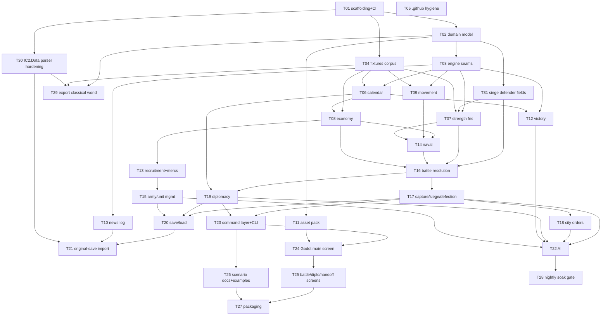

# Task catalogue: the 31 build tasks

Every build task's scope, **Owns** list, Definition of Done, model/effort, reviewer and dependencies, plus the dependency graph and the task index. **How** tasks are dispatched, reviewed and merged is in [build-process.md](build-process.md); operating the project day to day is in [operating-guide.md](operating-guide.md).

**Status in this document** is a snapshot written from the GitHub `status:*` labels by the documentation step ([build-process.md §4.8](build-process.md#48-documentation-update-after-every-merge), location A1), and appears only in the **Status** line of each entry, the **Status** column of the [task index](#3-task-index) and the index's **Totals** line. Every orchestrator tick compares the index against the labels and resyncs on drift. Between syncs, GitHub labels and [tracking issue #29](https://github.com/diegoami/imperial_conquest_2/issues/29) are authoritative. Values: **Merged** (`commit`) · **In progress** (`status:in-progress`, `in-review`, `rework` or `approved`) · **Ready** · **Blocked** · **Escalated**.

31 tasks: the 20 design milestones, seven pieces of scaffolding the milestone list assumes (build/CI harness, engine seams, GitHub hygiene, asset pack, nightly regression gate, the one-time export of the shipped `classical-mediterranean` world/ruleset, and hardening the `IC2.Data` parsers), and one correction to an already-merged task (T31).

---

## 1. The dependency graph

- **Merge-after** (hard): task B's branch may not be merged until task A is merged.
- **Start-after** (soft): task B's implementer cannot usefully begin until A is merged, because B has nothing to write against.

A task whose start-after set is satisfied can be dispatched while its merge-after set is still in flight; the implementer works against `main` plus stubs and rebases before merge.

### 1.1 Waves and the critical path

Waves are dependency layers, not concurrent batches: execution is serial, one code-modifying agent at a time ([build-process.md §7](build-process.md#7-concurrency-single-instance-and-local-only)).

| Wave | Tasks | Notes |
| --- | --- | --- |
| 0 | T01, T05 | Disjoint file sets. |
| 1 | T02, T04, T30 | T04 and T30 need only T01. T30's merge gates T29 and T21. |
| 2 | T03, T29 | T03 is the serialization point for engine code. T29 needs T02, T04 and T30, not T03. |
| 3 | T06, T07, T08, T09, T10, T11, T12, T31 | The widest wave. T31 goes first (T07 and T16 depend on it). T31 and T08 both write `tests/fixtures/**`. |
| 4 | T13, T14, T15, T16 | T16 is the long pole. |
| 5 | T17, T18, T19, T20, T21, T22 | T17 first, then T18/T19/T20, then T21 and T22. T22 is the long pole. |
| 6 | T23, T24, T25, T26, T27, T28 | T24/T25/T27 are single-instance (Godot) and form one serial chain. |

**Critical path**: `T01 → T02 → T03 → T07 → T14 → T16 → T17 → T23 → T24 → T25 → T27`, with `T02 → T31 → T07` as a second edge into T07 — 12 of 31 tasks. The AI chain (`… → T17 → T18 → T22 → T28`) runs alongside it with the most slack and the most uncertain duration, which argues for not deferring T22.

### 1.2 Sequential and independent tasks

- **Strictly sequential**: T01 → T02 → T03; T16 → T17 (a siege is a battle); T17 → T18 (a siege wipes a pending fortify order); T08 → T13 (mercenary hire debits the army purse T08 defines); T24 → T25 → T27 (Godot, single-instance); T30 → T29 (T29 reads the DAT through T30's parser); T31 → T07 and T31 → T16 (both consume the siege defender weights T31 corrects).
- **Independent**: wave 3's pure-rules systems over disjoint directories; T13/T14/T15; T18/T19/T20/T21; T26 against the Godot lane; T29 against T03.
- **Looks independent but is not**: T12 (victory) is gated behind T06 because its 250 BC condition needs the calendar's year; T20 (save/load) could be written early, but its DoD ("a mid-game state round-trips after N turns") is only meaningful once the state is largely complete.

---

## 2. The tasks

Conventions used by every entry:

- **Status**: see the top of this document.
- **Branch**: `task/T<nn>-<slug>`. One branch per task, never reused.
- **Owns**: the only paths the implementer may create or modify, besides its own tests. Anything else → escalate; a defect in another task's files → the bug list ([build-process.md §4.7](build-process.md#47-the-bug-list)).
- **Done when**: each line is a single assertion an agent can check by running a command. A DoD line is **immutable to the implementer** — see [build-process.md §4.4](build-process.md#44-the-dod-is-not-negotiable-by-an-agent).
- Numbers cited without a report name are already cited in `game-design.md`/`design-audit.md` at the referenced milestone.

### Phase 0 — Foundation

#### T01 Build scaffolding and CI

- **Status**: Merged (`a17d6e7`)
- **Design milestone**: none (prerequisite the backlog assumes). **Labels**: `phase:0 lane:infra`
- **Branch**: `task/T01-build-scaffolding` · **Model/effort**: Sonnet / Medium · **Reviewer**: Sonnet / High
- **Start after**: — · **Merge after**: —
- **Owns**: `IC2.sln`, `Directory.Build.props`, `.editorconfig`, `tests/**`, `.github/workflows/**`, `scripts/**`, `src/IC2.Engine/IC2.Engine.csproj`, `src/IC2.Cli/**` (the bare `.csproj`/stub `Program.cs` only — `src/IC2.Engine/Model/**` and `src/IC2.Engine/Serialization/**` are T02's, not touched here)
- **Scope**: Create the solution and **pre-declare every project the backlog will ever need** so no later task edits `IC2.sln`: existing `IC2.Data`, `IC2.Inspect`; new `src/IC2.Engine`, `src/IC2.Cli`; new `tests/IC2.Engine.Tests`, `tests/IC2.Data.Tests`. `godot/IC2.MapViewer.csproj` is **excluded** from the solution (it needs the Godot SDK and cannot build in CI) and that exclusion is documented in the file. `Directory.Build.props` centralises `net10.0`, `Nullable=enable`, `ImplicitUsings=enable`, and `TreatWarningsAsErrors=true` **for the new projects only** (existing `IC2.Data`/`IC2.Inspect` opt out, to avoid a scaffolding task turning into a refactor). Add the CI workflow: restore, build the solution, `dotnet test`, on push and PR. Add `scripts/check-godot-churn.ps1` implementing the Godot headless-churn caveat ([`operating-guide.md` §6](operating-guide.md#6-practical-caveats)) — after a Godot headless run, revert `godot/project.godot` and `godot/MapViewer.cs` if their diff is whitespace/header-only.
- **Done when**:
  1. `dotnet build IC2.sln` succeeds from a clean clone with zero warnings in the new projects.
  2. `dotnet test IC2.sln` runs and passes (a placeholder test in each new test project is acceptable).
  3. The CI workflow runs on the PR and is green; its job does **not** reference the Godot project.
  4. `scripts/check-godot-churn.ps1` exits 0 on a clean tree and exits non-zero (with the two filenames named) when `godot/project.godot`'s header alone has changed.
- **Hazards**: do not "fix" existing `IC2.Data`/`IC2.Inspect` code; out of scope. This PR is gated by the CI workflow it adds: a same-repo branch's `pull_request` workflow runs from the PR head, so no special-casing is needed.

#### T02 Core domain model and JSON round-trip

- **Status**: Merged (`fea39d8`)
- **Design milestone**: M1 (types half). **Labels**: `phase:0 lane:engine`
- **Branch**: `task/T02-domain-model` · **Model/effort**: **Opus / High** · **Reviewer**: Opus / High **+ `/code-review --effort ultra`**
- **Start after**: T01 · **Merge after**: T01
- **Owns**: `src/IC2.Engine/Model/**`, `src/IC2.Engine/Serialization/**`, `data/worlds/toy-3city.json`, `data/rulesets/toy-ruleset.json`, `data/scenarios/toy-3city.json`, `tests/IC2.Engine.Tests/Model/**` (file-level, not `data/worlds/**`/`data/rulesets/**` wildcards — see T29, which owns the real shipped world/ruleset data under the same directories without overlapping these specific files)
- **Scope**: The four file kinds from `game-design.md` §"The core data model" — `World`, `Ruleset`, `Scenario`, `SaveGame` — as C# records with `System.Text.Json` contracts, plus the `GameState` tree they produce. Must carry, from day one, every field later tasks need so they do not have to widen the model: per-army and per-fleet **money purse and supply stock**, army morale (`+14` semantics), the unit slot's regular/mercenary marker, city fortification with its `>100` in-progress encoding, fleet condition, the symmetric N×N diplomatic relation matrix with negative cooldowns, and the news ring buffer's storage. Support a `"_provenance"` key per field as `game-design.md` §"Ruleset format" specifies. Ship the toy 3-city / 2-nation `World`+`Ruleset`+`Scenario` under `data/`. Terrain tile types are an **open list** (12 codes shipped, not hardcoded to 12).
- **Done when**:
  1. Round-trip equality tests pass for each of `World`, `Ruleset`, `Scenario`, `SaveGame` (serialize → deserialize → serialize produces identical JSON).
  2. The toy scenario loads from `data/scenarios/toy-3city.json` and resolves its world and ruleset by id.
  3. A malformed file, an unknown required field, and a version mismatch each produce a distinct typed error, one negative test each — never a silent default.
  4. `GameState` is a fully serializable tree: a test constructs a non-trivial state, serializes it, deserializes it, and asserts deep equality.
  5. No gameplay constant is hardcoded in C#: a test asserts that every ruleset-governed number the model exposes is sourced from the loaded `Ruleset` object.
- **Hazards**: this is the widest-blast-radius diff in the plan. Nothing else may be in flight that touches `src/IC2.Engine`.

#### T31 Correct `Ruleset.Siege`'s defender-strength field identities

- **Status**: Merged (`27d7b41`)
- **Design milestone**: none — a correction to merged T02, found by T07's review. **Labels**: `phase:0 lane:engine`
- **Branch**: `task/T31-siege-defender-fields` · **Model/effort**: Sonnet / Medium · **Reviewer**: **Opus / Medium**
- **Start after**: T02 · **Merge after**: T02 — and merged before T07 and T16
- **Owns**: `src/IC2.Engine/Model/Ruleset.cs` (the `SiegeRules` record only), `data/rulesets/toy-ruleset.json`, `tests/IC2.Engine.Tests/Model/**`, `tests/fixtures/**` (the one mis-transcribed corpus entry only — a top-up under [build-process.md §2.4](build-process.md#2-how-the-build-avoids-conflicts)'s contract), `docs/investigations/siege-defender-strength.md` (new)
- **Scope**: T02 shipped `SiegeRules` with the loyalty and fortification defender weights attached to the wrong city fields and the population weight named "unidentified" — a report line that guessed at `FUN_0044A98C` propagated through the T04 corpus into T02's field names. The decompiled function, cross-checked against the city-details panel's own UI labels (`TInformation_ShowCityDetails` @ `0x0043BE5C`), gives `loyalty × 150 + finishedFortificationPercent × 250 + populationThousands × 200`. This task corrects **only** `SiegeRules`, the toy ruleset's `siege` block, the one corpus entry, and their provenance text; it writes no engine logic and leaves `FortificationCode` (already correct) untouched. Full evidence: [`investigations/siege-defender-strength.md`](investigations/siege-defender-strength.md).
- **Done when**:
  1. In `SiegeRules` and in `data/rulesets/toy-ruleset.json`, `DefenderLoyaltyWeight`/`defenderLoyaltyWeight` is **150** and `DefenderFortificationWeight`/`defenderFortificationWeight` is **250**. A test asserts both off the **loaded** `Ruleset`, never off a C# literal.
  2. `DefenderUnidentifiedFieldWeight` is renamed **`DefenderPopulationWeight`** (JSON `defenderPopulationWeight`), value unchanged at **200**, and its doc comment and `_provenance` name the city's **population in thousands**, citing `0x0043BE5C`'s `"Population -"` read. No field whose name claims an unidentified field survives in `SiegeRules`; a round-trip test covers the renamed JSON key.
  3. A doc comment on `SiegeRules` states the whole formula as `loyalty × 150 + finishedFortificationPercent × 250 + populationThousands × 200`, and states that the fortification term is the word decoded through **`FortificationCode.FinishedPercent`** — the guarded `code > MaxPercent ? code % radix : code`, matching the function's `if (fort < 0x65) fort else fort % 100` — **not** a raw stored word and **not** an unguarded `% 100`. A test pins `FinishedPercent(100, fortifyRule) == 100` and `FinishedPercent(200, fortifyRule) == 0`, so the difference between the guarded and unguarded decode cannot be lost later. `FortificationCode.cs` itself is unchanged.
  4. The T04 corpus entry **`capture.siegeDefenderStrengthFormula`** is corrected in place — same id, so T04's required-ids and no-duplicate-ids checks stay green — to `loyalty*150 + fortification*250 + population*200` (with the decode noted). Keeps `tag: "confirmed"`; its `note` records that the value supersedes `decompiled-city-capture-resolution.md`'s own wording, naming `FUN_0044A98C` and `0x0043BE5C` as the superseding evidence. All four of T04's DoD checks are re-run and green. (`capture.fortBonusThreshold` is bug [#46](https://github.com/diegoami/imperial_conquest_2/issues/46), not this task's.)
  5. The same file's provenance error is corrected: `combat.naval._provenance.carriedArmyPowerDivisor` currently reads *"a carried army adds armyPower / 50"*; `FUN_0044AA54` calls `FUN_0044A930` (**siege** strength), not `FUN_0044A8CC` (`armyPower`), so it adds *siege* strength / 50. Value unchanged at 50; text corrected. This is the only change outside the `siege` block.
  6. `docs/investigations/siege-defender-strength.md` records the decompilation, the panel-based field identification, the label-to-`DAT_*` table, and a one-line before/after for every field this task renamed or re-weighted.
  7. `dotnet build IC2.sln` and `dotnet test IC2.sln` are green, and `git diff --name-only main...HEAD` lists only Owns paths — in particular **nothing** under `src/IC2.Engine/Strength/**`.
  8. The PR body lists, for the post-merge documentation step, the claims this evidence settles: `design-audit.md` §2.13's `FUN_0044A98C` item (including that the −20%-if-owner≠allegiance and ×9/10-if-attacker==allegiance readings are **two separate adjustments in two different functions**, not one mis-read) and T17's *"Known-open item to record, not resolve"*, which this settles.
- **Out of scope, filed as bugs** ([build-process.md §4.7](build-process.md#47-the-bug-list)): [#46](https://github.com/diegoami/imperial_conquest_2/issues/46) — `HighFortificationThreshold`/`…BonusNumerator`/`…BonusDenominator` are misnamed (the branch tests **loyalty** `> 59`, gated on the capital predicate `FUN_0044B8D0`); [#47](https://github.com/diegoami/imperial_conquest_2/issues/47) — `DefenderOwnerNotAllegiancePenaltyPercent` (20) does not match the function's `(strength << 2) / 5`, which truncates differently from a 20% subtraction.
- **Hazards**: do not touch T07's branch or `src/IC2.Engine/Strength/**`. Do not re-derive the weights from `decompiled-city-capture-resolution.md` — it was the source of the error. Do not touch `AttackerIsAllegianceDefenderReductionPercent` (`FUN_0044B27C`, T17's). The values 150 / 250 / 200 are unchanged; only which field each multiplies was wrong. T31 and T08 both write `tests/fixtures/**` and are never dispatched together.

#### T30 Harden `IC2.Data`: army tombstones, and the DAT's own file layout

- **Status**: Merged (`2d50081`)
- **Design milestone**: none — the only task that owns `src/IC2.Data/**`, which T21 and T29 build on. Evidence: [`investigations/thracia-supply-morale.md`](investigations/thracia-supply-morale.md) (defect A) and [`investigations/dat-file-layout.md`](investigations/dat-file-layout.md) (defect B). **Labels**: `phase:0 lane:data local-only`
- **Branch**: `task/T30-data-parser-hardening` · **Model/effort**: **Sonnet / High** · **Reviewer**: **Opus / Medium**
- **Start after**: T01 · **Merge after**: T01 — and merged before T29 and T21 start
- **Owns**: `src/IC2.Data/**`, `src/IC2.Inspect/**`, `tests/IC2.Data.Tests/**` (the test project T01 already pre-declares in `IC2.sln`, so this task edits no solution file)
- **Scope**: **two distinct defect classes**, measured across the whole local corpus (51 `.sav` files plus the DAT).

  **A — the `0xFFFF` army tombstone. 3 of 51 saves. [confirmed]** `SaveArmyTable.Parse` rejects any army record whose owner word exceeds 15 and throws `InvalidDataException`, which aborts the parse of the **entire save** — so one bad record makes a whole file unreadable to every tool built on it. Real saves contain such records legitimately: `0xFFFF` is the established **no-owner sentinel** (the same one [`galatia-elimination-and-city-resupply-confirmed.md`](https://github.com/diegoami/imperial-conquest-2-research/blob/main/docs/reports/galatia-elimination-and-city-resupply-confirmed.md) already had to special-case for the *capital* field), marking an army slot merged or eliminated during the turn and not yet compacted. Exactly one such record appears in each of `1_thracia_271_spring_3.sav` (army 10), `1_thracia_271_autumn_1.sav` (army 9) and `1_cartago_271_spring_5.sav` (army 0) — in every case with **valid coordinates**, so the owner word alone is the discriminator. Treat such a record as a **tombstone**: skip it, keep parsing, and surface it as data rather than as a fatal error. Audit the other tables for the same pattern — the fleet, city and nation parsers all apply similar range checks — rather than patching only the one site that happens to be known.

  **B — the DAT is not SAV-shaped, and every table parser after `WorldPrefix` assumed it is. [confirmed]** The DAT has no record-count words (its loader `FUN_004481a0` hardcodes 15 armies and 2 fleets), and its 16-record nation table sits at `0x1B100` with a 1,055-byte record — not the SAV's 1,172, and not a constant offset shift. `Leader` and `HumanPlayer` are absent from the DAT because New Game assigns them. The complete read order, record offsets and field map are in [`investigations/dat-file-layout.md`](investigations/dat-file-layout.md). Deliver a DAT-vs-SAV layout discriminator and a DAT-shaped parse path; do **not** teach the SAV locator to "try harder".
- **Done when**:
  1. `1_thracia_271_spring_3.sav`, `1_thracia_271_autumn_1.sav` and `1_cartago_271_spring_5.sav` all parse; `--list-armies … Thracia` prints the Thracian army for the first two instead of aborting.
  2. Tombstoned records are **excluded from `Armies`** (not returned as degenerate entries with owner 65535) and exposed separately — e.g. a `SkippedRecords` count — so a caller can tell "clean parse" from "parse with tombstones" without re-reading bytes.
  3. A record that is malformed for any *other* reason still throws, with a message naming the record index and the failing field. Tombstone tolerance must not become blanket tolerance for corruption.
  4. A regression fixture runs **every** file in the configured assets directory — all 51 `.sav` files across `saves/`, `saves-processed/` and `saves-processed/processed/`, plus the DAT — through **every** parser and asserts a committed expected-outcome table: 51 of 51 saves and the DAT parse clean through all seven parsers, zero unexpected exceptions, with per-file army/fleet/city/nation counts.
  5. The DAT parses: 16 nation records whose names equal `NationCatalog`'s 16 names in order, plus treasury, unity, mobilized, capital-city index, city count and tax rate read at the **DAT record's own offsets**. A test asserts the DAT's per-nation city counts sum to 334, and that the DAT yields 15 armies and 2 fleets.
  6. `Leader` and `HumanPlayer` are **absent from a DAT parse by construction** — modelled as not-present (e.g. `null` plus an explicit "came from the DAT" marker), never defaulted to a plausible-looking value — with one negative test asserting a caller cannot read a leader name off the DAT and get a non-empty string.
  7. A file that is neither DAT-shaped nor SAV-shaped is rejected with a typed error naming which discriminator failed; the format sniffing must not silently fall through to the wrong layout.
  8. **Every test in this task skips with an explicit "original files not configured" result when `assets.local.ini` is absent**, exactly like T21 and T29.
- **Hazards**: **merge this before T29 starts, and before T21 starts.** T29's DoD line 1 cross-checks its export against `IC2.Data`'s own parse of the DAT — that is defect B, and it is unreachable until this merges. T21's DoD line 1 imports "three or four representative saves" and its line 2 requires an import report with zero unmapped fields, both unreachable if the parser can still abort on a real save; an implementer who meets either by sampling only clean saves will have satisfied the letter of the DoD while leaving the defect in place. Do **not** widen the owner check to accept all values ≤ 65535; `0xFFFF` is a specific sentinel and every other out-of-range owner is still a genuine parse failure. Do **not** recover the DAT's record offsets by searching a SAV for matching values — they are decompiled from `FUN_004481a0` and cited in `investigations/dat-file-layout.md`; a byte-search that happens to land on the same numbers is a `[derived]` result dressed as a `[confirmed]` one, which is exactly what `design-audit.md` §4.5 exists to catch.

#### T29 Export the shipped classical-mediterranean world and ruleset

- **Status**: Ready
- **Design milestone**: none explicitly — the one-time export tool `game-design.md` §"The core data model" describes. **Labels**: `phase:0 lane:data local-only`
- **Branch**: `task/T29-export-classical-world` · **Model/effort**: Sonnet / High · **Reviewer**: **Opus / Medium**
- **Start after**: T02, T04, **T30** · **Merge after**: T02, T04, **T30**
- **Owns**: `data/worlds/classical-mediterranean.json`, `data/rulesets/classical-faithful.json`, `scripts/export-classical-world.*`, `tests/IC2.Engine.Tests/Export/**` (file-level within `data/worlds/**`/`data/rulesets/**` — does not touch T02's toy fixtures)
- **Scope**: A one-time, re-runnable export script, built on the existing `IC2.Data` parsers, that reads the original DAT (and the classical-faithful ruleset's constants, sourced from the T04 fixtures corpus) and writes `data/worlds/classical-mediterranean.json` and `data/rulesets/classical-faithful.json` conforming to T02's `World`/`Ruleset` schema. **This is the only step in the whole build that reads the user's original game files to produce something that ships** — every later build, test, and play session uses the committed JSON output, never the original DAT again. Run once by whoever has `assets.local.ini` configured; the committed *output* is what everyone else, including CI, depends on. T30 provides the DAT parse this task builds on.
- **Done when**:
  1. Running the script against the configured original DAT produces `data/worlds/classical-mediterranean.json` with exactly 334 cities, 16 nations, and the confirmed 320×140 map — cross-checked against `IC2.Data`'s own parse of the same file, not re-derived independently: same map dimensions and city count from `WorldPrefix`, and the **same 16 nation names in the same order** from T30's DAT nation-table parse (the DAT's 16-record nation table at `0x1B100`; see [`investigations/dat-file-layout.md`](investigations/dat-file-layout.md)). The nation records' capital-city index, city count, treasury, unity, mobilized percentage and tax rate are likewise taken from that parse.
  2. **Leader names and the human-player flag are not exported from the DAT**, because they are not in it — `TPremierForm_NewGame` assigns both at New Game (see T30). The exported `World` either omits them or carries an explicit scenario-supplied value with `_provenance` saying so; a test asserts no leader string in the export claims DAT provenance. `NationCatalog`'s names remain a *cross-check* on the DAT parse, never the source of record for the export.
  3. `data/rulesets/classical-faithful.json` contains every constant in the T04 fixtures corpus tagged `confirmed`, with each value traced to its fixture id in `_provenance` — no value invented here that isn't already in the corpus.
  4. The committed JSON round-trips through T02's `World`/`Ruleset` loaders with no schema errors.
  5. Re-running the script against the same DAT produces byte-identical JSON (deterministic — same test pattern as T11's asset generator).
  6. **Every test in this task skips with an explicit "original files not configured" result when `assets.local.ini` is absent**, exactly like T21 — CI stays green on a machine without the original files, because CI only ever needs the *committed output*, not the ability to regenerate it.
- **Hazards**: do not hand-edit the committed JSON to fix a mismatch found after export — fix the export script and re-run, so the committed data always has a reproducible source. If the original DAT ever needs re-reading (a corrected field, a newly-decompiled table), this is the one task whose branch gets reopened, not a one-off patch to the JSON. Do **not** work around a DAT parse failure by falling back to `NationCatalog`'s hardcoded list and calling DoD line 1 satisfied — that turns the cross-check into a tautology. If T30's DAT path is missing something this task needs, escalate.

#### T03 Engine seams: RNG, turn pipeline, commands, events

- **Status**: Merged (`4f747fc`)
- **Design milestone**: none explicitly (implied by `game-design.md` §"Testing and determinism"). **Labels**: `phase:0 lane:engine`
- **Branch**: `task/T03-engine-seams` · **Model/effort**: **Opus / Ultrahigh** · **Reviewer**: Opus / High **+ `/code-review --effort ultra`**
- **Start after**: T02 · **Merge after**: T02
- **Owns**: `src/IC2.Engine/Core/**`, `tests/IC2.Engine.Tests/Core/**`
- **Scope**: The interfaces every later task is written against, and nothing else:
  - `IRng` — one seeded service, threaded through the turn coordinator; the **only** source of randomness in gameplay code (`game-design.md` principle 4).
  - The turn coordinator: an ordered phase pipeline with a stable, declared phase order and an `OnQuarterBoundary` hook contract (fired by T06's calendar, subscribed by T08's economy and T19's thaw) — so economy tests can fire the hook directly without the calendar merged.
  - Command dispatch: `ICommand` → `CommandResult` with a **typed rejection** (illegal command never throws, never silently no-ops).
  - The domain-event sink that T10's news log and the UI both consume.
  - **Attribute-based system registration** (assembly scan), so adding a system touches only that system's own file. This is the anti-conflict mechanism [build-process.md §2.3](build-process.md#2-how-the-build-avoids-conflicts) depends on.
  - The determinism guard: a test that scans `src/IC2.Engine` sources and fails on `System.Random`, `DateTime.Now`/`UtcNow`, `Guid.NewGuid`, `Environment.TickCount`, or unordered-dictionary enumeration in gameplay paths.
- **Done when**:
  1. Two full runs of a scripted N-phase sequence with the same seed produce byte-identical `GameState` hashes; with different seeds, different hashes.
  2. A no-op test system registers by attribute alone and executes in the declared phase order; a second one added in a second file does not require editing any shared file (asserted by the test's own structure).
  3. An illegal command returns a typed rejection with a reason code; a test asserts no exception is thrown and no state changed.
  4. The determinism guard test fails when a deliberately-added `new Random()` is present in a scratch file under `src/IC2.Engine` (test proves the guard works, then removes it).
  5. The `OnQuarterBoundary` hook can be fired directly in a test without a calendar implementation present.
- **Hazards**: **the critical-path blocker.** No other task may be in flight. If the phase order or command shape is wrong here, every wave-3 task inherits it.

#### T04 Fixtures corpus

- **Status**: Merged (`e7cab0c`)
- **Design milestone**: M1 (fixtures half); implements `design-audit.md` §4.4's recommendation. **Labels**: `phase:0 lane:data`
- **Branch**: `task/T04-fixtures-corpus` · **Model/effort**: Sonnet / High · **Reviewer**: **Opus / Medium**
- **Start after**: T01 · **Merge after**: T01 (independent of T02/T03 — disjoint paths)
- **Owns**: `tests/fixtures/**`, `tests/IC2.Engine.Tests/Fixtures/**`
- **Scope**: Transcribe **every exact number in the research repo's `docs/reports/`** into one typed JSON corpus with a small loader. Each entry carries `id`, `value`, `source` (the report filename), and `tag` (`confirmed` / `derived` / `designed`, matching the report's own tagging). Nothing is derived or computed here — pure transcription, so that a later disagreement is always between code and a fixture, never between two agents' readings. Minimum contents: the twelve `design-audit.md` §4.4 fixtures; the 12-entry terrain move-cost table; the full unit-type stat table; the 5×5 type-effectiveness matrix; the `+0x26` power weights (LI 20 · HI 100 · Ar 40 · LC 60 · HC 120); the diplomatic cooldowns (−8 / −24 / −18); the loyalty floors (40 / 65 / →90); the news-log message literals; the calendar constants; the caps (100,000 troops, 20 units, 198 armies, 40 news slots, 50 mercenary slots, 1,000 purse, 990 unity, 30,000 melee, 40%).
- **Done when**:
  1. A test loads the corpus and fails if any entry has an empty `value`, `source`, or `tag`.
  2. **A test asserts every `source` names a file present in a committed manifest of the research repo's real report filenames** (`tests/fixtures/known-reports.json` or similar, owned by this task, generated once from `gh api repos/diegoami/imperial-conquest-2-research/contents/docs/reports` and checked in — filenames only, not content, so nothing copyrighted or from the original game is involved). The manifest keeps the check offline and CI-green without cloning the research repo. If the manifest ever drifts from the research repo's real contents (a new report added there), that is a one-line update to the manifest, not a reason to weaken this check.
  3. A test asserts the corpus contains every id in a committed required-ids list (the minimum contents above), so a later task cannot silently find its fixture missing.
  4. A test asserts no two entries share an id.
- **Hazards**: the highest-leverage task in the plan for silent error. Reviewed by Opus specifically to re-derive a sample of entries from their cited reports (fetched from the research repo for the review, same as any other citation check — nothing here requires vendoring the reports into this repo). Any number that cannot be found in a report is **not** invented — it is omitted and reported in the PR body.

#### T05 GitHub hygiene: templates, labels, CODEOWNERS

- **Status**: Merged (`4ab3344`)
- **Design milestone**: none. **Labels**: `phase:0 lane:infra`
- **Branch**: `task/T05-github-hygiene` · **Model/effort**: **Fable / Low** · **Reviewer**: Sonnet / Medium
- **Start after**: — · **Merge after**: — (fully disjoint; can merge first)
- **Owns**: `.github/pull_request_template.md`, `.github/ISSUE_TEMPLATE/**`, `.github/CODEOWNERS`
- **Scope**: The PR template carrying the review contract from [build-process.md §4.2](build-process.md#42-what-the-reviewer-checks): a DoD-evidence fenced block, a provenance checklist, a determinism checkbox, an Owns-list scope declaration, and `Closes #<issue>`. An issue template for a build task mirroring the catalogue entry shape. `CODEOWNERS` assigning `docs/` and `.github/` to the user so doc changes always notify a human.
- **Done when** (headless-checkable, what the implementer and reviewer actually run):
  1. All three files exist and parse without error (`gh api repos/<owner>/<repo>/contents/<path>` returns 200 for each).
  2. `.github/pull_request_template.md`'s text contains the DoD-evidence heading, the provenance checklist, the determinism checkbox, the Owns-list scope declaration, and the literal string `Closes #` — a plain text/regex assertion against the file, not a behavioral PR-creation check.
  3. The issue template's YAML front matter parses and its body fields mirror the catalogue entry shape (task/model/effort/DoD).
  - **Not part of the headless gate — post-merge, human-verified only**: that `gh pr create` run interactively (no TTY in an agent's shell, so an agent cannot itself drive this) actually renders the template as the new PR's starting body, and that the issue template appears in `gh issue create --web`'s picker (opens a browser; unobservable to an agent). Noted here as a real check worth doing once, by hand, the next time a human opens an issue or PR — not a gate any agent can pass or fail.

---

### Phase 1 — Pure-rules fan-out

#### T06 Calendar and turn sequencing

- **Status**: Merged (`8b8007a`)
- **Design milestone**: **M2**. **Labels**: `phase:1 lane:engine`
- **Branch**: `task/T06-calendar` · **Model/effort**: Sonnet / Medium · **Reviewer**: Sonnet / High
- **Start after**: T03 · **Merge after**: T03, T04
- **Owns**: `src/IC2.Engine/Calendar/**`, `tests/IC2.Engine.Tests/Calendar/**`
- **Scope**: Week `+2 mod 12`; season advance at the 11→1 wrap; year *decrement* at Winter→Spring (270 BC counts down); the quarterly hook fired on the season boundary; active-seat rotation following the save's 16-entry turn-order table, with hotseat pause points surfaced as events (not UI). City-unit `StateCode` +2/week capped at 24. Parameterised by `weeksPerSeason`/`seasonsPerYear` from the ruleset. Also **the declared position of the per-turn attrition phase in the turn order** — the slot T08's supply/morale rule and T14's fleet attrition register into. This task owns *when*, not *what*: it declares and asserts the ordering, and the rules themselves live in T08 and T14.
- **Done when**:
  1. Advancing 48 turns from the shipped start produces a week/season/year sequence byte-equal to a committed expected-sequence fixture (hand-computed in the PR body from [`decompiled-turn-and-calendar-sequencing.md`](https://github.com/diegoami/imperial-conquest-2-research/blob/main/docs/reports/decompiled-turn-and-calendar-sequencing.md)).
  2. The quarterly hook fires **exactly 4 times per in-game year** over that 48-turn run — asserted by count, not by inspection.
  3. The year decrements only at the Winter→Spring wrap (a test walks every wrap and asserts on the other three that the year is unchanged).
  4. Seat rotation visits every seat once per calendar tick in turn-order-table order; a hotseat seat raises a handoff event and an AI seat does not.
  5. `StateCode` reaches 24 and stays there (cap, not a reset).
  6. **The turn order places army and fleet attrition before the calendar advance, once per turn, for every army and every fleet regardless of seat.** The original's tick `FUN_004514ec` runs its army loop, then its fleet loop, then the weather system, and only then updates the calendar (`design-audit.md` §2.9a; [`investigations/thracia-supply-morale.md`](investigations/thracia-supply-morale.md), which pins one save = one turn = two weeks three independent ways). Asserted with two no-op probe systems registered into the attrition phase: over a 12-turn run each fires exactly 12 times, both before the calendar advance in every turn, and the season the attrition phase observes is the season **before** that turn's advance — so a Winter→Spring turn consumes at the Winter rate, not the Spring one. That last point is the one an implementer gets wrong by accident, and T08's per-season consumption figures are wrong by 7× if it is.
  7. The attrition phase is a **declared, named phase in T03's ordered pipeline**, not an implicit side effect of another phase — a test asserts a system can register into it without T08 or T14 present, so those two tasks can be written and tested against the ordering before either merges.

#### T07 Strength functions

- **Status**: Merged (`acd4098`)
- **Design milestone**: **M5**. **Labels**: `phase:1 lane:engine`
- **Branch**: `task/T07-strength-functions` · **Model/effort**: Sonnet / High · **Reviewer**: **Opus / Medium**
- **Start after**: T03 · **Merge after**: T03, T04, **T31**
- **Owns**: `src/IC2.Engine/Strength/**`, `tests/IC2.Engine.Tests/Strength/**`
- **Scope**: The three pure functions that M8, M9 and M12 all consume, extracted early exactly as `game-design.md` M5 says: `armyPower`, `fleetPower`, and siege defender strength. **Integer semantics are part of the specification** — the original is Delphi and truncates; every division must be pinned by a test, not left to C# operator defaults.
- **Done when**:
  1. `armyPower(a) = (Σ powerWeight[type] × troops / 100) / 80 × armyMorale` reproduces hand-computed values for the published 13-unit Roman roster, using the `+0x26` weights from the T04 corpus.
  2. `fleetPower(f) = ships × condition / 10 (+ carriedArmyPower / 50)` reproduces hand-computed values, including the carried-army term and its absence.
  3. The `× (1 + random(4)/10)` bonus is applied through `IRng` and is exactly reproducible under a fixed seed (same seed → same value, asserted twice in one test).
  4. Siege defender strength triples archers, and applies the city term. The two clauses are two different decompiled functions and stay split: the attacker side is `FUN_0044A930` (archers ×3, no intermediate `/ 100`, `(total / 80) × morale`), and the defender side is `FUN_0044A98C`, which is `loyalty × 150 + finishedFortificationPercent × 250 + populationThousands × 200`, with **every weight read from T31's corrected `Ruleset.Siege`** and the fortification term decoded through `FortificationCode.FinishedPercent`, never the raw stored word. The third term is population; no parameter, field or doc comment in this diff may describe it as unidentified, and none may tell a caller to pass 0 for it.
  5. A truncation test: at least three cases where integer division differs from floating-point division assert the integer result.
  6. `armyPower` is exercised across the **full confirmed 51…70 morale range** and at both bounds, and the strength it returns is monotonic in morale over that range. `51 … 70` are the real bounds of the field, not a convention: `design-audit.md` §2.9a and [`investigations/thracia-supply-morale.md`](investigations/thracia-supply-morale.md) confirm the hard floor and ceiling in the turn tick, and the army panel prints the value as five 4-wide tiers via `moraleNames[(v − 51) >> 2]`. **This task does not implement the rule that moves morale** (that is T08) and does not clamp on its input; it is a pure function, and a morale outside 51…70 reaching it means an upstream bug rather than something to defend against here.
- **Hazards**: `design-audit.md` §2.9 — **two different morales**. Only army record `+14` (strategic) feeds these functions; the per-unit tactical morale array must not appear here. A reviewer finding tactical morale in this diff rejects it. Equally, a reviewer finding the supply→morale *rule* implemented in this diff rejects it: T07 consumes the field, T08 writes it. It compiles against T31's corrected `Ruleset.Siege` field names (`DefenderPopulationWeight`; loyalty 150, fortification 250); changing `Ruleset.Siege` from inside this task's Owns list is a scope failure.

#### T08 Economy, supply, and purses

- **Status**: In progress
- **Design milestone**: **M3**. **Labels**: `phase:1 lane:engine`
- **Branch**: `task/T08-economy` · **Model/effort**: Sonnet / High · **Reviewer**: **Opus / Medium**
- **Start after**: T03 · **Merge after**: T03, T04, T06
- **Owns**: `src/IC2.Engine/Economy/**`, `tests/IC2.Engine.Tests/Economy/**`
- **Scope**: Tax, quarterly upkeep with real non-payment consequences, tribute growth, loyalty drift and the rebellion check's *confirmed structure* with `_provenance`-tagged placeholder thresholds, the weather-event frequency curve with data-driven effects, **supply as a purchased economy**, **per-turn supply consumption and the supply→army-morale rule it drives**, and per-army/per-fleet money purses gated by the `economy.purses` ruleset flag (`design-audit.md` Q4): `classical-faithful` keeps the confirmed per-army/per-fleet purses (cap 1,000); `improved` routes the same purchases straight to/from the national treasury instead.
  - **Supply consumption and army morale** (`design-audit.md` §2.9a, [`investigations/thracia-supply-morale.md`](investigations/thracia-supply-morale.md), both `[confirmed]`). T07 *consumes* `armyMorale` and T06 owns *when* the tick runs; this task owns the rule that writes the field, because the morale write is a function of the supply percentage it computes. **Every constant below is transcribed from that investigation, not re-derived**; an implementer that goes back to the decompilation to rediscover them has misread the task ([build-process.md §2.4](build-process.md#2-how-the-build-avoids-conflicts)).
    - Per-turn consumption `= ((90 − seasonVal) × troops) / 20000`, with `seasonVal` from the DAT season table at `0x1F7D8`: **Spring 50 · Summer 80 · Autumn 80 · Winter 20**. An army **aboard a fleet** instead consumes a flat `troops / 200`, with no seasonal term.
    - Supply percentage `= supplies × 10000 / troops`, computed **after** that turn's consumption.
    - `pct < 10` → morale `−2`, hard-floored at **51**, and the army loses **one move**. `10 ≤ pct ≤ 15` → **no change** (a deliberate dead band). `pct > 15` → morale `+1`, capped at **70**.
    - Base moves `= 10 − min(5, troops / 20000)`, before the `pct < 10` penalty.
- **Done when** (sharpened from M3, which already names most of these):
  1. `income = 2440 × 15 / 100` and `× 20 / 100` reproduce both published Rome figures exactly.
  2. Ship upkeep `= 3 × ships` per quarter.
  3. The 13-unit Roman roster's regular upkeep computes to exactly **442**.
  4. That army's 482 tons against 48,173 troops reads exactly **100%**; the supply triple 204/998, 344/998, 184/282 reads **20% / 34% / 65%**.
  5. **Supply purchase (`design-audit.md` Q9)**: resupplying at a city the buying army's nation **owns** is free — no talent debit, matching the confirmed Mediolanum frames (army money and national treasury both unchanged across a 100-ton transfer). A 100-ton purchase at a city the nation does **not** own costs **20** talents, debited from the buying army's purse — the `amount / 5` constant from the code, for the paid case only. Where a foreign purchase's talents end up (the selling city's owner, or nowhere) is not yet confirmed; implement the debit as specified and treat the credit side as `_provenance`-flagged `[open]` pending more evidence, not as a confirmed destination. Read `design-audit.md` Q9 in full before writing this test.
  6. The purse cap of 1,000 is enforced on every path that credits a purse.
  7. An army whose upkeep cannot be paid loses troops (a real consequence, not a debt counter).
  8. Weather events fire ~8× more often in Winter than Summer over a fixed-seed 400-quarter run (asserted as a ratio band, the only band assertion in the catalogue, because the underlying figure is itself approximate in [`decompiled-weather-events.md`](https://github.com/diegoami/imperial-conquest-2-research/blob/main/docs/reports/decompiled-weather-events.md)).
  9. Under `economy.purses = centralized` (`improved`), the same supply/mercenary purchase debits and credits the national treasury directly, with no per-army/per-fleet purse involved — asserted with a fixture that would fail item 5's purse-crediting assertion if run under the wrong flag, so the two paths can't silently collapse into one.
  10. **Seasonal consumption**: a 22,000-troop army consumes exactly **44 / 11 / 11 / 77** tons per turn in Spring / Summer / Autumn / Winter, from the season values 50/80/80/20 read out of the ruleset (not hardcoded in C#); an army aboard a fleet consumes exactly `troops / 200` in every season, asserted separately.
  11. **The supply→morale rule reproduces the Thracian series exactly.** A test replays the thirteen recorded turns of `1_thracia_271_*` as a fixture — a 22,000-troop army starting at 142 tons and morale 65, never resupplied, through six Spring turns and into Summer — and asserts the morale sequence **65, 66, 67, 65, 63, 61, 59, 57, 55, 53, 51, 51, 51** turn for turn, and the moves sequence 9 while supplied and 8 from the first `pct < 10` turn on. The floor must hold on the last two turns (`max(51, 49)`), not merely trend downwards. The dead band gets its own case: an army held at 12 % for three turns does not move at all.
  12. Morale is **hard-clamped to 51…70 on every path that writes it**, asserted by a property-style test over the rule (a `+1` at 70 stays 70; a `−2` at 51 stays 51; a `−2` at 52 gives 51, not 50). T07 depends on this range and does not re-check it.
  13. The fixtures corpus is topped up from the 47th report, [`supply-driven-morale-and-fleet-attrition.md`](https://github.com/diegoami/imperial-conquest-2-research/blob/main/docs/reports/supply-driven-morale-and-fleet-attrition.md), the season table (50/80/80/20 at DAT `0x1F7D8`), the `20000` consumption divisor, the flat `troops / 200` at-sea rate, the 10 % / 15 % thresholds, the 51 / 70 clamps, the new-army morale 59, and the fleet constants T14 needs (below) — each a `confirmed` entry citing that report. **This is a top-up, not a reopen of T04**: T04 is merged, its Owns list covers `tests/fixtures/**`, and this task adds entries under that same contract, keeping T04's four DoD checks green (no empty field, `source` present in the manifest — the manifest gets the 47th filename added — every required id present, no duplicate ids).
- **Hazards**: Q9's one open detail (where a foreign purchase's talents go) is not a blocker — tag the credit side `[open]` and move on. `design-audit.md` §2.9 — **two different morales**. This task writes only army record `+14` (strategic); the per-unit tactical morale array must not appear in this diff. Do **not** share an implementation with T14's fleet-condition attrition: the two rules look analogous and are not the same rule (different trigger, different decay shape, different floor, different regeneration, different applicability) — see T14 and the comparison table in `investigations/thracia-supply-morale.md`.

#### T09 Movement and terrain

- **Status**: Ready
- **Design milestone**: **M6**. **Labels**: `phase:1 lane:engine`
- **Branch**: `task/T09-movement` · **Model/effort**: Sonnet / Medium · **Reviewer**: Sonnet / High
- **Start after**: T03 · **Merge after**: T03, T04
- **Owns**: `src/IC2.Engine/Movement/**`, `tests/IC2.Engine.Tests/Movement/**`
- **Scope**: The one-click Bresenham walk; the 12-entry terrain cost table from the corpus; blocking markers; the abort rule and its move-zeroing, gated by the `seatAsymmetry` ruleset flag (`design-audit.md` Q6, [build-process.md §9](build-process.md#9-standing-governance-decisions) Q-D): **AI-only** under `classical-faithful`, **every seat** under `improved`. Used by both armies (T09) and fleets (T14) — the walker is terrain-table-driven and does not special-case sea.
- **Done when**:
  1. The 12-entry table drives costs: Sea 1, Sea 3, Plain 1, Desert 1, Forest 2, Mountains 4, and all six River codes 4.
  2. A Bresenham walk over a committed test grid produces a cell sequence byte-equal to a committed expected-path fixture.
  3. A city, army or fleet marker in the path blocks the walk entirely (the walk stops **before** the marker; no move cost is charged for it).
  4. An unaffordable step aborts the move; under `classical-faithful` the army's remaining moves are **unchanged for a human seat** and **zeroed for a computer-controlled seat**; under `improved` moves are zeroed for **every** seat — asserted as separate tests per ruleset.
  5. A terrain type present in a world but absent from the ruleset's cost table defaults to 1 (the "arbitrary custom maps" guarantee), with a warning event.

#### T10 News log ring buffer and message catalog

- **Status**: Ready
- **Design milestone**: **M17**. **Labels**: `phase:1 lane:engine`
- **Branch**: `task/T10-news-log` · **Model/effort**: **Haiku / Medium** · **Reviewer**: Sonnet / Medium
- **Start after**: T03 · **Merge after**: T03, T04
- **Owns**: `src/IC2.Engine/News/**`, `tests/IC2.Engine.Tests/News/**`
- **Scope**: The 40-slot ring buffer, the catalog of confirmed message templates with operand substitution, **and the writer that carries a news-worthy domain event into `GameState.NewsLog`**. **Emission stays with each gameplay system** ([build-process.md §2.5](build-process.md#2-how-the-build-avoids-conflicts)); this task delivers the buffer, the catalog, the sink-to-state writer, and the coverage test that later tasks must keep green.
  - **The writer** is a system registered through T03's attribute-based registration, subscribing to T03's domain-event sink: for each news-worthy event it resolves the catalog template, substitutes the operands, and appends the rendered message to `GameState.NewsLog` (the storage T02 already ships). Without it, T20 would round-trip a news log nothing ever fills.
- **Done when**:
  1. 41 appends leave exactly the 40 newest, in order, oldest evicted.
  2. Every message literal in the T04 corpus's news section is present in the catalog and renders with its operands substituted (one test per literal, table-driven).
  3. A coverage test asserts every domain event kind returned by T03's `DomainEventCatalog.Discover` that is marked news-worthy has a catalog entry — so a later task adding an event without a message fails CI. (T03 ships attribute-declared event subtypes, not an enum — iterate the discovered set.)
  4. A news-worthy event published to the sink during a turn appears as a rendered message in `GameState.NewsLog` at the end of that turn, asserted on the state itself rather than on the sink; a non-news-worthy event does not. **The 40-slot eviction is asserted end-to-end through the writer**, not only against the buffer in isolation.
  5. The rendered log survives a `GameState` round-trip through T02's serialization — so T20's save/load inherits a news log that is actually populated.

#### T11 Asset pack loader and generated placeholder pack

- **Status**: Ready
- **Design milestone**: none explicitly (`game-design.md` §"Asset packs"). **Labels**: `phase:1 lane:data`
- **Branch**: `task/T11-asset-pack` · **Model/effort**: **Haiku / Medium** · **Reviewer**: Sonnet / Medium
- **Start after**: T02 · **Merge after**: T02
- **Owns**: `src/IC2.Engine/Assets/**`, `assets/packs/placeholder/**`, `scripts/generate-placeholder-assets.*`, `tests/IC2.Engine.Tests/Assets/**`
- **Scope**: The manifest loader mapping stable keys to files, plus a **deterministic generator script** producing the placeholder pack (flat-colour unit icons, terrain tiles, silent-but-valid audio stubs). Includes the **size-tiered army/fleet icon set** (`game-design.md` §"Army and fleet markers scale with size", `[confirmed]` — the original's own `TUnitMap_SelectUnit` marker arithmetic, not a guess): exactly `army.tier1.icon`/`army.tier2.icon`/`army.tier3.icon` and `fleet.tier1.icon`/`fleet.tier2.icon`/`fleet.tier3.icon`, one per confirmed band. Also the **city tier set** (`game-design.md` §"City markers", `[designed]` — placeholder pending confirmation): `city.tier1.icon` … `city.tierN.icon` plus `city.capital.icon`. Every tier icon a distinct (not just recoloured) placeholder shape so tiers are visually distinguishable at a glance even in flat placeholder art. No copyrighted original asset ever enters the repo — the existing `.gitignore` policy is unchanged and unchallenged.
- **Done when**:
  1. Every key in the engine's `AssetKeys` constant list resolves to a file that exists in the placeholder pack.
  2. A missing key raises a typed error naming the key, not a null.
  3. Re-running the generator produces byte-identical files (`git status` clean after a re-run) — asserted by the test running the generator into a temp dir and comparing hashes.
  4. `AssetKeys` includes the full city/army/fleet tier set from `game-design.md`, and a test asserts each tier's icon file is pixel-different from its neighbouring tiers (not the same placeholder shape re-exported under a different key).

#### T12 Victory conditions

- **Status**: Ready
- **Design milestone**: **M13**. **Labels**: `phase:1 lane:engine`
- **Branch**: `task/T12-victory` · **Model/effort**: Sonnet / Medium · **Reviewer**: Sonnet / High
- **Start after**: T03 · **Merge after**: T03, T06
- **Owns**: `src/IC2.Engine/Victory/**`, `tests/IC2.Engine.Tests/Victory/**`
- **Scope**: The four shipped conditions — the original's all-cities condition and its 250 BC year limit, domination-over-hostiles, score-at-turn-limit, and scenario-custom. Evaluated against a `GameState` constructed directly in tests; does **not** need capture logic merged.
- **Done when**: one test per condition, each with a positive and a negative case; the all-cities test uses the shipped world's own city count (not a hardcoded 334); the year-limit test fires at 250 BC and not at 251 BC; a scenario-custom goal defined purely in scenario JSON fires.
- **Note**: which condition is the shipped default is `design-audit.md` **Q5**, now answered: `victory.default` is `all-cities` under `classical-faithful`, and `domination-over-hostiles` (or `score-at-limit`, ruleset's choice) under `improved`. The task implements all four conditions and reads the default from the ruleset per seat's chosen preset; it does not hardcode either.

---

### Phase 2 — Dependent systems

#### T13 Recruitment and mercenaries

- **Status**: Blocked
- **Design milestone**: **M4**. **Labels**: `phase:2 lane:engine`
- **Branch**: `task/T13-recruitment` · **Model/effort**: Sonnet / High · **Reviewer**: **Opus / Medium**
- **Start after**: T08 · **Merge after**: T08
- **Owns**: `src/IC2.Engine/Recruitment/**`, `tests/IC2.Engine.Tests/Recruitment/**`
- **Scope**: Standing recruitment from the treasury; the 50-slot mercenary pool; hire **from the hiring army's own purse**; the two distinct upkeep formulas; the unit slot `+0` regular/mercenary marker and the merge block it implies.
- **Done when**:
  1. `cost = (troops / 200) × price[type]` reproduces every solved value in the corpus.
  2. The Felsina hire (6,438 troops, "very good") costs `(troops × quarterlyPrice[type]) / 1000 × quality` exactly, is debited from the **army purse** (treasury unchanged), and leaves the pool slot at the `0xFFFF` sentinel.
  3. Mercenary quarterly upkeep = `(troops / 200) × price[type] × quality / 5`; a regular of identical troops/type costs exactly 5×/quality as much (one test asserting both).
  4. The 100,000-troop army cap blocks an over-cap recruitment with a typed rejection.
  5. A mercenary unit's slot `+0` is non-zero and a regular's is zero; merging the two is rejected.
  6. Emits its confirmed news message(s) via T10's catalog.

#### T14 Naval

- **Status**: Blocked
- **Design milestone**: **M7**. **Labels**: `phase:2 lane:engine`
- **Branch**: `task/T14-naval` · **Model/effort**: Sonnet / High · **Reviewer**: **Opus / Medium**
- **Start after**: T09 · **Merge after**: T07, T08, T09
- **Owns**: `src/IC2.Engine/Naval/**`, `tests/IC2.Engine.Tests/Naval/**`
- **Scope**: Construction (10–100 clamp, `ships × 10`, 24-tick countdown at a named coastal city, coastal nations only); launch state (condition 100%, 50 tons, no money); condition as a strength multiplier and paid repair; transport; sea movement via T09's walker; join/split/transfer/scuttle; **and the per-turn at-sea attrition pass — storm damage, the zero-supply penalty, and loss at sea**. Naval **combat** is T16.
  - **At-sea attrition** (`design-audit.md` §2.9a, [`investigations/thracia-supply-morale.md`](investigations/thracia-supply-morale.md) §"Fleets", `[confirmed]` from code **and** empirically on the ten-save `1_cartago_271_*` series). Registers into the attrition phase T06 declares, and runs in this order — the order is part of the specification, because two of its consequences depend on it:
    1. Supplies `−= ships`, **every turn, every fleet**, in port or at sea.
    2. Everything below applies **only at sea** (`FleetRecord +10 == 0xFFFF`); a fleet in port is exempt.
    3. **Storm pass, unconditional and not supply-driven**: `dmg = max(1, random(100 − condition) / 10)`, doubled-and-capped-at-5 in Winter, tripled-and-capped-at-8 on the `+24 == 1` branch, then `dmg = dmg × 2 + 1` away from friendly coast (with a 1-in-20 Winter spike to 30) or halved next to it. `dmg < 6` reduces condition only; `dmg ≥ 6` costs **ships** as well. Because the roll scales with damage already taken, this is a **death spiral, not a linear decline** — and it is the dominant term by an order of magnitude over the supply rider.
    4. **Death check**: condition `< 40` destroys the fleet with the news message *"A fleet belonging to X is lost at sea."*; `dmg > 5` without death emits *"A fleet belonging to X is damaged in a storm."*
    5. Moves `= 30 − (ships − 50) / 10`, minus `troops(carried) / 100 / ships + 1` when carrying an army.
    6. **Zero supply** (`supplies == 0` exactly — absolute, not a percentage): moves `−3`, condition `−random(0..1)`.
    7. Damage slows you down: condition `< 70` costs a further `(70 − condition) >> 2` moves.
  - The at-sea rules are **structurally analogous to T08's army morale rule and must not share its implementation** — different trigger (absolute 0 vs. a `< 10 %` percentage), different decay (`random(0..1)` vs. a deterministic `−2`), no floor vs. a hard 51, no free regeneration vs. `+1`/turn, at-sea-only vs. always, and lethal vs. survivable. The comparison table in `investigations/thracia-supply-morale.md` is the reference; a reviewer finding one rule expressed in terms of the other rejects the diff. Over-capacity embarkation is `seatAsymmetry`-gated per `design-audit.md` Q6 — if the original's own AI-only trimming behaviour is implemented at all, it sits behind this same flag rather than as a hardcoded AI special case; confirm against [`mobilization-movement-and-city-capture-modes.md`](https://github.com/diegoami/imperial-conquest-2-research/blob/main/docs/reports/mobilization-movement-and-city-capture-modes.md) before adding it, and escalate rather than guess if the evidence doesn't actually support a trim (as opposed to outright refusal) for either seat type.
- **Done when**:
  1. A 10-ship order costs **100** talents, has capacity **5,000** troops, and quarterly upkeep **30**.
  2. It launches after exactly 24 ticks at 100% condition with 50 tons and 0 money; before launch its record reads as under construction.
  3. An army of more than `ships × 500` troops is refused embarkation with a typed rejection under both rulesets; exactly `ships × 500` is accepted.
  4. Repair of N points costs `ships × N / 5` and zeroes the fleet's moves; it is refused away from an owned city.
  5. A fleet carrying an army refuses repair, scuttle, split and join — four separate assertions.
  6. Join caps at 100 combined ships; split requires ≥ 20.
  7. Scuttle near an owned city returns money to the treasury and supplies to that city.
  8. Fleet map-marker encoding: 90 ships owner 1 → **333**; 70 ships owner 3 → **335**.
  9. Supply capacity is `ships × 8` tons, purchased through T08's economy at 1 talent per 5 tons.
  10. **The zero-supply move penalty reproduces the Carthaginian series exactly.** A fixture replays the starved 90-ship fleet of `1_cartago_271_*` — base moves `30 − (90 − 50)/10 = 26` — and asserts the recorded per-save moves **23, 23, 22, 21, 20, 19, 18** across those turns, i.e. `26 − 3` while condition ≥ 70 and `26 − 3 − (70 − condition) >> 2` below it. The **control** is asserted in the same test: a supplied 70-ship fleet at condition 100 reads exactly **28** on all ten turns, with no penalty applied. This term is deterministic and is the one directly separable naval assertion available.
  11. Supplies drop by `ships` per turn for a fleet **in port** as well as at sea, while condition, moves and the death check are untouched in port — one test asserting both halves, since "only at sea" applies to the attrition but not to the consumption.
  12. **Storm attrition is a spiral, not a slope**: over a fixed-seed run, the expected per-turn condition loss at condition 50 is strictly greater than at condition 90 — asserted as an ordering between two seeded runs, not as an absolute figure. Every draw goes through `IRng`.
  13. A fleet crossing condition `< 40` is destroyed and emits the literal *"A fleet belonging to X is lost at sea."* via T10's catalog, with its **ship count unchanged** in the turn it dies (the death check reads condition, not ships) — the distinguishing signature confirmed in `1_cartago_271_summer_9.sav`'s own news log. A fleet at condition 41 taking `dmg` that ends below 40 survives that turn and dies on the **next** check, because the death check precedes the zero-supply condition penalty.
  14. **`combat.onDefeat` and the ruleset presets do not alter this pass** — at-sea attrition is faithful under both `classical-faithful` and `improved`, asserted directly, so a later preset change cannot silently disable it.
- **Known-open items to record, not resolve**: `FUN_004494e4` (the "away from friendly coast" test that doubles damage) and the `FleetRecord +24 == 1` predicate that triples it are inferred from magnitudes in the Cartago series, not decompiled (`investigations/thracia-supply-morale.md` §"Still open"). Implement both as named, `_provenance`-tagged ruleset values defaulting to the reports' stated behaviour and mark them `[derived]`; do **not** escalate — resolving them needs new decompilation work, not a user decision.

#### T15 Army and unit management

- **Status**: Blocked
- **Design milestone**: **M14**. **Labels**: `phase:2 lane:engine`
- **Branch**: `task/T15-army-management` · **Model/effort**: Sonnet / Medium · **Reviewer**: Sonnet / High
- **Start after**: T13 · **Merge after**: T08, T13
- **Owns**: `src/IC2.Engine/Armies/**`, `tests/IC2.Engine.Tests/Armies/**`
- **Scope**: Join/split armies, join/split/rename/disband units, the auto-naming scheme, and every cap.
- **Done when**:
  1. Army join enforces ≤ 20 units **and** ≤ 100,000 troops combined, rejects either army being aboard a fleet, zeroes the survivor's moves, and pools money and supplies (conservation asserted exactly).
  2. Army split requires ≥ 2 units, enforces the 198-army cap, and gives the new army morale 59 and — `seatAsymmetry`-gated (`design-audit.md` Q6) — **0 moves for a human seat / 1 move for an AI seat under `classical-faithful`**, the same starting moves for every seat under `improved`. Troops and units are **conserved exactly** across the two resulting armies (no rounding, no loss, no minimum), asserted on a real published split: 75,536 troops / 16 units → 37,081 + 38,455 and 9 + 7.
     - **Money and supplies are an allocation the command takes, not a constant.** `FUN_00449F08`'s `money = 0, supplies = 0` are the values the original's `TSplitArmyUnit` dialog *opens* with, not what it commits — the dialog is a two-pane transfer screen with money and supply spinners, and a real observed split moved 256 talents to 156 / 100 **[confirmed: pending-offer-block-army-split-and-naupactus.md]**. So the split command takes a requested money/supply allocation, defaulting to `0` to the new army, validates it against what the parent actually holds, and conserves both totals exactly (assert the 256 → 156 / 100 case and the 0-by-default case separately). Morale 59 is unaffected and is itself confirmed: the observed new army reads 57 one turn later, which is `59 − 2` under T08's `pct < 10` supply penalty, the same `−2` its parent took in the same window.
  3. Disband is refused away from an owned city; money → treasury, supplies → that city, conserved exactly.
  4. Unit join requires same type, regulars only (mercenary marker blocks it), and merged troops ≤ the type's battalion size; merged quality is the **arithmetic mean**.
  5. Auto-naming produces the `Nth Foot/Guards/Bowmen/Lancers/Dragoons Battalion` ordinals counted across the whole nation, matching a published roster from the corpus.

#### T16 Battle resolution — all three variants

- **Status**: Blocked
- **Design milestone**: **M8**. **Labels**: `phase:2 lane:engine`
- **Branch**: `task/T16-battle-resolution` · **Model/effort**: **Opus / High** · **Reviewer**: Opus / High **+ `/code-review --effort ultra`, run by the user personally** (not the orchestrator — see [build-process.md §3.5](build-process.md#35-where-the-code-review-skill-fits), the orchestrator's own pass isn't independent)
- **Start after**: T07 · **Merge after**: T07, T08, T14, **T31**
- **Owns**: `src/IC2.Engine/Battle/**`, `tests/IC2.Engine.Tests/Battle/**`
- **Scope**: The original's own instant resolver, ported — field, siege, and naval — producing one `BattleResult`. Emits a `PeaceTreatyTriggered` domain event rather than calling diplomacy, so this task and T19 do not depend on each other's internals. Also implements the `combat.onDefeat` ruleset flag (`game-design.md` Combat section, `design-audit.md` Q1 follow-up): `classical-faithful` keeps the confirmed annihilation outcome; `improved` scatters the loser's field/naval army instead. `BattleResult` must stay presentation-agnostic — nothing in its shape should need to change if a future optional battle screen is added later.
- **Done when**, all under a **fixed seed** with exact assertions:
  1. The higher-power side wins; an exact tie goes to the defender (one test each).
  2. Under `classical-faithful`, the loser's army is destroyed outright.
  3. Winner casualties equal `loserPower × 40 / winnerPower` (integer semantics pinned) — unaffected by `combat.onDefeat`.
  4. The winner absorbs the loser's money, and supplies capped at `troops / 100` — unaffected by `combat.onDefeat`.
  5. Every surviving unit ends at ≥ "average"; exactly the 1-in-4 further promotions fire for the seeded roll; quality is capped at "elite".
  6. Unity moves loser −25 / winner +25, clamped at 990; at sea it moves `± floor(loserShips / 2)` — unaffected by `combat.onDefeat`.
  7. Under `classical-faithful`, the naval variant annihilates the loser's fleet **and any army aboard it**, and reduces the winner's ships and condition in proportion to the closeness of the fight.
  8. `PeaceTreatyTriggered` is emitted on a 2-in-5 roll gated on loser unity > 500 **and** city count > 7, and is observable in a test with no diplomacy system registered.
  9. Emits the confirmed news messages, including *"X sinks fleet of Y."*
  10. Under `improved`, a lost field or naval battle applies the mirrored `loserPower × 40 / winnerPower`-shaped casualty ratio to the loser's own troops instead of destroying it, relocates the survivor 2–4 tiles from the battle site onto the nearest valid unoccupied tile of the right kind, and zeroes its moves for the remainder of that turn.
  11. Under `improved`, when no valid tile exists even at distance 1 (fully boxed in), the outcome falls back to the `classical-faithful` destroyed result — assert this fallback with a scripted boxed-in fixture, not just the happy path.
  12. `combat.onDefeat` has **no effect on siege resolution** under either ruleset — a siege's defender outcome is unchanged by this flag (assert directly, since T17 depends on this staying true).
- **Explicitly not a DoD**: the Rome/Gaul per-type numbers (99,882 → 63,282). Per `design-audit.md` Q1's answer, they came from the *tactical* path and this resolver cannot produce them. An implementer that tries to make them pass has misread the task.
- **Hazards**: the type-effectiveness matrix, the 40% melee cap, the tactical morale array, the per-type shooting-vulnerability weight (unit-type table `+0x20`) and the **rout mechanic** (`FUN_00438fb0` — removal below `standardBattalionSize / 25`, the morale checks, and the −6/+5 morale cascade) are all **research held in reserve** for a possible future detailed resolver — they must not appear in this diff. A reviewer finding them rejects it. The rout mechanic is the most tempting of the set; resist it — the instant resolver annihilates the loser wholesale and tracks no per-unit attrition. The `improved` scatter outcome is `[designed, no original analogue]` — its survivor-fraction and scatter-tile-range constants are ruleset data with a documented placeholder default, not a value to hunt for in the decompilation. (`design-audit.md` **Q10**: the placeholder stays; it is not re-grounded on the rout thresholds.)
- **One fixtures-corpus correction this task must make first**, under T04's existing `tests/fixtures/**` contract and the same top-up mechanism T08 DoD 13 uses: the corpus entry `battle.tactical.adjacencyPromotionRule` transcribes a **withdrawn** rule (`design-audit.md` §2.10). Mark it withdrawn — or replace it with the uniform 1-in-4 rule already present as `battle.instantResolver.promotionChance` — and fix that sibling entry's `note`, which still describes the adjacency rule as a live second rule on a second code path. Stale test data in this task's subject area; equally fine as a standalone issue done before T16 dispatches.

#### T17 City capture, siege, and the defection cascade

- **Status**: Blocked
- **Design milestone**: **M9**. **Labels**: `phase:2 lane:engine`
- **Branch**: `task/T17-capture-siege` · **Model/effort**: Sonnet / High · **Reviewer**: **Opus / Medium**
- **Start after**: T16 · **Merge after**: T16
- **Owns**: `src/IC2.Engine/Cities/Capture/**`, `tests/IC2.Engine.Tests/Cities/Capture/**`
- **Scope**: Siege resolution routed through T16's resolver; capture transfers; the cascading defection mechanic; nation elimination.
- **Done when**:
  1. A scripted scenario reproduces the Galatia-elimination pattern **city by city**: exactly 2 *"falls to"* with population and fortification loss, and exactly 7 *"defects from"* with **neither** changed.
  2. Loyalty floors hold: 40 after a forced capture, 65 after a defection, toward 90 when the allegiant nation recaptures.
  3. Capture transfers unity (+9 / −15), wealth, city count, and the `nationTaxBase` field.
  4. Losing the last city eliminates the nation (capital sentinel set, unity reset).
  5. Per-siege attrition runs on **every** attempt, win or lose.
  6. Emits the confirmed *"falls to"* / *"defects from"* messages.
- **Siege adjustments** ([`investigations/siege-defender-strength.md`](investigations/siege-defender-strength.md)): `FUN_0044A98C` applies `(strength << 2) / 5` when the city's owner ≠ its allegiance, and `FUN_0044B27C` separately applies ×9/10 when the *attacking* nation equals the city's allegiance — two separate adjustments in two functions; both apply. Implement both as separately-named ruleset flags. The owner≠allegiance side currently ships with the wrong shape (`DefenderOwnerNotAllegiancePenaltyPercent`, bug [#47](https://github.com/diegoami/imperial_conquest_2/issues/47)); if #47 is unresolved when this task is dispatched, escalate rather than ship the known-wrong constant.

#### T18 City orders (fortification)

- **Status**: Blocked
- **Design milestone**: **M10**. **Labels**: `phase:2 lane:engine`
- **Branch**: `task/T18-city-orders` · **Model/effort**: **Haiku / Medium** · **Reviewer**: Sonnet / Medium
- **Start after**: T17 · **Merge after**: T08, T17
- **Owns**: `src/IC2.Engine/Cities/Orders/**`, `tests/IC2.Engine.Tests/Cities/Orders/**`
- **Scope**: Fortification as a paid, queued order, behind a generic `cityOrders` table with fortify as the only shipped entry (which keeps `design-audit.md` **Q7**'s door open without deciding it).
- **Done when**: a fortify order of N points costs `population(thousands) × N` talents; it reads back as in-progress via the `> 100` encoding and the panel text; a siege attempt clears it (`fort %= 100`); it is refused at 100% and while under siege.

#### T19 Diplomacy

- **Status**: Blocked
- **Design milestone**: **M11**. **Labels**: `phase:2 lane:engine`
- **Branch**: `task/T19-diplomacy` · **Model/effort**: Sonnet / High · **Reviewer**: **Opus / Medium**
- **Start after**: T16 · **Merge after**: T06, T16
- **Owns**: `src/IC2.Engine/Diplomacy/**`, `tests/IC2.Engine.Tests/Diplomacy/**`
- **Scope**: The original's confirmed model — the symmetric relation matrix, negative cooldowns, the trade cap, contagion, auto-declaration, post-battle terms, and reparations. Subscribes to T16's `PeaceTreatyTriggered`. **No AI decision-making** (that is T22) — this task's job for `diplomacy.model` (`design-audit.md` Q3) is only to make sure the confirmed state machine exposes whatever read surface T22's opinion-score layer will need under `improved`; it does not compute the score itself.
- **Done when**:
  1. The state machine round-trips all four states (peace / trade / alliance / war) and the matrix stays symmetric under every transition.
  2. Breaking trade sets −8, breaking an alliance −24, ending a war −18.
  3. The 3-trade-partner cap is enforced; trade is refused during a cooldown and while allied or at war.
  4. Allying drags the ally into the partner's wars; declaring war drags in the target's allies.
  5. Attacking sets the relation to war **before** the battle resolves.
  6. The quarterly thaw converges to 0 (`+1`, plus `min(0, v+3)` at probability 1/3) under a fixed seed.
  7. `reparations = W/4 + random(W/4) + cities × 10` is **exact** under a fixed seed, and falls in the observed range for the one recorded Ptolemaic payment.
  8. The honourable-peace branch fires when the victor is weaker on population × unity or on total army strength.
  9. The `design-audit.md` **Q8** first-8-columns thaw bug is behind ruleset flag `faithfulThawColumnBug`, default faithful in `classical-faithful`, with a test for **each** setting.
- **Note**: `design-audit.md` **Q3** (how faithful, versus an opinion score) affects only the AI's *willingness* layer, which is T22. This task implements the confirmed model regardless of Q3's answer.

#### T20 New-format save/load and versioning

- **Status**: Blocked
- **Design milestone**: **M16**. **Labels**: `phase:2 lane:engine`
- **Branch**: `task/T20-save-load` · **Model/effort**: Sonnet / High · **Reviewer**: **Opus / Medium**
- **Start after**: T17 · **Merge after**: T15, T17, T19
- **Owns**: `src/IC2.Engine/Persistence/**`, `tests/IC2.Engine.Tests/Persistence/**`, `tests/fixtures/saves/**`
- **Scope**: Versioned save files with an explicit migration path; the round-trip guarantee across the now-complete state.
- **Done when**:
  1. A mid-game state after N turns (N ≥ 20, all systems registered) round-trips to an **equal state hash**.
  2. A committed older-version save file loads through a migration and produces the expected state.
  3. An unknown *future* version is rejected with a typed error, not best-effort parsed.
  4. A save records which `World` and `Ruleset` it started from, and reloading with a different ruleset id is rejected with a clear message (`game-design.md` §"Original-save compatibility" policy, applied to native saves too).

#### T21 Original-save import bridge

- **Status**: Blocked
- **Design milestone**: **M15**. **Labels**: `phase:2 lane:data local-only`
- **Branch**: `task/T21-save-import` · **Model/effort**: Sonnet / High · **Reviewer**: **Opus / Medium**
- **Start after**: T20 · **Merge after**: T10, T20
- **Owns**: `src/IC2.Engine/Import/**`, `tests/IC2.Engine.Tests/Import/**`
- **Scope**: Map `IC2.Data`'s parsed original state onto the new domain model, per `game-design.md`'s import policy (always the `classical-mediterranean` world and `classical-faithful` ruleset; anything else rejected).
- **Done when**:
  1. Three or four representative saves (per [`operating-guide.md` §5](operating-guide.md#5-collaboration-norms)'s sampling rule, sample choice justified in the PR body) import, save to the new format, and reload to an equal state. **At least one should be a mid-turn save**: combat resolution writes the `0xFFFF` army tombstone *during* a turn and the end-of-turn tick compacts it out **[confirmed: battle-replayed-rout-mechanic-and-combat-constants.md]**, so a tombstone is the expected state of a mid-turn save.
  2. An import report lists zero unmapped fields for every table `IC2.Data` already parses.
  3. Importing onto a different ruleset or world id is rejected with the specified message.
  4. **Every test in this task skips with an explicit "original files not configured" result when `assets.local.ini` is absent**, so CI stays green on a machine without the user's files.
- **Constraint**: `local-only`. Cannot be dispatched to a machine without `C:\Users\diego\Documents\imp_conq_original`. See [build-process.md §8](build-process.md#8-adding-a-second-machine-later).

#### T22 AI

- **Status**: Blocked
- **Design milestone**: **M12**. **Labels**: `phase:2 lane:engine`
- **Branch**: `task/T22-ai` · **Model/effort**: **Opus / Ultrahigh** · **Reviewer**: Opus / High **+ `/code-review --effort ultra`, run by the user personally** (not the orchestrator — see [build-process.md §3.5](build-process.md#35-where-the-code-review-skill-fits), the orchestrator's own pass isn't independent)
- **Start after**: T19 · **Merge after**: T12, T15, T17, T18, T19
- **Owns**: `src/IC2.Engine/Ai/**`, `tests/IC2.Engine.Tests/Ai/**`
- **Scope**: The heuristic four-phase AI from `game-design.md` §AI — economy, military, diplomacy, victory-awareness — scored per candidate action, no lookahead, tuned by per-nation personality parameters in scenario data.
- **Done when**:
  1. **50 fixed seeds**, each running an all-AI toy scenario to a victory condition **or a stated turn cap**, with zero exceptions, zero rejected commands, and zero stalls (a turn that issues no command and changes no state twice in a row counts as a stall and fails).
  2. The whole 50-seed soak completes inside a stated wall-clock budget (proposed: 5 minutes) so it can run in CI, with the budget asserted by the test.
  3. Personality parameters demonstrably change behaviour: an `aggression: 0.9` nation attacks in a scripted state where an `aggression: 0.1` nation does not.
  4. Per-seed logs are written as a test artifact so a failing seed is reproducible from its number alone.
- **Hazards**: the highest risk of a non-terminating soak, because the original's victory condition is total conquest. The turn cap is mandatory, not optional.

---

### Phase 3 — Interface, delivery, and the standing gate

#### T23 Command layer and headless CLI harness

- **Status**: Blocked
- **Design milestone**: **M18** (headless half). **Labels**: `phase:3 lane:engine`
- **Branch**: `task/T23-command-layer` · **Model/effort**: Sonnet / Medium · **Reviewer**: Sonnet / High
- **Start after**: T17 · **Merge after**: T17, T19
- **Owns**: `src/IC2.Cli/**`, `src/IC2.Engine/Presentation/**`, `tests/IC2.Engine.Tests/Presentation/**`
- **Scope**: The headless boundary the Godot UI will bind to — view models for the contextual panel's selections (city / army / fleet / nation), and `IC2.Cli` as a scriptable play harness. Splitting this out of M18 is what makes the Godot lane small enough to serialize cheaply.
- **Done when**: a committed script drives `IC2.Cli` to load a scenario, issue **one order of each command type**, and end a turn, exiting 0; its output matches a committed golden transcript exactly (determinism proves itself here).

#### T24 Godot main game screen

- **Status**: Blocked
- **Design milestone**: **M18** (UI half). **Labels**: `phase:3 lane:ui single-instance`
- **Branch**: `task/T24-godot-main-screen` · **Model/effort**: Sonnet / High · **Reviewer**: Sonnet / High **+ human visual review**
- **Start after**: T23 · **Merge after**: T11, T23
- **Owns**: `godot/**`, `tests/IC2.Engine.Tests/Ui/**`
- **Scope**: The **main menu and New Game flow** — New Game / Load / Settings / Quit, with the **ruleset chooser as the flow's first, most prominent screen**: a two-card `Classical Faithful` vs `Improved` picker with a plain-language summary of what each changes, shown before scenario/seat selection, `Classical Faithful` pre-highlighted as the default (`game-design.md` §UI item 1). Also: top bar, the persistent contextual side panel, the bottom filter toolbar, the non-modal news log, and extending the existing `MapViewer` from read-only to issuing commands — including replacing `MapViewer`'s current size-blind `DrawArmy`/`DrawFleet` with the **confirmed three-tier markers** from T11's asset pack (`game-design.md` §"Army and fleet markers scale with size" — `troopsThousands < 25/50` and `shipCount < 25/50`, the original's own thresholds, not invented ones) and `DrawCity` with the placeholder city tier set (`game-design.md` §"City markers", `[designed]`), capital called out separately. Follows the published mockup's **layout intent**, not its markup (`game-design.md` §UI names the artifact URL).
- **Done when**:
  1. `Godot_..._console.exe --headless --path godot --quit-after 2` exits 0.
  2. A scripted headless Godot run loads a scenario, issues one order of each type through the command layer, and ends a turn, exiting 0.
  3. `scripts/check-godot-churn.ps1` reports a clean tree after that run (the Godot headless-churn caveat in [`operating-guide.md` §6](operating-guide.md#6-practical-caveats) is handled, not left to a human to remember).
  4. A scripted headless run reaches the New Game flow and asserts the ruleset chooser renders both `Classical Faithful` and `Improved` as equally-weighted, labelled options **before** any scenario/seat control is reachable, and that `Classical Faithful` is the pre-selected default; picking either value is what the scenario bootstrap actually reads (not a cosmetic control disconnected from the loaded `Ruleset`).
  5. A test asserts the map marker for a low-population city and a high-population city resolve to different asset keys (and likewise for a small vs. large army/fleet), driven by the loaded `GameState`'s actual numbers, not a fixed marker per owner.
- **Constraints**: `single-instance` — the only Godot-touching task that may be in flight. Needs human visual sign-off; see [build-process.md §9](build-process.md#9-standing-governance-decisions) Q-B.

#### T25 Battle result, diplomacy, and hotseat handoff screens

- **Status**: Blocked
- **Design milestone**: **M18** (remaining screens). **Labels**: `phase:3 lane:ui single-instance`
- **Branch**: `task/T25-godot-screens` · **Model/effort**: Sonnet / Medium · **Reviewer**: Sonnet / High **+ human visual review**
- **Start after**: T24 · **Merge after**: T24
- **Owns**: `godot/Screens/**`, `tests/IC2.Engine.Tests/Ui/Screens/**`
- **Scope**: The two deliberate modals (battle result, hotseat handoff) plus the diplomacy grid. The battle-result screen presents the **instant resolver's** contents — both power values, the winner, the loser's fate (destroyed under `classical-faithful`, scattered under `improved` — present whichever `BattleResult` actually reports, not a hardcoded "destroyed" string), the winner's casualties and promotions, absorbed money and supplies, the unity swing, and whether the automatic peace fired — not the original tactical dialog's per-type attrition table. Build this screen so a future optional alternate battle presentation (`game-design.md` §UI, reserved not built) could later be swapped in without changing what `T16` emits — no work item now, just don't paint this screen into a corner.
- **Done when**: a headless run opens each of the three screens from a scripted state and exits 0; a test asserts the battle-result view model exposes every field of `BattleResult` (so a later resolver change cannot silently drop one), including the loser's-fate field under both a destroyed and a scattered fixture; the blind-handoff toggle is read from the scenario.

#### T26 Scenario authoring docs and example scenarios

- **Status**: Blocked
- **Design milestone**: **M19**. **Labels**: `phase:3 lane:data`
- **Branch**: `task/T26-scenario-docs` · **Model/effort**: **Haiku / Medium** · **Reviewer**: Sonnet / Medium
- **Start after**: T23 · **Merge after**: T23
- **Owns**: `docs/scenario-authoring.md`, `data/scenarios/examples/**`, `tests/IC2.Engine.Tests/Scenarios/**`
- **Scope**: A reference for every field of `World`, `Ruleset` and `Scenario` including the `_provenance` convention, plus two example custom scenarios that are genuinely different (one alternate ruleset over the shipped world, one small custom world).
- **Done when**: both examples load and run 10 turns headlessly via `IC2.Cli`, exit 0; a test asserts the doc names every public field of the three file kinds (reflection-driven, so the doc cannot silently go stale).

#### T27 Packaging

- **Status**: Blocked
- **Design milestone**: **M20**. **Labels**: `phase:3 lane:ui single-instance`
- **Branch**: `task/T27-packaging` · **Model/effort**: Sonnet / Medium · **Reviewer**: Sonnet / High
- **Start after**: T25 · **Merge after**: T25, T26
- **Owns**: `godot/export_presets.cfg`, `scripts/package.*`, `docs/packaging.md`
- **Done when**: the packaging script produces an export that launches and loads a scenario when run from a directory with no Godot and no .NET SDK on `PATH` (verified by running it in a shell with a scrubbed `PATH`/`DOTNET_ROOT` and capturing exit 0 plus a screenshot).
- **Constraint**: `single-instance`; needs Godot export templates installed.

#### T28 Nightly regression and soak gate

- **Status**: Blocked
- **Design milestone**: none. **Labels**: `phase:3 lane:infra`
- **Branch**: `task/T28-nightly-gate` · **Model/effort**: **Haiku / Low** · **Reviewer**: Sonnet / Medium
- **Start after**: T22 · **Merge after**: T22
- **Owns**: `.github/workflows/nightly.yml`
- **Scope**: A scheduled workflow running the full golden-fixture suite plus the 50-seed AI soak, on a schedule and on manual dispatch, opening an issue on failure.
- **Done when**: the workflow runs green on manual dispatch; a deliberately-failing scratch run opens an issue (verified once, then reverted).

---

## 3. Task index

The doc→GitHub half of the cross-reference; each issue links back to its entry above. The **Status** column is synced with each entry's Status line by the post-merge documentation step ([build-process.md §4.8](build-process.md#48-documentation-update-after-every-merge)).

| Task | Title | Design M | Model | Effort | Reviewer | Merge after | Issue | Status |
| --- | --- | --- | --- | --- | --- | --- | --- | --- |
| [T01](#t01-build-scaffolding-and-ci) | Build scaffolding and CI | — | Sonnet | Medium | Sonnet/High | — | [#1](https://github.com/diegoami/imperial_conquest_2/issues/1) | Merged (`a17d6e7`) |
| [T02](#t02-core-domain-model-and-json-round-trip) | Core domain model | M1 | **Opus** | High | Opus/High + ultra | T01 | [#2](https://github.com/diegoami/imperial_conquest_2/issues/2) | Merged (`fea39d8`) |
| [T03](#t03-engine-seams-rng-turn-pipeline-commands-events) | Engine seams | — | **Opus** | **Ultrahigh** | Opus/High + ultra | T02 | [#3](https://github.com/diegoami/imperial_conquest_2/issues/3) | Merged (`4f747fc`) |
| [T04](#t04-fixtures-corpus) | Fixtures corpus | M1 | Sonnet | High | **Opus**/Medium | T01 | [#4](https://github.com/diegoami/imperial_conquest_2/issues/4) | Merged (`e7cab0c`) |
| [T05](#t05-github-hygiene-templates-labels-codeowners) | GitHub hygiene | — | **Fable** | Low | Sonnet/Medium | — | [#5](https://github.com/diegoami/imperial_conquest_2/issues/5) | Merged (`4ab3344`) |
| [T06](#t06-calendar-and-turn-sequencing) | Calendar and turns | M2 | Sonnet | Medium | Sonnet/High | T03, T04 | [#6](https://github.com/diegoami/imperial_conquest_2/issues/6) | Merged (`8b8007a`) |
| [T07](#t07-strength-functions) | Strength functions | M5 | Sonnet | High | **Opus**/Medium | T03, T04, T31 | [#7](https://github.com/diegoami/imperial_conquest_2/issues/7) | Merged (`acd4098`) |
| [T08](#t08-economy-supply-and-purses) | Economy and purses | M3 | Sonnet | High | **Opus**/Medium | T03, T04, T06 | [#8](https://github.com/diegoami/imperial_conquest_2/issues/8) | In progress |
| [T09](#t09-movement-and-terrain) | Movement and terrain | M6 | Sonnet | Medium | Sonnet/High | T03, T04 | [#9](https://github.com/diegoami/imperial_conquest_2/issues/9) | Ready |
| [T10](#t10-news-log-ring-buffer-and-message-catalog) | News log | M17 | **Haiku** | Medium | Sonnet/Medium | T03, T04 | [#10](https://github.com/diegoami/imperial_conquest_2/issues/10) | Ready |
| [T11](#t11-asset-pack-loader-and-generated-placeholder-pack) | Asset pack | — | **Haiku** | Medium | Sonnet/Medium | T02 | [#11](https://github.com/diegoami/imperial_conquest_2/issues/11) | Ready |
| [T12](#t12-victory-conditions) | Victory conditions | M13 | Sonnet | Medium | Sonnet/High | T03, T06 | [#12](https://github.com/diegoami/imperial_conquest_2/issues/12) | Ready |
| [T13](#t13-recruitment-and-mercenaries) | Recruitment and mercenaries | M4 | Sonnet | High | **Opus**/Medium | T08 | [#13](https://github.com/diegoami/imperial_conquest_2/issues/13) | Blocked |
| [T14](#t14-naval) | Naval | M7 | Sonnet | High | **Opus**/Medium | T07, T08, T09 | [#14](https://github.com/diegoami/imperial_conquest_2/issues/14) | Blocked |
| [T15](#t15-army-and-unit-management) | Army/unit management | M14 | Sonnet | Medium | Sonnet/High | T08, T13 | [#15](https://github.com/diegoami/imperial_conquest_2/issues/15) | Blocked |
| [T16](#t16-battle-resolution--all-three-variants) | Battle resolution | M8 | **Opus** | High | Opus/High + ultra | T07, T08, T14, T31 | [#16](https://github.com/diegoami/imperial_conquest_2/issues/16) | Blocked |
| [T17](#t17-city-capture-siege-and-the-defection-cascade) | Capture, siege, defection | M9 | Sonnet | High | **Opus**/Medium | T16 | [#17](https://github.com/diegoami/imperial_conquest_2/issues/17) | Blocked |
| [T18](#t18-city-orders-fortification) | City orders | M10 | **Haiku** | Medium | Sonnet/Medium | T08, T17 | [#18](https://github.com/diegoami/imperial_conquest_2/issues/18) | Blocked |
| [T19](#t19-diplomacy) | Diplomacy | M11 | Sonnet | High | **Opus**/Medium | T06, T16 | [#19](https://github.com/diegoami/imperial_conquest_2/issues/19) | Blocked |
| [T20](#t20-new-format-saveload-and-versioning) | Save/load and versioning | M16 | Sonnet | High | **Opus**/Medium | T15, T17, T19 | [#20](https://github.com/diegoami/imperial_conquest_2/issues/20) | Blocked |
| [T21](#t21-original-save-import-bridge) | Original-save import | M15 | Sonnet | High | **Opus**/Medium | T10, T20 | [#21](https://github.com/diegoami/imperial_conquest_2/issues/21) | Blocked |
| [T22](#t22-ai) | AI | M12 | **Opus** | **Ultrahigh** | Opus/High + ultra | T12, T15, T17, T18, T19 | [#22](https://github.com/diegoami/imperial_conquest_2/issues/22) | Blocked |
| [T23](#t23-command-layer-and-headless-cli-harness) | Command layer and CLI | M18 | Sonnet | Medium | Sonnet/High | T17, T19 | [#23](https://github.com/diegoami/imperial_conquest_2/issues/23) | Blocked |
| [T24](#t24-godot-main-game-screen) | Godot main screen | M18 | Sonnet | High | Sonnet/High + human | T11, T23 | [#24](https://github.com/diegoami/imperial_conquest_2/issues/24) | Blocked |
| [T25](#t25-battle-result-diplomacy-and-hotseat-handoff-screens) | Godot screens | M18 | Sonnet | Medium | Sonnet/High + human | T24 | [#25](https://github.com/diegoami/imperial_conquest_2/issues/25) | Blocked |
| [T26](#t26-scenario-authoring-docs-and-example-scenarios) | Scenario docs and examples | M19 | **Haiku** | Medium | Sonnet/Medium | T23 | [#26](https://github.com/diegoami/imperial_conquest_2/issues/26) | Blocked |
| [T27](#t27-packaging) | Packaging | M20 | Sonnet | Medium | Sonnet/High | T25, T26 | [#27](https://github.com/diegoami/imperial_conquest_2/issues/27) | Blocked |
| [T28](#t28-nightly-regression-and-soak-gate) | Nightly gate | — | **Haiku** | Low | Sonnet/Medium | T22 | [#28](https://github.com/diegoami/imperial_conquest_2/issues/28) | Blocked |
| [T29](#t29-export-the-shipped-classical-mediterranean-world-and-ruleset) | Export classical-mediterranean world | — | Sonnet | High | **Opus**/Medium | T02, T04, T30 | [#32](https://github.com/diegoami/imperial_conquest_2/issues/32) | Ready |
| [T30](#t30-harden-ic2data-army-tombstones-and-the-dats-own-file-layout) | `IC2.Data`: tombstones + DAT layout | — | Sonnet | High | **Opus**/Medium | T01 | [#37](https://github.com/diegoami/imperial_conquest_2/issues/37) | Merged (`2d50081`) |
| [T31](#t31-correct-rulesetsieges-defender-strength-field-identities) | Correct `Ruleset.Siege` defender fields | — | Sonnet | Medium | **Opus**/Medium | T02 | [#45](https://github.com/diegoami/imperial_conquest_2/issues/45) | Merged (`27d7b41`) |

**Totals** — 31 tasks: 4 Opus, 21 Sonnet, 5 Haiku, 1 Fable. Effort: 2 Ultrahigh, 14 High, 13 Medium, 2 Low. 9 merged as of `acd4098`.
