# Task catalogue

Every build task's scope, **Owns** list, Definition of Done, model/effort, reviewer and dependencies, plus the dependency graph and the task index. **How** tasks are dispatched, reviewed and merged is in [build-process.md](build-process.md); operating the project day to day is in [operating-guide.md](operating-guide.md).

**Status is not in this document.** Each task's stage (ready, in progress, merged, blocked, escalated) lives only in its GitHub issue's `status:*` label ([build-process.md §5](build-process.md#5-status-lives-on-github)). The index below links every issue.

74 tasks: 23 that build the 20 design milestones (M1 and M18 span more than one task), plus T46, the second half of M7 split out of T14; eight pieces of scaffolding the milestone list assumes (build/CI harness, engine seams, GitHub hygiene, asset pack, nightly regression gate, the one-time export of the shipped `classical-mediterranean` world/ruleset, the authored `improved` preset, and hardening the `IC2.Data` parsers); 28 corrections to already-merged code (T31–T35, T38–T40, T42–T45, T50, T52, T53, T60, T63–T71, T74–T76); five rules no task owned (T37, the weekly city supply step; T54, the attack and siege commands; T55–T57, mobilization, the mercenary restock and the AI's use of both); two early slices — T41 of T23's CLI, and T47 of T24's Godot UI; the asset pipeline (T48, T49, T51); the auto-resolve survey and tournament (T58, T59); and two layout fixes (T61, T62).

---

## 1. The dependency graph

- **Merge-after** (hard): task B's branch may not be merged until task A is merged.
- **Start-after** (soft): task B's implementer cannot usefully begin until A is merged, because B has nothing to write against.

A task whose start-after set is satisfied can be dispatched while its merge-after set is still in flight; the implementer works against `main` plus stubs and rebases before merge.

```mermaid
graph TD
  T01[T01 scaffolding+CI] --> T02[T02 domain model]
  T01 --> T04[T04 fixtures corpus]
  T02 --> T03[T03 engine seams]
  T02 --> T31[T31 siege defender fields]
  T02 --> T29[T29 export classical world]
  T04 --> T29
  T01 --> T30[T30 IC2.Data parser hardening]
  T30 --> T29
  T05[T05 .github hygiene]

  T03 --> T06[T06 calendar]
  T03 --> T07[T07 strength fns]
  T31 --> T07
  T31 --> T16
  T03 --> T09[T09 movement]
  T09 --> T45[T45 weekly moves tests]
  T03 --> T40[T40 published-events seam]
  T40 --> T10[T10 news log]
  T12 --> T43[T43 victory fixes]
  T43 --> T22
  T10 --> T41[T41 thin CLI demo]
  T41 --> T23
  T41 --> T42[T42 news-log fidelity]
  T42 --> T14
  T42 --> T16
  T42 --> T17
  T42 --> T19
  T02 --> T11[T11 asset pack]
  T03 --> T12[T12 victory]
  T04 --> T06
  T04 --> T07
  T04 --> T08[T08 economy]
  T04 --> T09
  T04 --> T10
  T06 --> T08
  T06 --> T12
  T06 --> T32[T32 attrition-phase test fix]
  T32 --> T08
  T31 --> T33[T33 siege defender shape]
  T07 --> T33
  T30 --> T34[T34 IC2.Data follow-ups + corpus fixture]
  T34 --> T44[T44 army moves signed]

  T08 --> T13[T13 recruitment+mercs]
  T08 --> T38[T38 supply dialog follow-ups]
  T38 --> T14
  T35 --> T39[T39 upkeep billing correction]
  T39 --> T13
  T39 --> T22
  T08 --> T14[T14 naval]
  T14 --> T46[T46 fleet transfer + supply]
  T16 --> T52[T52 naval improved scale]
  T52 --> T22
  T46 --> T50[T50 command hygiene]
  T50 --> T22
  T14 --> T47[T47 thin Godot slice]
  T47 --> T48[T48 asset-pack icons]
  T48 --> T24
  T11 --> T49[T49 asset spec]
  T49 --> T51[T51 asset generator]
  T51 --> T24
  T49 --> T24
  T46 --> T22
  T32 --> T14
  T09 --> T14
  T07 --> T14
  T08 --> T35[T35 model: tax base, recruitment slots, pending offer]
  T35 --> T13
  T35 --> T37[T37 city supply + famine]
  T08 --> T37
  T37 --> T29
  T13 --> T15[T15 army/unit mgmt]
  T07 --> T16[T16 battle resolution]
  T14 --> T16
  T08 --> T16
  T33 --> T16

  T16 --> T17[T17 capture/siege/defection]
  T33 --> T17
  T35 --> T17
  T16 --> T19[T19 diplomacy]
  T06 --> T19
  T35 --> T19
  T17 --> T18[T18 city orders]
  T17 --> T20[T20 save/load]
  T19 --> T20
  T15 --> T20
  T15 --> T29
  T17 --> T29
  T19 --> T29
  T20 --> T21[T21 original-save import]
  T10 --> T21
  T30 --> T21
  T29 --> T21
  T34 --> T21
  T44 --> T21
  T34 --> T29

  T17 --> T22[T22 AI]
  T18 --> T22
  T19 --> T22
  T12 --> T22
  T15 --> T22

  T17 --> T23[T23 command layer+CLI]
  T19 --> T23
  T23 --> T24[T24 Godot main screen]
  T11 --> T24
  T29 --> T36[T36 improved preset]
  T36 --> T24
  T36 --> T58[T58 auto-resolve survey]
  T58 --> T59[T59 auto-resolve tournament]
  T63[T63 casualty call sites] --> T59
  T29 --> T24
  T34 --> T24
  T24 --> T25[T25 battle/diplo/handoff screens]
  T23 --> T26[T26 scenario docs+examples]
  T29 --> T26
  T22 --> T28[T28 nightly soak gate]
  T25 --> T27[T27 packaging]
  T26 --> T27

  T16 --> T54[T54 attack + siege commands]
  T17 --> T54
  T19 --> T54
  T54 --> T22
  T54 --> T23
  T13 --> T55[T55 mobilization]
  T15 --> T55
  T22 --> T55
  T55 --> T57[T57 AI mobilizes]
  T22 --> T57
  T57 --> T60[T60 AI besieges]
  T13 --> T56[T56 mercenary restock]
  T22 --> T56
  T29 --> T62[T62 terrain sidecar]
  T36 --> T62
  T53[T53 fixture resolution + CI fixtures]
  T61[T61 catalogue split]

  T64[T64 fleet tombstones + fixture hygiene] --> T21
  T63 --> T68[T68 exporter provenance]
  T68 --> T56
  T63 --> T65[T65 AI hygiene + tests]
  T63 --> T66[T66 battle follow-ups]
  T68 --> T66
  T63 --> T67[T67 siege predicate]
  T68 --> T67
  T63 --> T69[T69 elimination + diplomacy]
  T68 --> T69
  T70[T70 command-layer hygiene]
  T71[T71 serialization + persistence]
  T68 --> T74[T74 test-suite isolation]
  T68 --> T75[T75 new-game seed]
  T73 --> T75
  T21 --> T76[T76 mercenary position]
  T65 --> T76
  T70 --> T76
  T76 --> T56
```

### 1.1 Waves and the critical path

Waves are dependency layers, not concurrent batches: execution is serial, one code-modifying agent at a time ([build-process.md §7](build-process.md#7-concurrency-single-instance-and-local-only)).

| Wave | Tasks | Notes |
| --- | --- | --- |
| 0 | T01, T05 | Disjoint file sets. |
| 1 | T02, T04, T30 | T04 and T30 need only T01. T30's merge gates T29, T21 and T34. |
| 2 | T03 | The serialization point for engine code. |
| 3 | T06, T07, T08, T09, T10, T11, T12, T31, T32, T33, T34, T40, T41, T42, T43 | The widest wave. T43 follows T12. T40 merges before T10; T41 (the thin CLI demo) and then T42 (news-log fidelity) follow T10. T32 merges before T08; T33 before T16 and T17; T34 any time before T21, T24 and T29. T08 and T33 both write `Ruleset.cs`, `toy-ruleset.json` and `tests/fixtures/**` — different records and entries, never in flight together. |
| 4 | T38, T13, T14, T15, T16, T35, T37, T39, T44, T45, T49 | T49 follows T11 and precedes T51 and T24. T44 follows T34 and must merge before T21. T45 follows T08 and T09 and gates nothing — it is test-only. T38 follows T08 and precedes T14. T39 follows T35 and precedes T13 and T22. T35 follows T08 and gates T13, T17, T19 and T37. T37 must merge before T29. T16 is the long pole. |
| 5 | T17, T18, T19, T20, T29, T21, T22, T46, T47, T50, T52, T54 | T17 first, then T18/T19/T20; T29 once T15, T17, T19 and T37 have merged; then T21 and T22. T22 is the long pole. T46 follows T14 and T38, T50 follows T46, T52 follows T16, and T54 follows T16, T17 and T19: all four merge before T22, and T54 also before T23. T47 follows T14 and precedes T48 and T24. |
| 6 | T23, T36, T24, T25, T26, T27, T28, T48, T51, T55 | T36 follows T29 and precedes T24. T24/T25/T27 are single-instance (Godot) and form one serial chain. T48 follows T47 and T51 follows T49; both precede T24. T55 follows T13, T15 and T22. |
| 7 | T58, T59, T57, T62, T63 | T58 follows T36, and T59 follows T58 and T63. They change nothing the game runs — T58 is a document and T59 a measurement harness — so they hold no other task up, and the user gates whether anything is adopted from them. T57 follows T22 and T55. T62 follows T29 and T36. T63 has no merge-after dependency, and precedes T59 and T65–T69. |
| 8 | T60, T65, T68 | T60 follows T57. T65 and T68 follow T63; T68 precedes T56, T66, T67 and T69, because each changes a ruleset key that reaches `classical-faithful.json` only through the exporter. |
| 9 | T66, T67, T69, T74, T75 | All follow T68; T66, T67 and T69 also follow T63, and T75 also follows T73 (and runs after the v0.3.0 tag). T74 is never in flight with T66, T69 or T71, whose test files it touches. T65, T66 and T67 each edit part of `src/IC2.Engine/Ai/**`, so whichever merges second rebases. |
| 10 | T76 | Follows T21, T65 and T70, and runs after the v0.3.0 tag (the user's decision of 2026-09-24). |
| 11 | T56 | Follows T13, T22, T68 and T76: the restock writes each offer's position, which T76 adds. |
| — | T53, T61, T64, T70, T71 | No merge-after dependency: each runs whenever the queue allows. T64 must merge before T21 (the user's decision of 2026-09-23). T67 and T71 both work in `Persistence/**` tests, so they are never in flight together. |

**Critical path**: `T01 → T02 → T03 → T06 → T32 → T08 → T38 → T14 → T16 → T17 → T29 → T36 → T24 → T25 → T27` — 15 of 74 tasks — with `T08 → T35 → T17` and `T31 → T33 → T16` as parallel edges into it; T29 also waits for T15 and T19, and `T17 → T23 → T24` runs one task shorter. The AI chain (`… → T17 → T18 → T22 → T28`, and now `T22 → T55 → T57 → T60`, as long as the critical path at 15 tasks) runs alongside it with the most slack and the most uncertain duration, which argues for not deferring T22.

### 1.2 Sequential and independent tasks

- **Strictly sequential**: T01 → T02 → T03; T12 → T43 → T22 (the AI soak needs a victory check that can actually fire); T03 → T40 → T10 → T41 (the news writer reads the published-events view T40 adds; the demo prints its news); T41 → T23 (T23 extends the demo harness); T10 → T41 → T42 → T14, T16, T17, T19 (the news format and its placeholder check settle before the first production news events); T16 → T17 (a siege is a battle); T17 → T18 (a siege wipes a pending fortify order); T08 → T13 (mercenary hire debits the army purse T08 defines); T08 → T38 → T14 (T14 is the first caller of the supply dialog T38 finishes); T35 → T39 → T13, T22 (billing is corrected before recruitment and the AI build on it); T24 → T25 → T27 (Godot, single-instance); T30 → T29 (T29 reads the DAT through T30's parser); T31 → T07 and T31 → T16 (both consume the siege defender weights T31 corrects); T32 → T08 and T32 → T14 (T06's attrition-phase test must stop counting systems before either registers one); T33 → T16 and T33 → T17 (both consume the defender-strength shape T33 corrects); T35 → T13, T17, T19, T37 (the model fields they read and write; T37 also reuses T35's threat predicate); T37 → T29 (it adds `EconomyRules` fields, and the ruleset schema settles before the export); T34 → T29 and T34 → T21 (both read the nation tax base through T34's parse); T34 → T44 → T21 (the army `moves` field is made signed in the parser before the import bridge maps it); T15, T17, T19 → T29 → T21, T24, T26 (the ruleset schema settles before the shipped ruleset is exported, and the shipped world, ruleset and scenario exist before anything consumes them — [build-process.md §2.6](build-process.md#2-how-the-build-avoids-conflicts)); T29 → T36 → T24 (the `improved` preset is authored from the exported constants, and the New Game chooser needs both presets).
- **Independent**: wave 3's pure-rules systems over disjoint directories; T32, T33 and T34 against each other and against T09–T12; T13/T14/T15; T18/T19/T20; T26 against the Godot lane.
- **Looks independent but is not**: T12 (victory) is gated behind T06 because its 250 BC condition needs the calendar's year; T20 (save/load) could be written early, but its DoD ("a mid-game state round-trips after N turns") is only meaningful once the state is largely complete.

---

## 2. The tasks

Split into one file per task at `docs/tasks/T<nn>.md` ([T61](https://github.com/diegoami/imperial_conquest_2/issues/273)); this section is the index. Each stub's heading is byte-identical to the original entry heading, so an existing `task-catalogue.md#t<nn>-...` citation (including in a GitHub issue body, which cannot be edited) still resolves to the right place.

Conventions used by every entry:

- **Branch**: `task/T<nn>-<slug>`. One branch per task, never reused.
- **Owns**: the only paths the implementer may create or modify, besides its own tests. Anything else → escalate; a defect in another task's files → the bug list ([build-process.md §4.6](build-process.md#46-bugs-and-follow-ups)). A parenthesis narrows a shared file to the part the task may change — for example `Ruleset.cs` (the `NavalRules` record only); ruleset schema changes follow [build-process.md §2.6](build-process.md#2-how-the-build-avoids-conflicts).
- **Done when**: each line is a single assertion an agent can check by running a command. A DoD line is **immutable to the implementer** — see [build-process.md §4.3](build-process.md#43-the-dod-is-not-negotiable-by-an-agent).
- Numbers cited without a report name are already cited in `game-design.md`/`design-audit.md` at the referenced milestone.

### Phase 0 — Foundation

#### T01 Build scaffolding and CI

Build scaffolding and CI → [full entry](tasks/T01.md) · [#1](https://github.com/diegoami/imperial_conquest_2/issues/1)

---

#### T02 Core domain model and JSON round-trip

Core domain model → [full entry](tasks/T02.md) · [#2](https://github.com/diegoami/imperial_conquest_2/issues/2)

---

#### T31 Correct `Ruleset.Siege`'s defender-strength field identities

Correct `Ruleset.Siege` defender fields → [full entry](tasks/T31.md) · [#45](https://github.com/diegoami/imperial_conquest_2/issues/45)

---

#### T30 Harden `IC2.Data`: army tombstones, and the DAT's own file layout

`IC2.Data`: tombstones + DAT layout → [full entry](tasks/T30.md) · [#37](https://github.com/diegoami/imperial_conquest_2/issues/37)

---

#### T03 Engine seams: RNG, turn pipeline, commands, events

Engine seams → [full entry](tasks/T03.md) · [#3](https://github.com/diegoami/imperial_conquest_2/issues/3)

---

#### T04 Fixtures corpus

Fixtures corpus → [full entry](tasks/T04.md) · [#4](https://github.com/diegoami/imperial_conquest_2/issues/4)

---

#### T05 GitHub hygiene: templates, labels, CODEOWNERS

GitHub hygiene → [full entry](tasks/T05.md) · [#5](https://github.com/diegoami/imperial_conquest_2/issues/5)

---

### Phase 1 — Pure-rules fan-out

#### T06 Calendar and turn sequencing

Calendar and turns → [full entry](tasks/T06.md) · [#6](https://github.com/diegoami/imperial_conquest_2/issues/6)

---

#### T07 Strength functions

Strength functions → [full entry](tasks/T07.md) · [#7](https://github.com/diegoami/imperial_conquest_2/issues/7)

---

#### T08 Economy, supply, and purses

Economy and purses → [full entry](tasks/T08.md) · [#8](https://github.com/diegoami/imperial_conquest_2/issues/8)

---

#### T09 Movement and terrain

Movement and terrain → [full entry](tasks/T09.md) · [#9](https://github.com/diegoami/imperial_conquest_2/issues/9)

---

#### T10 News log ring buffer and message catalog

News log → [full entry](tasks/T10.md) · [#10](https://github.com/diegoami/imperial_conquest_2/issues/10)

---

#### T11 Asset pack loader and generated placeholder pack

Asset pack → [full entry](tasks/T11.md) · [#11](https://github.com/diegoami/imperial_conquest_2/issues/11)

---

#### T12 Victory conditions

Victory conditions → [full entry](tasks/T12.md) · [#12](https://github.com/diegoami/imperial_conquest_2/issues/12)

---

#### T43 Victory: make domination reachable, and run the check each round

Victory fixes + round-tick check → [full entry](tasks/T43.md) · [#110](https://github.com/diegoami/imperial_conquest_2/issues/110)

---

#### T32 Make T06's calendar tests independent of later systems

Calendar tests independent of later systems → [full entry](tasks/T32.md) · [#60](https://github.com/diegoami/imperial_conquest_2/issues/60)

---

#### T33 Complete `Ruleset.Siege` and `SiegeStrength.Defender` against `FUN_0044A98C`

Complete `Ruleset.Siege` and `SiegeStrength.Defender` → [full entry](tasks/T33.md) · [#61](https://github.com/diegoami/imperial_conquest_2/issues/61)

---

#### T34 `IC2.Data` follow-ups, a path-independent corpus fixture, and the pending-offer block

`IC2.Data` follow-ups + corpus fixture → [full entry](tasks/T34.md) · [#62](https://github.com/diegoami/imperial_conquest_2/issues/62)

---

#### T44 `IC2.Data`: army `moves` is a signed field, and a sweep for the same gap

Army `moves` signed + parser sweep → [full entry](tasks/T44.md) · [#126](https://github.com/diegoami/imperial_conquest_2/issues/126)

---

#### T45 Pin the weekly moves maximum with the tests it never got

Weekly moves maximum: the missing tests → [full entry](tasks/T45.md) · [#129](https://github.com/diegoami/imperial_conquest_2/issues/129)

---

#### T40 Expose the run's published events to systems (a T03 seam)

Published-events seam (T03) → [full entry](tasks/T40.md) · [#84](https://github.com/diegoami/imperial_conquest_2/issues/84)

---

#### T41 Thin CLI demo on the toy world (a walking skeleton)

Thin CLI demo (toy world) → [full entry](tasks/T41.md) · [#89](https://github.com/diegoami/imperial_conquest_2/issues/89)

---

#### T42 News-log fidelity: slot format, round headers, and the corpus's news literals

News-log fidelity → [full entry](tasks/T42.md) · [#92](https://github.com/diegoami/imperial_conquest_2/issues/92)

---

### Phase 2 — Dependent systems

#### T35 Model: nation tax base, recruitment slots, and the pending diplomatic offer

Model: tax base, recruitment slots, pending offer → [full entry](tasks/T35.md) · [#63](https://github.com/diegoami/imperial_conquest_2/issues/63)

---

#### T37 City supply production and famine unrest

City supply, famine unrest, and three folded corrections → [full entry](tasks/T37.md) · [#70](https://github.com/diegoami/imperial_conquest_2/issues/70)

---

#### T38 Supply dialog follow-ups, treasury ↔ purse transfers, and automatic resupply

Supply dialog follow-ups + auto-resupply → [full entry](tasks/T38.md) · [#78](https://github.com/diegoami/imperial_conquest_2/issues/78)

---

#### T39 Quarterly upkeep: who pays, mercenary desertion, and deposition for debt

Upkeep billing correction → [full entry](tasks/T39.md) · [#81](https://github.com/diegoami/imperial_conquest_2/issues/81)

---

#### T13 Recruitment and mercenaries

Recruitment and mercenaries → [full entry](tasks/T13.md) · [#13](https://github.com/diegoami/imperial_conquest_2/issues/13)

---

#### T14 Naval

Naval → [full entry](tasks/T14.md) · [#14](https://github.com/diegoami/imperial_conquest_2/issues/14)

---

#### T46 Fleet-to-fleet transfer, and the supply path that keeps fleets alive

Fleet transfer + the fleet supply path → [full entry](tasks/T46.md) · [#148](https://github.com/diegoami/imperial_conquest_2/issues/148)

---

#### T15 Army and unit management

Army/unit management → [full entry](tasks/T15.md) · [#15](https://github.com/diegoami/imperial_conquest_2/issues/15)

---

#### T16 Battle resolution — all three variants

Battle resolution → [full entry](tasks/T16.md) · [#16](https://github.com/diegoami/imperial_conquest_2/issues/16)

---

#### T52 Scale the `improved` naval defeat, and T16's follow-ups

Scale the `improved` naval defeat + T16 follow-ups → [full entry](tasks/T52.md) · [#178](https://github.com/diegoami/imperial_conquest_2/issues/178)

---

#### T17 City capture, siege, and the defection cascade

Capture, siege, defection → [full entry](tasks/T17.md) · [#17](https://github.com/diegoami/imperial_conquest_2/issues/17)

---

#### T18 City orders (fortification)

City orders → [full entry](tasks/T18.md) · [#18](https://github.com/diegoami/imperial_conquest_2/issues/18)

---

#### T19 Diplomacy

Diplomacy → [full entry](tasks/T19.md) · [#19](https://github.com/diegoami/imperial_conquest_2/issues/19)

---

#### T20 New-format save/load and versioning

Save/load and versioning → [full entry](tasks/T20.md) · [#20](https://github.com/diegoami/imperial_conquest_2/issues/20)

---

#### T29 Export the shipped classical-mediterranean world and ruleset

Export classical-mediterranean world → [full entry](tasks/T29.md) · [#32](https://github.com/diegoami/imperial_conquest_2/issues/32)

---

#### T36 Author the `improved` preset ruleset

Author the `improved` preset → [full entry](tasks/T36.md) · [#64](https://github.com/diegoami/imperial_conquest_2/issues/64)

---

#### T21 Original-save import bridge

Original-save import → [full entry](tasks/T21.md) · [#21](https://github.com/diegoami/imperial_conquest_2/issues/21)

---

#### T22 AI

AI → [full entry](tasks/T22.md) · [#22](https://github.com/diegoami/imperial_conquest_2/issues/22)

---

### Phase 3 — Interface, delivery, and the standing gate

#### T23 Command layer and headless CLI harness

Command layer and CLI → [full entry](tasks/T23.md) · [#23](https://github.com/diegoami/imperial_conquest_2/issues/23)

---

#### T47 Thin Godot slice: the engine on a screen

Thin Godot slice → [full entry](tasks/T47.md) · [#151](https://github.com/diegoami/imperial_conquest_2/issues/151)

---

#### T48 Draw armies and cities from the asset pack

Asset-pack icons for armies and cities → [full entry](tasks/T48.md) · [#157](https://github.com/diegoami/imperial_conquest_2/issues/157)

---

#### T49 The asset inventory and format specification

Asset inventory + format spec → [full entry](tasks/T49.md) · [#159](https://github.com/diegoami/imperial_conquest_2/issues/159)

---

#### T50 Economy and naval command hygiene

Economy + naval command hygiene → [full entry](tasks/T50.md) · [#168](https://github.com/diegoami/imperial_conquest_2/issues/168)

---

#### T51 The prompt-driven asset generator

Prompt-driven asset generator → [full entry](tasks/T51.md) · [#173](https://github.com/diegoami/imperial_conquest_2/issues/173)

---

#### T53 Resolve test fixtures by name, and run them in CI

Fixture resolution + CI fixtures → [full entry](tasks/T53.md) · [#204](https://github.com/diegoami/imperial_conquest_2/issues/204)

---

#### T54 Attack, siege, and movement onto city tiles

Attack + siege commands → [full entry](tasks/T54.md) · [#216](https://github.com/diegoami/imperial_conquest_2/issues/216)

---

#### T55 Mobilization: a ready recruit becomes an army unit

Mobilization + the mobilization rate → [full entry](tasks/T55.md) · [#228](https://github.com/diegoami/imperial_conquest_2/issues/228)

---

#### T56 The quarterly mercenary restock

Quarterly mercenary restock → [full entry](tasks/T56.md) · [#229](https://github.com/diegoami/imperial_conquest_2/issues/229)

---

#### T57 The AI mobilizes its ready recruits

The AI mobilizes its ready recruits → [full entry](tasks/T57.md) · [#246](https://github.com/diegoami/imperial_conquest_2/issues/246)

---

#### T58 Survey composition-aware auto-resolve models, and how to judge them

Survey auto-resolve models + metrics → [full entry](tasks/T58.md) · [#251](https://github.com/diegoami/imperial_conquest_2/issues/251)

---

#### T59 The auto-resolve tournament

The auto-resolve tournament → [full entry](tasks/T59.md) · [#250](https://github.com/diegoami/imperial_conquest_2/issues/250)

---

#### T60 The AI never besieges: find out why, then fix it

The AI never besieges → [full entry](tasks/T60.md) · [#262](https://github.com/diegoami/imperial_conquest_2/issues/262)

---

#### T61 Split the task catalogue into one file per task

Split the catalogue per task → [full entry](tasks/T61.md) · [#273](https://github.com/diegoami/imperial_conquest_2/issues/273)

---

#### T62 Move the world's terrain blob out of the scenario JSON

Terrain blob to a sidecar → [full entry](tasks/T62.md) · [#274](https://github.com/diegoami/imperial_conquest_2/issues/274)

---

#### T63 Port the siege, naval, storm and small-unit casualty rules as the original has them

Casualty call sites, ported faithfully → [full entry](tasks/T63.md) · [#295](https://github.com/diegoami/imperial_conquest_2/issues/295)

---

#### T64 `IC2.Data` hygiene: fleet tombstones, one fixture search order, and a testable fixture mode

Fleet tombstones + fixture hygiene → [full entry](tasks/T64.md) · [#301](https://github.com/diegoami/imperial_conquest_2/issues/301)

---

#### T65 AI hygiene, the missing AI tests, and the classical-mediterranean stall, measured

AI hygiene + missing AI tests → [full entry](tasks/T65.md) · [#302](https://github.com/diegoami/imperial_conquest_2/issues/302)

---

#### T66 Battle follow-ups: the fleet-loss cap, the adjacency boundaries, and a ruleset pointer for archers

Battle follow-ups after T63 → [full entry](tasks/T66.md) · [#303](https://github.com/diegoami/imperial_conquest_2/issues/303)

---

#### T67 Siege state as a predicate, not a flag

Siege state as a predicate → [full entry](tasks/T67.md) · [#304](https://github.com/diegoami/imperial_conquest_2/issues/304)

---

#### T68 Exporter provenance: preset-specific wording and the missing corpus ids

Exporter provenance → [full entry](tasks/T68.md) · [#305](https://github.com/diegoami/imperial_conquest_2/issues/305)

---

#### T69 What elimination does to diplomacy, and a diplomacy tidy

Elimination and diplomacy → [full entry](tasks/T69.md) · [#306](https://github.com/diegoami/imperial_conquest_2/issues/306)

---

#### T70 Command-layer hygiene: one distance metric, one rejection file, and the naming filter

Command-layer hygiene → [full entry](tasks/T70.md) · [#307](https://github.com/diegoami/imperial_conquest_2/issues/307)

---

#### T71 Serialization and persistence hardening

Serialization + persistence hardening → [full entry](tasks/T71.md) · [#308](https://github.com/diegoami/imperial_conquest_2/issues/308)

---

#### T74 Test-suite isolation: the export scripts, the directory-scanning guard, and a stress check

Test-suite isolation → [full entry](tasks/T74.md) · [#328](https://github.com/diegoami/imperial_conquest_2/issues/328)

---

#### T75 A new game opens as the original does: starting relations and the news seed

New-game seed → [full entry](tasks/T75.md) · [#329](https://github.com/diegoami/imperial_conquest_2/issues/329)

---

#### T76 Mercenary offers have a position: the player's adjacency rule and the AI's automatic hire

Mercenary position → [full entry](tasks/T76.md) · [#330](https://github.com/diegoami/imperial_conquest_2/issues/330)

---

#### T24 Godot main game screen

Godot main screen → [full entry](tasks/T24.md) · [#24](https://github.com/diegoami/imperial_conquest_2/issues/24)

---

#### T25 Battle result, diplomacy, and hotseat handoff screens

Godot screens → [full entry](tasks/T25.md) · [#25](https://github.com/diegoami/imperial_conquest_2/issues/25)

---

#### T26 Scenario authoring docs and example scenarios

Scenario docs and examples → [full entry](tasks/T26.md) · [#26](https://github.com/diegoami/imperial_conquest_2/issues/26)

---

#### T27 Packaging

Packaging → [full entry](tasks/T27.md) · [#27](https://github.com/diegoami/imperial_conquest_2/issues/27)

---

#### T28 Nightly regression and soak gate

Nightly gate → [full entry](tasks/T28.md) · [#28](https://github.com/diegoami/imperial_conquest_2/issues/28)

---

## 3. Task index

The doc→GitHub half of the cross-reference; each issue links back to its entry above. Status is on the issue ([build-process.md §5](build-process.md#5-status-lives-on-github)).

| Task | Title | Design M | Model | Effort | Reviewer | Merge after | Issue |
| --- | --- | --- | --- | --- | --- | --- | --- |
| [T01](#t01-build-scaffolding-and-ci) | Build scaffolding and CI | — | Sonnet | Medium | Sonnet/High | — | [#1](https://github.com/diegoami/imperial_conquest_2/issues/1) |
| [T02](#t02-core-domain-model-and-json-round-trip) | Core domain model | M1 | **Opus** | High | Opus/High + ultra | T01 | [#2](https://github.com/diegoami/imperial_conquest_2/issues/2) |
| [T03](#t03-engine-seams-rng-turn-pipeline-commands-events) | Engine seams | — | **Opus** | **Ultrahigh** | Opus/High + ultra | T02 | [#3](https://github.com/diegoami/imperial_conquest_2/issues/3) |
| [T04](#t04-fixtures-corpus) | Fixtures corpus | M1 | Sonnet | High | **Opus**/Medium | T01 | [#4](https://github.com/diegoami/imperial_conquest_2/issues/4) |
| [T05](#t05-github-hygiene-templates-labels-codeowners) | GitHub hygiene | — | **Fable** | Low | Sonnet/Medium | — | [#5](https://github.com/diegoami/imperial_conquest_2/issues/5) |
| [T06](#t06-calendar-and-turn-sequencing) | Calendar and turns | M2 | Sonnet | Medium | Sonnet/High | T03, T04 | [#6](https://github.com/diegoami/imperial_conquest_2/issues/6) |
| [T07](#t07-strength-functions) | Strength functions | M5 | Sonnet | High | **Opus**/Medium | T03, T04, T31 | [#7](https://github.com/diegoami/imperial_conquest_2/issues/7) |
| [T08](#t08-economy-supply-and-purses) | Economy and purses | M3 | Sonnet | High | **Opus**/Medium | T03, T04, T06, T32 | [#8](https://github.com/diegoami/imperial_conquest_2/issues/8) |
| [T09](#t09-movement-and-terrain) | Movement and terrain | M6 | Sonnet | Medium | Sonnet/High | T03, T04 | [#9](https://github.com/diegoami/imperial_conquest_2/issues/9) |
| [T10](#t10-news-log-ring-buffer-and-message-catalog) | News log | M17 | Sonnet | Medium | **Opus**/Medium | T03, T04, T40 | [#10](https://github.com/diegoami/imperial_conquest_2/issues/10) |
| [T11](#t11-asset-pack-loader-and-generated-placeholder-pack) | Asset pack | — | Sonnet | Medium | Sonnet/Medium | T02 | [#11](https://github.com/diegoami/imperial_conquest_2/issues/11) |
| [T12](#t12-victory-conditions) | Victory conditions | M13 | Sonnet | Medium | Sonnet/High | T03, T06 | [#12](https://github.com/diegoami/imperial_conquest_2/issues/12) |
| [T13](#t13-recruitment-and-mercenaries) | Recruitment and mercenaries | M4 | Sonnet | High | **Opus**/Medium | T08, T35, T39 | [#13](https://github.com/diegoami/imperial_conquest_2/issues/13) |
| [T14](#t14-naval) | Naval | M7 | Sonnet | High | **Opus**/Medium | T07, T08, T09, T32, T38, T42 | [#14](https://github.com/diegoami/imperial_conquest_2/issues/14) |
| [T15](#t15-army-and-unit-management) | Army/unit management | M14 | Sonnet | Medium | Sonnet/High | T08, T13 | [#15](https://github.com/diegoami/imperial_conquest_2/issues/15) |
| [T16](#t16-battle-resolution--all-three-variants) | Battle resolution | M8 | **Opus** | High | Opus/High + ultra | T07, T08, T14, T31, T33, T42 | [#16](https://github.com/diegoami/imperial_conquest_2/issues/16) |
| [T17](#t17-city-capture-siege-and-the-defection-cascade) | Capture, siege, defection | M9 | Sonnet | High | **Opus**/Medium | T16, T33, T35, T42 | [#17](https://github.com/diegoami/imperial_conquest_2/issues/17) |
| [T18](#t18-city-orders-fortification) | City orders | M10 | **Haiku** | Medium | Sonnet/Medium | T08, T17 | [#18](https://github.com/diegoami/imperial_conquest_2/issues/18) |
| [T19](#t19-diplomacy) | Diplomacy | M11 | Sonnet | High | **Opus**/Medium | T06, T16, T35, T42 | [#19](https://github.com/diegoami/imperial_conquest_2/issues/19) |
| [T20](#t20-new-format-saveload-and-versioning) | Save/load and versioning | M16 | Sonnet | High | **Opus**/Medium | T15, T17, T19 | [#20](https://github.com/diegoami/imperial_conquest_2/issues/20) |
| [T21](#t21-original-save-import-bridge) | Original-save import | M15 | Sonnet | High | **Opus**/Medium | T10, T20, T29, T30, T34, T64 | [#21](https://github.com/diegoami/imperial_conquest_2/issues/21) |
| [T22](#t22-ai) | AI | M12 | **Opus** | **Ultrahigh** | Opus/High + ultra | T12, T15, T17, T18, T19, T39, T43, T54 | [#22](https://github.com/diegoami/imperial_conquest_2/issues/22) |
| [T23](#t23-command-layer-and-headless-cli-harness) | Command layer and CLI | M18 | Sonnet | Medium | Sonnet/High | T17, T19, T41 | [#23](https://github.com/diegoami/imperial_conquest_2/issues/23) |
| [T24](#t24-godot-main-game-screen) | Godot main screen | M18 | Sonnet | High | Sonnet/High + human | T11, T23, T29, T34, T36 | [#24](https://github.com/diegoami/imperial_conquest_2/issues/24) |
| [T25](#t25-battle-result-diplomacy-and-hotseat-handoff-screens) | Godot screens | M18 | Sonnet | Medium | Sonnet/High + human | T24 | [#25](https://github.com/diegoami/imperial_conquest_2/issues/25) |
| [T26](#t26-scenario-authoring-docs-and-example-scenarios) | Scenario docs and examples | M19 | **Haiku** | Medium | Sonnet/Medium | T23, T29 | [#26](https://github.com/diegoami/imperial_conquest_2/issues/26) |
| [T27](#t27-packaging) | Packaging | M20 | Sonnet | Medium | Sonnet/High | T25, T26 | [#27](https://github.com/diegoami/imperial_conquest_2/issues/27) |
| [T28](#t28-nightly-regression-and-soak-gate) | Nightly gate | — | **Haiku** | Low | Sonnet/Medium | T22 | [#28](https://github.com/diegoami/imperial_conquest_2/issues/28) |
| [T29](#t29-export-the-shipped-classical-mediterranean-world-and-ruleset) | Export classical-mediterranean world | — | Sonnet | High | **Opus**/Medium | T02, T04, T30, T34, T15, T17, T19, T37 | [#32](https://github.com/diegoami/imperial_conquest_2/issues/32) |
| [T30](#t30-harden-ic2data-army-tombstones-and-the-dats-own-file-layout) | `IC2.Data`: tombstones + DAT layout | — | Sonnet | High | **Opus**/Medium | T01 | [#37](https://github.com/diegoami/imperial_conquest_2/issues/37) |
| [T31](#t31-correct-rulesetsieges-defender-strength-field-identities) | Correct `Ruleset.Siege` defender fields | — | Sonnet | Medium | **Opus**/Medium | T02 | [#45](https://github.com/diegoami/imperial_conquest_2/issues/45) |
| [T32](#t32-make-t06s-calendar-tests-independent-of-later-systems) | Calendar tests independent of later systems | — | Sonnet | Low | Sonnet/High | T06 | [#60](https://github.com/diegoami/imperial_conquest_2/issues/60) |
| [T33](#t33-complete-rulesetsiege-and-siegestrengthdefender-against-fun_0044a98c) | Complete `Ruleset.Siege` and `SiegeStrength.Defender` | — | Sonnet | Medium | **Opus**/Medium | T31, T07 | [#61](https://github.com/diegoami/imperial_conquest_2/issues/61) |
| [T34](#t34-ic2data-follow-ups-a-path-independent-corpus-fixture-and-the-pending-offer-block) | `IC2.Data` follow-ups + corpus fixture | — | Sonnet | Medium | **Opus**/Medium | T30 | [#62](https://github.com/diegoami/imperial_conquest_2/issues/62) |
| [T35](#t35-model-nation-tax-base-recruitment-slots-and-the-pending-diplomatic-offer) | Model: tax base, recruitment slots, pending offer | — | Sonnet | High | **Opus**/High | T08 | [#63](https://github.com/diegoami/imperial_conquest_2/issues/63) |
| [T36](#t36-author-the-improved-preset-ruleset) | Author the `improved` preset | — | **Haiku** | Medium | Sonnet/Medium | T29 | [#64](https://github.com/diegoami/imperial_conquest_2/issues/64) |
| [T37](#t37-city-supply-production-and-famine-unrest) | City supply, famine unrest, and three folded corrections | — | Sonnet | High | **Opus**/Medium | T08, T35 | [#70](https://github.com/diegoami/imperial_conquest_2/issues/70) |
| [T38](#t38-supply-dialog-follow-ups-treasury--purse-transfers-and-automatic-resupply) | Supply dialog follow-ups + auto-resupply | — | Sonnet | High | **Opus**/Medium | T08 | [#78](https://github.com/diegoami/imperial_conquest_2/issues/78) |
| [T39](#t39-quarterly-upkeep-who-pays-mercenary-desertion-and-deposition-for-debt) | Upkeep billing correction | — | Sonnet | High | **Opus**/Medium | T08, T35 | [#81](https://github.com/diegoami/imperial_conquest_2/issues/81) |
| [T40](#t40-expose-the-runs-published-events-to-systems-a-t03-seam) | Published-events seam (T03) | — | Sonnet | Medium | **Opus**/Medium | T03 | [#84](https://github.com/diegoami/imperial_conquest_2/issues/84) |
| [T41](#t41-thin-cli-demo-on-the-toy-world-a-walking-skeleton) | Thin CLI demo (toy world) | M18 | Sonnet | Medium | Sonnet/High | T06, T08, T09, T10 | [#89](https://github.com/diegoami/imperial_conquest_2/issues/89) |
| [T42](#t42-news-log-fidelity-slot-format-round-headers-and-the-corpuss-news-literals) | News-log fidelity | M17 | Sonnet | Medium | **Opus**/Medium | T10, T41 | [#92](https://github.com/diegoami/imperial_conquest_2/issues/92) |
| [T43](#t43-victory-make-domination-reachable-and-run-the-check-each-round) | Victory fixes + round-tick check | M13 | Sonnet | Medium | **Opus**/Medium | T12 | [#110](https://github.com/diegoami/imperial_conquest_2/issues/110) |
| [T44](#t44-ic2data-army-moves-is-a-signed-field-and-a-sweep-for-the-same-gap) | Army `moves` signed + parser sweep | — | Sonnet | Medium | **Opus**/Medium | T30, T34 | [#126](https://github.com/diegoami/imperial_conquest_2/issues/126) |
| [T45](#t45-pin-the-weekly-moves-maximum-with-the-tests-it-never-got) | Weekly moves maximum: the missing tests | — | Sonnet | Medium | **Opus**/Medium | T08, T09 | [#129](https://github.com/diegoami/imperial_conquest_2/issues/129) |
| [T46](#t46-fleet-to-fleet-transfer-and-the-supply-path-that-keeps-fleets-alive) | Fleet transfer + the fleet supply path | — | Sonnet | High | **Opus**/Medium | T14, T38 | [#148](https://github.com/diegoami/imperial_conquest_2/issues/148) |
| [T47](#t47-thin-godot-slice-the-engine-on-a-screen) | Thin Godot slice | — | Sonnet | Medium | Sonnet/High | T02, T03, T41 | [#151](https://github.com/diegoami/imperial_conquest_2/issues/151) |
| [T48](#t48-draw-armies-and-cities-from-the-asset-pack) | Asset-pack icons for armies and cities | — | Sonnet | High | Sonnet/High | T11, T47 | [#157](https://github.com/diegoami/imperial_conquest_2/issues/157) |
| [T49](#t49-the-asset-inventory-and-format-specification) | Asset inventory + format spec | — | Sonnet | High | **Opus**/Medium | T11 | [#159](https://github.com/diegoami/imperial_conquest_2/issues/159) |
| [T50](#t50-economy-and-naval-command-hygiene) | Economy + naval command hygiene | — | Sonnet | High | **Opus**/Medium | T39, T46 | [#168](https://github.com/diegoami/imperial_conquest_2/issues/168) |
| [T51](#t51-the-prompt-driven-asset-generator) | Prompt-driven asset generator | — | Sonnet | High | **Opus**/Medium | T11, T49 | [#173](https://github.com/diegoami/imperial_conquest_2/issues/173) |
| [T52](#t52-scale-the-improved-naval-defeat-and-t16s-follow-ups) | Scale the `improved` naval defeat + T16 follow-ups | — | Sonnet | High | Sonnet/High | T16 | [#178](https://github.com/diegoami/imperial_conquest_2/issues/178) |
| [T53](#t53-resolve-test-fixtures-by-name-and-run-them-in-ci) | Fixture resolution + CI fixtures | — | Sonnet | High | **Opus**/Medium | — | [#204](https://github.com/diegoami/imperial_conquest_2/issues/204) |
| [T54](#t54-attack-siege-and-movement-onto-city-tiles) | Attack + siege commands | — | **Opus** | High | **Opus**/High | T16, T17, T19 | [#216](https://github.com/diegoami/imperial_conquest_2/issues/216) |
| [T55](#t55-mobilization-a-ready-recruit-becomes-an-army-unit) | Mobilization + the mobilization rate | — | **Opus** | High | **Opus**/High | T13, T15, T22 | [#228](https://github.com/diegoami/imperial_conquest_2/issues/228) |
| [T56](#t56-the-quarterly-mercenary-restock) | Quarterly mercenary restock | — | Sonnet | High | **Opus**/Medium | T13, T22, T68, T76 | [#229](https://github.com/diegoami/imperial_conquest_2/issues/229) |
| [T57](#t57-the-ai-mobilizes-its-ready-recruits) | The AI mobilizes its ready recruits | — | Sonnet | High | **Opus**/Medium | T22, T55 | [#246](https://github.com/diegoami/imperial_conquest_2/issues/246) |
| [T58](#t58-survey-composition-aware-auto-resolve-models-and-how-to-judge-them) | Survey auto-resolve models + metrics | — | **Opus** | High | **Opus**/Medium | T36 | [#251](https://github.com/diegoami/imperial_conquest_2/issues/251) |
| [T59](#t59-the-auto-resolve-tournament) | The auto-resolve tournament | — | **Opus** | High | **Opus**/High | T58, T63 | [#250](https://github.com/diegoami/imperial_conquest_2/issues/250) |
| [T60](#t60-the-ai-never-besieges-find-out-why-then-fix-it) | The AI never besieges | — | **Opus** | High | **Opus**/High | T57 | [#262](https://github.com/diegoami/imperial_conquest_2/issues/262) |
| [T61](#t61-split-the-task-catalogue-into-one-file-per-task) | Split the catalogue per task | — | Sonnet | High | **Opus**/Medium | — | [#273](https://github.com/diegoami/imperial_conquest_2/issues/273) |
| [T62](#t62-move-the-worlds-terrain-blob-out-of-the-scenario-json) | Terrain blob to a sidecar | — | Sonnet | High | **Opus**/Medium | T29, T36 | [#274](https://github.com/diegoami/imperial_conquest_2/issues/274) |
| [T63](#t63-port-the-siege-naval-storm-and-small-unit-casualty-rules-as-the-original-has-them) | Casualty call sites, ported faithfully | M8 | Sonnet | High | **Opus**/High | — | [#295](https://github.com/diegoami/imperial_conquest_2/issues/295) |
| [T64](#t64-ic2data-hygiene-fleet-tombstones-one-fixture-search-order-and-a-testable-fixture-mode) | Fleet tombstones + fixture hygiene | — | Sonnet | Medium | **Opus**/Medium | — | [#301](https://github.com/diegoami/imperial_conquest_2/issues/301) |
| [T65](#t65-ai-hygiene-the-missing-ai-tests-and-the-classical-mediterranean-stall-measured) | AI hygiene + missing AI tests | — | Sonnet | High | **Opus**/Medium | T63 | [#302](https://github.com/diegoami/imperial_conquest_2/issues/302) |
| [T66](#t66-battle-follow-ups-the-fleet-loss-cap-the-adjacency-boundaries-and-a-ruleset-pointer-for-archers) | Battle follow-ups after T63 | — | Sonnet | High | **Opus**/Medium | T63, T68 | [#303](https://github.com/diegoami/imperial_conquest_2/issues/303) |
| [T67](#t67-siege-state-as-a-predicate-not-a-flag) | Siege state as a predicate | — | **Opus** | High | **Opus**/High | T63, T68 | [#304](https://github.com/diegoami/imperial_conquest_2/issues/304) |
| [T68](#t68-exporter-provenance-preset-specific-wording-and-the-missing-corpus-ids) | Exporter provenance | — | Sonnet | High | **Opus**/Medium | T63 | [#305](https://github.com/diegoami/imperial_conquest_2/issues/305) |
| [T69](#t69-what-elimination-does-to-diplomacy-and-a-diplomacy-tidy) | Elimination and diplomacy | — | Sonnet | High | **Opus**/Medium | T63, T68 | [#306](https://github.com/diegoami/imperial_conquest_2/issues/306) |
| [T70](#t70-command-layer-hygiene-one-distance-metric-one-rejection-file-and-the-naming-filter) | Command-layer hygiene | — | Sonnet | Low | **Opus**/Medium | — | [#307](https://github.com/diegoami/imperial_conquest_2/issues/307) |
| [T71](#t71-serialization-and-persistence-hardening) | Serialization + persistence hardening | — | Sonnet | Medium | **Opus**/Medium | — | [#308](https://github.com/diegoami/imperial_conquest_2/issues/308) |
| [T74](#t74-test-suite-isolation-the-export-scripts-the-directory-scanning-guard-and-a-stress-check) | Test-suite isolation | — | Sonnet | Medium | **Opus**/Medium | T68 | [#328](https://github.com/diegoami/imperial_conquest_2/issues/328) |
| [T75](#t75-a-new-game-opens-as-the-original-does-starting-relations-and-the-news-seed) | New-game seed | — | Sonnet | Medium | **Opus**/Medium | T68, T73 | [#329](https://github.com/diegoami/imperial_conquest_2/issues/329) |
| [T76](#t76-mercenary-offers-have-a-position-the-players-adjacency-rule-and-the-ais-automatic-hire) | Mercenary position | — | Sonnet | High | **Opus**/Medium | T21, T65, T70 | [#330](https://github.com/diegoami/imperial_conquest_2/issues/330) |

**Totals** — 74 tasks: 10 Opus, 59 Sonnet, 4 Haiku, 1 Fable. Effort: 2 Ultrahigh, 41 High, 27 Medium, 4 Low.
